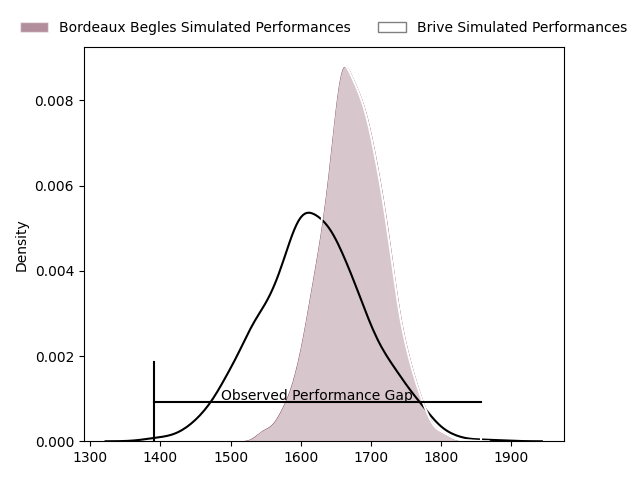
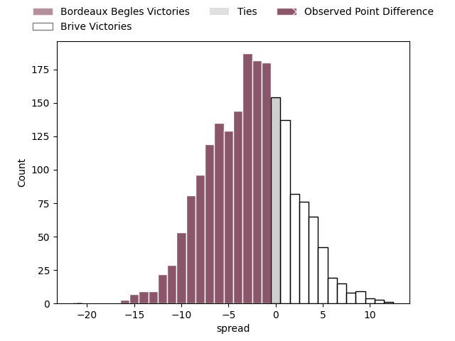
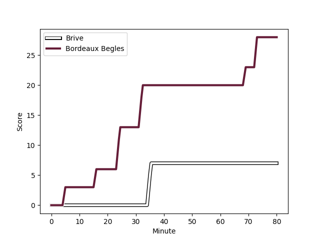
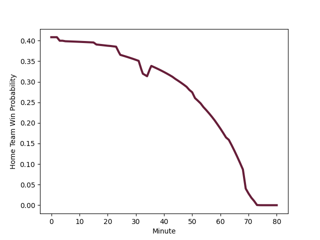

---  
layout: page  
title: Bordeaux Begles at Brive; 28-7  
date: 2023-03-04 17:15:00 18:00:00 -0500  
categories: match review  
---
# Bordeaux Begles at Brive; 28-7

# Club Level Predictions

The first set of predictions treats a club as the smallest object, as the club develops its members, organizes a gameplan, and deploys its players as needed for each match. This club model has a prediction of 0.423, which translates to predicting Bordeaux Begles to win by 2.7.

Each club has a rating and a rating deviation (simiar to a Glicko system), and expected performances can be generated. This allows for simulated matches and spreads like the ones below.
## Projected Performances

## Projected Spreads

## Projected Results

# Player Level Predictions

Treating teams instead as an entity made up of the currently active players, I have ratings for each player in an altogether different system. These can be combined to form team ratings once teamsheets are announced, weighting starters a bit higher than the reserves. After the match is played, players can be weighted by their minutes on the field, allowing for an accurate measure of the team's composition. With these compiled team ratings, we can make predictions, measure inaccuracy, and update the individual player ratings.
## Prediction with Player Minutes: Bordeaux Begles by 15.8

Bordeaux Begles by 19.8 on a neutral field
## Scores over Time

## Win Probability over Time

There were 1 large changes in win probability in this match
## Prediction without Player Minutes: Bordeaux Begles by 11.5

Bordeaux Begles by 15.5 on a neutral pitch

|   Away Minutes | Away Player                                                                      |   Away elo |   Away Percentile |   Number |   Home Percentile |   Home elo | Home Player                                                                     |   Home Minutes |
|---------------:|:---------------------------------------------------------------------------------|-----------:|------------------:|---------:|------------------:|-----------:|:--------------------------------------------------------------------------------|---------------:|
|             54 | [Jefferson Poirot](..//playerfiles//JeffersonPoirot_cleaned.md)                  |      98.4  |                62 |        1 |                66 |     100.73 | [Daniel Brennan](..//playerfiles//DanielBrennan_cleaned.md)                     |             44 |
|             63 | [Maxime Lamothe](..//playerfiles//MaximeLamothe_cleaned.md)                      |     110.32 |                88 |        2 |                61 |      98.54 | [Motu Farao Matu'u](..//playerfiles//MotuFaraoMatu'u_cleaned.md)                |             49 |
|             62 | [Ben Tameifuna](..//playerfiles//BenTameifuna_cleaned.md)                        |     101.9  |                75 |        3 |                40 |      92.4  | [Marcel van der Merwe](..//playerfiles//MarcelvanderMerwe_cleaned.md)           |             59 |
|             63 | [Thomas Jolmes](..//playerfiles//ThomasJolmes_cleaned.md)                        |      97.27 |                56 |        4 |                63 |      99.83 | [Lucas Martin Paulos Adler](..//playerfiles//LucasMartinPaulosAdler_cleaned.md) |             80 |
|             80 | [Jan Andre Marais](..//playerfiles//JanAndreMarais_cleaned.md)                   |     103.66 |                69 |        5 |                76 |     105.38 | [Julien Delannoy](..//playerfiles//JulienDelannoy_cleaned.md)                   |             51 |
|             80 | [Mahamadou Diaby](..//playerfiles//MahamadouDiaby_cleaned.md)                    |     105.02 |                75 |        6 |                47 |      93.57 | [Esteban Abadie](..//playerfiles//EstebanAbadie_cleaned.md)                     |             80 |
|             80 | [Bastien Vergnes Taillefer](..//playerfiles//BastienVergnesTaillefer_cleaned.md) |      97.83 |                55 |        7 |                79 |     107.47 | [Saïd Hireche](..//playerfiles//SaïdHireche_cleaned.md)                         |             59 |
|             76 | [Tom Willis](..//playerfiles//TomWillis_cleaned.md)                              |     118.56 |                91 |        8 |                52 |      96.84 | [Mesulame Kunavula](..//playerfiles//MesulameKunavula_cleaned.md)               |             62 |
|             75 | [Maxime Lucu](..//playerfiles//MaximeLucu_cleaned.md)                            |     103.61 |                71 |        9 |                12 |      79.32 | [Leo Carbonneau](..//playerfiles//LeoCarbonneau_cleaned.md)                     |             80 |
|             75 | [Matthieu Jalibert](..//playerfiles//MatthieuJalibert_cleaned.md)                |      96.2  |                51 |       10 |                78 |     105.96 | [Nicolas Sanchez](..//playerfiles//NicolasSanchez_cleaned.md)                   |             21 |
|             80 | [Santiago Cordero](..//playerfiles//SantiagoCordero_cleaned.md)                  |     113.26 |                88 |       11 |                13 |      78.51 | [Mathis Ferté](..//playerfiles//MathisFerté_cleaned.md)                         |             80 |
|             80 | [Tani Vili](..//playerfiles//TaniVili_cleaned.md)                                |     113.91 |                89 |       12 |                66 |     100.68 | [Guillaume Galletier](..//playerfiles//GuillaumeGalletier_cleaned.md)           |              3 |
|             75 | [Nicolas Depoortere](..//playerfiles//NicolasDepoortere_cleaned.md)              |     105.27 |                78 |       13 |                78 |     107.79 | [Setariki Tuicuvu](..//playerfiles//SetarikiTuicuvu_cleaned.md)                 |             80 |
|             80 | [Louis Bielle Biarrey](..//playerfiles//LouisBielleBiarrey_cleaned.md)           |     108.37 |                83 |       14 |                56 |      97.54 | [Arthur Bonneval](..//playerfiles//ArthurBonneval_cleaned.md)                   |             80 |
|             80 | [Romain Buros](..//playerfiles//RomainBuros_cleaned.md)                          |     121.22 |                93 |       15 |                 4 |      67.03 | [Enzo Hervé](..//playerfiles//EnzoHervé_cleaned.md)                             |             80 |
|             26 | [Lesko Kaulashvili](..//playerfiles//LeskoKaulashvili_cleaned.md)                |     108.76 |                85 |       16 |                43 |      92.76 | [Nicolaas Jacobus Lee](..//playerfiles//NicolaasJacobusLee_cleaned.md)          |             77 |
|             17 | [Gabriel Oghre](..//playerfiles//GabrielOghre_cleaned.md)                        |      97.43 |               nan |       17 |                42 |      92.09 | [Enzo Sanga](..//playerfiles//EnzoSanga_cleaned.md)                             |             59 |
|             17 | [Pierre Bochaton](..//playerfiles//PierreBochaton_cleaned.md)                    |      95    |               nan |       18 |                21 |      86.68 | [Wesley Tapueluelu](..//playerfiles//WesleyTapueluelu_cleaned.md)               |             36 |
|              5 | [Pablo Uberti](..//playerfiles//PabloUberti_cleaned.md)                          |      86.95 |                22 |       19 |                37 |      91.38 | [Lucas Da Silva](..//playerfiles//LucasDaSilva_cleaned.md)                      |             31 |
|              5 | [Zack Holmes](..//playerfiles//ZackHolmes_cleaned.md)                            |     105.12 |                75 |       20 |                10 |      74.61 | [Andres Zafra Tarazona](..//playerfiles//AndresZafraTarazona_cleaned.md)        |             29 |
|              5 | [Jules Gimbert](..//playerfiles//JulesGimbert_cleaned.md)                        |     100.62 |                68 |       21 |                62 |     100.76 | [Pietro Ceccarelli](..//playerfiles//PietroCeccarelli_cleaned.md)               |             21 |
|             18 | [Vadim Cobilas](..//playerfiles//VadimCobilas_cleaned.md)                        |      93.44 |                38 |       22 |                72 |     105.35 | [Retief Marais](..//playerfiles//RetiefMarais_cleaned.md)                       |             21 |
|              4 | [Renato Giammarioli](..//playerfiles//RenatoGiammarioli_cleaned.md)              |      99.67 |                63 |       23 |                27 |      89.94 | [Sasha Gue](..//playerfiles//SashaGue_cleaned.md)                               |             18 |

