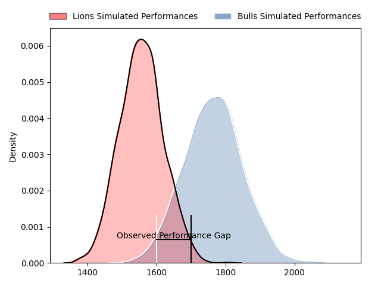
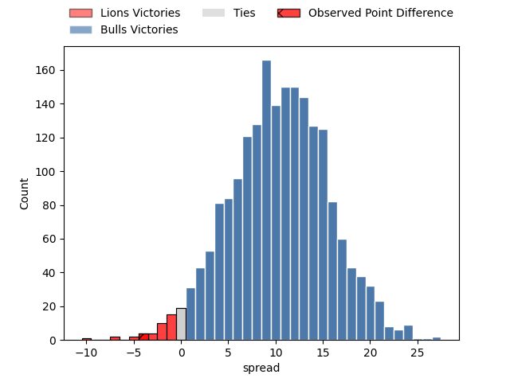
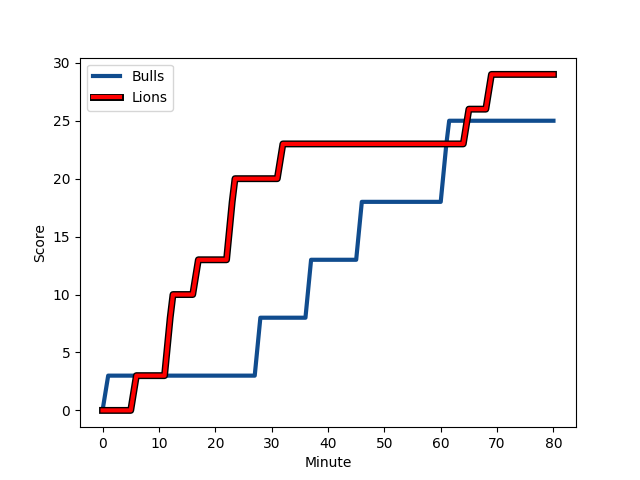
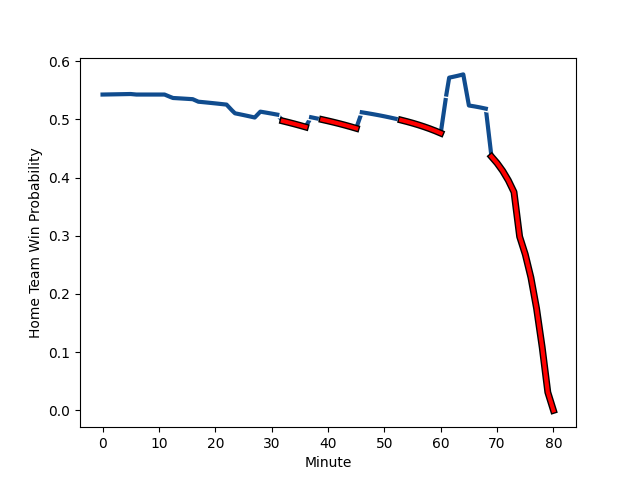

---  
layout: page  
title: Lions at Bulls; 29-25  
date: 2023-03-04 15:45:00 18:00:00 -0500  
categories: match review  
---
# Lions at Bulls; 29-25

# Club Level Predictions

The first set of predictions treats a club as the smallest object, as the club develops its members, organizes a gameplan, and deploys its players as needed for each match. This club model has a prediction of 0.763, which translates to predicting Bulls to win by 10.4.

Each club has a rating and a rating deviation (simiar to a Glicko system), and expected performances can be generated. This allows for simulated matches and spreads like the ones below.
## Projected Performances

## Projected Spreads

## Projected Results

# Player Level Predictions

Treating teams instead as an entity made up of the currently active players, I have ratings for each player in an altogether different system. These can be combined to form team ratings once teamsheets are announced, weighting starters a bit higher than the reserves. After the match is played, players can be weighted by their minutes on the field, allowing for an accurate measure of the team's composition. With these compiled team ratings, we can make predictions, measure inaccuracy, and update the individual player ratings.
## Prediction with Player Minutes: Bulls by 18.6

Bulls by 14.6 on a neutral field
## Scores over Time

## Win Probability over Time

There were 12 large changes in win probability in this match
## Prediction without Player Minutes: Bulls by 18.1

Bulls by 14.1 on a neutral pitch

|   Away Minutes | Away Player                                                                         |   Away elo |   Away Percentile |   Number |   Home Percentile |   Home elo | Home Player                                                                                    |   Home Minutes |
|---------------:|:------------------------------------------------------------------------------------|-----------:|------------------:|---------:|------------------:|-----------:|:-----------------------------------------------------------------------------------------------|---------------:|
|             80 | [Jean-Pierre Smith](..//playerfiles//Jean-PierreSmith_cleaned.md)                   |      91.65 |                37 |        1 |                43 |      95    | [Dylan Thomas Smith](..//playerfiles//DylanThomasSmith_cleaned.md)                             |             80 |
|             65 | [Jean-Pierre Smith](..//playerfiles//Jean-PierreSmith_cleaned.md)                   |      91.65 |                37 |        1 |                43 |      95    | [Dylan Thomas Smith](..//playerfiles//DylanThomasSmith_cleaned.md)                             |             80 |
|             80 | [Jean-Pierre Smith](..//playerfiles//Jean-PierreSmith_cleaned.md)                   |      91.65 |                37 |        1 |                43 |      95    | [Dylan Thomas Smith](..//playerfiles//DylanThomasSmith_cleaned.md)                             |             54 |
|             65 | [Jean-Pierre Smith](..//playerfiles//Jean-PierreSmith_cleaned.md)                   |      91.65 |                37 |        1 |                43 |      95    | [Dylan Thomas Smith](..//playerfiles//DylanThomasSmith_cleaned.md)                             |             54 |
|             80 | [PJ Botha](..//playerfiles//PJBotha_cleaned.md)                                     |      91.87 |                41 |        2 |                87 |     107.92 | [Cornelis Johannes Grobbelaar](..//playerfiles//CornelisJohannesGrobbelaar_cleaned.md)         |             80 |
|             65 | [PJ Botha](..//playerfiles//PJBotha_cleaned.md)                                     |      91.87 |                41 |        2 |                87 |     107.92 | [Cornelis Johannes Grobbelaar](..//playerfiles//CornelisJohannesGrobbelaar_cleaned.md)         |             80 |
|             80 | [PJ Botha](..//playerfiles//PJBotha_cleaned.md)                                     |      91.87 |                41 |        2 |                87 |     107.92 | [Cornelis Johannes Grobbelaar](..//playerfiles//CornelisJohannesGrobbelaar_cleaned.md)         |             69 |
|             65 | [PJ Botha](..//playerfiles//PJBotha_cleaned.md)                                     |      91.87 |                41 |        2 |                87 |     107.92 | [Cornelis Johannes Grobbelaar](..//playerfiles//CornelisJohannesGrobbelaar_cleaned.md)         |             69 |
|             80 | [Asenathi Ntlabakanye](..//playerfiles//AsenathiNtlabakanye_cleaned.md)             |      73.6  |                 5 |        3 |                76 |     102.51 | [Mornay Jan Jakobus Smith](..//playerfiles//MornayJanJakobusSmith_cleaned.md)                  |             80 |
|             63 | [Asenathi Ntlabakanye](..//playerfiles//AsenathiNtlabakanye_cleaned.md)             |      73.6  |                 5 |        3 |                76 |     102.51 | [Mornay Jan Jakobus Smith](..//playerfiles//MornayJanJakobusSmith_cleaned.md)                  |             54 |
|             80 | [Asenathi Ntlabakanye](..//playerfiles//AsenathiNtlabakanye_cleaned.md)             |      73.6  |                 5 |        3 |                76 |     102.51 | [Mornay Jan Jakobus Smith](..//playerfiles//MornayJanJakobusSmith_cleaned.md)                  |             54 |
|             63 | [Asenathi Ntlabakanye](..//playerfiles//AsenathiNtlabakanye_cleaned.md)             |      73.6  |                 5 |        3 |                76 |     102.51 | [Mornay Jan Jakobus Smith](..//playerfiles//MornayJanJakobusSmith_cleaned.md)                  |             80 |
|             54 | [Willem Alberts](..//playerfiles//WillemAlberts_cleaned.md)                         |      87.47 |                26 |        4 |                56 |      97.09 | [Willem Hendrik Jacques du Plessis](..//playerfiles//WillemHendrikJacquesduPlessis_cleaned.md) |             53 |
|             80 | [Willem Alberts](..//playerfiles//WillemAlberts_cleaned.md)                         |      87.47 |                26 |        4 |                56 |      97.09 | [Willem Hendrik Jacques du Plessis](..//playerfiles//WillemHendrikJacquesduPlessis_cleaned.md) |             53 |
|             54 | [Willem Alberts](..//playerfiles//WillemAlberts_cleaned.md)                         |      87.47 |                26 |        4 |                56 |      97.09 | [Willem Hendrik Jacques du Plessis](..//playerfiles//WillemHendrikJacquesduPlessis_cleaned.md) |             80 |
|             80 | [Willem Alberts](..//playerfiles//WillemAlberts_cleaned.md)                         |      87.47 |                26 |        4 |                56 |      97.09 | [Willem Hendrik Jacques du Plessis](..//playerfiles//WillemHendrikJacquesduPlessis_cleaned.md) |             80 |
|             80 | [Ruben (Hobo) Schoeman](..//playerfiles//Ruben(Hobo)Schoeman_cleaned.md)            |      96.99 |                56 |        5 |                81 |     107.36 | [Ruan Nortje](..//playerfiles//RuanNortje_cleaned.md)                                          |             80 |
|             80 | [Emmanuel Tshituka](..//playerfiles//EmmanuelTshituka_cleaned.md)                   |      95.67 |                52 |        6 |                71 |     102.72 | [Marco Gerhardt van Staden](..//playerfiles//MarcoGerhardtvanStaden_cleaned.md)                |             80 |
|             80 | [Ruan Venter](..//playerfiles//RuanVenter_cleaned.md)                               |      86.73 |                25 |        7 |                65 |     100.73 | [WJ Steenkamp](..//playerfiles//WJSteenkamp_cleaned.md)                                        |             40 |
|             80 | [Ruan Venter](..//playerfiles//RuanVenter_cleaned.md)                               |      86.73 |                25 |        7 |                65 |     100.73 | [WJ Steenkamp](..//playerfiles//WJSteenkamp_cleaned.md)                                        |             80 |
|             80 | [Francke Horn](..//playerfiles//FranckeHorn_cleaned.md)                             |     104.59 |                77 |        8 |                85 |     110.4  | [Elrigh Louw](..//playerfiles//ElrighLouw_cleaned.md)                                          |             80 |
|             74 | [Sanele Nohamba](..//playerfiles//SaneleNohamba_cleaned.md)                         |      97.86 |                59 |        9 |                38 |      91.38 | [Embrose Cheldon Papier](..//playerfiles//EmbroseCheldonPapier_cleaned.md)                     |             55 |
|             74 | [Sanele Nohamba](..//playerfiles//SaneleNohamba_cleaned.md)                         |      97.86 |                59 |        9 |                38 |      91.38 | [Embrose Cheldon Papier](..//playerfiles//EmbroseCheldonPapier_cleaned.md)                     |             80 |
|             80 | [Sanele Nohamba](..//playerfiles//SaneleNohamba_cleaned.md)                         |      97.86 |                59 |        9 |                38 |      91.38 | [Embrose Cheldon Papier](..//playerfiles//EmbroseCheldonPapier_cleaned.md)                     |             80 |
|             80 | [Sanele Nohamba](..//playerfiles//SaneleNohamba_cleaned.md)                         |      97.86 |                59 |        9 |                38 |      91.38 | [Embrose Cheldon Papier](..//playerfiles//EmbroseCheldonPapier_cleaned.md)                     |             55 |
|             78 | [Gianni Dean Lombard](..//playerfiles//GianniDeanLombard_cleaned.md)                |     100.29 |                65 |       10 |                39 |      93.02 | [Morne Steyn](..//playerfiles//MorneSteyn_cleaned.md)                                          |             69 |
|             80 | [Gianni Dean Lombard](..//playerfiles//GianniDeanLombard_cleaned.md)                |     100.29 |                65 |       10 |                39 |      93.02 | [Morne Steyn](..//playerfiles//MorneSteyn_cleaned.md)                                          |             69 |
|             78 | [Gianni Dean Lombard](..//playerfiles//GianniDeanLombard_cleaned.md)                |     100.29 |                65 |       10 |                39 |      93.02 | [Morne Steyn](..//playerfiles//MorneSteyn_cleaned.md)                                          |             80 |
|             80 | [Gianni Dean Lombard](..//playerfiles//GianniDeanLombard_cleaned.md)                |     100.29 |                65 |       10 |                39 |      93.02 | [Morne Steyn](..//playerfiles//MorneSteyn_cleaned.md)                                          |             80 |
|             80 | [Edwill Charl van der Merwe](..//playerfiles//EdwillCharlvanderMerwe_cleaned.md)    |      94.19 |                47 |       11 |                64 |      99.86 | [S'Busiso Romeo Nkosi](..//playerfiles//S'BusisoRomeoNkosi_cleaned.md)                         |             80 |
|             80 | [Marius Louw](..//playerfiles//MariusLouw_cleaned.md)                               |      94.58 |                49 |       12 |                70 |     102.66 | [David Kriel](..//playerfiles//DavidKriel_cleaned.md)                                          |             80 |
|             80 | [Manuel Johern (Mannie) Rass](..//playerfiles//ManuelJohern(Mannie)Rass_cleaned.md) |      89.06 |                31 |       13 |                47 |      94.03 | [Cornal Hendricks](..//playerfiles//CornalHendricks_cleaned.md)                                |             80 |
|             55 | [Manuel Johern (Mannie) Rass](..//playerfiles//ManuelJohern(Mannie)Rass_cleaned.md) |      89.06 |                31 |       13 |                47 |      94.03 | [Cornal Hendricks](..//playerfiles//CornalHendricks_cleaned.md)                                |             80 |
|             80 | [Sibahle Ndiphiwe Maxwane](..//playerfiles//SibahleNdiphiweMaxwane_cleaned.md)      |      93.72 |                46 |       14 |                53 |      96.17 | [Sibongile Vukile Novuka](..//playerfiles//SibongileVukileNovuka_cleaned.md)                   |             80 |
|             80 | [Quan Horn](..//playerfiles//QuanHorn_cleaned.md)                                   |      93.15 |                47 |       15 |                71 |     102.18 | [Wandisile Simelane](..//playerfiles//WandisileSimelane_cleaned.md)                            |             80 |
|             26 | [Ruan Delport](..//playerfiles//RuanDelport_cleaned.md)                             |      99.97 |                62 |       16 |                54 |      97.88 | [Ruan Stefan Vermaak](..//playerfiles//RuanStefanVermaak_cleaned.md)                           |             27 |
|             25 | [Rynardt Jonker](..//playerfiles//RynardtJonker_cleaned.md)                         |      97.42 |                56 |       17 |                42 |      91.95 | [Cyle Justin Brink](..//playerfiles//CyleJustinBrink_cleaned.md)                               |             40 |
|             17 | [Ruan-Henry Smith](..//playerfiles//Ruan-HenrySmith_cleaned.md)                     |      95.47 |               nan |       18 |                28 |      89.64 | [Francois Klopper](..//playerfiles//FrancoisKlopper_cleaned.md)                                |             26 |
|             15 | [Morné Brandon](..//playerfiles//MornéBrandon_cleaned.md)                           |      83.2  |                14 |       19 |                31 |      89.74 | [Simphiwe Matanzima](..//playerfiles//SimphiweMatanzima_cleaned.md)                            |             26 |
|             15 | [Rhynardt Rinjsburger](..//playerfiles//RhynardtRinjsburger_cleaned.md)             |      97.4  |               nan |       20 |                65 |      99.73 | [Bernard van der Linde](..//playerfiles//BernardvanderLinde_cleaned.md)                        |             25 |
|              6 | [Morne Van den Berg](..//playerfiles//MorneVandenBerg_cleaned.md)                   |      77.1  |                10 |       21 |                 9 |      78.28 | [Jan Hendrik Wessels](..//playerfiles//JanHendrikWessels_cleaned.md)                           |             11 |
|              2 | [Andries Coetzee](..//playerfiles//AndriesCoetzee_cleaned.md)                       |     109.99 |                84 |       22 |                36 |      90.88 | [Chris Smith](..//playerfiles//ChrisSmith_cleaned.md)                                          |             11 |

