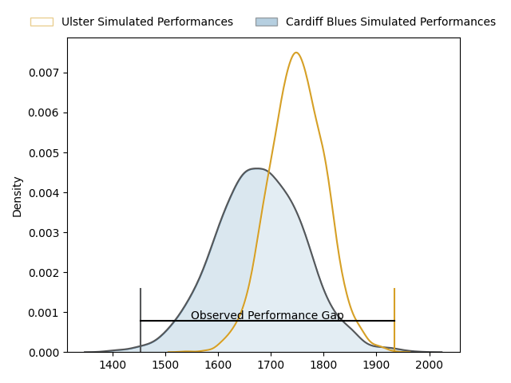
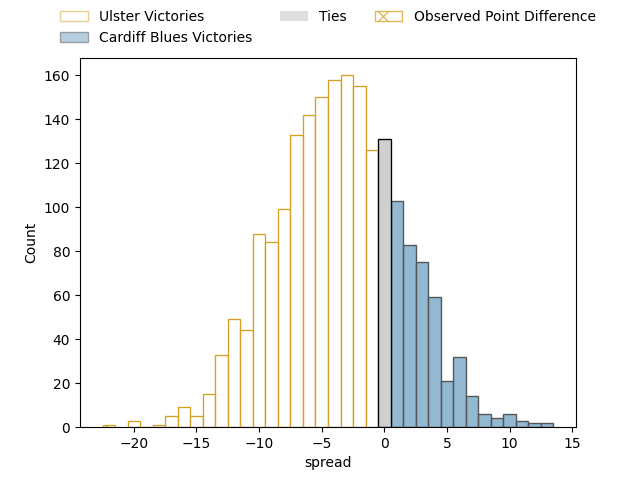
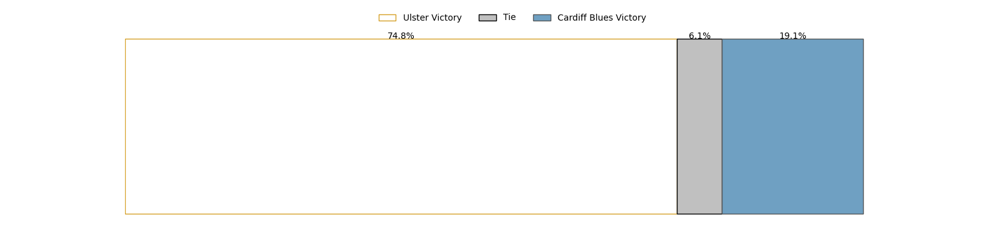
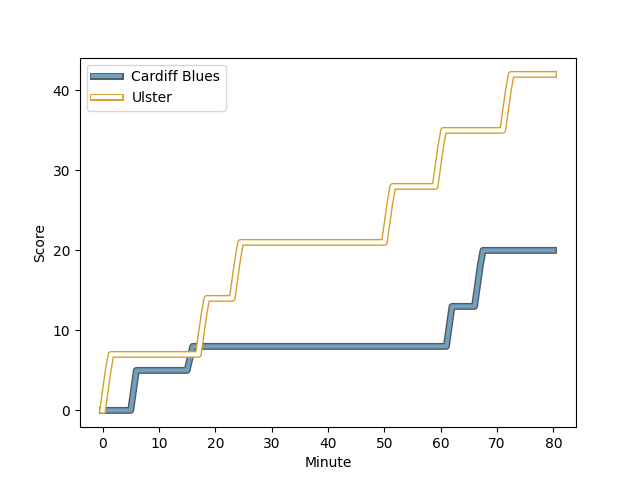
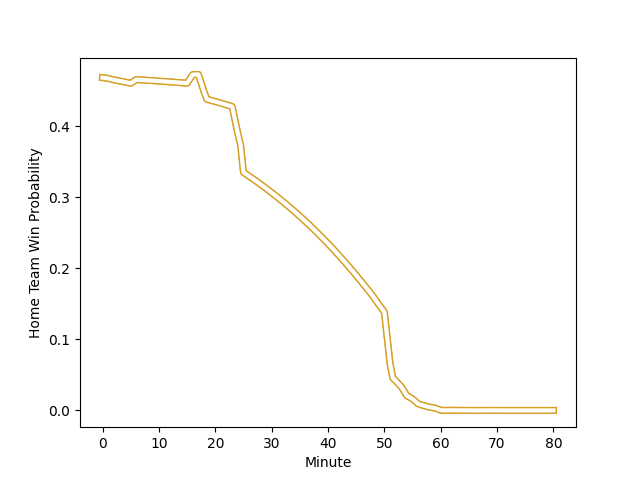

---  
layout: page  
title: Ulster at Cardiff Blues; 42-20  
date: 2023-03-04 20:35:00 18:00:00 -0500  
categories: match review  
---
# Ulster at Cardiff Blues; 42-20

# Club Level Predictions

The first set of predictions treats a club as the smallest object, as the club develops its members, organizes a gameplan, and deploys its players as needed for each match. This club model has a prediction of 0.393, which translates to predicting Ulster to win by 3.8.

Each club has a rating and a rating deviation (simiar to a Glicko system), and expected performances can be generated. This allows for simulated matches and spreads like the ones below.
## Projected Performances

## Projected Spreads

## Projected Results

# Player Level Predictions

Treating teams instead as an entity made up of the currently active players, I have ratings for each player in an altogether different system. These can be combined to form team ratings once teamsheets are announced, weighting starters a bit higher than the reserves. After the match is played, players can be weighted by their minutes on the field, allowing for an accurate measure of the team's composition. With these compiled team ratings, we can make predictions, measure inaccuracy, and update the individual player ratings.
## Prediction with Player Minutes: Ulster by 1.5

Ulster by 5.5 on a neutral field
## Scores over Time

## Win Probability over Time

There were 3 large changes in win probability in this match
## Prediction without Player Minutes: Cardiff Blues by 3.0

Ulster by 1.0 on a neutral pitch

|   Away Minutes | Away Player                                                                 |   Away elo |   Away Percentile |   Number |   Home Percentile |   Home elo | Home Player                                                         |   Home Minutes |
|---------------:|:----------------------------------------------------------------------------|-----------:|------------------:|---------:|------------------:|-----------:|:--------------------------------------------------------------------|---------------:|
|             58 | [Rory Sutherland](..//playerfiles//RorySutherland_cleaned.md)               |     119.38 |                95 |        1 |                34 |      90.65 | [Rhys Carre](..//playerfiles//RhysCarre_cleaned.md)                 |             53 |
|             58 | [Rob Herring](..//playerfiles//RobHerring_cleaned.md)                       |      83.92 |                17 |        2 |                88 |     110.31 | [Kristian Dacey](..//playerfiles//KristianDacey_cleaned.md)         |             54 |
|             69 | [Jeffery To'omaga-Allen](..//playerfiles//JefferyTo'omaga-Allen_cleaned.md) |     117.71 |                93 |        3 |                65 |      98.18 | [Dillon Lewis](..//playerfiles//DillonLewis_cleaned.md)             |             53 |
|             72 | [Kieran Treadwell](..//playerfiles//KieranTreadwell_cleaned.md)             |      89.92 |                32 |        4 |                16 |      81.91 | [Lopeti Timani](..//playerfiles//LopetiTimani_cleaned.md)           |             80 |
|             49 | [Sam Carter](..//playerfiles//SamCarter_cleaned.md)                         |     106.81 |                78 |        5 |                86 |     111.61 | [Seb Davies](..//playerfiles//SebDavies_cleaned.md)                 |             56 |
|             80 | [David McCann](..//playerfiles//DavidMcCann_cleaned.md)                     |     103.56 |                66 |        6 |                79 |     107.12 | [Joshua Turnbull](..//playerfiles//JoshuaTurnbull_cleaned.md)       |             80 |
|             80 | [Marcus Rea](..//playerfiles//MarcusRea_cleaned.md)                         |      91.99 |                42 |        7 |                65 |     100.22 | [Ellis Jenkins](..//playerfiles//EllisJenkins_cleaned.md)           |             80 |
|             80 | [Nick Timoney](..//playerfiles//NickTimoney_cleaned.md)                     |     111.88 |                86 |        8 |                81 |     107.78 | [James Ratti](..//playerfiles//JamesRatti_cleaned.md)               |             56 |
|             80 | [Nathan Doak](..//playerfiles//NathanDoak_cleaned.md)                       |     102.36 |                71 |        9 |                96 |     119.02 | [Lloyd Williams](..//playerfiles//LloydWilliams_cleaned.md)         |             25 |
|             80 | [Billy Burns](..//playerfiles//BillyBurns_cleaned.md)                       |      90.39 |                35 |       10 |                45 |      93.51 | [Jarrod Evans](..//playerfiles//JarrodEvans_cleaned.md)             |             80 |
|             64 | [Jacob Stockdale](..//playerfiles//JacobStockdale_cleaned.md)               |      95.23 |                50 |       11 |                37 |      90.66 | [Jason Harries](..//playerfiles//JasonHarries_cleaned.md)           |             80 |
|             80 | [Stewart Moore](..//playerfiles//StewartMoore_cleaned.md)                   |     107.22 |                81 |       12 |                93 |     118.55 | [Max Llewellyn](..//playerfiles//MaxLlewellyn_cleaned.md)           |             80 |
|             59 | [James Hume](..//playerfiles//JamesHume_cleaned.md)                         |     100.78 |                66 |       13 |                71 |     102.58 | [Rey Lee-Lo](..//playerfiles//ReyLee-Lo_cleaned.md)                 |             66 |
|             80 | [Ben Moxham](..//playerfiles//BenMoxham_cleaned.md)                         |      98.98 |                60 |       14 |                18 |      83.93 | [Owen Lane](..//playerfiles//OwenLane_cleaned.md)                   |             80 |
|             80 | [Michael Lowry](..//playerfiles//MichaelLowry_cleaned.md)                   |     112.38 |                85 |       15 |                57 |      98.28 | [Ben Thomas](..//playerfiles//BenThomas_cleaned.md)                 |             64 |
|             31 | [Alan O'Connor](..//playerfiles//AlanO'Connor_cleaned.md)                   |     107.91 |                80 |       16 |               nan |      96.87 | [Ellis Bevan](..//playerfiles//EllisBevan_cleaned.md)               |             55 |
|             22 | [Callum Reid](..//playerfiles//CallumReid_cleaned.md)                       |      94.18 |                45 |       17 |                14 |      87.47 | [Kieran Assirati](..//playerfiles//KieranAssirati_cleaned.md)       |             27 |
|             22 | [Tom Stewart](..//playerfiles//TomStewart_cleaned.md)                       |     121.18 |                93 |       18 |                59 |      97.32 | [Corey Domachowski](..//playerfiles//CoreyDomachowski_cleaned.md)   |             27 |
|             21 | [Jude Posthlewaite](..//playerfiles//JudePosthlewaite_cleaned.md)           |      95    |               nan |       19 |                16 |      83.82 | [Liam Belcher](..//playerfiles//LiamBelcher_cleaned.md)             |             26 |
|             16 | [Ethan McIlroy](..//playerfiles//EthanMcIlroy_cleaned.md)                   |      88.11 |                26 |       20 |               nan |      94.15 | [Shane Lewis-Hughes](..//playerfiles//ShaneLewis-Hughes_cleaned.md) |             24 |
|             11 | [Gareth Milasinovich](..//playerfiles//GarethMilasinovich_cleaned.md)       |     101.32 |               nan |       21 |                64 |     100.37 | [Teddy Williams](..//playerfiles//TeddyWilliams_cleaned.md)         |             24 |
|              8 | [Harry Sheridan](..//playerfiles//HarrySheridan_cleaned.md)                 |     105.88 |                76 |       22 |               nan |      94.82 | [Matthew Morgan](..//playerfiles//MatthewMorgan_cleaned.md)         |             16 |
|            nan | nan                                                                         |     nan    |               nan |       23 |                24 |      86.16 | [Aled Summerhill](..//playerfiles//AledSummerhill_cleaned.md)       |             14 |

