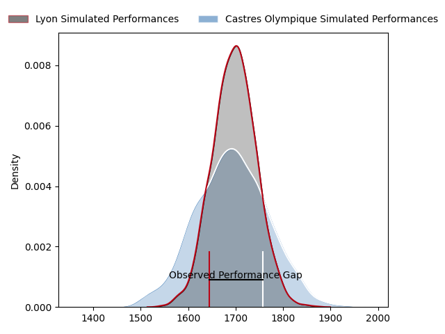
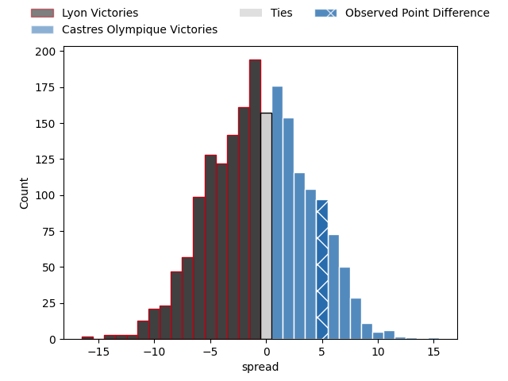
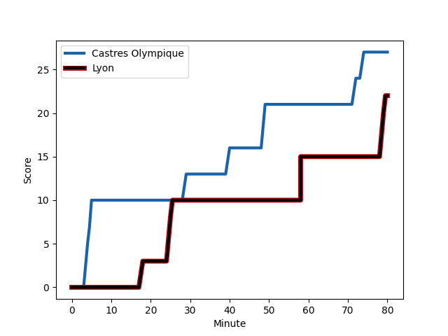
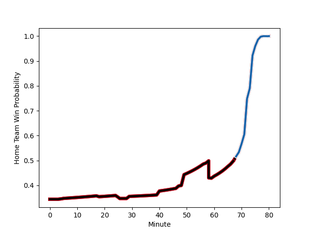

---  
layout: page  
title: Lyon at Castres Olympique; 22-27  
date: 2023-03-04 17:15:00 18:00:00 -0500  
categories: match review  
---
# Lyon at Castres Olympique; 22-27

# Club Level Predictions

The first set of predictions treats a club as the smallest object, as the club develops its members, organizes a gameplan, and deploys its players as needed for each match. This club model has a prediction of 0.486, which translates to predicting Lyon to win by 0.5.

Each club has a rating and a rating deviation (simiar to a Glicko system), and expected performances can be generated. This allows for simulated matches and spreads like the ones below.
## Projected Performances

## Projected Spreads

## Projected Results

# Player Level Predictions

Treating teams instead as an entity made up of the currently active players, I have ratings for each player in an altogether different system. These can be combined to form team ratings once teamsheets are announced, weighting starters a bit higher than the reserves. After the match is played, players can be weighted by their minutes on the field, allowing for an accurate measure of the team's composition. With these compiled team ratings, we can make predictions, measure inaccuracy, and update the individual player ratings.
## Prediction with Player Minutes: Lyon by 24.0

Lyon by 28.0 on a neutral field
## Scores over Time

## Win Probability over Time

There were 9 large changes in win probability in this match
## Prediction without Player Minutes: Lyon by 22.8

Lyon by 26.8 on a neutral pitch

|   Away Minutes | Away Player                                                                      |   Away elo |   Away Percentile |   Number |   Home Percentile |   Home elo | Home Player                                                                       |   Home Minutes |
|---------------:|:---------------------------------------------------------------------------------|-----------:|------------------:|---------:|------------------:|-----------:|:----------------------------------------------------------------------------------|---------------:|
|             60 | [Sébastien Taofifenua](..//playerfiles//SébastienTaofifenua_cleaned.md)          |      99.08 |                65 |        1 |                30 |      87.91 | [Quentin Walcker](..//playerfiles//QuentinWalcker_cleaned.md)                     |             57 |
|             47 | [Guillaume Marchand](..//playerfiles//GuillaumeMarchand_cleaned.md)              |     101.23 |                71 |        2 |                10 |      78.97 | [Gaëtan Barlot](..//playerfiles//GaëtanBarlot_cleaned.md)                         |             71 |
|             47 | [Francisco Gomez Kodela](..//playerfiles//FranciscoGomezKodela_cleaned.md)       |     101.43 |                73 |        3 |                12 |      80.93 | [Wilfried Hounkpatin](..//playerfiles//WilfriedHounkpatin_cleaned.md)             |             68 |
|             59 | [Loann Goujon](..//playerfiles//LoannGoujon_cleaned.md)                          |      96.52 |               nan |        4 |               nan |      91.7  | [Ryno Pieterse](..//playerfiles//RynoPieterse_cleaned.md)                         |             59 |
|             80 | [Temo Sukayawa Mayanavanua](..//playerfiles//TemoSukayawaMayanavanua_cleaned.md) |     115.21 |                90 |        5 |                13 |      78.93 | [Thomas Staniforth](..//playerfiles//ThomasStaniforth_cleaned.md)                 |             80 |
|             80 | [Dylan Cretin](..//playerfiles//DylanCretin_cleaned.md)                          |     110.64 |                85 |        6 |                33 |      87.98 | [Nick Champion de Crespigny](..//playerfiles//NickChampiondeCrespigny_cleaned.md) |             66 |
|             80 | [Joel Kpoku](..//playerfiles//JoelKpoku_cleaned.md)                              |      99.17 |                59 |        7 |                25 |      87.34 | [Tyler Ardron](..//playerfiles//TylerArdron_cleaned.md)                           |             80 |
|             25 | [Mickael Guillard](..//playerfiles//MickaelGuillard_cleaned.md)                  |     102.41 |                56 |        8 |                25 |      86.94 | [Kevin Kornath](..//playerfiles//KevinKornath_cleaned.md)                         |             80 |
|             47 | [Jonathan Pelissié](..//playerfiles//JonathanPelissié_cleaned.md)                |     101.08 |                69 |        9 |                30 |      88.68 | [Santiago Arata Perrone](..//playerfiles//SantiagoArataPerrone_cleaned.md)        |             70 |
|             80 | [Lima Sopoaga](..//playerfiles//LimaSopoaga_cleaned.md)                          |      96.12 |               nan |       10 |                 7 |      73.73 | [Benjamin Urdapilleta](..//playerfiles//BenjaminUrdapilleta_cleaned.md)           |             80 |
|             47 | [Noa Nakaitaci](..//playerfiles//NoaNakaitaci_cleaned.md)                        |      88.95 |                31 |       11 |                12 |      78.71 | [Filipo Nakosi](..//playerfiles//FilipoNakosi_cleaned.md)                         |             75 |
|             80 | [Josua Tuisova](..//playerfiles//JosuaTuisova_cleaned.md)                        |     114.95 |                90 |       12 |                19 |      84.48 | [Adrea Cocagi](..//playerfiles//AdreaCocagi_cleaned.md)                           |             66 |
|             70 | [Josiah Maraku](..//playerfiles//JosiahMaraku_cleaned.md)                        |     112.64 |                88 |       13 |                21 |      85.11 | [Adrien Seguret](..//playerfiles//AdrienSeguret_cleaned.md)                       |             80 |
|             80 | [Tavite Veredamu](..//playerfiles//TaviteVeredamu_cleaned.md)                    |      99.46 |                61 |       14 |                 8 |      73.25 | [Geoffrey Palis](..//playerfiles//GeoffreyPalis_cleaned.md)                       |             80 |
|             80 | [Toby Arnold](..//playerfiles//TobyArnold_cleaned.md)                            |     102.19 |                68 |       15 |                23 |      83.64 | [Julien Dumora](..//playerfiles//JulienDumora_cleaned.md)                         |             80 |
|             55 | [Killian Geraci](..//playerfiles//KillianGeraci_cleaned.md)                      |      96.61 |               nan |       16 |                12 |      80.97 | [Antoine Tichit](..//playerfiles//AntoineTichit_cleaned.md)                       |             23 |
|             33 | [Baptiste Couilloud](..//playerfiles//BaptisteCouilloud_cleaned.md)              |      89.97 |                34 |       17 |                15 |      81.05 | [Leone Nakarawa](..//playerfiles//LeoneNakarawa_cleaned.md)                       |             21 |
|             33 | [Léo Berdeu](..//playerfiles//LéoBerdeu_cleaned.md)                              |      92.97 |                43 |       18 |                48 |      92.09 | [Baptiste Delaporte](..//playerfiles//BaptisteDelaporte_cleaned.md)               |             14 |
|             33 | [Feao Fotuaika](..//playerfiles//FeaoFotuaika_cleaned.md)                        |      97.62 |               nan |       19 |                10 |      77.14 | [Vilimoni Botitu](..//playerfiles//VilimoniBotitu_cleaned.md)                     |             14 |
|             33 | [Yanis Charcosset](..//playerfiles//YanisCharcosset_cleaned.md)                  |      98.1  |                50 |       20 |                28 |      87.41 | [Levan Chilachava](..//playerfiles//LevanChilachava_cleaned.md)                   |             12 |
|             20 | [Vivien Devisme](..//playerfiles//VivienDevisme_cleaned.md)                      |      94.74 |               nan |       21 |                70 |     100.66 | [Julien Blanc](..//playerfiles//JulienBlanc_cleaned.md)                           |             10 |
|             21 | [Théo William](..//playerfiles//ThéoWilliam_cleaned.md)                          |      97.57 |                57 |       22 |                83 |     106.15 | [Brice Humbert](..//playerfiles//BriceHumbert_cleaned.md)                         |              9 |
|             10 | [Kyle Godwin](..//playerfiles//KyleGodwin_cleaned.md)                            |      99.1  |                64 |       23 |                31 |      88.7  | [Louis Le Brun](..//playerfiles//LouisLeBrun_cleaned.md)                          |              5 |

