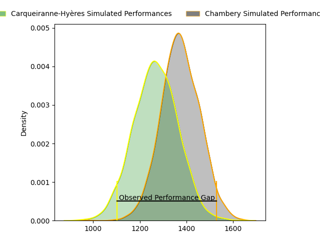
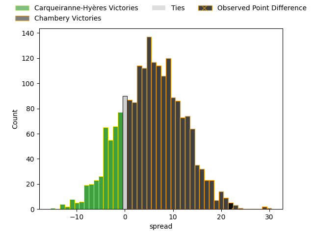
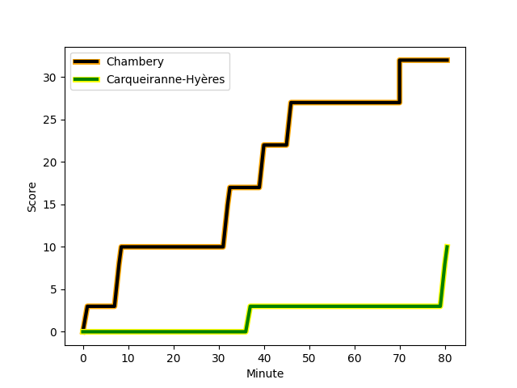
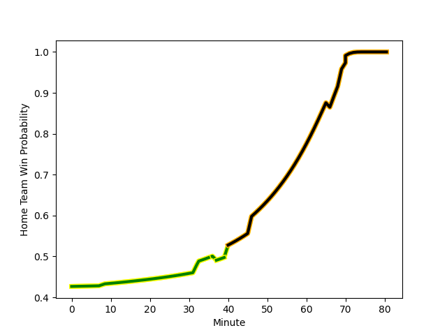

---  
layout: page  
title: Carqueiranne-Hyères at Chambery; 10-32  
date: 2023-03-04 19:00:00 18:00:00 -0500  
categories: match review  
---
# Carqueiranne-Hyères at Chambery; 10-32

# Club Level Predictions

The first set of predictions treats a club as the smallest object, as the club develops its members, organizes a gameplan, and deploys its players as needed for each match. This club model has a prediction of 0.64, which translates to predicting Chambery to win by 5.2.

Each club has a rating and a rating deviation (simiar to a Glicko system), and expected performances can be generated. This allows for simulated matches and spreads like the ones below.
## Projected Performances

## Projected Spreads

## Projected Results

# Player Level Predictions

Treating teams instead as an entity made up of the currently active players, I have ratings for each player in an altogether different system. These can be combined to form team ratings once teamsheets are announced, weighting starters a bit higher than the reserves. After the match is played, players can be weighted by their minutes on the field, allowing for an accurate measure of the team's composition. With these compiled team ratings, we can make predictions, measure inaccuracy, and update the individual player ratings.
## Prediction with Player Minutes: Carqueiranne-Hyères by 8.1

Carqueiranne-Hyères by 12.1 on a neutral field
## Scores over Time

## Win Probability over Time

There were 3 large changes in win probability in this match
## Prediction without Player Minutes: Carqueiranne-Hyères by 8.1

Carqueiranne-Hyères by 12.1 on a neutral pitch

|   Away Minutes | Away Player                                                            |   Away elo |   Away Percentile |   Number |   Home Percentile |   Home elo | Home Player                                                                 |   Home Minutes |
|---------------:|:-----------------------------------------------------------------------|-----------:|------------------:|---------:|------------------:|-----------:|:----------------------------------------------------------------------------|---------------:|
|             80 | [Eli Serra-Miglietti](..//playerfiles//EliSerra-Miglietti_cleaned.md)  |      98.36 |                63 |        1 |                48 |      91.44 | [Géraud Clermont](..//playerfiles//GéraudClermont_cleaned.md)               |             80 |
|             80 | [Yan Tabarot](..//playerfiles//YanTabarot_cleaned.md)                  |      84.51 |                18 |        2 |                24 |      87.29 | [Gauthier Brute de Remur](..//playerfiles//GauthierBrutedeRemur_cleaned.md) |             80 |
|             80 | [Lasha Mchelidze](..//playerfiles//LashaMchelidze_cleaned.md)          |     100.29 |                69 |        3 |                51 |      93.23 | [Giorgi Pertaia](..//playerfiles//GiorgiPertaia_cleaned.md)                 |             80 |
|             80 | [Lucas Cazac](..//playerfiles//LucasCazac_cleaned.md)                  |      62.55 |                 2 |        4 |                71 |     103.29 | [Jean-Baptiste Grenod](..//playerfiles//Jean-BaptisteGrenod_cleaned.md)     |             80 |
|             80 | [Nathan Gendre](..//playerfiles//NathanGendre_cleaned.md)              |     108.88 |                82 |        5 |                 4 |      64.66 | [Romain Guyot](..//playerfiles//RomainGuyot_cleaned.md)                     |             80 |
|             80 | [Florian Munoz Rivero](..//playerfiles//FlorianMunozRivero_cleaned.md) |     103.68 |                72 |        6 |                74 |     102.89 | [Matheo Triki](..//playerfiles//MatheoTriki_cleaned.md)                     |             80 |
|             80 | [Joachim Beaumont](..//playerfiles//JoachimBeaumont_cleaned.md)        |     118.12 |                92 |        7 |                39 |      91.56 | [Pierre-Nicolas Dance](..//playerfiles//Pierre-NicolasDance_cleaned.md)     |             80 |
|             80 | [Jordan Lavocat](..//playerfiles//JordanLavocat_cleaned.md)            |     105.25 |               nan |        8 |                47 |      94.89 | [Thomas Coignat](..//playerfiles//ThomasCoignat_cleaned.md)                 |             80 |
|             80 | [Rémi Dubié](..//playerfiles//RémiDubié_cleaned.md)                    |      88.4  |                24 |        9 |                72 |     102.48 | [Thibault Dufau](..//playerfiles//ThibaultDufau_cleaned.md)                 |             80 |
|             80 | [Lachie Munro](..//playerfiles//LachieMunro_cleaned.md)                |     114.25 |                88 |       10 |                16 |      82.78 | [Thibault Moreno](..//playerfiles//ThibaultMoreno_cleaned.md)               |             80 |
|             80 | [Josselyn Bouchon](..//playerfiles//JosselynBouchon_cleaned.md)        |     104.78 |                76 |       11 |                86 |     111.69 | [Mosese Mawalu](..//playerfiles//MoseseMawalu_cleaned.md)                   |             80 |
|             80 | [Romain Leveque](..//playerfiles//RomainLeveque_cleaned.md)            |     132.41 |                98 |       12 |                39 |      91.53 | [Bastien Reymond](..//playerfiles//BastienReymond_cleaned.md)               |             80 |
|             80 | [Charles Brousse](..//playerfiles//CharlesBrousse_cleaned.md)          |     108.82 |                84 |       13 |                63 |      99.91 | [Vereniki Goneva](..//playerfiles//VerenikiGoneva_cleaned.md)               |             80 |
|             80 | [Dylan Michael Sage](..//playerfiles//DylanMichaelSage_cleaned.md)     |     105.72 |                77 |       14 |                57 |      97.91 | [Arthur Nennig](..//playerfiles//ArthurNennig_cleaned.md)                   |             80 |
|             80 | [Adrien Amans](..//playerfiles//AdrienAmans_cleaned.md)                |      96.15 |                52 |       15 |                51 |      95.38 | [Thomas Hecquet](..//playerfiles//ThomasHecquet_cleaned.md)                 |             80 |

