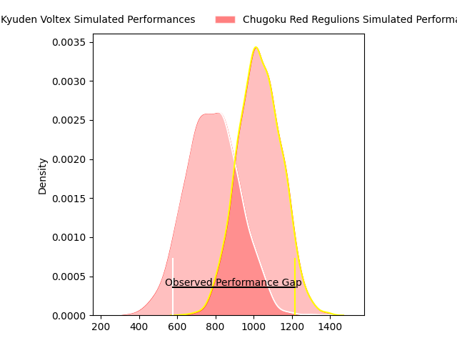
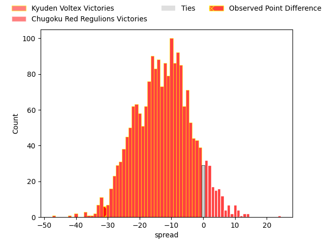
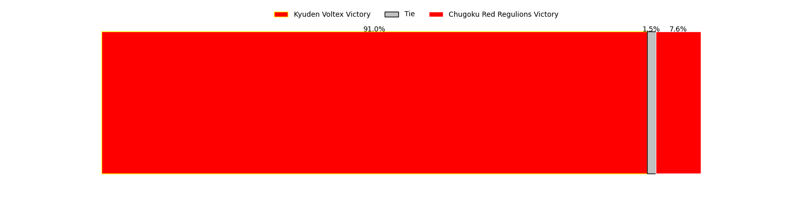
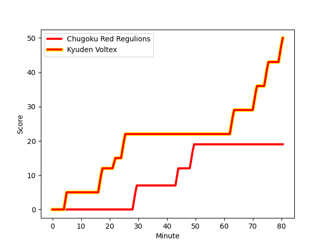
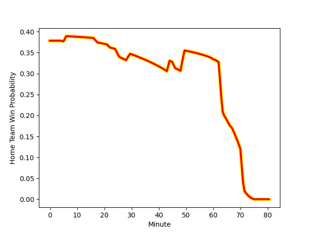

---  
layout: page  
title: Kyuden Voltex at Chugoku Red Regulions; 50-19  
date: 2023-03-04 00:00:00 18:00:00 -0500  
categories: match review  
---
# Kyuden Voltex at Chugoku Red Regulions; 50-19

# Club Level Predictions

The first set of predictions treats a club as the smallest object, as the club develops its members, organizes a gameplan, and deploys its players as needed for each match. This club model has a prediction of 0.203, which translates to predicting Kyuden Voltex to win by 12.6.

Each club has a rating and a rating deviation (simiar to a Glicko system), and expected performances can be generated. This allows for simulated matches and spreads like the ones below.
## Projected Performances

## Projected Spreads

## Projected Results

# Player Level Predictions

Treating teams instead as an entity made up of the currently active players, I have ratings for each player in an altogether different system. These can be combined to form team ratings once teamsheets are announced, weighting starters a bit higher than the reserves. After the match is played, players can be weighted by their minutes on the field, allowing for an accurate measure of the team's composition. With these compiled team ratings, we can make predictions, measure inaccuracy, and update the individual player ratings.
## Prediction with Player Minutes: Kyuden Voltex by 17.5

Kyuden Voltex by 21.5 on a neutral field
## Scores over Time

## Win Probability over Time

There were 4 large changes in win probability in this match
## Prediction without Player Minutes: Kyuden Voltex by 21.1

Kyuden Voltex by 25.1 on a neutral pitch

|   Away Minutes | Away Player                                                                |   Away elo |   Away Percentile |   Number |   Home Percentile |   Home elo | Home Player                                                       |   Home Minutes |
|---------------:|:---------------------------------------------------------------------------|-----------:|------------------:|---------:|------------------:|-----------:|:------------------------------------------------------------------|---------------:|
|             60 | [Samuel Nozomu Faialaga](..//playerfiles//SamuelNozomuFaialaga_cleaned.md) |      97.1  |                57 |        1 |                 9 |      78.78 | [Kojiro Arito](..//playerfiles//KojiroArito_cleaned.md)           |             62 |
|             60 | [Daigo Asato](..//playerfiles//DaigoAsato_cleaned.md)                      |      90.28 |                34 |        2 |                 7 |      75.63 | [Yuuki Asai](..//playerfiles//YuukiAsai_cleaned.md)               |             80 |
|             60 | [Shinpei Kamata](..//playerfiles//ShinpeiKamata_cleaned.md)                |      97.32 |                63 |        3 |                 6 |      74.95 | [Saiya Kitajima](..//playerfiles//SaiyaKitajima_cleaned.md)       |             62 |
|             80 | [Ray Tatafu](..//playerfiles//RayTatafu_cleaned.md)                        |      89.02 |                33 |        4 |                 0 |      39.91 | [Taro Nishikawa](..//playerfiles//TaroNishikawa_cleaned.md)       |             80 |
|             46 | [Tom Rowe](..//playerfiles//TomRowe_cleaned.md)                            |      88.32 |                27 |        5 |                 7 |      72.87 | [Noriyuki Kureyama](..//playerfiles//NoriyukiKureyama_cleaned.md) |              6 |
|             80 | [Ken Nakashima](..//playerfiles//KenNakashima_cleaned.md)                  |      87.02 |                24 |        6 |                28 |      88.43 | [Shintaro Matsuda](..//playerfiles//ShintaroMatsuda_cleaned.md)   |             77 |
|             46 | [Yuuki Yamada](..//playerfiles//YuukiYamada_cleaned.md)                    |      98.99 |                65 |        7 |                 4 |      69.22 | [Kohei Matsunaga](..//playerfiles//KoheiMatsunaga_cleaned.md)     |             80 |
|             80 | [Walker Alex Takuya](..//playerfiles//WalkerAlexTakuya_cleaned.md)         |      91.09 |                36 |        8 |                59 |      98.55 | [Ed Quirk](..//playerfiles//EdQuirk_cleaned.md)                   |             80 |
|             60 | [Shunta Takenouchi](..//playerfiles//ShuntaTakenouchi_cleaned.md)          |      90.65 |                37 |        9 |                 7 |      73.26 | [Rintaro Kawashima](..//playerfiles//RintaroKawashima_cleaned.md) |             67 |
|             77 | [Phil Burleigh](..//playerfiles//PhilBurleigh_cleaned.md)                  |      89.33 |                31 |       10 |                18 |      81.85 | [Ippei Yamada](..//playerfiles//IppeiYamada_cleaned.md)           |             74 |
|             80 | [Ren Hagiwara](..//playerfiles//RenHagiwara_cleaned.md)                    |      79.78 |                13 |       11 |                28 |      88.31 | [Kentaro Fujii](..//playerfiles//KentaroFujii_cleaned.md)         |             80 |
|             80 | [Hayato Kojyo](..//playerfiles//HayatoKojyo_cleaned.md)                    |      95    |               nan |       12 |                25 |      86.45 | [Shinya Hirayama](..//playerfiles//ShinyaHirayama_cleaned.md)     |             80 |
|             80 | [Sam Vaka](..//playerfiles//SamVaka_cleaned.md)                            |      88.99 |                30 |       13 |                 3 |      65.56 | [Masaaki Morita](..//playerfiles//MasaakiMorita_cleaned.md)       |             80 |
|             80 | [Yasunari Isoda](..//playerfiles//YasunariIsoda_cleaned.md)                |      98.18 |                59 |       14 |                16 |      80.99 | [Keigo Hatanaka](..//playerfiles//KeigoHatanaka_cleaned.md)       |             62 |
|             64 | [Keito Honda](..//playerfiles//KeitoHonda_cleaned.md)                      |      84.74 |               nan |       15 |                 4 |      64.86 | [Masahiro Nakano](..//playerfiles//MasahiroNakano_cleaned.md)     |             80 |
|             34 | [Tomotaka Ishimatsu](..//playerfiles//TomotakaIshimatsu_cleaned.md)        |      97.71 |                59 |       16 |                59 |      97.82 | [Tomonari Aoki](..//playerfiles//TomonariAoki_cleaned.md)         |             74 |
|             34 | [Colby Fainga'a](..//playerfiles//ColbyFainga'a_cleaned.md)                |     112.65 |                88 |       17 |                 4 |      71.34 | [Toshiyuki Ooki](..//playerfiles//ToshiyukiOoki_cleaned.md)       |             18 |
|             20 | [Genki Nakamura](..//playerfiles//GenkiNakamura_cleaned.md)                |      85.49 |               nan |       18 |                12 |      81.32 | [Hidetatsu Tsuboi](..//playerfiles//HidetatsuTsuboi_cleaned.md)   |             18 |
|             20 | [Yasuo Saruwatari](..//playerfiles//YasuoSaruwatari_cleaned.md)            |      86.46 |                21 |       19 |                15 |      80.34 | [Motoki Arai](..//playerfiles//MotokiArai_cleaned.md)             |             18 |
|             20 | [Daisuke Kodama](..//playerfiles//DaisukeKodama_cleaned.md)                |      82.04 |                19 |       20 |                34 |      89.63 | [Atsushi Mizofuchi](..//playerfiles//AtsushiMizofuchi_cleaned.md) |             13 |
|             20 | [Kazuto Tokunaga](..//playerfiles//KazutoTokunaga_cleaned.md)              |     123.76 |               nan |       21 |                 5 |      71.13 | [Hashizo Yoshida](..//playerfiles//HashizoYoshida_cleaned.md)     |              6 |
|             16 | [Akihito Yamada](..//playerfiles//AkihitoYamada_cleaned.md)                |      94.27 |               nan |       22 |                 3 |      64.9  | [Kennta Fujisaki](..//playerfiles//KenntaFujisaki_cleaned.md)     |              3 |
|              3 | [Kichi Uezato](..//playerfiles//KichiUezato_cleaned.md)                    |     100.61 |                79 |       23 |               nan |     nan    | nan                                                               |            nan |

