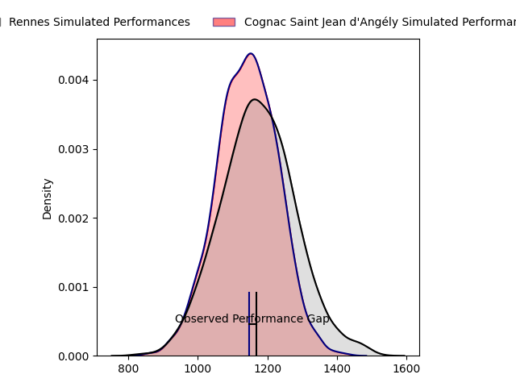
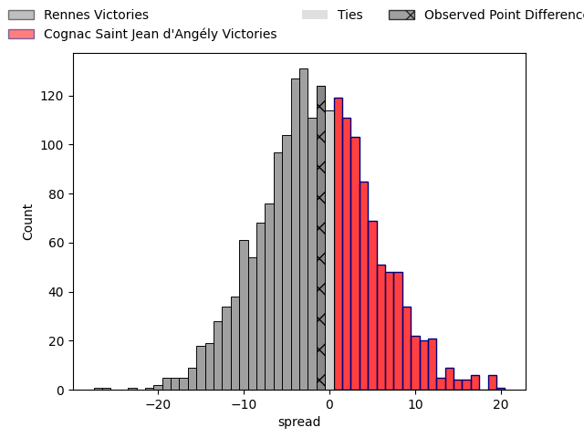
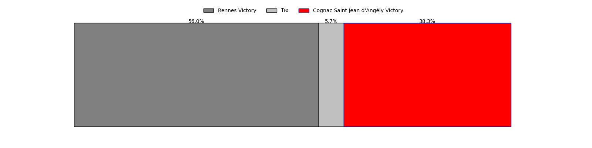
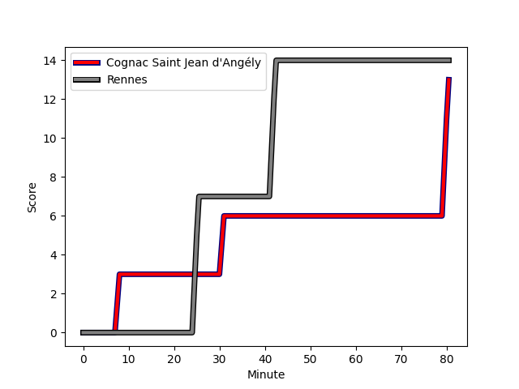
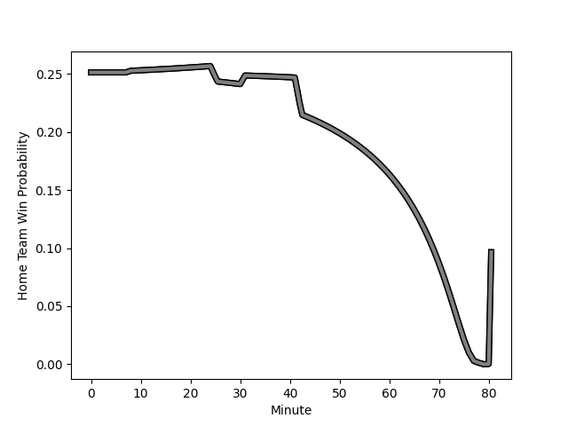

---  
layout: page  
title: Rennes at Cognac Saint Jean d'Angély; 14-13  
date: 2023-03-04 18:00:00 18:00:00 -0500  
categories: match review  
---
# Rennes at Cognac Saint Jean d'Angély; 14-13

# Club Level Predictions

The first set of predictions treats a club as the smallest object, as the club develops its members, organizes a gameplan, and deploys its players as needed for each match. This club model has a prediction of 0.461, which translates to predicting Rennes to win by 1.4.

Each club has a rating and a rating deviation (simiar to a Glicko system), and expected performances can be generated. This allows for simulated matches and spreads like the ones below.
## Projected Performances

## Projected Spreads

## Projected Results

# Player Level Predictions

Treating teams instead as an entity made up of the currently active players, I have ratings for each player in an altogether different system. These can be combined to form team ratings once teamsheets are announced, weighting starters a bit higher than the reserves. After the match is played, players can be weighted by their minutes on the field, allowing for an accurate measure of the team's composition. With these compiled team ratings, we can make predictions, measure inaccuracy, and update the individual player ratings.
## Prediction with Player Minutes: Rennes by 42.5

Rennes by 46.5 on a neutral field
## Scores over Time

## Win Probability over Time

There were 1 large changes in win probability in this match
## Prediction without Player Minutes: Rennes by 44.6

Rennes by 48.6 on a neutral pitch

|   Away Minutes | Away Player                                                             |   Away elo |   Away Percentile |   Number |   Home Percentile |   Home elo | Home Player                                                         |   Home Minutes |
|---------------:|:------------------------------------------------------------------------|-----------:|------------------:|---------:|------------------:|-----------:|:--------------------------------------------------------------------|---------------:|
|             42 | [Grégory Querin](..//playerfiles//GrégoryQuerin_cleaned.md)             |     104.36 |                57 |        1 |                28 |      88.77 | [Kevin Tougne](..//playerfiles//KevinTougne_cleaned.md)             |             79 |
|             80 | [Grégory Querin](..//playerfiles//GrégoryQuerin_cleaned.md)             |     104.36 |                57 |        1 |                28 |      88.77 | [Kevin Tougne](..//playerfiles//KevinTougne_cleaned.md)             |             79 |
|             42 | [Grégory Querin](..//playerfiles//GrégoryQuerin_cleaned.md)             |     104.36 |                57 |        1 |                28 |      88.77 | [Kevin Tougne](..//playerfiles//KevinTougne_cleaned.md)             |             80 |
|             80 | [Grégory Querin](..//playerfiles//GrégoryQuerin_cleaned.md)             |     104.36 |                57 |        1 |                28 |      88.77 | [Kevin Tougne](..//playerfiles//KevinTougne_cleaned.md)             |             80 |
|             80 | [Alexandre Fau](..//playerfiles//AlexandreFau_cleaned.md)               |      88.14 |                33 |        2 |                13 |      85.25 | [Maxime Gau](..//playerfiles//MaximeGau_cleaned.md)                 |             80 |
|             56 | [Alexandre Fau](..//playerfiles//AlexandreFau_cleaned.md)               |      88.14 |                33 |        2 |                13 |      85.25 | [Maxime Gau](..//playerfiles//MaximeGau_cleaned.md)                 |             80 |
|             56 | [Luvuyo Pupuma](..//playerfiles//LuvuyoPupuma_cleaned.md)               |      96.71 |                57 |        3 |                66 |      99.34 | [Martin Augeix](..//playerfiles//MartinAugeix_cleaned.md)           |             80 |
|             80 | [Luvuyo Pupuma](..//playerfiles//LuvuyoPupuma_cleaned.md)               |      96.71 |                57 |        3 |                66 |      99.34 | [Martin Augeix](..//playerfiles//MartinAugeix_cleaned.md)           |             80 |
|             80 | [Alexandre Gueroult](..//playerfiles//AlexandreGueroult_cleaned.md)     |      88.03 |                27 |        4 |                 1 |      52.94 | [Thomas Toevalu](..//playerfiles//ThomasToevalu_cleaned.md)         |             80 |
|             80 | [Clément Fontaine](..//playerfiles//ClémentFontaine_cleaned.md)         |      96.13 |                54 |        5 |                12 |      79.98 | [Filipe Manu](..//playerfiles//FilipeManu_cleaned.md)               |             80 |
|             65 | [Clément Fontaine](..//playerfiles//ClémentFontaine_cleaned.md)         |      96.13 |                54 |        5 |                12 |      79.98 | [Filipe Manu](..//playerfiles//FilipeManu_cleaned.md)               |             80 |
|             65 | [Clément Fontaine](..//playerfiles//ClémentFontaine_cleaned.md)         |      96.13 |                54 |        5 |                12 |      79.98 | [Filipe Manu](..//playerfiles//FilipeManu_cleaned.md)               |             62 |
|             80 | [Clément Fontaine](..//playerfiles//ClémentFontaine_cleaned.md)         |      96.13 |                54 |        5 |                12 |      79.98 | [Filipe Manu](..//playerfiles//FilipeManu_cleaned.md)               |             62 |
|             80 | [Baptiste Beaujouan](..//playerfiles//BaptisteBeaujouan_cleaned.md)     |     104.23 |                74 |        6 |                 2 |      59.64 | [Lucas Gulizzi](..//playerfiles//LucasGulizzi_cleaned.md)           |             80 |
|             80 | [Baptiste Beaujouan](..//playerfiles//BaptisteBeaujouan_cleaned.md)     |     104.23 |                74 |        6 |                 2 |      59.64 | [Lucas Gulizzi](..//playerfiles//LucasGulizzi_cleaned.md)           |             60 |
|             56 | [Baptiste Beaujouan](..//playerfiles//BaptisteBeaujouan_cleaned.md)     |     104.23 |                74 |        6 |                 2 |      59.64 | [Lucas Gulizzi](..//playerfiles//LucasGulizzi_cleaned.md)           |             60 |
|             56 | [Baptiste Beaujouan](..//playerfiles//BaptisteBeaujouan_cleaned.md)     |     104.23 |                74 |        6 |                 2 |      59.64 | [Lucas Gulizzi](..//playerfiles//LucasGulizzi_cleaned.md)           |             80 |
|             80 | [Luca Di Salvatore](..//playerfiles//LucaDiSalvatore_cleaned.md)        |      92.94 |                45 |        7 |                86 |     111.69 | [Gio Sordia](..//playerfiles//GioSordia_cleaned.md)                 |             80 |
|             80 | [Gaétan Béraud](..//playerfiles//GaétanBéraud_cleaned.md)               |      77.7  |                 9 |        8 |                14 |      82.53 | [Matthieu Thomas](..//playerfiles//MatthieuThomas_cleaned.md)       |             80 |
|             80 | [Maxime Le Viavant](..//playerfiles//MaximeLeViavant_cleaned.md)        |      96.18 |               nan |        9 |                 7 |      72.93 | [Mathieu Billou](..//playerfiles//MathieuBillou_cleaned.md)         |             80 |
|             80 | [Maxime Le Viavant](..//playerfiles//MaximeLeViavant_cleaned.md)        |      96.18 |               nan |        9 |                 7 |      72.93 | [Mathieu Billou](..//playerfiles//MathieuBillou_cleaned.md)         |             78 |
|             67 | [Maxime Le Viavant](..//playerfiles//MaximeLeViavant_cleaned.md)        |      96.18 |               nan |        9 |                 7 |      72.93 | [Mathieu Billou](..//playerfiles//MathieuBillou_cleaned.md)         |             78 |
|             67 | [Maxime Le Viavant](..//playerfiles//MaximeLeViavant_cleaned.md)        |      96.18 |               nan |        9 |                 7 |      72.93 | [Mathieu Billou](..//playerfiles//MathieuBillou_cleaned.md)         |             80 |
|             80 | [Yvan Leroyer](..//playerfiles//YvanLeroyer_cleaned.md)                 |      90.02 |                35 |       10 |                26 |      87.57 | [Serafin Bordoli](..//playerfiles//SerafinBordoli_cleaned.md)       |             80 |
|             80 | [Yvan Leroyer](..//playerfiles//YvanLeroyer_cleaned.md)                 |      90.02 |                35 |       10 |                26 |      87.57 | [Serafin Bordoli](..//playerfiles//SerafinBordoli_cleaned.md)       |             62 |
|             80 | [Alexis François](..//playerfiles//AlexisFrançois_cleaned.md)           |      86.8  |                24 |       11 |                 1 |      59.26 | [Vincent Pageneau](..//playerfiles//VincentPageneau_cleaned.md)     |             80 |
|             67 | [Alexis François](..//playerfiles//AlexisFrançois_cleaned.md)           |      86.8  |                24 |       11 |                 1 |      59.26 | [Vincent Pageneau](..//playerfiles//VincentPageneau_cleaned.md)     |             80 |
|             80 | [Ryan Dubois](..//playerfiles//RyanDubois_cleaned.md)                   |      96.68 |                55 |       12 |                22 |      85.31 | [Henry Tuilagi](..//playerfiles//HenryTuilagi_cleaned.md)           |             80 |
|             80 | [Clément Lepresle](..//playerfiles//ClémentLepresle_cleaned.md)         |      94.51 |                48 |       13 |                47 |      93.91 | [Isimeli Kuruibua](..//playerfiles//IsimeliKuruibua_cleaned.md)     |             80 |
|             80 | [Enzo Salvai](..//playerfiles//EnzoSalvai_cleaned.md)                   |     111.73 |                87 |       14 |                13 |      80.57 | [Jone Tuva](..//playerfiles//JoneTuva_cleaned.md)                   |             80 |
|             51 | [Mathieu Brignonen](..//playerfiles//MathieuBrignonen_cleaned.md)       |      90.83 |                40 |       15 |                18 |      81.34 | [Dany Antunes](..//playerfiles//DanyAntunes_cleaned.md)             |             62 |
|             80 | [Mathieu Brignonen](..//playerfiles//MathieuBrignonen_cleaned.md)       |      90.83 |                40 |       15 |                18 |      81.34 | [Dany Antunes](..//playerfiles//DanyAntunes_cleaned.md)             |             80 |
|             51 | [Mathieu Brignonen](..//playerfiles//MathieuBrignonen_cleaned.md)       |      90.83 |                40 |       15 |                18 |      81.34 | [Dany Antunes](..//playerfiles//DanyAntunes_cleaned.md)             |             80 |
|             80 | [Mathieu Brignonen](..//playerfiles//MathieuBrignonen_cleaned.md)       |      90.83 |                40 |       15 |                18 |      81.34 | [Dany Antunes](..//playerfiles//DanyAntunes_cleaned.md)             |             62 |
|             38 | [Baptiste Le Jallé](..//playerfiles//BaptisteLeJallé_cleaned.md)        |      91    |                36 |       16 |               nan |      95.13 | [Enrique Manukawera](..//playerfiles//EnriqueManukawera_cleaned.md) |              1 |
|             24 | [Pierre Strippoli](..//playerfiles//PierreStrippoli_cleaned.md)         |      91.51 |                32 |       17 |                 0 |      46.13 | [Utu Maninoa](..//playerfiles//UtuManinoa_cleaned.md)               |             18 |
|             24 | [Atonio Ulutuipalelei](..//playerfiles//AtonioUlutuipalelei_cleaned.md) |      90.21 |                33 |       18 |               nan |      99.05 | [Khaled Hammouten](..//playerfiles//KhaledHammouten_cleaned.md)     |             20 |
|             15 | [Vincent Wenger](..//playerfiles//VincentWenger_cleaned.md)             |      88.45 |                47 |       19 |                 1 |      55.51 | [Mathis Garnier](..//playerfiles//MathisGarnier_cleaned.md)         |              2 |
|             24 | [Victor Fromenteze](..//playerfiles//VictorFromenteze_cleaned.md)       |      79.11 |                 9 |       20 |                47 |      93.68 | [William Beaudon](..//playerfiles//WilliamBeaudon_cleaned.md)       |             18 |
|             13 | [Joaquin Diaz Luzzi](..//playerfiles//JoaquinDiazLuzzi_cleaned.md)      |     119.34 |                90 |       21 |                50 |      95.08 | [Nils Guyon](..//playerfiles//NilsGuyon_cleaned.md)                 |             18 |
|             13 | [Hypolite Cornu](..//playerfiles//HypoliteCornu_cleaned.md)             |     103.8  |                65 |       22 |               nan |     nan    | nan                                                                 |            nan |
|             29 | [Romuald François](..//playerfiles//RomualdFrançois_cleaned.md)         |      75.12 |                 8 |       23 |               nan |     nan    | nan                                                                 |            nan |

