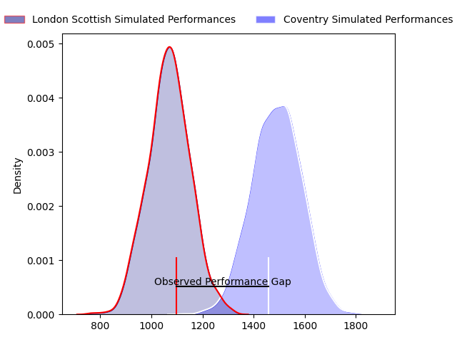
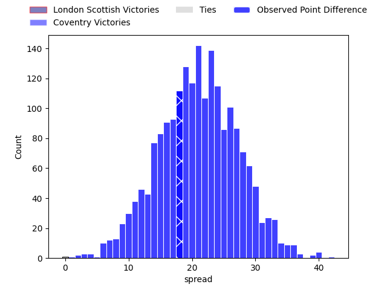
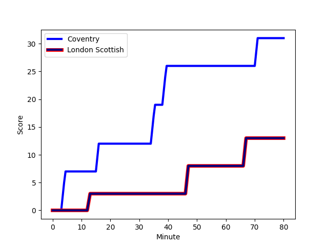
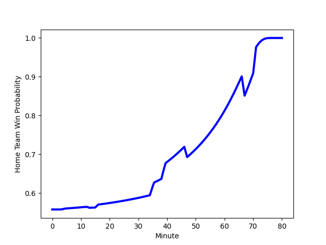

---  
layout: page  
title: London Scottish at Coventry; 13-31  
date: 2023-03-04 16:00:00 18:00:00 -0500  
categories: match review  
---
# London Scottish at Coventry; 13-31

# Club Level Predictions

The first set of predictions treats a club as the smallest object, as the club develops its members, organizes a gameplan, and deploys its players as needed for each match. This club model has a prediction of 0.912, which translates to predicting Coventry to win by 21.0.

Each club has a rating and a rating deviation (simiar to a Glicko system), and expected performances can be generated. This allows for simulated matches and spreads like the ones below.
## Projected Performances

## Projected Spreads

## Projected Results

# Player Level Predictions

Treating teams instead as an entity made up of the currently active players, I have ratings for each player in an altogether different system. These can be combined to form team ratings once teamsheets are announced, weighting starters a bit higher than the reserves. After the match is played, players can be weighted by their minutes on the field, allowing for an accurate measure of the team's composition. With these compiled team ratings, we can make predictions, measure inaccuracy, and update the individual player ratings.
## Prediction with Player Minutes: Coventry by 14.0

Coventry by 10.0 on a neutral field
## Scores over Time

## Win Probability over Time

There were 4 large changes in win probability in this match
## Prediction without Player Minutes: Coventry by 14.0

Coventry by 10.0 on a neutral pitch

|   Away Minutes | Away Player                                                         |   Away elo |   Away Percentile |   Number |   Home Percentile |   Home elo | Home Player                                                         |   Home Minutes |
|---------------:|:--------------------------------------------------------------------|-----------:|------------------:|---------:|------------------:|-----------:|:--------------------------------------------------------------------|---------------:|
|             80 | [William Hobson](..//playerfiles//WilliamHobson_cleaned.md)         |     104.73 |                82 |        1 |                60 |      97.75 | [Toby Trinder](..//playerfiles//TobyTrinder_cleaned.md)             |             80 |
|             80 | [Harri Morris](..//playerfiles//HarriMorris_cleaned.md)             |      99.99 |                72 |        2 |                49 |      97.69 | [Suva Ma'asi](..//playerfiles//SuvaMa'asi_cleaned.md)               |             80 |
|             80 | [Joe Rees](..//playerfiles//JoeRees_cleaned.md)                     |      96.75 |                56 |        3 |                79 |     103.76 | [Ollie Andrews](..//playerfiles//OllieAndrews_cleaned.md)           |             80 |
|             80 | [Matas Jurevicius](..//playerfiles//MatasJurevicius_cleaned.md)     |      90.87 |                35 |        4 |                25 |      86.93 | [James Tyas](..//playerfiles//JamesTyas_cleaned.md)                 |             80 |
|             80 | [Bailey Ransom](..//playerfiles//BaileyRansom_cleaned.md)           |     118.65 |                92 |        5 |                91 |     116.68 | [Adam Peters](..//playerfiles//AdamPeters_cleaned.md)               |             80 |
|             80 | [Will Trenholm](..//playerfiles//WillTrenholm_cleaned.md)           |      84.71 |                19 |        6 |                23 |      86.45 | [Tom Dodd](..//playerfiles//TomDodd_cleaned.md)                     |             80 |
|             80 | [Jack Ingall](..//playerfiles//JackIngall_cleaned.md)               |      65.68 |                 3 |        7 |                94 |     120.51 | [Josh Bainbridge](..//playerfiles//JoshBainbridge_cleaned.md)       |             80 |
|             80 | [Viliami Taulani](..//playerfiles//ViliamiTaulani_cleaned.md)       |      99.73 |                63 |        8 |                89 |     113.29 | [Senitiki Nayalo](..//playerfiles//SenitikiNayalo_cleaned.md)       |             80 |
|             80 | [Daniel Nutton](..//playerfiles//DanielNutton_cleaned.md)           |      61.26 |                 2 |        9 |                34 |      89.63 | [Will Chudley](..//playerfiles//WillChudley_cleaned.md)             |             80 |
|             80 | [Nathan Chamberlain](..//playerfiles//NathanChamberlain_cleaned.md) |      91.84 |                41 |       10 |                 9 |      79.77 | [Evan Mitchell](..//playerfiles//EvanMitchell_cleaned.md)           |             80 |
|             80 | [Vilikesa Wara](..//playerfiles//VilikesaWara_cleaned.md)           |      91.91 |                41 |       11 |                53 |      95.96 | [James Martin](..//playerfiles//JamesMartin_cleaned.md)             |             80 |
|             80 | [Lennox Anyanwu](..//playerfiles//LennoxAnyanwu_cleaned.md)         |     105.57 |                80 |       12 |                57 |      99.44 | [Lucas Titherington](..//playerfiles//LucasTitherington_cleaned.md) |             80 |
|             80 | [Hayden Hyde](..//playerfiles//HaydenHyde_cleaned.md)               |      74.8  |                 8 |       13 |                82 |     107.11 | [Will Rigg](..//playerfiles//WillRigg_cleaned.md)                   |             80 |
|             80 | [Luke Mehson](..//playerfiles//LukeMehson_cleaned.md)               |      95.7  |                52 |       14 |                41 |      90.92 | [Louis James](..//playerfiles//LouisJames_cleaned.md)               |             80 |
|             80 | [Cameron Anderson](..//playerfiles//CameronAnderson_cleaned.md)     |      92.45 |                45 |       15 |                32 |      89.19 | [Will Talbot-Davies](..//playerfiles//WillTalbot-Davies_cleaned.md) |             80 |

