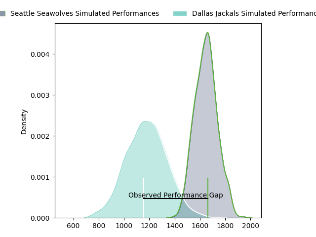
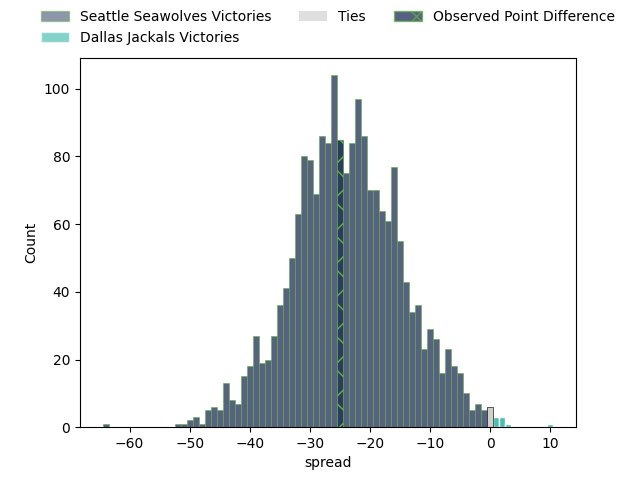
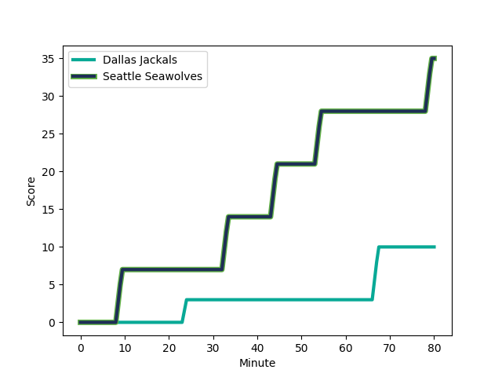
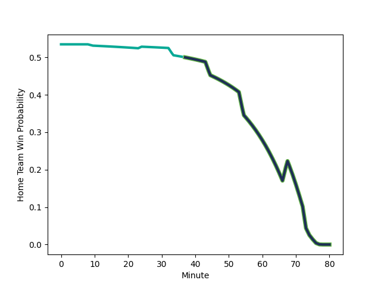

---  
layout: page  
title: Seattle Seawolves at Dallas Jackals; 35-10  
date: 2023-03-04 02:00:00 18:00:00 -0500  
categories: match review  
---
# Seattle Seawolves at Dallas Jackals; 35-10

# Club Level Predictions

The first set of predictions treats a club as the smallest object, as the club develops its members, organizes a gameplan, and deploys its players as needed for each match. This club model has a prediction of 0.068, which translates to predicting Seattle Seawolves to win by 23.6.

Each club has a rating and a rating deviation (simiar to a Glicko system), and expected performances can be generated. This allows for simulated matches and spreads like the ones below.
## Projected Performances

## Projected Spreads

## Projected Results

# Player Level Predictions

Treating teams instead as an entity made up of the currently active players, I have ratings for each player in an altogether different system. These can be combined to form team ratings once teamsheets are announced, weighting starters a bit higher than the reserves. After the match is played, players can be weighted by their minutes on the field, allowing for an accurate measure of the team's composition. With these compiled team ratings, we can make predictions, measure inaccuracy, and update the individual player ratings.
## Prediction with Player Minutes: Dallas Jackals by 10.0

Dallas Jackals by 6.0 on a neutral field
## Scores over Time

## Win Probability over Time

There were 6 large changes in win probability in this match
## Prediction without Player Minutes: Dallas Jackals by 15.1

Dallas Jackals by 11.1 on a neutral pitch

|   Away Minutes | Away Player                                                                |   Away elo |   Away Percentile |   Number |   Home Percentile |   Home elo | Home Player                                                            |   Home Minutes |
|---------------:|:---------------------------------------------------------------------------|-----------:|------------------:|---------:|------------------:|-----------:|:-----------------------------------------------------------------------|---------------:|
|             46 | [Jake Turnbull](..//playerfiles//JakeTurnbull_cleaned.md)                  |      93.01 |                42 |        1 |                79 |     105.75 | [Nicolas Revol](..//playerfiles//NicolasRevol_cleaned.md)              |             80 |
|             80 | [Jake Turnbull](..//playerfiles//JakeTurnbull_cleaned.md)                  |      93.01 |                42 |        1 |                79 |     105.75 | [Nicolas Revol](..//playerfiles//NicolasRevol_cleaned.md)              |             80 |
|             46 | [Jake Turnbull](..//playerfiles//JakeTurnbull_cleaned.md)                  |      93.01 |                42 |        1 |                79 |     105.75 | [Nicolas Revol](..//playerfiles//NicolasRevol_cleaned.md)              |             55 |
|             80 | [Jake Turnbull](..//playerfiles//JakeTurnbull_cleaned.md)                  |      93.01 |                42 |        1 |                79 |     105.75 | [Nicolas Revol](..//playerfiles//NicolasRevol_cleaned.md)              |             55 |
|             80 | [James Malcolm](..//playerfiles//JamesMalcolm_cleaned.md)                  |      96.99 |                67 |        2 |                17 |      84.52 | [Dewald Kotze](..//playerfiles//DewaldKotze_cleaned.md)                |             80 |
|             46 | [James Malcolm](..//playerfiles//JamesMalcolm_cleaned.md)                  |      96.99 |                67 |        2 |                17 |      84.52 | [Dewald Kotze](..//playerfiles//DewaldKotze_cleaned.md)                |             80 |
|             80 | [James Malcolm](..//playerfiles//JamesMalcolm_cleaned.md)                  |      96.99 |                67 |        2 |                17 |      84.52 | [Dewald Kotze](..//playerfiles//DewaldKotze_cleaned.md)                |             55 |
|             46 | [James Malcolm](..//playerfiles//JamesMalcolm_cleaned.md)                  |      96.99 |                67 |        2 |                17 |      84.52 | [Dewald Kotze](..//playerfiles//DewaldKotze_cleaned.md)                |             55 |
|             46 | [Mason Pedersen](..//playerfiles//MasonPedersen_cleaned.md)                |      63.67 |                 2 |        3 |                34 |      90.71 | [Juan Pablo Zeiss](..//playerfiles//JuanPabloZeiss_cleaned.md)         |             80 |
|             80 | [Mason Pedersen](..//playerfiles//MasonPedersen_cleaned.md)                |      63.67 |                 2 |        3 |                34 |      90.71 | [Juan Pablo Zeiss](..//playerfiles//JuanPabloZeiss_cleaned.md)         |             80 |
|             46 | [Mason Pedersen](..//playerfiles//MasonPedersen_cleaned.md)                |      63.67 |                 2 |        3 |                34 |      90.71 | [Juan Pablo Zeiss](..//playerfiles//JuanPabloZeiss_cleaned.md)         |             62 |
|             80 | [Mason Pedersen](..//playerfiles//MasonPedersen_cleaned.md)                |      63.67 |                 2 |        3 |                34 |      90.71 | [Juan Pablo Zeiss](..//playerfiles//JuanPabloZeiss_cleaned.md)         |             62 |
|             80 | [Ben Landry](..//playerfiles//BenLandry_cleaned.md)                        |      85.88 |                21 |        4 |                38 |      91.34 | [Sam Golla](..//playerfiles//SamGolla_cleaned.md)                      |             80 |
|             71 | [Ben Landry](..//playerfiles//BenLandry_cleaned.md)                        |      85.88 |                42 |        4 |                38 |      91.34 | [Sam Golla](..//playerfiles//SamGolla_cleaned.md)                      |             73 |
|             71 | [Ben Landry](..//playerfiles//BenLandry_cleaned.md)                        |      85.88 |                21 |        4 |                38 |      91.34 | [Sam Golla](..//playerfiles//SamGolla_cleaned.md)                      |             73 |
|             71 | [Ben Landry](..//playerfiles//BenLandry_cleaned.md)                        |      85.88 |                21 |        4 |                38 |      91.34 | [Sam Golla](..//playerfiles//SamGolla_cleaned.md)                      |             80 |
|             80 | [Ben Landry](..//playerfiles//BenLandry_cleaned.md)                        |      85.88 |                21 |        4 |                38 |      91.34 | [Sam Golla](..//playerfiles//SamGolla_cleaned.md)                      |             73 |
|             71 | [Ben Landry](..//playerfiles//BenLandry_cleaned.md)                        |      85.88 |                42 |        4 |                38 |      91.34 | [Sam Golla](..//playerfiles//SamGolla_cleaned.md)                      |             80 |
|             80 | [Ben Landry](..//playerfiles//BenLandry_cleaned.md)                        |      85.88 |                42 |        4 |                38 |      91.34 | [Sam Golla](..//playerfiles//SamGolla_cleaned.md)                      |             73 |
|             80 | [Ben Landry](..//playerfiles//BenLandry_cleaned.md)                        |      85.88 |                42 |        4 |                38 |      91.34 | [Sam Golla](..//playerfiles//SamGolla_cleaned.md)                      |             80 |
|             71 | [Rhyno Herbst](..//playerfiles//RhynoHerbst_cleaned.md)                    |      91.86 |                40 |        5 |                 0 |      27.89 | [Conrado Roura](..//playerfiles//ConradoRoura_cleaned.md)              |             80 |
|             80 | [Rhyno Herbst](..//playerfiles//RhynoHerbst_cleaned.md)                    |      91.86 |                40 |        5 |                 0 |      27.89 | [Conrado Roura](..//playerfiles//ConradoRoura_cleaned.md)              |             80 |
|             80 | [Charles Elton](..//playerfiles//CharlesElton_cleaned.md)                  |      91.69 |                40 |        6 |                22 |      86.25 | [Jeronimo Gomez Vara](..//playerfiles//JeronimoGomezVara_cleaned.md)   |             80 |
|             80 | [Nakai Penny](..//playerfiles//NakaiPenny_cleaned.md)                      |      95.03 |                51 |        7 |                 6 |      70.91 | [Jalen Tatum](..//playerfiles//JalenTatum_cleaned.md)                  |             55 |
|             80 | [Nakai Penny](..//playerfiles//NakaiPenny_cleaned.md)                      |      95.03 |                51 |        7 |                 6 |      70.91 | [Jalen Tatum](..//playerfiles//JalenTatum_cleaned.md)                  |             80 |
|             80 | [Riekert Hattingh](..//playerfiles//RiekertHattingh_cleaned.md)            |      91.86 |                40 |        8 |                32 |      89.79 | [Jan Adriaan Booysen](..//playerfiles//JanAdriaanBooysen_cleaned.md)   |             80 |
|             80 | [JP Smith](..//playerfiles//JPSmith_cleaned.md)                            |     104.52 |                78 |        9 |                60 |      97.87 | [Pedro Imhoff](..//playerfiles//PedroImhoff_cleaned.md)                |             21 |
|             80 | [JP Smith](..//playerfiles//JPSmith_cleaned.md)                            |     104.52 |                78 |        9 |                60 |      97.87 | [Pedro Imhoff](..//playerfiles//PedroImhoff_cleaned.md)                |             80 |
|             80 | [AJ Alatimu](..//playerfiles//AJAlatimu_cleaned.md)                        |      93.93 |               nan |       10 |                98 |     134.27 | [Martin Elias](..//playerfiles//MartinElias_cleaned.md)                |             22 |
|             80 | [AJ Alatimu](..//playerfiles//AJAlatimu_cleaned.md)                        |      93.93 |               nan |       10 |                98 |     134.27 | [Martin Elias](..//playerfiles//MartinElias_cleaned.md)                |             80 |
|             80 | [Lauina Futi](..//playerfiles//LauinaFuti_cleaned.md)                      |     149.47 |                99 |       11 |                87 |     111.22 | [James Vaifale](..//playerfiles//JamesVaifale_cleaned.md)              |             80 |
|             80 | [Lauina Futi](..//playerfiles//LauinaFuti_cleaned.md)                      |     149.47 |                99 |       11 |                87 |     111.22 | [James Vaifale](..//playerfiles//JamesVaifale_cleaned.md)              |             73 |
|             56 | [Lauina Futi](..//playerfiles//LauinaFuti_cleaned.md)                      |     149.47 |                99 |       11 |                87 |     111.22 | [James Vaifale](..//playerfiles//JamesVaifale_cleaned.md)              |             73 |
|             56 | [Lauina Futi](..//playerfiles//LauinaFuti_cleaned.md)                      |     149.47 |                99 |       11 |                87 |     111.22 | [James Vaifale](..//playerfiles//JamesVaifale_cleaned.md)              |             80 |
|             80 | [Tevita Lopeti](..//playerfiles//TevitaLopeti_cleaned.md)                  |      83.17 |                43 |       12 |                 5 |      72.11 | [Alejandro Torres](..//playerfiles//AlejandroTorres_cleaned.md)        |             80 |
|             80 | [Tevita Lopeti](..//playerfiles//TevitaLopeti_cleaned.md)                  |      83.17 |                17 |       12 |                 5 |      72.11 | [Alejandro Torres](..//playerfiles//AlejandroTorres_cleaned.md)        |             80 |
|             80 | [Daniel David Kriel](..//playerfiles//DanielDavidKriel_cleaned.md)         |      91.86 |                41 |       13 |                88 |     111.33 | [Tomas Malanos](..//playerfiles//TomasMalanos_cleaned.md)              |             80 |
|             75 | [Conner Mooneyham](..//playerfiles//ConnerMooneyham_cleaned.md)            |      54.42 |                 3 |       14 |                 2 |      59.26 | [Eric Naposki](..//playerfiles//EricNaposki_cleaned.md)                |             80 |
|             80 | [Conner Mooneyham](..//playerfiles//ConnerMooneyham_cleaned.md)            |      54.42 |                 1 |       14 |                 2 |      59.26 | [Eric Naposki](..//playerfiles//EricNaposki_cleaned.md)                |             80 |
|             80 | [Conner Mooneyham](..//playerfiles//ConnerMooneyham_cleaned.md)            |      54.42 |                 3 |       14 |                 2 |      59.26 | [Eric Naposki](..//playerfiles//EricNaposki_cleaned.md)                |             80 |
|             75 | [Conner Mooneyham](..//playerfiles//ConnerMooneyham_cleaned.md)            |      54.42 |                 1 |       14 |                 2 |      59.26 | [Eric Naposki](..//playerfiles//EricNaposki_cleaned.md)                |             80 |
|             80 | [Duncan Victor Matthews](..//playerfiles//DuncanVictorMatthews_cleaned.md) |      91.86 |                44 |       15 |                29 |      86.88 | [Adriaan John Carelse](..//playerfiles//AdriaanJohnCarelse_cleaned.md) |             80 |
|             34 | [Mzamo Majola](..//playerfiles//MzamoMajola_cleaned.md)                    |      84.33 |                37 |       16 |                 0 |      45.17 | [Liam Murray](..//playerfiles//LiamMurray_cleaned.md)                  |             25 |
|             34 | [Mzamo Majola](..//playerfiles//MzamoMajola_cleaned.md)                    |      84.33 |                16 |       16 |                 0 |      45.17 | [Liam Murray](..//playerfiles//LiamMurray_cleaned.md)                  |             25 |
|             34 | [Peter Malcolm](..//playerfiles//PeterMalcolm_cleaned.md)                  |      80.11 |                34 |       17 |               nan |      93.64 | [Connor Robinson](..//playerfiles//ConnorRobinson_cleaned.md)          |             25 |
|             34 | [Peter Malcolm](..//playerfiles//PeterMalcolm_cleaned.md)                  |      80.11 |                11 |       17 |               nan |      93.64 | [Connor Robinson](..//playerfiles//ConnorRobinson_cleaned.md)          |             25 |
|             34 | [Sam Matenga](..//playerfiles//SamMatenga_cleaned.md)                      |      83.16 |                15 |       18 |                21 |      86.4  | [Herman Agenbag](..//playerfiles//HermanAgenbag_cleaned.md)            |             18 |
|             34 | [Sam Matenga](..//playerfiles//SamMatenga_cleaned.md)                      |      83.16 |                42 |       18 |                21 |      86.4  | [Herman Agenbag](..//playerfiles//HermanAgenbag_cleaned.md)            |             18 |
|              9 | [Ben Mitchell](..//playerfiles//BenMitchell_cleaned.md)                    |      -9.99 |                 0 |       19 |                 6 |      72.02 | [Charlie Hola](..//playerfiles//CharlieHola_cleaned.md)                |              7 |
|              9 | [Ben Mitchell](..//playerfiles//BenMitchell_cleaned.md)                    |      -9.99 |                 0 |       19 |                 6 |      72.02 | [Charlie Hola](..//playerfiles//CharlieHola_cleaned.md)                |              7 |
|              9 | [Taylor Krumrei](..//playerfiles//TaylorKrumrei_cleaned.md)                |     101.96 |                71 |       20 |                37 |      90.8  | [Carson Shoemaker](..//playerfiles//CarsonShoemaker_cleaned.md)        |             25 |
|             24 | [Martin Iosefo](..//playerfiles//MartinIosefo_cleaned.md)                  |      91.86 |                40 |       21 |                 7 |      71.37 | [Danny Christensen](..//playerfiles//DannyChristensen_cleaned.md)      |             59 |
|              5 | [Karl Keane](..//playerfiles//KarlKeane_cleaned.md)                        |      95.08 |               nan |       22 |                62 |      99.14 | [Lui Sitama](..//playerfiles//LuiSitama_cleaned.md)                    |             58 |
|            nan | nan                                                                        |     nan    |               nan |       23 |               nan |      96.67 | [Patrick Medina](..//playerfiles//PatrickMedina_cleaned.md)            |              7 |

