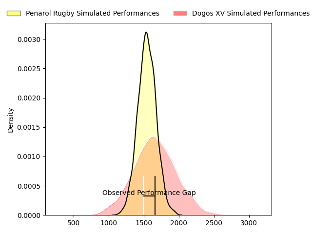
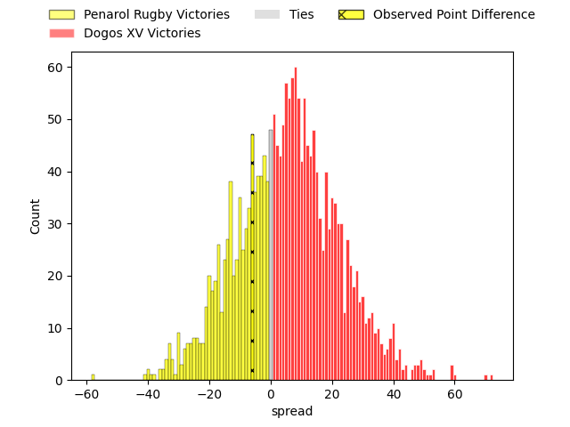
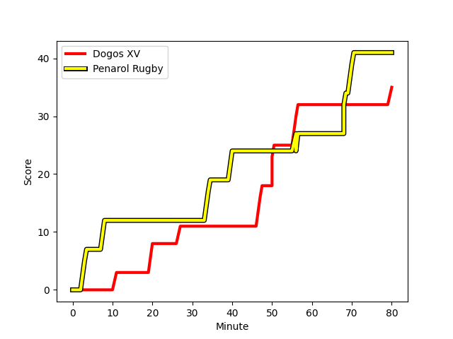
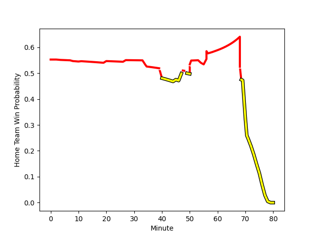

---  
layout: page  
title: Penarol Rugby at Dogos XV; 41-35  
date: 2023-03-04 22:00:00 18:00:00 -0500  
categories: match review  
---
# Penarol Rugby at Dogos XV; 41-35

# Club Level Predictions

The first set of predictions treats a club as the smallest object, as the club develops its members, organizes a gameplan, and deploys its players as needed for each match. This club model has a prediction of 0.659, which translates to predicting Dogos XV to win by 6.2.

Each club has a rating and a rating deviation (simiar to a Glicko system), and expected performances can be generated. This allows for simulated matches and spreads like the ones below.
## Projected Performances

## Projected Spreads

## Projected Results

# Player Level Predictions

Treating teams instead as an entity made up of the currently active players, I have ratings for each player in an altogether different system. These can be combined to form team ratings once teamsheets are announced, weighting starters a bit higher than the reserves. After the match is played, players can be weighted by their minutes on the field, allowing for an accurate measure of the team's composition. With these compiled team ratings, we can make predictions, measure inaccuracy, and update the individual player ratings.
## Prediction with Player Minutes: Dogos XV by 13.1

Dogos XV by 9.1 on a neutral field
## Scores over Time

## Win Probability over Time

There were 14 large changes in win probability in this match
## Prediction without Player Minutes: Dogos XV by 15.2

Dogos XV by 11.2 on a neutral pitch

|   Away Minutes | Away Player                                                                                     |   Away elo |   Away Percentile |   Number |   Home Percentile |   Home elo | Home Player                                                                      |   Home Minutes |
|---------------:|:------------------------------------------------------------------------------------------------|-----------:|------------------:|---------:|------------------:|-----------:|:---------------------------------------------------------------------------------|---------------:|
|             54 | [Edgardo Matias Benitez Santin](..//playerfiles//EdgardoMatiasBenitezSantin_cleaned.md)         |      97.26 |                63 |        1 |               nan |      95.81 | [Mateo Nunez Miserez](..//playerfiles//MateoNunezMiserez_cleaned.md)             |             40 |
|             54 | [Edgardo Matias Benitez Santin](..//playerfiles//EdgardoMatiasBenitezSantin_cleaned.md)         |      97.26 |                58 |        1 |               nan |      95.81 | [Mateo Nunez Miserez](..//playerfiles//MateoNunezMiserez_cleaned.md)             |             40 |
|             80 | [Guillermo Pujadas Leon](..//playerfiles//GuillermoPujadasLeon_cleaned.md)                      |      76.88 |                19 |        2 |               nan |      98.02 | [Roman Pretz](..//playerfiles//RomanPretz_cleaned.md)                            |             79 |
|             80 | [Guillermo Pujadas Leon](..//playerfiles//GuillermoPujadasLeon_cleaned.md)                      |      76.88 |                 8 |        2 |               nan |      98.02 | [Roman Pretz](..//playerfiles//RomanPretz_cleaned.md)                            |             79 |
|             54 | [Ignacio Alfredo Peculo Rodriguez](..//playerfiles//IgnacioAlfredoPeculoRodriguez_cleaned.md)   |      77.53 |                 8 |        3 |               nan |      97.23 | [Ramiro Valdes Iribarren](..//playerfiles//RamiroValdesIribarren_cleaned.md)     |             40 |
|             54 | [Ignacio Alfredo Peculo Rodriguez](..//playerfiles//IgnacioAlfredoPeculoRodriguez_cleaned.md)   |      77.53 |                25 |        3 |               nan |      97.23 | [Ramiro Valdes Iribarren](..//playerfiles//RamiroValdesIribarren_cleaned.md)     |             40 |
|             49 | [Ignacio Dotti](..//playerfiles//IgnacioDotti_cleaned.md)                                       |      78.18 |                21 |        4 |                 5 |      68.72 | [Gregorio Hernandez](..//playerfiles//GregorioHernandez_cleaned.md)              |             75 |
|             49 | [Ignacio Dotti](..//playerfiles//IgnacioDotti_cleaned.md)                                       |      78.18 |                12 |        4 |                 5 |      68.72 | [Gregorio Hernandez](..//playerfiles//GregorioHernandez_cleaned.md)              |             75 |
|             79 | [Felipe Aliaga](..//playerfiles//FelipeAliaga_cleaned.md)                                       |      93.67 |                52 |        5 |                55 |      96.65 | [Franco Molina](..//playerfiles//FrancoMolina_cleaned.md)                        |             80 |
|             79 | [Felipe Aliaga](..//playerfiles//FelipeAliaga_cleaned.md)                                       |      93.67 |                46 |        5 |                55 |      96.65 | [Franco Molina](..//playerfiles//FrancoMolina_cleaned.md)                        |             80 |
|             80 | [Manuel Ardao](..//playerfiles//ManuelArdao_cleaned.md)                                         |      84.65 |                19 |        6 |                11 |      80.24 | [Aitor Bildosola](..//playerfiles//AitorBildosola_cleaned.md)                    |             40 |
|             55 | [Lucas Bianchi](..//playerfiles//LucasBianchi_cleaned.md)                                       |      84.65 |                19 |        7 |                50 |      94.65 | [Efrain Elias](..//playerfiles//EfrainElias_cleaned.md)                          |             80 |
|             80 | [Manuel Diana](..//playerfiles//ManuelDiana_cleaned.md)                                         |      84.65 |                20 |        8 |                12 |      79.94 | [Ignacio Jose Gandini](..//playerfiles//IgnacioJoseGandini_cleaned.md)           |             80 |
|             59 | [Santiago Álvarez Viera Da Cunha](..//playerfiles//SantiagoÁlvarezVieraDaCunha_cleaned.md)      |      94.47 |                55 |        9 |               nan |      94.82 | [Agustin Moyano](..//playerfiles//AgustinMoyano_cleaned.md)                      |             70 |
|             59 | [Santiago Álvarez Viera Da Cunha](..//playerfiles//SantiagoÁlvarezVieraDaCunha_cleaned.md)      |      94.47 |                50 |        9 |               nan |      94.82 | [Agustin Moyano](..//playerfiles//AgustinMoyano_cleaned.md)                      |             70 |
|             80 | [Felipe Etcheverry](..//playerfiles//FelipeEtcheverry_cleaned.md)                               |      84.65 |                20 |       10 |                68 |     101.6  | [Julian Ignacio Hernandez](..//playerfiles//JulianIgnacioHernandez_cleaned.md)   |             80 |
|             80 | [Juan Manuel Alonso](..//playerfiles//JuanManuelAlonso_cleaned.md)                              |      84.65 |                20 |       11 |                85 |     109.78 | [Ernesto Giudice](..//playerfiles//ErnestoGiudice_cleaned.md)                    |             54 |
|             55 | [Guillermo Storace](..//playerfiles//GuillermoStorace_cleaned.md)                               |      94.74 |               nan |       12 |                27 |      87.27 | [Leonardo Gea Salim](..//playerfiles//LeonardoGeaSalim_cleaned.md)               |             80 |
|             80 | [Tomas Inciarte Rachetti](..//playerfiles//TomasInciarteRachetti_cleaned.md)                    |      74.55 |                 8 |       13 |                86 |     109.75 | [Faustino Sánchez Valarolo](..//playerfiles//FaustinoSánchezValarolo_cleaned.md) |             80 |
|             80 | [Tomas Inciarte Rachetti](..//playerfiles//TomasInciarteRachetti_cleaned.md)                    |      74.55 |                21 |       13 |                86 |     109.75 | [Faustino Sánchez Valarolo](..//playerfiles//FaustinoSánchezValarolo_cleaned.md) |             80 |
|             80 | [Alfonso Silva](..//playerfiles//AlfonsoSilva_cleaned.md)                                       |      77.14 |                11 |       14 |                10 |      76.61 | [Valentin Soler](..//playerfiles//ValentinSoler_cleaned.md)                      |             45 |
|             80 | [Alfonso Silva](..//playerfiles//AlfonsoSilva_cleaned.md)                                       |      77.14 |                26 |       14 |                10 |      76.61 | [Valentin Soler](..//playerfiles//ValentinSoler_cleaned.md)                      |             45 |
|             80 | [Rodrigo Silva](..//playerfiles//RodrigoSilva_cleaned.md)                                       |      84.65 |                25 |       15 |                55 |      96.65 | [Mateo Soler](..//playerfiles//MateoSoler_cleaned.md)                            |             80 |
|             31 | [Eric Dosantos](..//playerfiles//EricDosantos_cleaned.md)                                       |      95    |               nan |       16 |                10 |      78.36 | [Boris Wenger](..//playerfiles//BorisWenger_cleaned.md)                          |             40 |
|             26 | [Diego Arbelo](..//playerfiles//DiegoArbelo_cleaned.md)                                         |      91.77 |               nan |       17 |                 7 |      76.03 | [Octavio Filippa](..//playerfiles//OctavioFilippa_cleaned.md)                    |             40 |
|             26 | [Mateo Perillo](..//playerfiles//MateoPerillo_cleaned.md)                                       |      97.43 |                61 |       18 |                 8 |      87.13 | [Juan Bautista Mernes](..//playerfiles//JuanBautistaMernes_cleaned.md)           |             40 |
|             25 | [Juan Zuccarino](..//playerfiles//JuanZuccarino_cleaned.md)                                     |     109.78 |                86 |       19 |                12 |      78.43 | [Juan Cruz Strada](..//playerfiles//JuanCruzStrada_cleaned.md)                   |             10 |
|             25 | [Carlos Manuel Deus Lopes de Amorin](..//playerfiles//CarlosManuelDeusLopesdeAmorin_cleaned.md) |      83.83 |                21 |       20 |               nan |      98.58 | [Federico Albrisi](..//playerfiles//FedericoAlbrisi_cleaned.md)                  |              5 |
|             21 | [Juan Francisco Torres Burwood](..//playerfiles//JuanFranciscoTorresBurwood_cleaned.md)         |      93.84 |               nan |       21 |               nan |     100.26 | [Juan Baronio](..//playerfiles//JuanBaronio_cleaned.md)                          |             35 |
|              1 | [Agustin Morales](..//playerfiles//AgustinMorales_cleaned.md)                                   |      94.35 |               nan |       22 |               nan |     101.01 | [Mariano García Ascárate](..//playerfiles//MarianoGarcíaAscárate_cleaned.md)     |             26 |
|            nan | nan                                                                                             |     nan    |               nan |       23 |                43 |      92.37 | [Tomas Bartolini](..//playerfiles//TomasBartolini_cleaned.md)                    |              1 |

