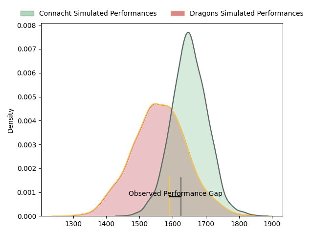
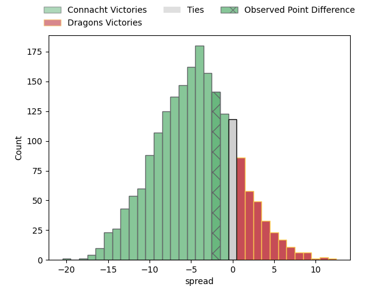
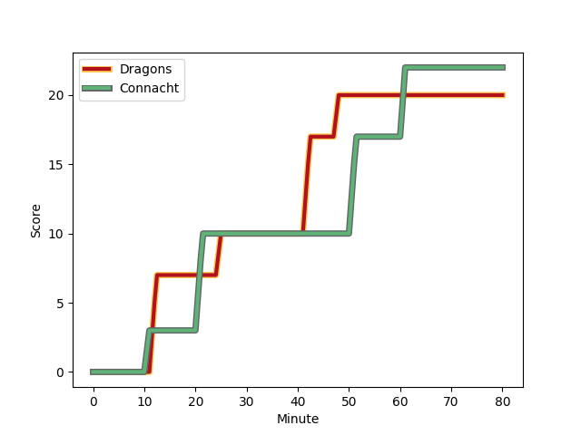
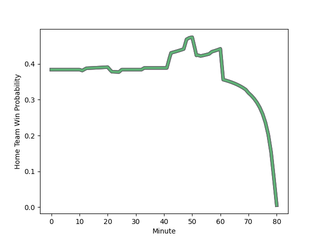

---  
layout: page  
title: Connacht at Dragons; 22-20  
date: 2023-03-04 20:35:00 18:00:00 -0500  
categories: match review  
---
# Connacht at Dragons; 22-20

# Club Level Predictions

The first set of predictions treats a club as the smallest object, as the club develops its members, organizes a gameplan, and deploys its players as needed for each match. This club model has a prediction of 0.371, which translates to predicting Connacht to win by 4.6.

Each club has a rating and a rating deviation (simiar to a Glicko system), and expected performances can be generated. This allows for simulated matches and spreads like the ones below.
## Projected Performances

## Projected Spreads

## Projected Results

# Player Level Predictions

Treating teams instead as an entity made up of the currently active players, I have ratings for each player in an altogether different system. These can be combined to form team ratings once teamsheets are announced, weighting starters a bit higher than the reserves. After the match is played, players can be weighted by their minutes on the field, allowing for an accurate measure of the team's composition. With these compiled team ratings, we can make predictions, measure inaccuracy, and update the individual player ratings.
## Prediction with Player Minutes: Connacht by 19.1

Connacht by 23.1 on a neutral field
## Scores over Time

## Win Probability over Time

There were 8 large changes in win probability in this match
## Prediction without Player Minutes: Connacht by 18.4

Connacht by 22.4 on a neutral pitch

|   Away Minutes | Away Player                                                             |   Away elo |   Away Percentile |   Number |   Home Percentile |   Home elo | Home Player                                                       |   Home Minutes |
|---------------:|:------------------------------------------------------------------------|-----------:|------------------:|---------:|------------------:|-----------:|:------------------------------------------------------------------|---------------:|
|             57 | [Dennis Buckley](..//playerfiles//DennisBuckley_cleaned.md)             |      96.52 |                56 |        1 |                31 |      89.91 | [Rhodri Jones](..//playerfiles//RhodriJones_cleaned.md)           |             70 |
|             57 | [Dylan Tierney-Martin](..//playerfiles//DylanTierney-Martin_cleaned.md) |     106.06 |                82 |        2 |                31 |      89.48 | [Bradley Roberts](..//playerfiles//BradleyRoberts_cleaned.md)     |             51 |
|             33 | [Jack Aungier](..//playerfiles//JackAungier_cleaned.md)                 |     107.82 |                86 |        3 |               nan |      92.63 | [Leon Brown](..//playerfiles//LeonBrown_cleaned.md)               |             53 |
|             57 | [Joshua Daniel Murphy](..//playerfiles//JoshuaDanielMurphy_cleaned.md)  |     107.19 |                79 |        4 |                14 |      79.46 | [Matthew Screech](..//playerfiles//MatthewScreech_cleaned.md)     |             80 |
|             80 | [Niall Murray](..//playerfiles//NiallMurray_cleaned.md)                 |     110.7  |                84 |        5 |                22 |      85.25 | [Ben Carter](..//playerfiles//BenCarter_cleaned.md)               |             80 |
|             80 | [Cian Prendergast](..//playerfiles//CianPrendergast_cleaned.md)         |     107.34 |                79 |        6 |                59 |      97.14 | [Aaron Wainwright](..//playerfiles//AaronWainwright_cleaned.md)   |             57 |
|             80 | [Conor Oliver](..//playerfiles//ConorOliver_cleaned.md)                 |     107.98 |                81 |        7 |                14 |      82.56 | [Taine Basham](..//playerfiles//TaineBasham_cleaned.md)           |             51 |
|             50 | [Paul Boyle](..//playerfiles//PaulBoyle_cleaned.md)                     |      99.33 |                61 |        8 |                23 |      86.7  | [Ross Moriarty](..//playerfiles//RossMoriarty_cleaned.md)         |             80 |
|             80 | [Caolin Blade](..//playerfiles//CaolinBlade_cleaned.md)                 |     103.15 |                73 |        9 |                27 |      87.68 | [Rhodri Williams](..//playerfiles//RhodriWilliams_cleaned.md)     |             80 |
|             80 | [David Hawkshaw](..//playerfiles//DavidHawkshaw_cleaned.md)             |     102.41 |                71 |       10 |                47 |      94.13 | [Will Reed](..//playerfiles//WillReed_cleaned.md)                 |             61 |
|             80 | [John Porch](..//playerfiles//JohnPorch_cleaned.md)                     |     113.73 |                89 |       11 |                22 |      86.26 | [Ashton Hewitt](..//playerfiles//AshtonHewitt_cleaned.md)         |             80 |
|             80 | [Cathal Forde](..//playerfiles//CathalForde_cleaned.md)                 |     111.04 |                87 |       12 |                32 |      89.33 | [Max Clark](..//playerfiles//MaxClark_cleaned.md)                 |             80 |
|             80 | [Thomas Farrell](..//playerfiles//ThomasFarrell_cleaned.md)             |     104.13 |                75 |       13 |                39 |      91.54 | [Steffan Hughes](..//playerfiles//SteffanHughes_cleaned.md)       |             80 |
|             75 | [Shayne Bolton](..//playerfiles//ShayneBolton_cleaned.md)               |      95    |               nan |       14 |                35 |      90.24 | [Jared Lee Rosser](..//playerfiles//JaredLeeRosser_cleaned.md)    |             80 |
|             80 | [Tiernan O'Halloran](..//playerfiles//TiernanO'Halloran_cleaned.md)     |     112.37 |                85 |       15 |                62 |      99.55 | [Angus O'Brien](..//playerfiles//AngusO'Brien_cleaned.md)         |             80 |
|             47 | [Sam Illo](..//playerfiles//SamIllo_cleaned.md)                         |      91.94 |                30 |       16 |                50 |      94.92 | [Harri Keddie](..//playerfiles//HarriKeddie_cleaned.md)           |             29 |
|             30 | [Jarrad Butler](..//playerfiles//JarradButler_cleaned.md)               |     109.34 |                83 |       17 |               nan |      95    | [Elliott Dee](..//playerfiles//ElliottDee_cleaned.md)             |             29 |
|             23 | [Oisin Dowling](..//playerfiles//OisinDowling_cleaned.md)               |      86.08 |                24 |       18 |                21 |      86.61 | [Lloyd Fairbrother](..//playerfiles//LloydFairbrother_cleaned.md) |             27 |
|             23 | [David Heffernan](..//playerfiles//DavidHeffernan_cleaned.md)           |     100.1  |                68 |       19 |                54 |      96.64 | [George Nott](..//playerfiles//GeorgeNott_cleaned.md)             |             23 |
|             23 | [Peter Dooley](..//playerfiles//PeterDooley_cleaned.md)                 |     104.04 |                79 |       20 |                13 |      79.05 | [Sam Davies](..//playerfiles//SamDavies_cleaned.md)               |             19 |
|              5 | [Shane Jennings](..//playerfiles//ShaneJennings_cleaned.md)             |      95    |               nan |       21 |                34 |      85.79 | [Aki Seiuli](..//playerfiles//AkiSeiuli_cleaned.md)               |             10 |

