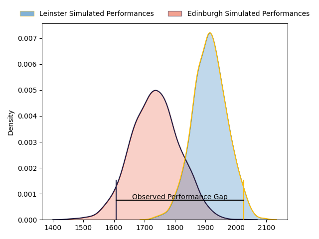
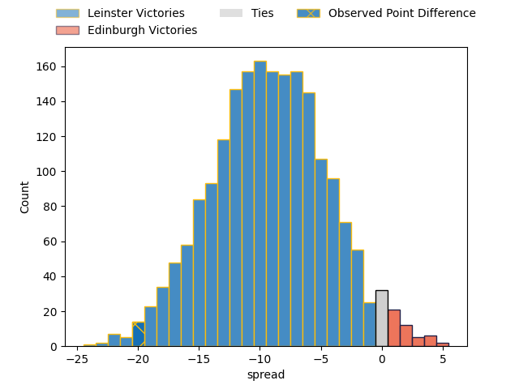
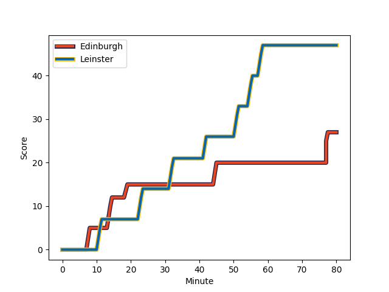
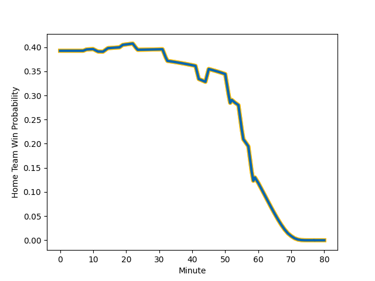

---  
layout: page  
title: Leinster at Edinburgh; 47-27  
date: 2023-03-04 18:00:00 18:00:00 -0500  
categories: match review  
---
# Leinster at Edinburgh; 47-27

# Club Level Predictions

The first set of predictions treats a club as the smallest object, as the club develops its members, organizes a gameplan, and deploys its players as needed for each match. This club model has a prediction of 0.264, which translates to predicting Leinster to win by 9.0.

Each club has a rating and a rating deviation (simiar to a Glicko system), and expected performances can be generated. This allows for simulated matches and spreads like the ones below.
## Projected Performances

## Projected Spreads

## Projected Results

# Player Level Predictions

Treating teams instead as an entity made up of the currently active players, I have ratings for each player in an altogether different system. These can be combined to form team ratings once teamsheets are announced, weighting starters a bit higher than the reserves. After the match is played, players can be weighted by their minutes on the field, allowing for an accurate measure of the team's composition. With these compiled team ratings, we can make predictions, measure inaccuracy, and update the individual player ratings.
## Prediction with Player Minutes: Leinster by 15.0

Leinster by 19.0 on a neutral field
## Scores over Time

## Win Probability over Time

There were 5 large changes in win probability in this match
## Prediction without Player Minutes: Leinster by 15.5

Leinster by 19.5 on a neutral pitch

|   Away Minutes | Away Player                                                            |   Away elo |   Away Percentile |   Number |   Home Percentile |   Home elo | Home Player                                                                   |   Home Minutes |
|---------------:|:-----------------------------------------------------------------------|-----------:|------------------:|---------:|------------------:|-----------:|:------------------------------------------------------------------------------|---------------:|
|             59 | [Michael Milne](..//playerfiles//MichaelMilne_cleaned.md)              |     101.66 |                74 |        1 |                13 |      81.96 | [Abram Adrian Boan Venter](..//playerfiles//AbramAdrianBoanVenter_cleaned.md) |             70 |
|             54 | [John McKee](..//playerfiles//JohnMcKee_cleaned.md)                    |      99.83 |                68 |        2 |                52 |      94.72 | [Stuart McInally](..//playerfiles//StuartMcInally_cleaned.md)                 |             52 |
|             59 | [Michael Ala'alatoa](..//playerfiles//MichaelAla'alatoa_cleaned.md)    |     113.09 |                90 |        3 |               nan |      94.74 | [Lee-Roy Atalifo](..//playerfiles//Lee-RoyAtalifo_cleaned.md)                 |             52 |
|             80 | [Ross Molony](..//playerfiles//RossMolony_cleaned.md)                  |     127.69 |                97 |        4 |                50 |      93.14 | [Marshall Sykes](..//playerfiles//MarshallSykes_cleaned.md)                   |             58 |
|             54 | [Jason Howell Jenkins](..//playerfiles//JasonHowellJenkins_cleaned.md) |      95.7  |               nan |        5 |                59 |      97.89 | [Sam Skinner](..//playerfiles//SamSkinner_cleaned.md)                         |             80 |
|             54 | [Rhys Ruddock](..//playerfiles//RhysRuddock_cleaned.md)                |     106.41 |                78 |        6 |                97 |     132.15 | [Luke Crosbie](..//playerfiles//LukeCrosbie_cleaned.md)                       |             80 |
|             80 | [Scott Penny](..//playerfiles//ScottPenny_cleaned.md)                  |     104.31 |                75 |        7 |                46 |      93.19 | [Hamish Watson](..//playerfiles//HamishWatson_cleaned.md)                     |             80 |
|             80 | [Max Deegan](..//playerfiles//MaxDeegan_cleaned.md)                    |     109.72 |                84 |        8 |                22 |      85.78 | [Viliame Mata](..//playerfiles//ViliameMata_cleaned.md)                       |             70 |
|             59 | [Luke McGrath](..//playerfiles//LukeMcGrath_cleaned.md)                |     113.91 |                92 |        9 |                37 |      88.45 | [Ben Vellacott](..//playerfiles//BenVellacott_cleaned.md)                     |             60 |
|             80 | [Harry Byrne](..//playerfiles//HarryByrne_cleaned.md)                  |     105.02 |                76 |       10 |                27 |      88.13 | [Charlie Savala](..//playerfiles//CharlieSavala_cleaned.md)                   |             80 |
|             80 | [Dave Kearney](..//playerfiles//DaveKearney_cleaned.md)                |     101.5  |                69 |       11 |                40 |      90.84 | [Wes Goosen](..//playerfiles//WesGoosen_cleaned.md)                           |             32 |
|             80 | [Jamie Osborne](..//playerfiles//JamieOsborne_cleaned.md)              |     104.11 |                75 |       12 |                12 |      78.78 | [James Lang](..//playerfiles//JamesLang_cleaned.md)                           |             80 |
|             80 | [Liam Turner](..//playerfiles//LiamTurner_cleaned.md)                  |     103.29 |                73 |       13 |                50 |      94.94 | [Mark Bennett](..//playerfiles//MarkBennett_cleaned.md)                       |             80 |
|             59 | [Jordan Larmour](..//playerfiles//JordanLarmour_cleaned.md)            |     110.37 |                86 |       14 |                35 |      90.36 | [Damien Hoyland](..//playerfiles//DamienHoyland_cleaned.md)                   |             80 |
|             68 | [Ciaran Frawley](..//playerfiles//CiaranFrawley_cleaned.md)            |      95    |               nan |       15 |                 9 |      75.68 | [Emiliano Boffelli](..//playerfiles//EmilianoBoffelli_cleaned.md)             |             70 |
|             26 | [Will Connors](..//playerfiles//WillConnors_cleaned.md)                |      96.81 |               nan |       16 |                32 |      88.51 | [Chris Dean](..//playerfiles//ChrisDean_cleaned.md)                           |             48 |
|             26 | [Brian Deeny](..//playerfiles//BrianDeeny_cleaned.md)                  |     106.46 |                79 |       17 |                75 |     103.44 | [David Cherry](..//playerfiles//DavidCherry_cleaned.md)                       |             28 |
|             26 | [Lee Barron](..//playerfiles//LeeBarron_cleaned.md)                    |      95.73 |               nan |       18 |                31 |      89.82 | [Jamie Hodgson](..//playerfiles//JamieHodgson_cleaned.md)                     |             22 |
|             21 | [Jack Boyle](..//playerfiles//JackBoyle_cleaned.md)                    |      95.73 |               nan |       19 |               nan |     105.52 | [Elliot Millar-Mills](..//playerfiles//ElliotMillar-Mills_cleaned.md)         |             28 |
|             21 | [Nick McCarthy](..//playerfiles//NickMcCarthy_cleaned.md)              |     100.22 |                55 |       20 |                46 |      93.6  | [Charlie Shiel](..//playerfiles//CharlieShiel_cleaned.md)                     |             20 |
|             21 | [Tom Clarkson](..//playerfiles//TomClarkson_cleaned.md)                |      97    |               nan |       21 |                45 |      92.95 | [Nick Haining](..//playerfiles//NickHaining_cleaned.md)                       |             10 |
|             21 | [Rob Russell](..//playerfiles//RobRussell_cleaned.md)                  |      98.91 |                54 |       22 |               nan |      91.21 | [Jaco van der Walt](..//playerfiles//JacovanderWalt_cleaned.md)               |             10 |
|             12 | [Charlie Tector](..//playerfiles//CharlieTector_cleaned.md)            |      95.83 |               nan |       23 |                 9 |      77.23 | [Jamie Jack](..//playerfiles//JamieJack_cleaned.md)                           |             10 |

