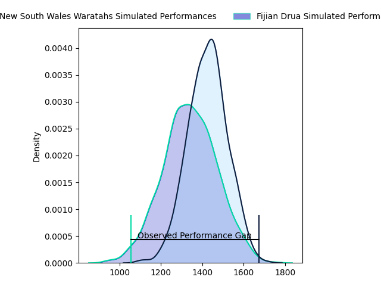
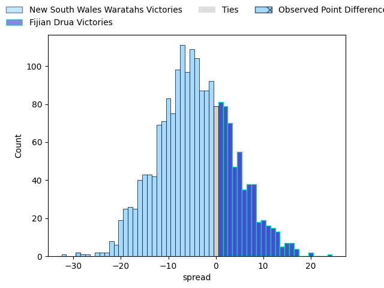
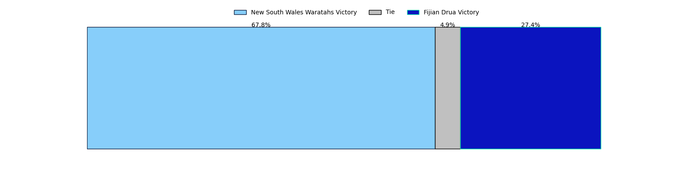
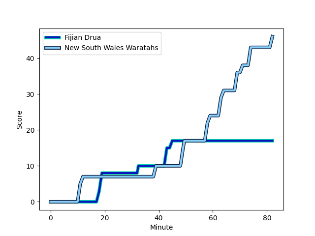
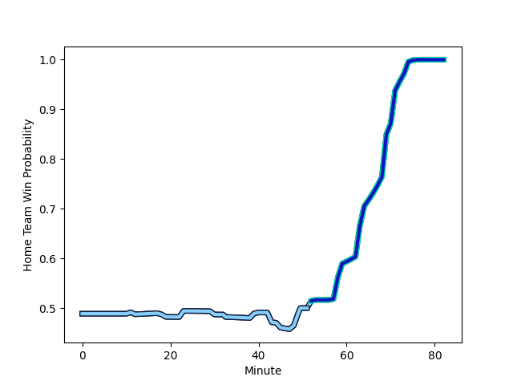

---  
layout: page  
title: New South Wales Waratahs at Fijian Drua; 46.0-17.0  
date: 2023-03-04 03:35:00 18:00:00 -0500  
categories: match review  
---
# New South Wales Waratahs at Fijian Drua; 46.0-17.0

# Club Level Predictions

The first set of predictions treats a club as the smallest object, as the club develops its members, organizes a gameplan, and deploys its players as needed for each match. This club model has a prediction of 0.385, which translates to predicting New South Wales Waratahs to win by 4.2.

Each club has a rating and a rating deviation (simiar to a Glicko system), and expected performances can be generated. This allows for simulated matches and spreads like the ones below.
## Projected Performances

## Projected Spreads

## Projected Results

# Player Level Predictions

Treating teams instead as an entity made up of the currently active players, I have ratings for each player in an altogether different system. These can be combined to form team ratings once teamsheets are announced, weighting starters a bit higher than the reserves. After the match is played, players can be weighted by their minutes on the field, allowing for an accurate measure of the team's composition. With these compiled team ratings, we can make predictions, measure inaccuracy, and update the individual player ratings.
## Prediction with Player Minutes: Fijian Drua by 15.0

Fijian Drua by 11.0 on a neutral field
## Scores over Time

## Win Probability over Time

There were 9 large changes in win probability in this match
## Prediction without Player Minutes: Fijian Drua by 16.4

Fijian Drua by 12.4 on a neutral pitch

|   Away Minutes | Away Player                                                           |   Away elo |   Away Percentile |   Number |   Home Percentile |   Home elo | Home Player                                                                     |   Home Minutes |
|---------------:|:----------------------------------------------------------------------|-----------:|------------------:|---------:|------------------:|-----------:|:--------------------------------------------------------------------------------|---------------:|
|             71 | [Tom Lambert](..//playerfiles//TomLambert_cleaned.md)                 |      90.58 |               nan |        1 |               nan |      96.86 | [Jone Tiko](..//playerfiles//JoneTiko_cleaned.md)                               |             30 |
|             57 | [Dave Porecki](..//playerfiles//DavePorecki_cleaned.md)               |      90.73 |                37 |        2 |                65 |      99.23 | [Tevita Ikanivere](..//playerfiles//TevitaIkanivere_cleaned.md)                 |             48 |
|             41 | [Archer Holz](..//playerfiles//ArcherHolz_cleaned.md)                 |      91.98 |                39 |        3 |               nan |      96.56 | [Samuela Tawake](..//playerfiles//SamuelaTawake_cleaned.md)                     |             82 |
|             82 | [Jed Holloway](..//playerfiles//JedHolloway_cleaned.md)               |      88.96 |                29 |        4 |                62 |      99.23 | [Isoa Nasilasila](..//playerfiles//IsoaNasilasila_cleaned.md)                   |             82 |
|             57 | [Hugh Sinclair](..//playerfiles//HughSinclair_cleaned.md)             |      92.42 |               nan |        5 |                65 |     100.21 | [Ratu Rotuisolia](..//playerfiles//RatuRotuisolia_cleaned.md)                   |             53 |
|             57 | [Lachlan Swinton](..//playerfiles//LachlanSwinton_cleaned.md)         |      91.54 |                40 |        6 |                65 |     100.21 | [Joseva Tamani](..//playerfiles//JosevaTamani_cleaned.md)                       |             69 |
|             82 | [Michael Hooper](..//playerfiles//MichaelHooper_cleaned.md)           |      88.96 |                31 |        7 |                65 |     100.21 | [Kitione Salawa](..//playerfiles//KitioneSalawa_cleaned.md)                     |             82 |
|             66 | [Langi Gleeson](..//playerfiles//LangiGleeson_cleaned.md)             |      92.42 |               nan |        8 |                61 |      99.49 | [Te Ahiwaru Cirikidaveta](..//playerfiles//TeAhiwaruCirikidaveta_cleaned.md)    |             52 |
|             71 | [Jake Gordon](..//playerfiles//JakeGordon_cleaned.md)                 |      88.96 |                31 |        9 |                64 |      99.23 | [Frank Lomani](..//playerfiles//FrankLomani_cleaned.md)                         |             68 |
|             73 | [Tane Edmed](..//playerfiles//TaneEdmed_cleaned.md)                   |      88.96 |                28 |       10 |               nan |      96.76 | [Caleb Muntz](..//playerfiles//CalebMuntz_cleaned.md)                           |             82 |
|             82 | [Max Jorgensen](..//playerfiles//MaxJorgensen_cleaned.md)             |      88.96 |                31 |       11 |                65 |     100.21 | [Tuidraki Samusamuvodre](..//playerfiles//TuidrakiSamusamuvodre_cleaned.md)     |             64 |
|             82 | [Lalakai Foketi](..//playerfiles//LalakaiFoketi_cleaned.md)           |      88.96 |                30 |       12 |                65 |     100.21 | [Kalaveti Ravouvou](..//playerfiles//KalavetiRavouvou_cleaned.md)               |             52 |
|             82 | [Izaia Perese](..//playerfiles//IzaiaPerese_cleaned.md)               |      90.73 |                37 |       13 |                64 |      99.82 | [Iosefo Masi](..//playerfiles//IosefoMasi_cleaned.md)                           |             82 |
|             82 | [Mark Nawaqanitawase](..//playerfiles//MarkNawaqanitawase_cleaned.md) |      88.96 |                31 |       14 |                65 |     100.21 | [Selestino Ravutaumada](..//playerfiles//SelestinoRavutaumada_cleaned.md)       |             82 |
|             82 | [Ben Donaldson](..//playerfiles//BenDonaldson_cleaned.md)             |      88.96 |                35 |       15 |                64 |     100.21 | [Ilaisa Droasese](..//playerfiles//IlaisaDroasese_cleaned.md)                   |             82 |
|             25 | [Tolu Latu](..//playerfiles//ToluLatu_cleaned.md)                     |      95    |               nan |       16 |               nan |      95.98 | [Zuriel Togiatama](..//playerfiles//ZurielTogiatama_cleaned.md)                 |             34 |
|             41 | [Tetera Faulkner](..//playerfiles//TeteraFaulkner_cleaned.md)         |      91.98 |               nan |       17 |               nan |      95    | [Livai Natave](..//playerfiles//LivaiNatave_cleaned.md)                         |             38 |
|             11 | [Daniel Botha](..//playerfiles//DanielBotha_cleaned.md)               |      95    |               nan |       18 |               nan |      95    | [Kaliopasi Uluilakepa](..//playerfiles//KaliopasiUluilakepa_cleaned.md)         |             21 |
|             25 | [Taleni Seu](..//playerfiles//TaleniSeu_cleaned.md)                   |      91.54 |                38 |       19 |               nan |      95.98 | [Sorovakatini Tuifagalele](..//playerfiles//SorovakatiniTuifagalele_cleaned.md) |             29 |
|             16 | [Will Harris](..//playerfiles//WillHarris_cleaned.md)                 |      93.23 |               nan |       20 |               nan |      95.72 | [Elia Canakaivata](..//playerfiles//EliaCanakaivata_cleaned.md)                 |             23 |
|             25 | [Charlie Gamble](..//playerfiles//CharlieGamble_cleaned.md)           |      90.73 |                35 |       21 |               nan |      95.98 | [Peni Matawalu](..//playerfiles//PeniMatawalu_cleaned.md)                       |             14 |
|             11 | [Harrison Goddard](..//playerfiles//HarrisonGoddard_cleaned.md)       |      95    |               nan |       22 |                58 |      98.45 | [Teti Tela](..//playerfiles//TetiTela_cleaned.md)                               |             30 |
|              9 | [Ben Dowling](..//playerfiles//BenDowling_cleaned.md)                 |      95    |               nan |       23 |               nan |      95.39 | [Taniela Rakuro](..//playerfiles//TanielaRakuro_cleaned.md)                     |             18 |

