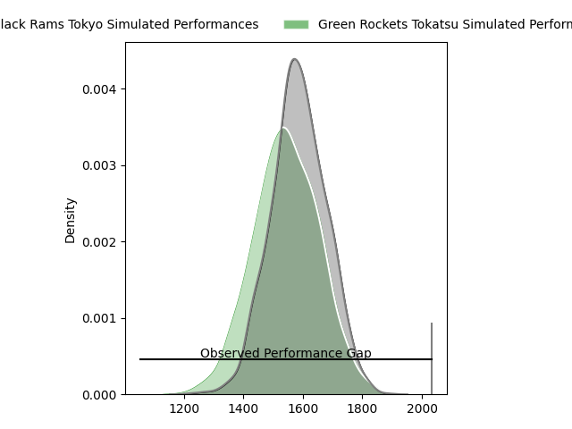
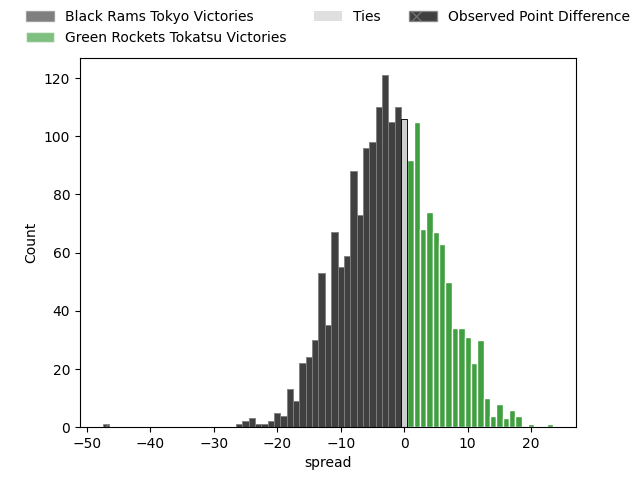
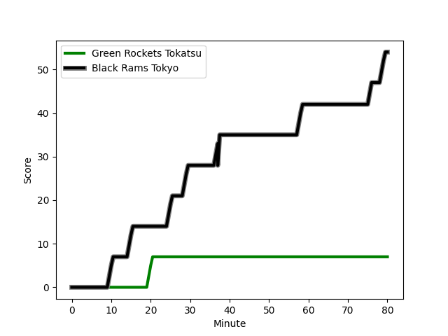
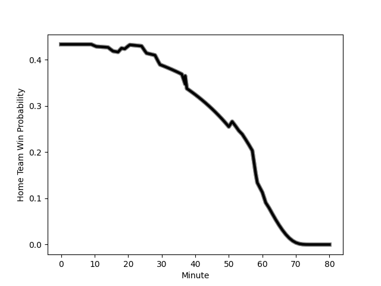

---  
layout: page  
title: Black Rams Tokyo at Green Rockets Tokatsu; 54-7  
date: 2023-03-04 04:00:00 18:00:00 -0500  
categories: match review  
---
# Black Rams Tokyo at Green Rockets Tokatsu; 54-7

# Club Level Predictions

The first set of predictions treats a club as the smallest object, as the club develops its members, organizes a gameplan, and deploys its players as needed for each match. This club model has a prediction of 0.513, which translates to predicting Green Rockets Tokatsu to win by 0.5.

Each club has a rating and a rating deviation (simiar to a Glicko system), and expected performances can be generated. This allows for simulated matches and spreads like the ones below.
## Projected Performances

## Projected Spreads

## Projected Results

# Player Level Predictions

Treating teams instead as an entity made up of the currently active players, I have ratings for each player in an altogether different system. These can be combined to form team ratings once teamsheets are announced, weighting starters a bit higher than the reserves. After the match is played, players can be weighted by their minutes on the field, allowing for an accurate measure of the team's composition. With these compiled team ratings, we can make predictions, measure inaccuracy, and update the individual player ratings.
## Prediction with Player Minutes: Black Rams Tokyo by 7.7

Black Rams Tokyo by 11.7 on a neutral field
## Scores over Time

## Win Probability over Time

There were 2 large changes in win probability in this match
## Prediction without Player Minutes: Black Rams Tokyo by 9.9

Black Rams Tokyo by 13.9 on a neutral pitch

|   Away Minutes | Away Player                                                         |   Away elo |   Away Percentile |   Number |   Home Percentile |   Home elo | Home Player                                                   |   Home Minutes |
|---------------:|:--------------------------------------------------------------------|-----------:|------------------:|---------:|------------------:|-----------:|:--------------------------------------------------------------|---------------:|
|             66 | [Yuichiro Taniguchi](..//playerfiles//YuichiroTaniguchi_cleaned.md) |     107.12 |                76 |        1 |                57 |      97.13 | [Suguru Kubo](..//playerfiles//SuguruKubo_cleaned.md)         |             54 |
|             54 | [Ko Sato](..//playerfiles//KoSato_cleaned.md)                       |     100.72 |                69 |        2 |                 7 |      76    | [Yo Sato](..//playerfiles//YoSato_cleaned.md)                 |             51 |
|             61 | [Paddy Ryan](..//playerfiles//PaddyRyan_cleaned.md)                 |      99.99 |                67 |        3 |                97 |     124.6  | [Satoshi Ueda](..//playerfiles//SatoshiUeda_cleaned.md)       |             61 |
|             80 | [Daiki Yanagawa](..//playerfiles//DaikiYanagawa_cleaned.md)         |      67.15 |                 4 |        4 |                13 |      79.31 | [Daiki Yamagiwa](..//playerfiles//DaikiYamagiwa_cleaned.md)   |             80 |
|             61 | [Talau Fakatava](..//playerfiles//TalauFakatava_cleaned.md)         |     106.61 |                78 |        5 |                24 |      86.71 | [Luke Porter](..//playerfiles//LukePorter_cleaned.md)         |             80 |
|             80 | [Amato Fakatava](..//playerfiles//AmatoFakatava_cleaned.md)         |      75.31 |                 7 |        6 |                27 |      87.98 | [Wheetu Douglas](..//playerfiles//WheetuDouglas_cleaned.md)   |             51 |
|             80 | [Brodi McCurran](..//playerfiles//BrodiMcCurran_cleaned.md)         |     122.43 |                94 |        7 |                 2 |      59.76 | [Ryoi Kamei](..//playerfiles//RyoiKamei_cleaned.md)           |             51 |
|             54 | [Nathan Hughes](..//playerfiles//NathanHughes_cleaned.md)           |     105.36 |                78 |        8 |                87 |     113.1  | [Aseri Masivou](..//playerfiles//AseriMasivou_cleaned.md)     |             80 |
|             18 | [Syota Yamamoto](..//playerfiles//SyotaYamamoto_cleaned.md)         |     113.27 |                91 |        9 |                51 |      94.72 | [Nicholas Phipps](..//playerfiles//NicholasPhipps_cleaned.md) |             64 |
|             54 | [Kohei Horigome](..//playerfiles//KoheiHorigome_cleaned.md)         |     100.49 |                63 |       10 |                66 |     100.93 | [Taisetsu Kanai](..//playerfiles//TaisetsuKanai_cleaned.md)   |             54 |
|             80 | [Netani Vakayalia](..//playerfiles//NetaniVakayalia_cleaned.md)     |     113.02 |                88 |       11 |                84 |     109.4  | [Kenta Omata](..//playerfiles//KentaOmata_cleaned.md)         |             80 |
|             80 | [Hadleigh Parkes](..//playerfiles//HadleighParkes_cleaned.md)       |     116.17 |                91 |       12 |                52 |      96.2  | [Christian Laui](..//playerfiles//ChristianLaui_cleaned.md)   |             61 |
|             80 | [Yuki Ikeda](..//playerfiles//YukiIkeda_cleaned.md)                 |      97.96 |                59 |       13 |                29 |      89.19 | [Tim Bennetts](..//playerfiles//TimBennetts_cleaned.md)       |             80 |
|             62 | [Main Taira](..//playerfiles//MainTaira_cleaned.md)                 |      95.38 |                51 |       14 |                42 |      91.65 | [Lomano Lemeki](..//playerfiles//LomanoLemeki_cleaned.md)     |             80 |
|             80 | [Matt McGahan](..//playerfiles//MattMcGahan_cleaned.md)             |     123.11 |                95 |       15 |                34 |      89.3  | [Tom Marshall](..//playerfiles//TomMarshall_cleaned.md)       |             80 |
|             26 | [Junpei Yukawa](..//playerfiles//JunpeiYukawa_cleaned.md)           |     101.27 |                60 |       16 |                33 |      89.57 | [Ash Dixon](..//playerfiles//AshDixon_cleaned.md)             |             29 |
|             26 | [Masaaki Onishi](..//playerfiles//MasaakiOnishi_cleaned.md)         |      86.22 |                15 |       17 |                50 |      94.86 | [Yoshida Hosoda](..//playerfiles//YoshidaHosoda_cleaned.md)   |             29 |
|             26 | [Isaac Lucas](..//playerfiles//IsaacLucas_cleaned.md)               |     106.55 |                65 |       18 |               nan |      93.6  | [Ren Osawa](..//playerfiles//RenOsawa_cleaned.md)             |             29 |
|             19 | [Michael Stolberg](..//playerfiles//MichaelStolberg_cleaned.md)     |     105.92 |                75 |       19 |                20 |      88.56 | [Sunao Takizawa](..//playerfiles//SunaoTakizawa_cleaned.md)   |             26 |
|             14 | [Taichi Chiba](..//playerfiles//TaichiChiba_cleaned.md)             |     106.57 |                84 |       20 |                78 |     105.83 | [Yuma Sugimoto](..//playerfiles//YumaSugimoto_cleaned.md)     |             26 |
|             18 | [Siope Lolo Tavo](..//playerfiles//SiopeLoloTavo_cleaned.md)        |      85.45 |                19 |       21 |                12 |      79.2  | [Koichi Matsura](..//playerfiles//KoichiMatsura_cleaned.md)   |             19 |
|             19 | [Daigo Sasagawa](..//playerfiles//DaigoSasagawa_cleaned.md)         |      96.21 |                49 |       22 |                22 |      94.58 | [Taku Toma](..//playerfiles//TakuToma_cleaned.md)             |             19 |
|             62 | [Toshiya Takahashi](..//playerfiles//ToshiyaTakahashi_cleaned.md)   |      92.14 |                34 |       23 |               nan |      93.91 | [Fumiaki Tanaka](..//playerfiles//FumiakiTanaka_cleaned.md)   |             16 |

