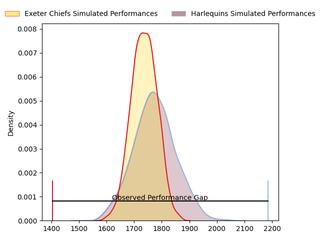
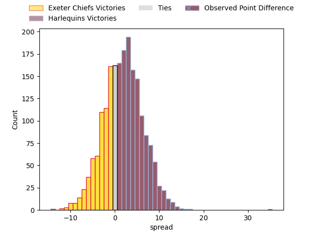
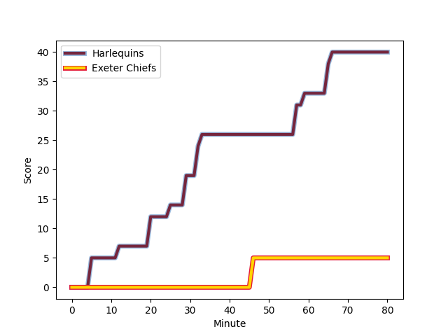
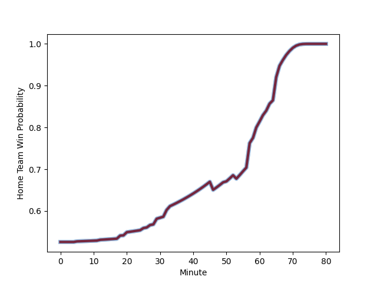

---  
layout: page  
title: Exeter Chiefs at Harlequins; 5.0-40.0  
date: 2023-03-04 12:15:00 18:00:00 -0500  
categories: match review  
---
# Exeter Chiefs at Harlequins; 5.0-40.0

# Club Level Predictions

The first set of predictions treats a club as the smallest object, as the club develops its members, organizes a gameplan, and deploys its players as needed for each match. This club model has a prediction of 0.554, which translates to predicting Harlequins to win by 1.9.

Each club has a rating and a rating deviation (simiar to a Glicko system), and expected performances can be generated. This allows for simulated matches and spreads like the ones below.
## Projected Performances

## Projected Spreads

## Projected Results

# Player Level Predictions

Treating teams instead as an entity made up of the currently active players, I have ratings for each player in an altogether different system. These can be combined to form team ratings once teamsheets are announced, weighting starters a bit higher than the reserves. After the match is played, players can be weighted by their minutes on the field, allowing for an accurate measure of the team's composition. With these compiled team ratings, we can make predictions, measure inaccuracy, and update the individual player ratings.
## Prediction with Player Minutes: Harlequins by 8.4

Harlequins by 4.4 on a neutral field
## Scores over Time

## Win Probability over Time

There were 4 large changes in win probability in this match
## Prediction without Player Minutes: Harlequins by 7.5

Harlequins by 3.5 on a neutral pitch

|   Away Minutes | Away Player                                                       |   Away elo |   Away Percentile |   Number |   Home Percentile |   Home elo | Home Player                                                       |   Home Minutes |
|---------------:|:------------------------------------------------------------------|-----------:|------------------:|---------:|------------------:|-----------:|:------------------------------------------------------------------|---------------:|
|             53 | [Scott Sio](..//playerfiles//ScottSio_cleaned.md)                 |      98.41 |                62 |        1 |                61 |      97.93 | [Joe Marler](..//playerfiles//JoeMarler_cleaned.md)               |             69 |
|             50 | [Jack Innard](..//playerfiles//JackInnard_cleaned.md)             |      94.47 |                52 |        2 |                23 |      86.42 | [George Head](..//playerfiles//GeorgeHead_cleaned.md)             |             27 |
|             18 | [Harry Williams](..//playerfiles//HarryWilliams_cleaned.md)       |     110.77 |                89 |        3 |                93 |     115.81 | [Wilco Louw](..//playerfiles//WilcoLouw_cleaned.md)               |             59 |
|             50 | [Jonny Gray](..//playerfiles//JonnyGray_cleaned.md)               |     102.71 |                79 |        4 |                92 |     117.98 | [Dino Lamb](..//playerfiles//DinoLamb_cleaned.md)                 |             64 |
|             80 | [Dafydd Jenkins](..//playerfiles//DafyddJenkins_cleaned.md)       |     110.93 |                86 |        5 |                54 |      96.64 | [Stephan Lewies](..//playerfiles//StephanLewies_cleaned.md)       |             80 |
|             80 | [Jacques Vermeulen](..//playerfiles//JacquesVermeulen_cleaned.md) |      87.44 |                26 |        6 |                10 |      79.05 | [Jack Kenningham](..//playerfiles//JackKenningham_cleaned.md)     |             56 |
|             53 | [Christ Tshiunza](..//playerfiles//ChristTshiunza_cleaned.md)     |      84.31 |                18 |        7 |                59 |      98.12 | [James Chisholm](..//playerfiles//JamesChisholm_cleaned.md)       |             64 |
|             80 | [Sam Simmonds](..//playerfiles//SamSimmonds_cleaned.md)           |     122.15 |                95 |        8 |                19 |      83.83 | [Tom Lawday](..//playerfiles//TomLawday_cleaned.md)               |             80 |
|             62 | [Sam Maunder](..//playerfiles//SamMaunder_cleaned.md)             |      63.11 |                 2 |        9 |                86 |     108.67 | [Danny Care](..//playerfiles//DannyCare_cleaned.md)               |             73 |
|             80 | [Harvey Skinner](..//playerfiles//HarveySkinner_cleaned.md)       |      94.92 |                49 |       10 |                98 |     133.04 | [Marcus Smith](..//playerfiles//MarcusSmith_cleaned.md)           |             80 |
|             80 | [Olly Woodburn](..//playerfiles//OllyWoodburn_cleaned.md)         |     125.16 |                96 |       11 |                62 |      99.41 | [Josh Bassett](..//playerfiles//JoshBassett_cleaned.md)           |             57 |
|             50 | [Solomone Kata](..//playerfiles//SolomoneKata_cleaned.md)         |     119.99 |                95 |       12 |                91 |     114.75 | [Andre Esterhuizen](..//playerfiles//AndreEsterhuizen_cleaned.md) |             80 |
|             50 | [Ian Whitten](..//playerfiles//IanWhitten_cleaned.md)             |      94.46 |                49 |       13 |                55 |      96.66 | [Joe Marchant](..//playerfiles//JoeMarchant_cleaned.md)           |             80 |
|             80 | [Jack Nowell](..//playerfiles//JackNowell_cleaned.md)             |      79.34 |                13 |       14 |                54 |      96.29 | [Cadan Murley](..//playerfiles//CadanMurley_cleaned.md)           |             80 |
|             80 | [Josh Hodge](..//playerfiles//JoshHodge_cleaned.md)               |      74.63 |                10 |       15 |                57 |      98    | [Nick David](..//playerfiles//NickDavid_cleaned.md)               |             80 |
|             30 | [Jack Yeandle](..//playerfiles//JackYeandle_cleaned.md)           |     115.81 |                93 |       16 |               nan |      97.08 | [Sam Riley](..//playerfiles//SamRiley_cleaned.md)                 |             53 |
|             27 | [Danny Southworth](..//playerfiles//DannySouthworth_cleaned.md)   |      93.11 |               nan |       17 |                21 |      88.83 | [Fin Baxter](..//playerfiles//FinBaxter_cleaned.md)               |             11 |
|             62 | [Marcus Street](..//playerfiles//MarcusStreet_cleaned.md)         |      95    |               nan |       18 |                66 |     101.38 | [Simon Kerrod](..//playerfiles//SimonKerrod_cleaned.md)           |             21 |
|             30 | [Jack Dunne](..//playerfiles//JackDunne_cleaned.md)               |     101.17 |                66 |       19 |                90 |     114.97 | [Irne Herbst](..//playerfiles//IrneHerbst_cleaned.md)             |             16 |
|             27 | [Dave Ewers](..//playerfiles//DaveEwers_cleaned.md)               |     133.56 |                98 |       20 |                 9 |      77.67 | [Will Evans](..//playerfiles//WillEvans_cleaned.md)               |             16 |
|             18 | [Jack Maunder](..//playerfiles//JackMaunder_cleaned.md)           |      81.99 |                16 |       21 |                 8 |      77.51 | [Luke Wallace](..//playerfiles//LukeWallace_cleaned.md)           |             24 |
|             30 | [Joe Simmonds](..//playerfiles//JoeSimmonds_cleaned.md)           |     120.49 |                92 |       22 |               nan |      96.2  | [Scott Steele](..//playerfiles//ScottSteele_cleaned.md)           |              7 |
|             30 | [Tom Hendrickson](..//playerfiles//TomHendrickson_cleaned.md)     |      85.06 |                32 |       23 |               nan |      97.65 | [Luke Northmore](..//playerfiles//LukeNorthmore_cleaned.md)       |             23 |

