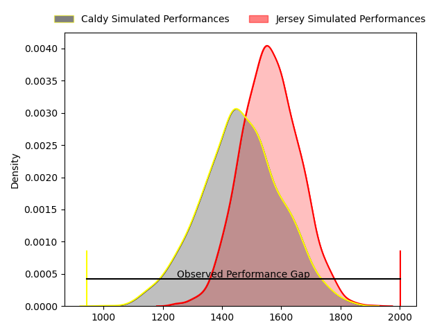
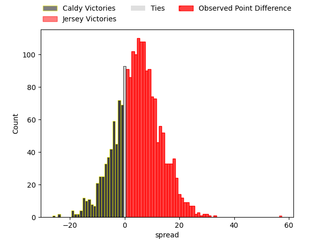
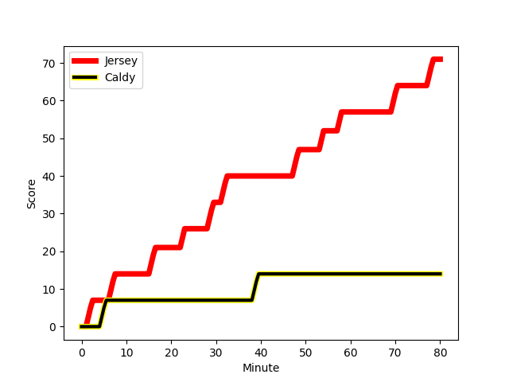
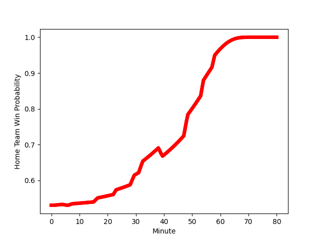

---  
layout: page  
title: Caldy at Jersey; 14-71  
date: 2023-03-04 16:00:00 18:00:00 -0500  
categories: match review  
---
# Caldy at Jersey; 14-71

# Club Level Predictions

The first set of predictions treats a club as the smallest object, as the club develops its members, organizes a gameplan, and deploys its players as needed for each match. This club model has a prediction of 0.624, which translates to predicting Jersey to win by 4.8.

Each club has a rating and a rating deviation (simiar to a Glicko system), and expected performances can be generated. This allows for simulated matches and spreads like the ones below.
## Projected Performances

## Projected Spreads

## Projected Results

# Player Level Predictions

Treating teams instead as an entity made up of the currently active players, I have ratings for each player in an altogether different system. These can be combined to form team ratings once teamsheets are announced, weighting starters a bit higher than the reserves. After the match is played, players can be weighted by their minutes on the field, allowing for an accurate measure of the team's composition. With these compiled team ratings, we can make predictions, measure inaccuracy, and update the individual player ratings.
## Prediction with Player Minutes: Jersey by 8.3

Jersey by 4.3 on a neutral field
## Scores over Time

## Win Probability over Time

There were 4 large changes in win probability in this match
## Prediction without Player Minutes: Jersey by 11.4

Jersey by 7.4 on a neutral pitch

|   Away Minutes | Away Player                                                       |   Away elo |   Away Percentile |   Number |   Home Percentile |   Home elo | Home Player                                                                          |   Home Minutes |
|---------------:|:------------------------------------------------------------------|-----------:|------------------:|---------:|------------------:|-----------:|:-------------------------------------------------------------------------------------|---------------:|
|             80 | [Adam Aigbokhae](..//playerfiles//AdamAigbokhae_cleaned.md)       |     108.71 |                87 |        1 |                88 |     110.09 | [Samuel Alexander Grahamslaw](..//playerfiles//SamuelAlexanderGrahamslaw_cleaned.md) |             80 |
|             66 | [Adam Aigbokhae](..//playerfiles//AdamAigbokhae_cleaned.md)       |     108.71 |                87 |        1 |                88 |     110.09 | [Samuel Alexander Grahamslaw](..//playerfiles//SamuelAlexanderGrahamslaw_cleaned.md) |             80 |
|             80 | [Adam Aigbokhae](..//playerfiles//AdamAigbokhae_cleaned.md)       |     108.71 |                87 |        1 |                88 |     110.09 | [Samuel Alexander Grahamslaw](..//playerfiles//SamuelAlexanderGrahamslaw_cleaned.md) |             50 |
|             66 | [Adam Aigbokhae](..//playerfiles//AdamAigbokhae_cleaned.md)       |     108.71 |                87 |        1 |                88 |     110.09 | [Samuel Alexander Grahamslaw](..//playerfiles//SamuelAlexanderGrahamslaw_cleaned.md) |             50 |
|             80 | [Oliver Hearn](..//playerfiles//OliverHearn_cleaned.md)           |     112.73 |                91 |        2 |                85 |     106.52 | [Eoghan Clarke](..//playerfiles//EoghanClarke_cleaned.md)                            |             80 |
|             66 | [Oliver Hearn](..//playerfiles//OliverHearn_cleaned.md)           |     112.73 |                91 |        2 |                85 |     106.52 | [Eoghan Clarke](..//playerfiles//EoghanClarke_cleaned.md)                            |             80 |
|             80 | [Oliver Hearn](..//playerfiles//OliverHearn_cleaned.md)           |     112.73 |                91 |        2 |                85 |     106.52 | [Eoghan Clarke](..//playerfiles//EoghanClarke_cleaned.md)                            |             50 |
|             66 | [Oliver Hearn](..//playerfiles//OliverHearn_cleaned.md)           |     112.73 |                91 |        2 |                85 |     106.52 | [Eoghan Clarke](..//playerfiles//EoghanClarke_cleaned.md)                            |             50 |
|             50 | [Andrew Darlington](..//playerfiles//AndrewDarlington_cleaned.md) |      46.28 |                 1 |        3 |                88 |     110.35 | [Steven Longwell](..//playerfiles//StevenLongwell_cleaned.md)                        |             50 |
|             50 | [Andrew Darlington](..//playerfiles//AndrewDarlington_cleaned.md) |      46.28 |                 1 |        3 |                88 |     110.35 | [Steven Longwell](..//playerfiles//StevenLongwell_cleaned.md)                        |             50 |
|             80 | [Andrew Darlington](..//playerfiles//AndrewDarlington_cleaned.md) |      46.28 |                 1 |        3 |                88 |     110.35 | [Steven Longwell](..//playerfiles//StevenLongwell_cleaned.md)                        |             50 |
|             80 | [Andrew Darlington](..//playerfiles//AndrewDarlington_cleaned.md) |      46.28 |                 1 |        3 |                88 |     110.35 | [Steven Longwell](..//playerfiles//StevenLongwell_cleaned.md)                        |             50 |
|             50 | [Andrew Darlington](..//playerfiles//AndrewDarlington_cleaned.md) |      46.28 |                 1 |        3 |                88 |     110.35 | [Steven Longwell](..//playerfiles//StevenLongwell_cleaned.md)                        |             80 |
|             50 | [Andrew Darlington](..//playerfiles//AndrewDarlington_cleaned.md) |      46.28 |                 1 |        3 |                88 |     110.35 | [Steven Longwell](..//playerfiles//StevenLongwell_cleaned.md)                        |             80 |
|             80 | [Andrew Darlington](..//playerfiles//AndrewDarlington_cleaned.md) |      46.28 |                 1 |        3 |                88 |     110.35 | [Steven Longwell](..//playerfiles//StevenLongwell_cleaned.md)                        |             80 |
|             80 | [Andrew Darlington](..//playerfiles//AndrewDarlington_cleaned.md) |      46.28 |                 1 |        3 |                88 |     110.35 | [Steven Longwell](..//playerfiles//StevenLongwell_cleaned.md)                        |             80 |
|             56 | [Sam Dickinson](..//playerfiles//SamDickinson_cleaned.md)         |     113.28 |                88 |        4 |                90 |     115.62 | [Sean O'Connor](..//playerfiles//SeanO'Connor_cleaned.md)                            |             80 |
|             80 | [Sam Dickinson](..//playerfiles//SamDickinson_cleaned.md)         |     113.28 |                88 |        4 |                90 |     115.62 | [Sean O'Connor](..//playerfiles//SeanO'Connor_cleaned.md)                            |             80 |
|             80 | [Thomas Sanders](..//playerfiles//ThomasSanders_cleaned.md)       |     105.93 |                77 |        5 |                86 |     111.33 | [Macauley Cook](..//playerfiles//MacauleyCook_cleaned.md)                            |             80 |
|             80 | [Harrison Crowe](..//playerfiles//HarrisonCrowe_cleaned.md)       |      94.63 |                48 |        6 |                73 |     102.83 | [Tim Grey](..//playerfiles//TimGrey_cleaned.md)                                      |             80 |
|             66 | [Callum Ridgway](..//playerfiles//CallumRidgway_cleaned.md)       |     110.26 |                85 |        7 |                81 |     107.98 | [Lewis Wynne](..//playerfiles//LewisWynne_cleaned.md)                                |             59 |
|             80 | [Callum Ridgway](..//playerfiles//CallumRidgway_cleaned.md)       |     110.26 |                85 |        7 |                81 |     107.98 | [Lewis Wynne](..//playerfiles//LewisWynne_cleaned.md)                                |             59 |
|             66 | [Callum Ridgway](..//playerfiles//CallumRidgway_cleaned.md)       |     110.26 |                85 |        7 |                81 |     107.98 | [Lewis Wynne](..//playerfiles//LewisWynne_cleaned.md)                                |             80 |
|             80 | [Callum Ridgway](..//playerfiles//CallumRidgway_cleaned.md)       |     110.26 |                85 |        7 |                81 |     107.98 | [Lewis Wynne](..//playerfiles//LewisWynne_cleaned.md)                                |             80 |
|             80 | [Josiah Dickinson](..//playerfiles//JosiahDickinson_cleaned.md)   |     103.14 |                72 |        8 |                53 |      96.23 | [James Andrew Dun](..//playerfiles//JamesAndrewDun_cleaned.md)                       |             41 |
|             80 | [Josiah Dickinson](..//playerfiles//JosiahDickinson_cleaned.md)   |     103.14 |                72 |        8 |                53 |      96.23 | [James Andrew Dun](..//playerfiles//JamesAndrewDun_cleaned.md)                       |             80 |
|             80 | [Chris Pilgrim](..//playerfiles//ChrisPilgrim_cleaned.md)         |     110.06 |                87 |        9 |                71 |     101.96 | [James Mitchell](..//playerfiles//JamesMitchell_cleaned.md)                          |             50 |
|             68 | [Chris Pilgrim](..//playerfiles//ChrisPilgrim_cleaned.md)         |     110.06 |                87 |        9 |                71 |     101.96 | [James Mitchell](..//playerfiles//JamesMitchell_cleaned.md)                          |             50 |
|             80 | [Chris Pilgrim](..//playerfiles//ChrisPilgrim_cleaned.md)         |     110.06 |                87 |        9 |                71 |     101.96 | [James Mitchell](..//playerfiles//JamesMitchell_cleaned.md)                          |             80 |
|             68 | [Chris Pilgrim](..//playerfiles//ChrisPilgrim_cleaned.md)         |     110.06 |                87 |        9 |                71 |     101.96 | [James Mitchell](..//playerfiles//JamesMitchell_cleaned.md)                          |             80 |
|             80 | [Rhys Hayes](..//playerfiles//RhysHayes_cleaned.md)               |     105.61 |                77 |       10 |                64 |     100.16 | [Russell Bennett](..//playerfiles//RussellBennett_cleaned.md)                        |             80 |
|             80 | [Rhys Hayes](..//playerfiles//RhysHayes_cleaned.md)               |     105.61 |                77 |       10 |                64 |     100.16 | [Russell Bennett](..//playerfiles//RussellBennett_cleaned.md)                        |             56 |
|             80 | [Michael Cartmill](..//playerfiles//MichaelCartmill_cleaned.md)   |      95.27 |                40 |       11 |                72 |     103.61 | [Tomi Lewis](..//playerfiles//TomiLewis_cleaned.md)                                  |             80 |
|             52 | [Michael Cartmill](..//playerfiles//MichaelCartmill_cleaned.md)   |      95.27 |                40 |       11 |                72 |     103.61 | [Tomi Lewis](..//playerfiles//TomiLewis_cleaned.md)                                  |             80 |
|             80 | [Michael Barlow](..//playerfiles//MichaelBarlow_cleaned.md)       |     114.15 |                90 |       12 |                98 |     133.92 | [Dan Barnes](..//playerfiles//DanBarnes_cleaned.md)                                  |             56 |
|             50 | [Michael Barlow](..//playerfiles//MichaelBarlow_cleaned.md)       |     114.15 |                90 |       12 |                98 |     133.92 | [Dan Barnes](..//playerfiles//DanBarnes_cleaned.md)                                  |             56 |
|             50 | [Michael Barlow](..//playerfiles//MichaelBarlow_cleaned.md)       |     114.15 |                90 |       12 |                98 |     133.92 | [Dan Barnes](..//playerfiles//DanBarnes_cleaned.md)                                  |             80 |
|             80 | [Michael Barlow](..//playerfiles//MichaelBarlow_cleaned.md)       |     114.15 |                90 |       12 |                98 |     133.92 | [Dan Barnes](..//playerfiles//DanBarnes_cleaned.md)                                  |             80 |
|             80 | [Dan Bibby](..//playerfiles//DanBibby_cleaned.md)                 |     104.02 |                75 |       13 |                83 |     107.7  | [Alex McHenry](..//playerfiles//AlexMcHenry_cleaned.md)                              |             80 |
|             80 | [Nick Royle](..//playerfiles//NickRoyle_cleaned.md)               |     110.97 |                86 |       14 |                57 |      97.26 | [Ben Woollett](..//playerfiles//BenWoollett_cleaned.md)                              |             80 |
|             80 | [Elliott Gourlay](..//playerfiles//ElliottGourlay_cleaned.md)     |     115.99 |                90 |       15 |                57 |      98.34 | [Brendan Owen](..//playerfiles//BrendanOwen_cleaned.md)                              |             80 |
|             30 | [Ryan Higginson](..//playerfiles//RyanHigginson_cleaned.md)       |     104.85 |                55 |       16 |                 8 |      75.42 | [Tom Everard](..//playerfiles//TomEverard_cleaned.md)                                |             39 |
|             30 | [Lewis Barker](..//playerfiles//LewisBarker_cleaned.md)           |     100.36 |               nan |       17 |                32 |      92.6  | [Greg McGrath](..//playerfiles//GregMcGrath_cleaned.md)                              |             30 |
|             28 | [Louis Beer](..//playerfiles//LouisBeer_cleaned.md)               |     113.24 |                89 |       18 |                19 |      85.04 | [James Hadfield](..//playerfiles//JamesHadfield_cleaned.md)                          |             30 |
|             24 | [Martin Gerrard](..//playerfiles//MartinGerrard_cleaned.md)       |     108.4  |                71 |       19 |                62 |      98.75 | [Adam Nicol](..//playerfiles//AdamNicol_cleaned.md)                                  |             30 |
|             14 | [William Sanderson](..//playerfiles//WilliamSanderson_cleaned.md) |      90.71 |               nan |       20 |               nan |      83.29 | [Toby Venner](..//playerfiles//TobyVenner_cleaned.md)                                |             30 |
|             14 | [Nyle Davidson](..//playerfiles//NyleDavidson_cleaned.md)         |     100.1  |                65 |       21 |                22 |      85.13 | [Jordan Holgate](..//playerfiles//JordanHolgate_cleaned.md)                          |             24 |
|             14 | [Thomas Clarke](..//playerfiles//ThomasClarke_cleaned.md)         |      94.49 |               nan |       22 |               nan |      95    | [Ben Burnell](..//playerfiles//BenBurnell_cleaned.md)                                |             24 |
|             12 | [Joseph Murray](..//playerfiles//JosephMurray_cleaned.md)         |      95.65 |                42 |       23 |                62 |      98.38 | [Josh Gray](..//playerfiles//JoshGray_cleaned.md)                                    |             21 |

