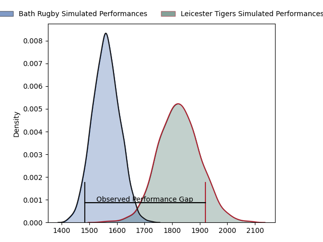
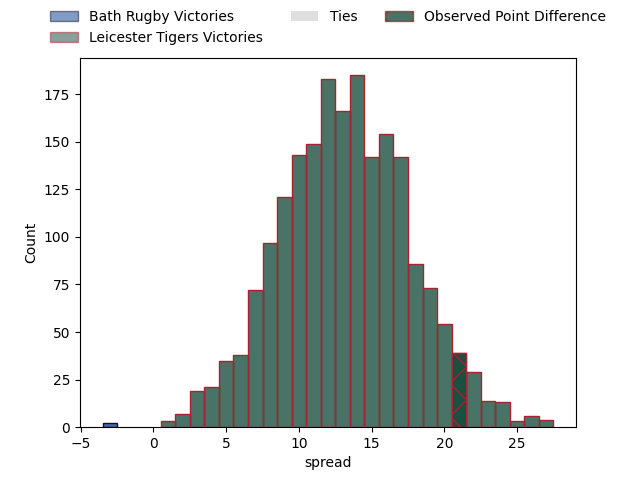
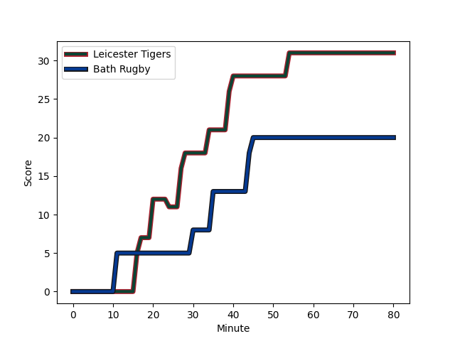
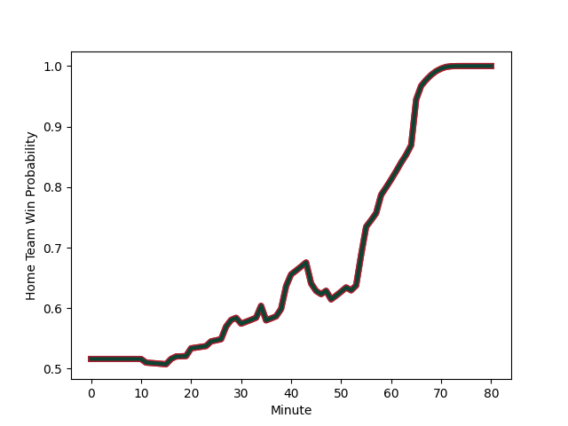

---  
layout: page  
title: Bath Rugby at Leicester Tigers; 27.0-48.0  
date: 2023-03-04 10:00:00 18:00:00 -0500  
categories: match review  
---
# Bath Rugby at Leicester Tigers; 27.0-48.0

# Club Level Predictions

The first set of predictions treats a club as the smallest object, as the club develops its members, organizes a gameplan, and deploys its players as needed for each match. This club model has a prediction of 0.815, which translates to predicting Leicester Tigers to win by 13.0.

Each club has a rating and a rating deviation (simiar to a Glicko system), and expected performances can be generated. This allows for simulated matches and spreads like the ones below.
## Projected Performances

## Projected Spreads

## Projected Results

# Player Level Predictions

Treating teams instead as an entity made up of the currently active players, I have ratings for each player in an altogether different system. These can be combined to form team ratings once teamsheets are announced, weighting starters a bit higher than the reserves. After the match is played, players can be weighted by their minutes on the field, allowing for an accurate measure of the team's composition. With these compiled team ratings, we can make predictions, measure inaccuracy, and update the individual player ratings.
## Prediction with Player Minutes: Leicester Tigers by 10.5

Leicester Tigers by 6.5 on a neutral field
## Scores over Time

## Win Probability over Time

There were 7 large changes in win probability in this match
## Prediction without Player Minutes: Leicester Tigers by 10.9

Leicester Tigers by 6.9 on a neutral pitch

|   Away Minutes | Away Player                                                           |   Away elo |   Away Percentile |   Number |   Home Percentile |   Home elo | Home Player                                                       |   Home Minutes |
|---------------:|:----------------------------------------------------------------------|-----------:|------------------:|---------:|------------------:|-----------:|:------------------------------------------------------------------|---------------:|
|             63 | [Beno Obano](..//playerfiles//BenoObano_cleaned.md)                   |     109.01 |                87 |        1 |                76 |     102.35 | [Tom West](..//playerfiles//TomWest_cleaned.md)                   |             55 |
|             66 | [Tom Dunn](..//playerfiles//TomDunn_cleaned.md)                       |     125.67 |                97 |        2 |                22 |      86.19 | [Julian Montoya](..//playerfiles//JulianMontoya_cleaned.md)       |             66 |
|             55 | [Will Stuart](..//playerfiles//WillStuart_cleaned.md)                 |      79.93 |                17 |        3 |                78 |     103.5  | [Joe Heyes](..//playerfiles//JoeHeyes_cleaned.md)                 |             58 |
|             80 | [Josh McNally](..//playerfiles//JoshMcNally_cleaned.md)               |      85.93 |                23 |        4 |                65 |     100.65 | [George Martin](..//playerfiles//GeorgeMartin_cleaned.md)         |             80 |
|             80 | [GJ van Velze](..//playerfiles//GJvanVelze_cleaned.md)                |      97.06 |               nan |        5 |                90 |     115.57 | [Cameron Henderson](..//playerfiles//CameronHenderson_cleaned.md) |             80 |
|             80 | [Fergus Lee-Warner](..//playerfiles//FergusLee-Warner_cleaned.md)     |      75.38 |                11 |        6 |                94 |     120.98 | [Hanro Liebenberg](..//playerfiles//HanroLiebenberg_cleaned.md)   |             52 |
|             46 | [Sam Underhill](..//playerfiles//SamUnderhill_cleaned.md)             |      96.53 |                54 |        7 |                82 |     107.92 | [Tommy Reffell](..//playerfiles//TommyReffell_cleaned.md)         |             58 |
|             38 | [Jaco Coetzee](..//playerfiles//JacoCoetzee_cleaned.md)               |      95.09 |               nan |        8 |                77 |     104.84 | [Jasper Wiese](..//playerfiles//JasperWiese_cleaned.md)           |             80 |
|             80 | [Ben Spencer](..//playerfiles//BenSpencer_cleaned.md)                 |     113.49 |                91 |        9 |                31 |      89.07 | [Ben Youngs](..//playerfiles//BenYoungs_cleaned.md)               |             71 |
|             80 | [Orlando Bailey](..//playerfiles//OrlandoBailey_cleaned.md)           |      81.32 |                15 |       10 |                96 |     127.8  | [Handre Pollard](..//playerfiles//HandrePollard_cleaned.md)       |             66 |
|             80 | [Matt Gallagher](..//playerfiles//MattGallagher_cleaned.md)           |     124.46 |                96 |       11 |                84 |     107    | [Harry Simmons](..//playerfiles//HarrySimmons_cleaned.md)         |             80 |
|             71 | [Cameron Redpath](..//playerfiles//CameronRedpath_cleaned.md)         |     101.7  |                70 |       12 |                75 |     103.78 | [Jimmy Gopperth](..//playerfiles//JimmyGopperth_cleaned.md)       |             46 |
|             80 | [Jonathan Joseph](..//playerfiles//JonathanJoseph_cleaned.md)         |     115.4  |                92 |       13 |                27 |      87.19 | [Matt Scott](..//playerfiles//MattScott_cleaned.md)               |             80 |
|             58 | [Ruaridh McConnochie](..//playerfiles//RuaridhMcConnochie_cleaned.md) |     112.69 |                88 |       14 |                45 |      93.11 | [Harry Potter](..//playerfiles//HarryPotter_cleaned.md)           |             80 |
|             80 | [Tom de Glanville](..//playerfiles//TomdeGlanville_cleaned.md)        |      84.66 |                25 |       15 |                77 |     107.13 | [Mike Brown](..//playerfiles//MikeBrown_cleaned.md)               |             80 |
|             14 | [Niall Annett](..//playerfiles//NiallAnnett_cleaned.md)               |      96.71 |                57 |       16 |                 3 |      68.53 | [Charlie Clare](..//playerfiles//CharlieClare_cleaned.md)         |             14 |
|             17 | [Juan Schoeman](..//playerfiles//JuanSchoeman_cleaned.md)             |      95.64 |               nan |       17 |                98 |     123.39 | [Francois van Wyk](..//playerfiles//FrancoisvanWyk_cleaned.md)    |             25 |
|             25 | [D'Arcy Rae](..//playerfiles//D'ArcyRae_cleaned.md)                   |      45.19 |                 0 |       18 |                19 |      86.56 | [Will Hurd](..//playerfiles//WillHurd_cleaned.md)                 |             22 |
|             32 | [Miles Reid](..//playerfiles//MilesReid_cleaned.md)                   |     120.55 |                94 |       19 |                99 |     143.93 | [Harry Wells](..//playerfiles//HarryWells_cleaned.md)             |             22 |
|             10 | [Alfie Barbeary](..//playerfiles//AlfieBarbeary_cleaned.md)           |      95    |               nan |       20 |                74 |     104.19 | [Olly Cracknell](..//playerfiles//OllyCracknell_cleaned.md)       |             28 |
|             22 | [Louis Schreuder](..//playerfiles//LouisSchreuder_cleaned.md)         |      99.77 |                66 |       21 |                76 |     100.42 | [Tom Whiteley](..//playerfiles//TomWhiteley_cleaned.md)           |              9 |
|              9 | [Max Ojomoh](..//playerfiles//MaxOjomoh_cleaned.md)                   |      84.02 |                18 |       22 |                44 |      93.87 | [Charlie Atkinson](..//playerfiles//CharlieAtkinson_cleaned.md)   |             14 |
|             34 | [Chris Cloete](..//playerfiles//ChrisCloete_cleaned.md)               |     122.96 |                95 |       23 |                92 |     116.12 | [Guy Porter](..//playerfiles//GuyPorter_cleaned.md)               |             34 |

