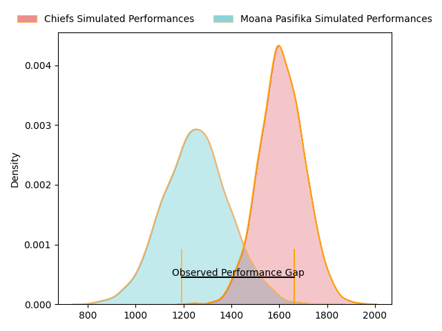
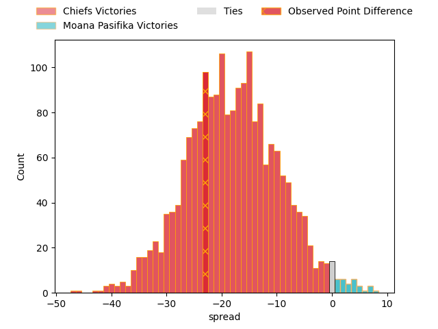
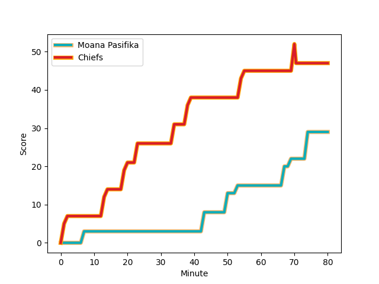
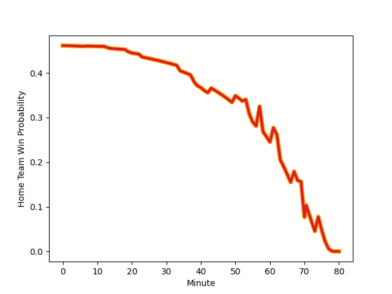

---  
layout: page  
title: Chiefs at Moana Pasifika; 52.0-29.0  
date: 2023-03-04 01:05:00 18:00:00 -0500  
categories: match review  
---
# Chiefs at Moana Pasifika; 52.0-29.0

# Club Level Predictions

The first set of predictions treats a club as the smallest object, as the club develops its members, organizes a gameplan, and deploys its players as needed for each match. This club model has a prediction of 0.124, which translates to predicting Chiefs to win by 17.7.

Each club has a rating and a rating deviation (simiar to a Glicko system), and expected performances can be generated. This allows for simulated matches and spreads like the ones below.
## Projected Performances

## Projected Spreads

## Projected Results

# Player Level Predictions

Treating teams instead as an entity made up of the currently active players, I have ratings for each player in an altogether different system. These can be combined to form team ratings once teamsheets are announced, weighting starters a bit higher than the reserves. After the match is played, players can be weighted by their minutes on the field, allowing for an accurate measure of the team's composition. With these compiled team ratings, we can make predictions, measure inaccuracy, and update the individual player ratings.
## Prediction with Player Minutes: Chiefs by 6.4

Chiefs by 10.4 on a neutral field
## Scores over Time

## Win Probability over Time

There were 8 large changes in win probability in this match
## Prediction without Player Minutes: Chiefs by 13.2

Chiefs by 17.2 on a neutral pitch

|   Away Minutes | Away Player                                                             |   Away elo |   Away Percentile |   Number |   Home Percentile |   Home elo | Home Player                                                               |   Home Minutes |
|---------------:|:------------------------------------------------------------------------|-----------:|------------------:|---------:|------------------:|-----------:|:--------------------------------------------------------------------------|---------------:|
|             52 | [Ollie Norris](..//playerfiles//OllieNorris_cleaned.md)                 |      91.58 |                38 |        1 |               nan |      95    | [Ezekiel Lindenmuth](..//playerfiles//EzekielLindenmuth_cleaned.md)       |             41 |
|             53 | [Samisoni Taukei'aho](..//playerfiles//SamisoniTaukei'aho_cleaned.md)   |     112.87 |                90 |        2 |                 9 |      78.04 | [Samiuela Moli](..//playerfiles//SamiuelaMoli_cleaned.md)                 |             58 |
|             41 | [George Dyer](..//playerfiles//GeorgeDyer_cleaned.md)                   |      90.13 |                32 |        3 |                 8 |      77.36 | [Chris Apoua](..//playerfiles//ChrisApoua_cleaned.md)                     |             80 |
|             57 | [Brodie Retallick](..//playerfiles//BrodieRetallick_cleaned.md)         |     117.44 |                92 |        4 |                10 |      77.2  | [Samuel Slade](..//playerfiles//SamuelSlade_cleaned.md)                   |             56 |
|             80 | [Tupou Vaa'i](..//playerfiles//TupouVaa'i_cleaned.md)                   |      93.7  |                46 |        5 |                 4 |      65.14 | [Mahroni Ngakuru](..//playerfiles//MahroniNgakuru_cleaned.md)             |             80 |
|             80 | [Pita Gus Sowakula](..//playerfiles//PitaGusSowakula_cleaned.md)        |      99.88 |                64 |        6 |               nan |      95    | [Miracle Faiilagi](..//playerfiles//MiracleFaiilagi_cleaned.md)           |             63 |
|             57 | [Sam Cane](..//playerfiles//SamCane_cleaned.md)                         |     137.5  |                98 |        7 |                39 |      91.57 | [Solomone Funaki](..//playerfiles//SolomoneFunaki_cleaned.md)             |             80 |
|             80 | [Luke Jacobson](..//playerfiles//LukeJacobson_cleaned.md)               |     135.29 |                99 |        8 |                77 |     104.57 | [Jonah Mau'u](..//playerfiles//JonahMau'u_cleaned.md)                     |             80 |
|             61 | [Brad Weber](..//playerfiles//BradWeber_cleaned.md)                     |     135.94 |                99 |        9 |                50 |      93.47 | [Manu Paea](..//playerfiles//ManuPaea_cleaned.md)                         |             55 |
|             67 | [Damian McKenzie](..//playerfiles//DamianMcKenzie_cleaned.md)           |      93    |                43 |       10 |                91 |     118.75 | [Christian Leali'ifano](..//playerfiles//ChristianLeali'ifano_cleaned.md) |             80 |
|             53 | [Etene Nanai-Seturo](..//playerfiles//EteneNanai-Seturo_cleaned.md)     |      88.14 |                28 |       11 |               nan |      95    | [Anzelo Tuitavuki](..//playerfiles//AnzeloTuitavuki_cleaned.md)           |             80 |
|             80 | [Rameka Poihipi](..//playerfiles//RamekaPoihipi_cleaned.md)             |      90.7  |                34 |       12 |                96 |     124.73 | [Levi Aumua](..//playerfiles//LeviAumua_cleaned.md)                       |             80 |
|             80 | [Alex Nankivell](..//playerfiles//AlexNankivell_cleaned.md)             |      86.09 |                24 |       13 |                 8 |      73.82 | [Fine Inisi](..//playerfiles//FineInisi_cleaned.md)                       |             80 |
|             80 | [Liam Coombes-Fabling](..//playerfiles//LiamCoombes-Fabling_cleaned.md) |     111.58 |                86 |       14 |                28 |      88.1  | [Timoci Tavatavanawai](..//playerfiles//TimociTavatavanawai_cleaned.md)   |             80 |
|             80 | [Shaun Stevenson](..//playerfiles//ShaunStevenson_cleaned.md)           |     101.44 |                67 |       15 |                88 |     113.26 | [Danny Toala](..//playerfiles//DannyToala_cleaned.md)                     |             57 |
|             27 | [Tyrone Thompson](..//playerfiles//TyroneThompson_cleaned.md)           |      95    |               nan |       16 |               nan |      95    | [Ray Niuia](..//playerfiles//RayNiuia_cleaned.md)                         |             22 |
|             28 | [Jared Proffit](..//playerfiles//JaredProffit_cleaned.md)               |      95    |               nan |       17 |                78 |     103.86 | [Abraham Pole](..//playerfiles//AbrahamPole_cleaned.md)                   |             39 |
|             39 | [John Ryan](..//playerfiles//JohnRyan_cleaned.md)                       |     103.13 |               nan |       18 |               nan |      95    | [Isileli Tu'ungafasi](..//playerfiles//IsileliTu'ungafasi_cleaned.md)     |             23 |
|             23 | [Laghlan McWhannell](..//playerfiles//LaghlanMcWhannell_cleaned.md)     |      95    |               nan |       19 |                10 |      76.66 | [Mike McKee](..//playerfiles//MikeMcKee_cleaned.md)                       |             39 |
|             23 | [Simon Parker](..//playerfiles//SimonParker_cleaned.md)                 |      95    |               nan |       20 |               nan |      95    | [Lotu Inisi](..//playerfiles//LotuInisi_cleaned.md)                       |             17 |
|             19 | [Cortez Ratima](..//playerfiles//CortezRatima_cleaned.md)               |     107.74 |                92 |       21 |                72 |     102.08 | [Ere Enari](..//playerfiles//EreEnari_cleaned.md)                         |             25 |
|             27 | [Bryn Gatland](..//playerfiles//BrynGatland_cleaned.md)                 |      95    |               nan |       22 |                94 |     121.57 | [William Havili](..//playerfiles//WilliamHavili_cleaned.md)               |             23 |
|             13 | [Ngatungane Punivai](..//playerfiles//NgatunganePunivai_cleaned.md)     |      95    |               nan |       23 |                18 |      83.69 | [Henry Taefu](..//playerfiles//HenryTaefu_cleaned.md)                     |             13 |

