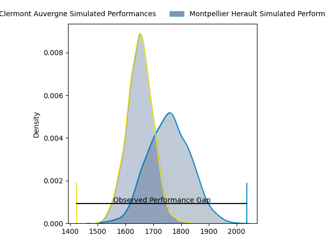
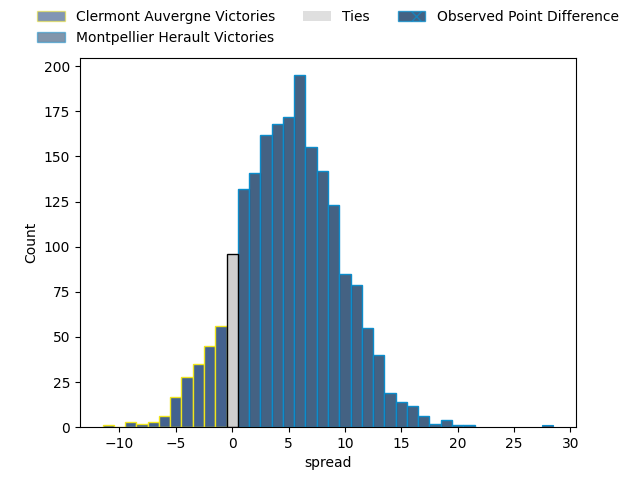
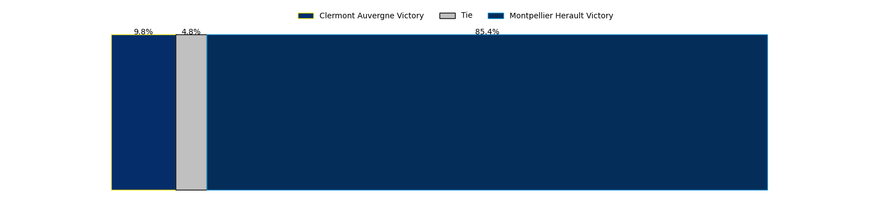
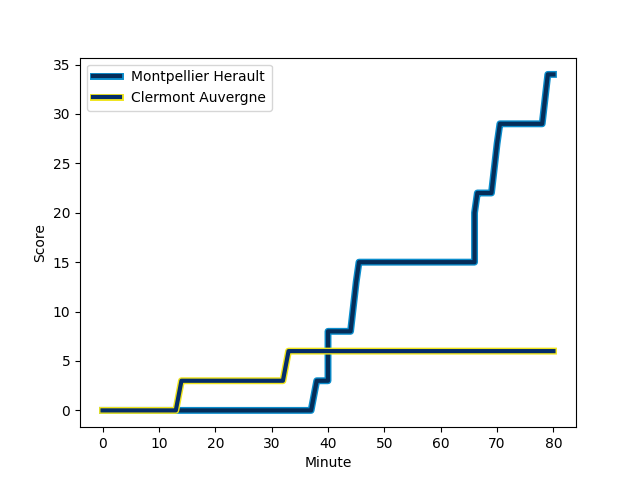
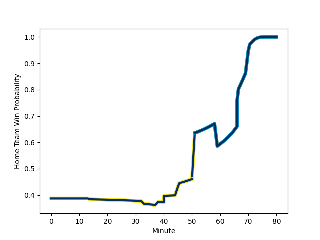

---  
layout: page  
title: Clermont Auvergne at Montpellier Herault; 6-34  
date: 2023-03-04 15:00:00 18:00:00 -0500  
categories: match review  
---
# Clermont Auvergne at Montpellier Herault; 6-34

# Club Level Predictions

The first set of predictions treats a club as the smallest object, as the club develops its members, organizes a gameplan, and deploys its players as needed for each match. This club model has a prediction of 0.645, which translates to predicting Montpellier Herault to win by 5.2.

Each club has a rating and a rating deviation (simiar to a Glicko system), and expected performances can be generated. This allows for simulated matches and spreads like the ones below.
## Projected Performances

## Projected Spreads

## Projected Results

# Player Level Predictions

Treating teams instead as an entity made up of the currently active players, I have ratings for each player in an altogether different system. These can be combined to form team ratings once teamsheets are announced, weighting starters a bit higher than the reserves. After the match is played, players can be weighted by their minutes on the field, allowing for an accurate measure of the team's composition. With these compiled team ratings, we can make predictions, measure inaccuracy, and update the individual player ratings.
## Prediction with Player Minutes: Clermont Auvergne by 15.4

Clermont Auvergne by 19.4 on a neutral field
## Scores over Time

## Win Probability over Time

There were 6 large changes in win probability in this match
## Prediction without Player Minutes: Clermont Auvergne by 15.6

Clermont Auvergne by 19.6 on a neutral pitch

|   Away Minutes | Away Player                                                         |   Away elo |   Away Percentile |   Number |   Home Percentile |   Home elo | Home Player                                                                                        |   Home Minutes |
|---------------:|:--------------------------------------------------------------------|-----------:|------------------:|---------:|------------------:|-----------:|:---------------------------------------------------------------------------------------------------|---------------:|
|             80 | [Etienne Falgoux](..//playerfiles//EtienneFalgoux_cleaned.md)       |     103.08 |                78 |        1 |                63 |      96.88 | [Enzo Forletta](..//playerfiles//EnzoForletta_cleaned.md)                                          |             20 |
|             41 | [Etienne Falgoux](..//playerfiles//EtienneFalgoux_cleaned.md)       |     103.08 |                78 |        1 |                63 |      96.88 | [Enzo Forletta](..//playerfiles//EnzoForletta_cleaned.md)                                          |             20 |
|             51 | [Étienne Fourcade](..//playerfiles//ÉtienneFourcade_cleaned.md)     |      98.34 |                63 |        2 |                27 |      87.58 | [Brandon Paenga-Amosa](..//playerfiles//BrandonPaenga-Amosa_cleaned.md)                            |             50 |
|             80 | [Étienne Fourcade](..//playerfiles//ÉtienneFourcade_cleaned.md)     |      98.34 |                63 |        2 |                27 |      87.58 | [Brandon Paenga-Amosa](..//playerfiles//BrandonPaenga-Amosa_cleaned.md)                            |             50 |
|             41 | [Rabah Slimani](..//playerfiles//RabahSlimani_cleaned.md)           |      97.98 |                61 |        3 |                37 |      91.72 | [Titi Lamositele](..//playerfiles//TitiLamositele_cleaned.md)                                      |             50 |
|             80 | [Thibault Lanen](..//playerfiles//ThibaultLanen_cleaned.md)         |     113.48 |                88 |        4 |                33 |      92.49 | [Bastien Chalureau](..//playerfiles//BastienChalureau_cleaned.md)                                  |             80 |
|             80 | [Tomas Lavanini](..//playerfiles//TomasLavanini_cleaned.md)         |      86.76 |                24 |        5 |                50 |      95.27 | [Tyler Evan Duguid](..//playerfiles//TylerEvanDuguid_cleaned.md)                                   |             45 |
|             80 | [Arthur Iturria](..//playerfiles//ArthurIturria_cleaned.md)         |     102.65 |                71 |        6 |                55 |      96.44 | [Nicolaas Jacobus Janse van Rensburg](..//playerfiles//NicolaasJacobusJansevanRensburg_cleaned.md) |             80 |
|             23 | [Alexandre Fischer](..//playerfiles//AlexandreFischer_cleaned.md)   |     103.19 |                72 |        7 |                52 |      95.47 | [Masivesi Dakuwaqa](..//playerfiles//MasivesiDakuwaqa_cleaned.md)                                  |             52 |
|             41 | [Peceli Yato](..//playerfiles//PeceliYato_cleaned.md)               |     107.48 |                81 |        8 |                46 |      94.09 | [Zach Mercer](..//playerfiles//ZachMercer_cleaned.md)                                              |             80 |
|             52 | [Baptiste Jauneau](..//playerfiles//BaptisteJauneau_cleaned.md)     |     104.88 |                80 |        9 |                52 |      95.12 | [Jacobus Meyer Reinach](..//playerfiles//JacobusMeyerReinach_cleaned.md)                           |             80 |
|             52 | [Baptiste Jauneau](..//playerfiles//BaptisteJauneau_cleaned.md)     |     104.88 |                80 |        9 |                52 |      95.12 | [Jacobus Meyer Reinach](..//playerfiles//JacobusMeyerReinach_cleaned.md)                           |             72 |
|             47 | [Anthony Belleau](..//playerfiles//AnthonyBelleau_cleaned.md)       |     104.03 |                74 |       10 |                48 |      94.63 | [Paolo Garbisi](..//playerfiles//PaoloGarbisi_cleaned.md)                                          |             80 |
|             80 | [Alivereti Raka](..//playerfiles//AliveretiRaka_cleaned.md)         |      87.78 |                25 |       11 |                41 |      92.03 | [George Bridge](..//playerfiles//GeorgeBridge_cleaned.md)                                          |             80 |
|             47 | [Irae Simone](..//playerfiles//IraeSimone_cleaned.md)               |      91.31 |                39 |       12 |                66 |     100.01 | [Jan Lodewyk Serfontein](..//playerfiles//JanLodewykSerfontein_cleaned.md)                         |             64 |
|             80 | [George Moala](..//playerfiles//GeorgeMoala_cleaned.md)             |     106.71 |                80 |       13 |                35 |      90.28 | [Thomas Darmon](..//playerfiles//ThomasDarmon_cleaned.md)                                          |             59 |
|             80 | [Bautista Delguy](..//playerfiles//BautistaDelguy_cleaned.md)       |      98.75 |                61 |       14 |                24 |      87.18 | [Vincent Rattez](..//playerfiles//VincentRattez_cleaned.md)                                        |             80 |
|             80 | [Alex Newsome](..//playerfiles//AlexNewsome_cleaned.md)             |     109.58 |                83 |       15 |                40 |      90.3  | [Anthony Bouthier](..//playerfiles//AnthonyBouthier_cleaned.md)                                    |             80 |
|             57 | [Judicael Cancoriet](..//playerfiles//JudicaelCancoriet_cleaned.md) |      89.66 |                27 |       16 |                55 |      96.43 | [Grégory Fichten](..//playerfiles//GrégoryFichten_cleaned.md)                                      |             60 |
|             39 | [Cristian Ojovan](..//playerfiles//CristianOjovan_cleaned.md)       |     100.36 |                61 |       17 |                57 |      97.31 | [Elliott Stooke](..//playerfiles//ElliottStooke_cleaned.md)                                        |             35 |
|             39 | [Fritz Lee](..//playerfiles//FritzLee_cleaned.md)                   |      89.89 |                33 |       18 |                60 |      97.28 | [Vincent Giudicelli](..//playerfiles//VincentGiudicelli_cleaned.md)                                |             30 |
|             33 | [Jules Plisson](..//playerfiles//JulesPlisson_cleaned.md)           |      91.59 |                34 |       19 |                33 |      87.07 | [Henry Thomas](..//playerfiles//HenryThomas_cleaned.md)                                            |             30 |
|             33 | [Cheikh Tiberghien](..//playerfiles//CheikhTiberghien_cleaned.md)   |      94.16 |                51 |       20 |                41 |      91.77 | [Lenni Nouchi](..//playerfiles//LenniNouchi_cleaned.md)                                            |             28 |
|             28 | [Sebastien Bézy](..//playerfiles//SebastienBézy_cleaned.md)         |      96.77 |                57 |       21 |                48 |      92.51 | [Pierre Lucas](..//playerfiles//PierreLucas_cleaned.md)                                            |             21 |
|             39 | [Giorgi Beria](..//playerfiles//GiorgiBeria_cleaned.md)             |      92.94 |                35 |       22 |                45 |      93.52 | [Louis Carbonel](..//playerfiles//LouisCarbonel_cleaned.md)                                        |             16 |
|             29 | [Benjamin Boudou](..//playerfiles//BenjaminBoudou_cleaned.md)       |      99.92 |                44 |       23 |                53 |      96.35 | [Aubin Eymeri](..//playerfiles//AubinEymeri_cleaned.md)                                            |              8 |

