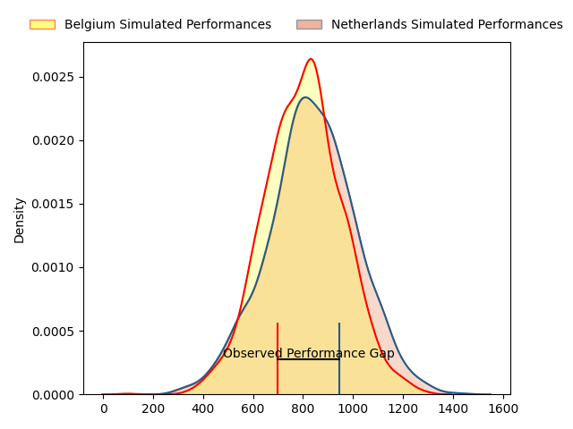
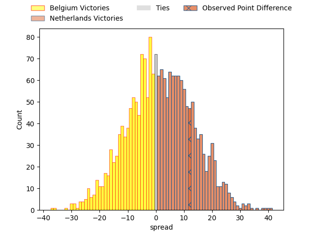
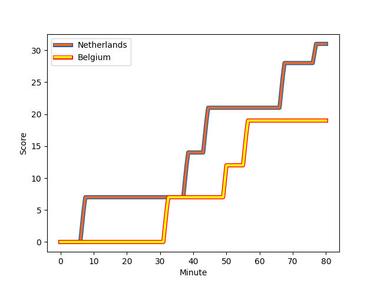
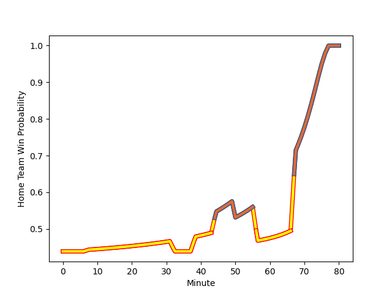

---  
layout: page  
title: Belgium at Netherlands; 19-31  
date: 2023-03-04 12:15:00 18:00:00 -0500  
categories: match review  
---
# Belgium at Netherlands; 19-31

# Club Level Predictions

The first set of predictions treats a club as the smallest object, as the club develops its members, organizes a gameplan, and deploys its players as needed for each match. This club model has a prediction of 0.541, which translates to predicting Netherlands to win by 1.6.

Each club has a rating and a rating deviation (simiar to a Glicko system), and expected performances can be generated. This allows for simulated matches and spreads like the ones below.
## Projected Performances

## Projected Spreads

## Projected Results

# Player Level Predictions

Treating teams instead as an entity made up of the currently active players, I have ratings for each player in an altogether different system. These can be combined to form team ratings once teamsheets are announced, weighting starters a bit higher than the reserves. After the match is played, players can be weighted by their minutes on the field, allowing for an accurate measure of the team's composition. With these compiled team ratings, we can make predictions, measure inaccuracy, and update the individual player ratings.
## Prediction with Player Minutes: Belgium by 6.8

Belgium by 10.8 on a neutral field
## Scores over Time

## Win Probability over Time

There were 14 large changes in win probability in this match
## Prediction without Player Minutes: Belgium by 4.7

Belgium by 8.7 on a neutral pitch

|   Away Minutes | Away Player                                                               |   Away elo |   Away Percentile |   Number |   Home Percentile |   Home elo | Home Player                                                                          |   Home Minutes |
|---------------:|:--------------------------------------------------------------------------|-----------:|------------------:|---------:|------------------:|-----------:|:-------------------------------------------------------------------------------------|---------------:|
|             80 | [Romain Pinte](..//playerfiles//RomainPinte_cleaned.md)                   |      73.41 |                 5 |        1 |                 1 |      60.88 | [Hugo Langelaan](..//playerfiles//HugoLangelaan_cleaned.md)                          |             79 |
|             75 | [Romain Pinte](..//playerfiles//RomainPinte_cleaned.md)                   |      73.41 |                 5 |        1 |                 1 |      60.88 | [Hugo Langelaan](..//playerfiles//HugoLangelaan_cleaned.md)                          |             79 |
|             75 | [Romain Pinte](..//playerfiles//RomainPinte_cleaned.md)                   |      73.41 |                 5 |        1 |                 1 |      60.88 | [Hugo Langelaan](..//playerfiles//HugoLangelaan_cleaned.md)                          |             80 |
|             80 | [Romain Pinte](..//playerfiles//RomainPinte_cleaned.md)                   |      73.41 |                 5 |        1 |                 1 |      60.88 | [Hugo Langelaan](..//playerfiles//HugoLangelaan_cleaned.md)                          |             80 |
|             75 | [Alexis Cuffolo](..//playerfiles//AlexisCuffolo_cleaned.md)               |      66.52 |                 7 |        2 |                10 |      87.61 | [Ross Bennie-Coulson](..//playerfiles//RossBennie-Coulson_cleaned.md)                |             59 |
|             75 | [Alexis Cuffolo](..//playerfiles//AlexisCuffolo_cleaned.md)               |      66.52 |                 3 |        2 |                10 |      87.61 | [Ross Bennie-Coulson](..//playerfiles//RossBennie-Coulson_cleaned.md)                |             59 |
|             80 | [Alexis Cuffolo](..//playerfiles//AlexisCuffolo_cleaned.md)               |      66.52 |                 7 |        2 |                10 |      87.61 | [Ross Bennie-Coulson](..//playerfiles//RossBennie-Coulson_cleaned.md)                |             59 |
|             80 | [Alexis Cuffolo](..//playerfiles//AlexisCuffolo_cleaned.md)               |      66.52 |                 3 |        2 |                10 |      87.61 | [Ross Bennie-Coulson](..//playerfiles//RossBennie-Coulson_cleaned.md)                |             59 |
|             75 | [Alexis Cuffolo](..//playerfiles//AlexisCuffolo_cleaned.md)               |      66.52 |                 7 |        2 |                30 |      87.61 | [Ross Bennie-Coulson](..//playerfiles//RossBennie-Coulson_cleaned.md)                |             59 |
|             75 | [Alexis Cuffolo](..//playerfiles//AlexisCuffolo_cleaned.md)               |      66.52 |                 3 |        2 |                30 |      87.61 | [Ross Bennie-Coulson](..//playerfiles//RossBennie-Coulson_cleaned.md)                |             59 |
|             80 | [Alexis Cuffolo](..//playerfiles//AlexisCuffolo_cleaned.md)               |      66.52 |                 7 |        2 |                30 |      87.61 | [Ross Bennie-Coulson](..//playerfiles//RossBennie-Coulson_cleaned.md)                |             59 |
|             75 | [Alexis Cuffolo](..//playerfiles//AlexisCuffolo_cleaned.md)               |      66.52 |                 7 |        2 |                10 |      87.61 | [Ross Bennie-Coulson](..//playerfiles//RossBennie-Coulson_cleaned.md)                |             80 |
|             80 | [Alexis Cuffolo](..//playerfiles//AlexisCuffolo_cleaned.md)               |      66.52 |                 3 |        2 |                30 |      87.61 | [Ross Bennie-Coulson](..//playerfiles//RossBennie-Coulson_cleaned.md)                |             59 |
|             80 | [Alexis Cuffolo](..//playerfiles//AlexisCuffolo_cleaned.md)               |      66.52 |                 7 |        2 |                10 |      87.61 | [Ross Bennie-Coulson](..//playerfiles//RossBennie-Coulson_cleaned.md)                |             80 |
|             80 | [Alexis Cuffolo](..//playerfiles//AlexisCuffolo_cleaned.md)               |      66.52 |                 3 |        2 |                10 |      87.61 | [Ross Bennie-Coulson](..//playerfiles//RossBennie-Coulson_cleaned.md)                |             80 |
|             75 | [Alexis Cuffolo](..//playerfiles//AlexisCuffolo_cleaned.md)               |      66.52 |                 7 |        2 |                30 |      87.61 | [Ross Bennie-Coulson](..//playerfiles//RossBennie-Coulson_cleaned.md)                |             80 |
|             75 | [Alexis Cuffolo](..//playerfiles//AlexisCuffolo_cleaned.md)               |      66.52 |                 3 |        2 |                30 |      87.61 | [Ross Bennie-Coulson](..//playerfiles//RossBennie-Coulson_cleaned.md)                |             80 |
|             80 | [Alexis Cuffolo](..//playerfiles//AlexisCuffolo_cleaned.md)               |      66.52 |                 7 |        2 |                30 |      87.61 | [Ross Bennie-Coulson](..//playerfiles//RossBennie-Coulson_cleaned.md)                |             80 |
|             80 | [Alexis Cuffolo](..//playerfiles//AlexisCuffolo_cleaned.md)               |      66.52 |                 3 |        2 |                30 |      87.61 | [Ross Bennie-Coulson](..//playerfiles//RossBennie-Coulson_cleaned.md)                |             80 |
|             75 | [Alexis Cuffolo](..//playerfiles//AlexisCuffolo_cleaned.md)               |      66.52 |                 3 |        2 |                10 |      87.61 | [Ross Bennie-Coulson](..//playerfiles//RossBennie-Coulson_cleaned.md)                |             80 |
|             80 | [Samuel Opsomer](..//playerfiles//SamuelOpsomer_cleaned.md)               |      95    |               nan |        3 |               nan |      95.82 | [Gabor Besuigen](..//playerfiles//GaborBesuigen_cleaned.md)                          |             67 |
|             45 | [Samuel Opsomer](..//playerfiles//SamuelOpsomer_cleaned.md)               |      95    |               nan |        3 |               nan |      95.82 | [Gabor Besuigen](..//playerfiles//GaborBesuigen_cleaned.md)                          |             67 |
|             80 | [Samuel Opsomer](..//playerfiles//SamuelOpsomer_cleaned.md)               |      95    |               nan |        3 |               nan |      95.82 | [Gabor Besuigen](..//playerfiles//GaborBesuigen_cleaned.md)                          |             80 |
|             45 | [Samuel Opsomer](..//playerfiles//SamuelOpsomer_cleaned.md)               |      95    |               nan |        3 |               nan |      95.82 | [Gabor Besuigen](..//playerfiles//GaborBesuigen_cleaned.md)                          |             80 |
|             80 | [Chris Salay Baudry](..//playerfiles//ChrisSalayBaudry_cleaned.md)        |      71.57 |                 6 |        4 |                14 |      80.63 | [Christopher van Leeuwen](..//playerfiles//ChristophervanLeeuwen_cleaned.md)         |             80 |
|             80 | [Chris Salay Baudry](..//playerfiles//ChrisSalayBaudry_cleaned.md)        |      71.57 |                 6 |        4 |                14 |      80.63 | [Christopher van Leeuwen](..//playerfiles//ChristophervanLeeuwen_cleaned.md)         |             65 |
|             80 | [Guillaume Mortier](..//playerfiles//GuillaumeMortier_cleaned.md)         |      87.34 |                29 |        5 |                 6 |      63.69 | [Dennis van Dijken](..//playerfiles//DennisvanDijken_cleaned.md)                     |             80 |
|             75 | [Guillaume Mortier](..//playerfiles//GuillaumeMortier_cleaned.md)         |      87.34 |                29 |        5 |                 3 |      63.69 | [Dennis van Dijken](..//playerfiles//DennisvanDijken_cleaned.md)                     |             80 |
|             75 | [Guillaume Mortier](..//playerfiles//GuillaumeMortier_cleaned.md)         |      87.34 |                29 |        5 |                 6 |      63.69 | [Dennis van Dijken](..//playerfiles//DennisvanDijken_cleaned.md)                     |             80 |
|             80 | [Guillaume Mortier](..//playerfiles//GuillaumeMortier_cleaned.md)         |      87.34 |                29 |        5 |                 3 |      63.69 | [Dennis van Dijken](..//playerfiles//DennisvanDijken_cleaned.md)                     |             80 |
|             80 | [Toon Deceuninck](..//playerfiles//ToonDeceuninck_cleaned.md)             |      74.42 |                 6 |        6 |                 9 |      77.81 | [Spike Salman](..//playerfiles//SpikeSalman_cleaned.md)                              |             80 |
|             80 | [Toon Deceuninck](..//playerfiles//ToonDeceuninck_cleaned.md)             |      74.42 |                 6 |        6 |                 9 |      77.81 | [Spike Salman](..//playerfiles//SpikeSalman_cleaned.md)                              |             79 |
|             79 | [Dries De Keyser](..//playerfiles//DriesDeKeyser_cleaned.md)              |      91.97 |                62 |        7 |                 7 |      69.04 | [Wolf Van Dijk](..//playerfiles//WolfVanDijk_cleaned.md)                             |             80 |
|             80 | [Dries De Keyser](..//playerfiles//DriesDeKeyser_cleaned.md)              |      91.97 |                62 |        7 |                 4 |      69.04 | [Wolf Van Dijk](..//playerfiles//WolfVanDijk_cleaned.md)                             |             80 |
|             79 | [Dries De Keyser](..//playerfiles//DriesDeKeyser_cleaned.md)              |      91.97 |                62 |        7 |                 4 |      69.04 | [Wolf Van Dijk](..//playerfiles//WolfVanDijk_cleaned.md)                             |             80 |
|             80 | [Dries De Keyser](..//playerfiles//DriesDeKeyser_cleaned.md)              |      91.97 |                62 |        7 |                 7 |      69.04 | [Wolf Van Dijk](..//playerfiles//WolfVanDijk_cleaned.md)                             |             80 |
|             80 | [Maximillien Hendrickx](..//playerfiles//MaximillienHendrickx_cleaned.md) |      82.01 |                16 |        8 |                13 |      80.77 | [Christopher Raymond](..//playerfiles//ChristopherRaymond_cleaned.md)                |             80 |
|             45 | [Ryan Godsmark](..//playerfiles//RyanGodsmark_cleaned.md)                 |      63.32 |                 2 |        9 |                47 |      91.6  | [Rik van Balkom](..//playerfiles//RikvanBalkom_cleaned.md)                           |             54 |
|             80 | [Ryan Godsmark](..//playerfiles//RyanGodsmark_cleaned.md)                 |      63.32 |                 2 |        9 |                47 |      91.6  | [Rik van Balkom](..//playerfiles//RikvanBalkom_cleaned.md)                           |             54 |
|             45 | [Ryan Godsmark](..//playerfiles//RyanGodsmark_cleaned.md)                 |      63.32 |                 5 |        9 |                47 |      91.6  | [Rik van Balkom](..//playerfiles//RikvanBalkom_cleaned.md)                           |             54 |
|             45 | [Ryan Godsmark](..//playerfiles//RyanGodsmark_cleaned.md)                 |      63.32 |                 2 |        9 |                47 |      91.6  | [Rik van Balkom](..//playerfiles//RikvanBalkom_cleaned.md)                           |             80 |
|             80 | [Ryan Godsmark](..//playerfiles//RyanGodsmark_cleaned.md)                 |      63.32 |                 5 |        9 |                47 |      91.6  | [Rik van Balkom](..//playerfiles//RikvanBalkom_cleaned.md)                           |             80 |
|             80 | [Ryan Godsmark](..//playerfiles//RyanGodsmark_cleaned.md)                 |      63.32 |                 2 |        9 |                47 |      91.6  | [Rik van Balkom](..//playerfiles//RikvanBalkom_cleaned.md)                           |             80 |
|             45 | [Ryan Godsmark](..//playerfiles//RyanGodsmark_cleaned.md)                 |      63.32 |                 5 |        9 |                47 |      91.6  | [Rik van Balkom](..//playerfiles//RikvanBalkom_cleaned.md)                           |             80 |
|             80 | [Ryan Godsmark](..//playerfiles//RyanGodsmark_cleaned.md)                 |      63.32 |                 5 |        9 |                47 |      91.6  | [Rik van Balkom](..//playerfiles//RikvanBalkom_cleaned.md)                           |             54 |
|             80 | [Jordan Gott](..//playerfiles//JordanGott_cleaned.md)                     |      72.7  |                10 |       10 |                 2 |      55.84 | [David Weersma](..//playerfiles//DavidWeersma_cleaned.md)                            |             80 |
|             80 | [Jordan Gott](..//playerfiles//JordanGott_cleaned.md)                     |      72.7  |                10 |       10 |                 3 |      55.84 | [David Weersma](..//playerfiles//DavidWeersma_cleaned.md)                            |             80 |
|             80 | [Thomas Wallraf](..//playerfiles//ThomasWallraf_cleaned.md)               |      87.22 |               nan |       11 |                64 |      99.83 | [Siem Noorman](..//playerfiles//SiemNoorman_cleaned.md)                              |             80 |
|             64 | [Thomas Wallraf](..//playerfiles//ThomasWallraf_cleaned.md)               |      87.22 |               nan |       11 |                64 |      99.83 | [Siem Noorman](..//playerfiles//SiemNoorman_cleaned.md)                              |             80 |
|             80 | [Guillaume Piron](..//playerfiles//GuillaumePiron_cleaned.md)             |      92.32 |               nan |       12 |                43 |      91.76 | [Daily Owen Limmen](..//playerfiles//DailyOwenLimmen_cleaned.md)                     |             80 |
|             79 | [Guillaume Piron](..//playerfiles//GuillaumePiron_cleaned.md)             |      92.32 |               nan |       12 |                43 |      91.76 | [Daily Owen Limmen](..//playerfiles//DailyOwenLimmen_cleaned.md)                     |             80 |
|             80 | [Florian Remue](..//playerfiles//FlorianRemue_cleaned.md)                 |      52.71 |                 1 |       13 |                 2 |      59.77 | [Oliva Sialau](..//playerfiles//OlivaSialau_cleaned.md)                              |             80 |
|             80 | [Victor André](..//playerfiles//VictorAndré_cleaned.md)                   |      71.13 |                 7 |       14 |                 3 |      64.15 | [Jordy Hop](..//playerfiles//JordyHop_cleaned.md)                                    |             80 |
|             80 | [Victor André](..//playerfiles//VictorAndré_cleaned.md)                   |      71.13 |                 7 |       14 |                 3 |      64.15 | [Jordy Hop](..//playerfiles//JordyHop_cleaned.md)                                    |             77 |
|             80 | [Dazzy Cornez](..//playerfiles//DazzyCornez_cleaned.md)                   |      70.6  |                13 |       15 |                 0 |      37.06 | [Te Hauora Campbell](..//playerfiles//TeHauoraCampbell_cleaned.md)                   |             77 |
|             80 | [Dazzy Cornez](..//playerfiles//DazzyCornez_cleaned.md)                   |      70.6  |                 6 |       15 |                 0 |      37.06 | [Te Hauora Campbell](..//playerfiles//TeHauoraCampbell_cleaned.md)                   |             80 |
|             80 | [Dazzy Cornez](..//playerfiles//DazzyCornez_cleaned.md)                   |      70.6  |                13 |       15 |                 0 |      37.06 | [Te Hauora Campbell](..//playerfiles//TeHauoraCampbell_cleaned.md)                   |             80 |
|             80 | [Dazzy Cornez](..//playerfiles//DazzyCornez_cleaned.md)                   |      70.6  |                 6 |       15 |                 0 |      37.06 | [Te Hauora Campbell](..//playerfiles//TeHauoraCampbell_cleaned.md)                   |             77 |
|             35 | [Lucas Sotteau](..//playerfiles//LucasSotteau_cleaned.md)                 |      90.15 |                32 |       16 |                14 |      80.61 | [Hugo Scholler](..//playerfiles//HugoScholler_cleaned.md)                            |             26 |
|             35 | [Lucas Sotteau](..//playerfiles//LucasSotteau_cleaned.md)                 |      90.15 |                52 |       16 |                14 |      80.61 | [Hugo Scholler](..//playerfiles//HugoScholler_cleaned.md)                            |             26 |
|             35 | [Julien Berger](..//playerfiles//JulienBerger_cleaned.md)                 |      86.5  |                35 |       17 |               nan |      95.15 | [Lars Linnenbank](..//playerfiles//LarsLinnenbank_cleaned.md)                        |             21 |
|             16 | [Henri Dequenne](..//playerfiles//HenriDequenne_cleaned.md)               |      90.22 |                34 |       18 |               nan |      77.37 | [Jim Boelrijk](..//playerfiles//JimBoelrijk_cleaned.md)                              |             15 |
|              5 | [Seppe Verelst](..//playerfiles//SeppeVerelst_cleaned.md)                 |      93.14 |               nan |       19 |                40 |      92.62 | [Delano Jansen Van der Sligte](..//playerfiles//DelanoJansenVanderSligte_cleaned.md) |             13 |
|              5 | [Aster Van Nieuwenhove](..//playerfiles//AsterVanNieuwenhove_cleaned.md)  |      93.81 |                50 |       20 |                49 |      94.54 | [Vikas Meijer](..//playerfiles//VikasMeijer_cleaned.md)                              |              3 |
|              5 | [Eliot Claes](..//playerfiles//EliotClaes_cleaned.md)                     |      95    |               nan |       21 |                57 |      97.3  | [Leroy van Dam](..//playerfiles//LeroyvanDam_cleaned.md)                             |              3 |
|              1 | [Romain Honhon](..//playerfiles//RomainHonhon_cleaned.md)                 |     102.31 |               nan |       22 |               nan |      93.14 | [Odin Ruijgrok](..//playerfiles//OdinRuijgrok_cleaned.md)                            |              1 |
|              1 | [Hugo De Francq](..//playerfiles//HugoDeFrancq_cleaned.md)                |      69.18 |                 7 |       23 |               nan |      84.41 | [Dave Koelman](..//playerfiles//DaveKoelman_cleaned.md)                              |              1 |

