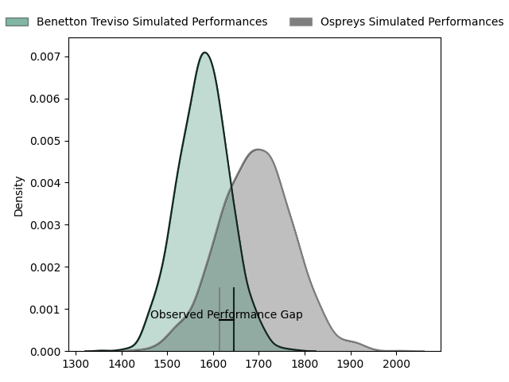
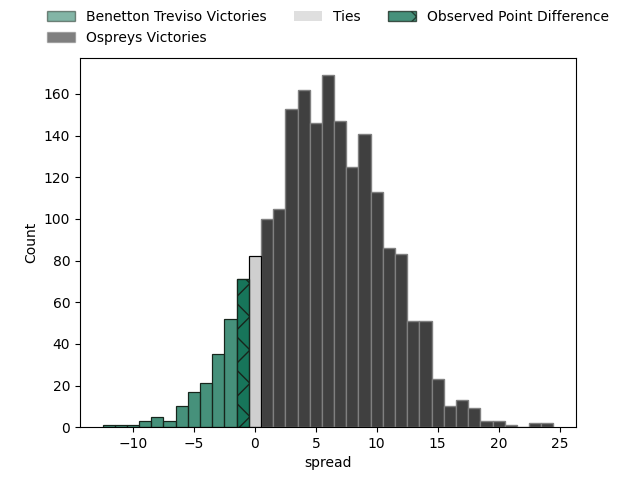
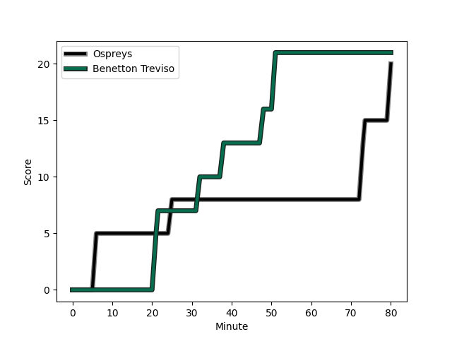
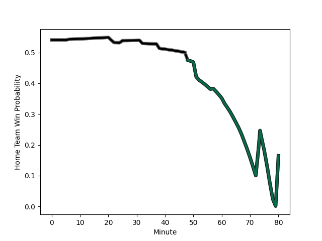

---  
layout: page  
title: Benetton Treviso at Ospreys; 21-20  
date: 2023-03-04 18:15:00 18:00:00 -0500  
categories: match review  
---
# Benetton Treviso at Ospreys; 21-20

# Club Level Predictions

The first set of predictions treats a club as the smallest object, as the club develops its members, organizes a gameplan, and deploys its players as needed for each match. This club model has a prediction of 0.658, which translates to predicting Ospreys to win by 5.8.

Each club has a rating and a rating deviation (simiar to a Glicko system), and expected performances can be generated. This allows for simulated matches and spreads like the ones below.
## Projected Performances

## Projected Spreads

## Projected Results

# Player Level Predictions

Treating teams instead as an entity made up of the currently active players, I have ratings for each player in an altogether different system. These can be combined to form team ratings once teamsheets are announced, weighting starters a bit higher than the reserves. After the match is played, players can be weighted by their minutes on the field, allowing for an accurate measure of the team's composition. With these compiled team ratings, we can make predictions, measure inaccuracy, and update the individual player ratings.
## Prediction with Player Minutes: Ospreys by 12.1

Ospreys by 8.1 on a neutral field
## Scores over Time

## Win Probability over Time

There were 13 large changes in win probability in this match
## Prediction without Player Minutes: Ospreys by 11.9

Ospreys by 7.9 on a neutral pitch

|   Away Minutes | Away Player                                                                                 |   Away elo |   Away Percentile |   Number |   Home Percentile |   Home elo | Home Player                                                                 |   Home Minutes |
|---------------:|:--------------------------------------------------------------------------------------------|-----------:|------------------:|---------:|------------------:|-----------:|:----------------------------------------------------------------------------|---------------:|
|             74 | [Francisco Nahuel Tetaz Chaparro](..//playerfiles//FranciscoNahuelTetazChaparro_cleaned.md) |      91.36 |                36 |        1 |                56 |      96.55 | [Nicky Smith](..//playerfiles//NickySmith_cleaned.md)                       |             68 |
|             80 | [Bautista Bernasconi](..//playerfiles//BautistaBernasconi_cleaned.md)                       |      98.23 |                72 |        2 |                70 |     100.61 | [Sam Parry](..//playerfiles//SamParry_cleaned.md)                           |             80 |
|             64 | [Tiziano Pasquali](..//playerfiles//TizianoPasquali_cleaned.md)                             |      89.27 |                30 |        3 |                63 |      98.44 | [Tom Botha](..//playerfiles//TomBotha_cleaned.md)                           |             61 |
|             80 | [Marco Lazzaroni](..//playerfiles//MarcoLazzaroni_cleaned.md)                               |      96.9  |                56 |        4 |                86 |     110.82 | [Rhys Davies](..//playerfiles//RhysDavies_cleaned.md)                       |             80 |
|             52 | [Carl Wegner](..//playerfiles//CarlWegner_cleaned.md)                                       |      91.38 |               nan |        5 |                74 |     105.76 | [Huw Owen-Sutton](..//playerfiles//HuwOwen-Sutton_cleaned.md)               |             80 |
|             80 | [Giovanni Pettinelli](..//playerfiles//GiovanniPettinelli_cleaned.md)                       |      87.94 |                28 |        6 |               nan |      95    | [Daniel Lydiate](..//playerfiles//DanielLydiate_cleaned.md)                 |             61 |
|             61 | [Alessandrio Izekor](..//playerfiles//AlessandrioIzekor_cleaned.md)                         |      85.5  |                21 |        7 |                70 |     101.62 | [Ethan Roots](..//playerfiles//EthanRoots_cleaned.md)                       |             80 |
|             80 | [Riccardo Favretto](..//playerfiles//RiccardoFavretto_cleaned.md)                           |      88.53 |                28 |        8 |                46 |      94.15 | [Morgan Morris](..//playerfiles//MorganMorris_cleaned.md)                   |             22 |
|             52 | [Dewald Otto Duvenage](..//playerfiles//DewaldOttoDuvenage_cleaned.md)                      |      86.18 |                24 |        9 |                31 |      88.8  | [Reuben Morgan-Williams](..//playerfiles//ReubenMorgan-Williams_cleaned.md) |             80 |
|             80 | [Jacob Umaga](..//playerfiles//JacobUmaga_cleaned.md)                                       |      92.99 |                49 |       10 |                23 |      86.69 | [Stephen Myler](..//playerfiles//StephenMyler_cleaned.md)                   |             61 |
|             80 | [Marcus Watson](..//playerfiles//MarcusWatson_cleaned.md)                                   |      98.76 |                73 |       11 |                31 |      88.99 | [Keelan Giles](..//playerfiles//KeelanGiles_cleaned.md)                     |             80 |
|             80 | [Filippo Drago](..//playerfiles//FilippoDrago_cleaned.md)                                   |      84.64 |                20 |       12 |                83 |     109.26 | [Kieran Williams](..//playerfiles//KieranWilliams_cleaned.md)               |             66 |
|             57 | [Joaquin Riera](..//playerfiles//JoaquinRiera_cleaned.md)                                   |     102.72 |                78 |       13 |                28 |      87.94 | [Owen Watkin](..//playerfiles//OwenWatkin_cleaned.md)                       |             80 |
|             52 | [Ignacio Mendy](..//playerfiles//IgnacioMendy_cleaned.md)                                   |      92.6  |                43 |       14 |                61 |      99.08 | [Luke Morgan](..//playerfiles//LukeMorgan_cleaned.md)                       |             80 |
|             80 | [Rhyno Christo Smith](..//playerfiles//RhynoChristoSmith_cleaned.md)                        |      81.5  |                19 |       15 |               nan |      91.2  | [Iestyn Hopkins](..//playerfiles//IestynHopkins_cleaned.md)                 |             66 |
|             28 | [Giacomo Da Re](..//playerfiles//GiacomoDaRe_cleaned.md)                                    |      95    |               nan |       16 |                36 |      87.94 | [Harri Deaves](..//playerfiles//HarriDeaves_cleaned.md)                     |             58 |
|             28 | [Alessandro Garbisi](..//playerfiles//AlessandroGarbisi_cleaned.md)                         |      98.32 |                69 |       17 |               nan |      92.74 | [Rhys Henry](..//playerfiles//RhysHenry_cleaned.md)                         |             19 |
|             28 | [Henry Stowers](..//playerfiles//HenryStowers_cleaned.md)                                   |      85.78 |                21 |       18 |                43 |      90.34 | [James Fender](..//playerfiles//JamesFender_cleaned.md)                     |             19 |
|             23 | [Marco Zanon](..//playerfiles//MarcoZanon_cleaned.md)                                       |      81.83 |                15 |       19 |               nan |      95.41 | [Jack Walsh](..//playerfiles//JackWalsh_cleaned.md)                         |             19 |
|             19 | [Matteo Meggiato](..//playerfiles//MatteoMeggiato_cleaned.md)                               |      95    |               nan |       20 |                83 |     108.21 | [Michael Collins](..//playerfiles//MichaelCollins_cleaned.md)               |             14 |
|             16 | [Filipo Alongi](..//playerfiles//FilipoAlongi_cleaned.md)                                   |      91.82 |               nan |       21 |               nan |      93.94 | [Matthew Aubrey](..//playerfiles//MatthewAubrey_cleaned.md)                 |             14 |
|              6 | [Cherif Traore](..//playerfiles//CherifTraore_cleaned.md)                                   |     101.25 |                75 |       22 |               nan |      92.93 | [Garyn Phillips](..//playerfiles//GarynPhillips_cleaned.md)                 |             12 |

