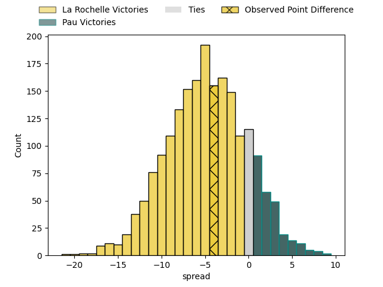
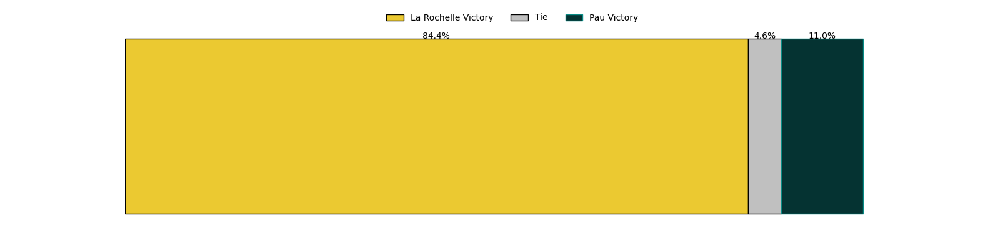
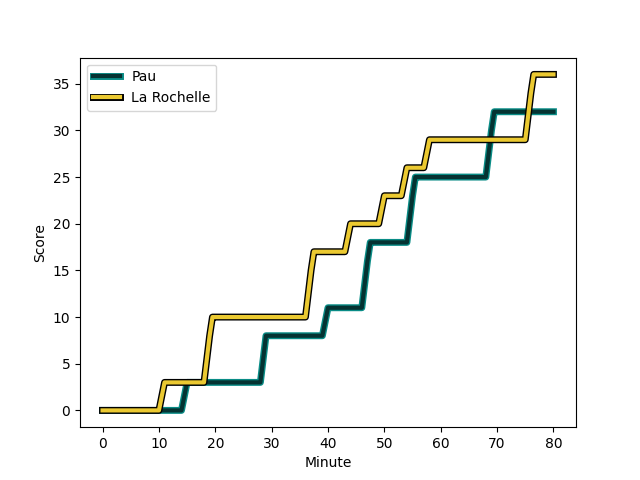
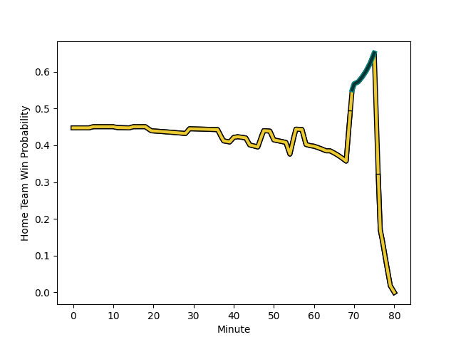

---  
layout: page  
title: La Rochelle at Pau; 36-32  
date: 2023-03-04 17:15:00 18:00:00 -0500  
categories: match review  
---
# La Rochelle at Pau; 36-32

# Club Level Predictions

The first set of predictions treats a club as the smallest object, as the club develops its members, organizes a gameplan, and deploys its players as needed for each match. This club model has a prediction of 0.368, which translates to predicting La Rochelle to win by 4.7.

Each club has a rating and a rating deviation (simiar to a Glicko system), and expected performances can be generated. This allows for simulated matches and spreads like the ones below.
## Projected Performances

## Projected Spreads

## Projected Results

# Player Level Predictions

Treating teams instead as an entity made up of the currently active players, I have ratings for each player in an altogether different system. These can be combined to form team ratings once teamsheets are announced, weighting starters a bit higher than the reserves. After the match is played, players can be weighted by their minutes on the field, allowing for an accurate measure of the team's composition. With these compiled team ratings, we can make predictions, measure inaccuracy, and update the individual player ratings.
## Prediction with Player Minutes: La Rochelle by 5.2

La Rochelle by 9.2 on a neutral field
## Scores over Time

## Win Probability over Time

There were 12 large changes in win probability in this match
## Prediction without Player Minutes: La Rochelle by 5.7

La Rochelle by 9.7 on a neutral pitch

|   Away Minutes | Away Player                                                                       |   Away elo |   Away Percentile |   Number |   Home Percentile |   Home elo | Home Player                                                                    |   Home Minutes |
|---------------:|:----------------------------------------------------------------------------------|-----------:|------------------:|---------:|------------------:|-----------:|:-------------------------------------------------------------------------------|---------------:|
|             58 | [Hayden Thompson-Stringer](..//playerfiles//HaydenThompson-Stringer_cleaned.md)   |      91.48 |                37 |        1 |                51 |      92.95 | [Ignacio David Calles](..//playerfiles//IgnacioDavidCalles_cleaned.md)         |              5 |
|             60 | [Pierre Bourgarit](..//playerfiles//PierreBourgarit_cleaned.md)                   |      93.83 |                53 |        2 |                32 |      89.28 | [Lucas Rey](..//playerfiles//LucasRey_cleaned.md)                              |             60 |
|             41 | [Georges-Henri Colombe](..//playerfiles//Georges-HenriColombe_cleaned.md)         |      92.5  |                41 |        3 |                48 |      94.28 | [Siate Tokolahi](..//playerfiles//SiateTokolahi_cleaned.md)                    |             60 |
|             71 | [Thomas Lavault](..//playerfiles//ThomasLavault_cleaned.md)                       |      96.38 |               nan |        4 |                40 |      92.02 | [Lekima Vuda Tagitagivalu](..//playerfiles//LekimaVudaTagitagivalu_cleaned.md) |             50 |
|             80 | [William Skelton](..//playerfiles//WilliamSkelton_cleaned.md)                     |      97.85 |                59 |        5 |                43 |      90.37 | [Fabrice Metz](..//playerfiles//FabriceMetz_cleaned.md)                        |             80 |
|             58 | [Ultan Dillane](..//playerfiles//UltanDillane_cleaned.md)                         |      91.17 |                38 |        6 |               nan |      92.06 | [Luke Whitelock](..//playerfiles//LukeWhitelock_cleaned.md)                    |             80 |
|             80 | [Levani Botia](..//playerfiles//LevaniBotia_cleaned.md)                           |      92.92 |                45 |        7 |                20 |      84.92 | [Reece Hewat](..//playerfiles//ReeceHewat_cleaned.md)                          |             64 |
|             71 | [Yoan Tanga Mangene](..//playerfiles//YoanTangaMangene_cleaned.md)                |      96.53 |                53 |        8 |                 5 |      72.36 | [Sacha Zegueur](..//playerfiles//SachaZegueur_cleaned.md)                      |             70 |
|             76 | [Thomas Berjon](..//playerfiles//ThomasBerjon_cleaned.md)                         |      94    |                48 |        9 |                22 |      85.48 | [Dan Robson](..//playerfiles//DanRobson_cleaned.md)                            |             60 |
|             80 | [Antoine Hastoy](..//playerfiles//AntoineHastoy_cleaned.md)                       |     111.26 |                86 |       10 |                10 |      77.64 | [Zack Henry](..//playerfiles//ZackHenry_cleaned.md)                            |             80 |
|             80 | [Jules Favre](..//playerfiles//JulesFavre_cleaned.md)                             |      97.5  |                57 |       11 |                56 |      97.24 | [Daniel Ikpefan](..//playerfiles//DanielIkpefan_cleaned.md)                    |             80 |
|             80 | [Jonathan Danty](..//playerfiles//JonathanDanty_cleaned.md)                       |     104.31 |                76 |       12 |                49 |      94.77 | [Nathan Decron](..//playerfiles//NathanDecron_cleaned.md)                      |             50 |
|             80 | [UJ Seuteni](..//playerfiles//UJSeuteni_cleaned.md)                               |      97.42 |                57 |       13 |                82 |     107.38 | [Émilien Gailleton](..//playerfiles//ÉmilienGailleton_cleaned.md)              |             80 |
|             80 | [Dillyn Leyds](..//playerfiles//DillynLeyds_cleaned.md)                           |     108.55 |                84 |       14 |                75 |     105.33 | [Clément Laporte](..//playerfiles//ClémentLaporte_cleaned.md)                  |             80 |
|             76 | [Brice Dulin](..//playerfiles//BriceDulin_cleaned.md)                             |     101.1  |                66 |       15 |                28 |      86.1  | [Jack Maddocks](..//playerfiles//JackMaddocks_cleaned.md)                      |             80 |
|             39 | [Joel Sclavi](..//playerfiles//JoelSclavi_cleaned.md)                             |      85.64 |                20 |       16 |                62 |      99.21 | [Rémi Seneca](..//playerfiles//RémiSeneca_cleaned.md)                          |             75 |
|             22 | [Leo Aouf](..//playerfiles//LeoAouf_cleaned.md)                                   |      96.01 |               nan |       17 |                62 |      98.78 | [Santiago Grondona](..//playerfiles//SantiagoGrondona_cleaned.md)              |             30 |
|             22 | [Paul Boudehent](..//playerfiles//PaulBoudehent_cleaned.md)                       |      91.53 |                43 |       18 |                33 |      89.58 | [Jale Vatubua](..//playerfiles//JaleVatubua_cleaned.md)                        |             30 |
|             20 | [Quentin Lespiaucq-Brettes](..//playerfiles//QuentinLespiaucq-Brettes_cleaned.md) |      97.86 |                61 |       19 |                53 |      91.42 | [Youri Delhommel](..//playerfiles//YouriDelhommel_cleaned.md)                  |             20 |
|              9 | [Kyle Hatherell](..//playerfiles//KyleHatherell_cleaned.md)                       |      96.99 |                53 |       20 |                32 |      90.07 | [Nicolas Corato](..//playerfiles//NicolasCorato_cleaned.md)                    |             20 |
|              9 | [Romain Sazy](..//playerfiles//RomainSazy_cleaned.md)                             |     106.9  |                80 |       21 |                52 |      95.2  | [Thibault Daubagna](..//playerfiles//ThibaultDaubagna_cleaned.md)              |             20 |
|              4 | [Raymond Rhule](..//playerfiles//RaymondRhule_cleaned.md)                         |     107.07 |                82 |       22 |                52 |      95.47 | [Martin Puech](..//playerfiles//MartinPuech_cleaned.md)                        |             16 |
|              4 | [Jules Le Bail](..//playerfiles//JulesLeBail_cleaned.md)                          |      93.9  |               nan |       23 |                49 |      95.08 | [Brent Liufau](..//playerfiles//BrentLiufau_cleaned.md)                        |             10 |

