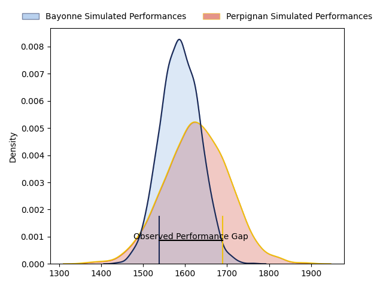
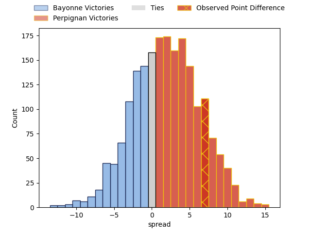
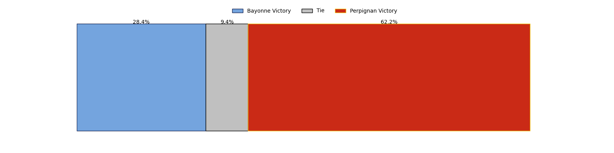
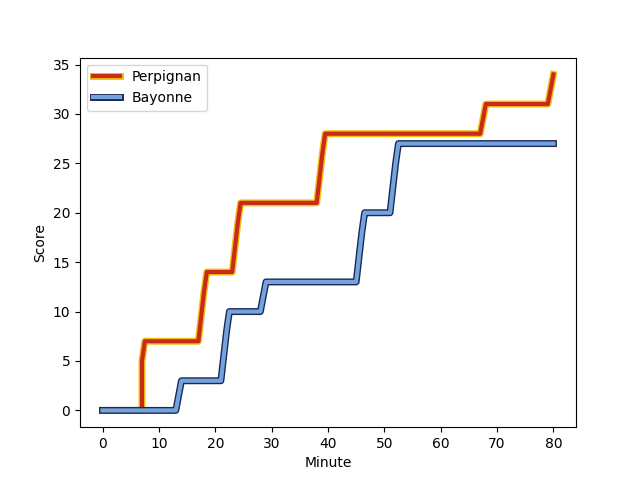
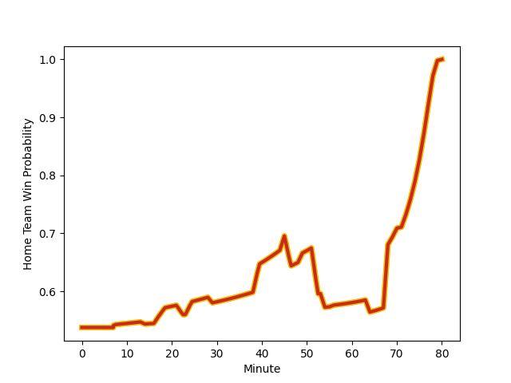

---  
layout: page  
title: Bayonne at Perpignan; 27-34  
date: 2023-03-04 17:15:00 18:00:00 -0500  
categories: match review  
---
# Bayonne at Perpignan; 27-34

# Club Level Predictions

The first set of predictions treats a club as the smallest object, as the club develops its members, organizes a gameplan, and deploys its players as needed for each match. This club model has a prediction of 0.556, which translates to predicting Perpignan to win by 2.0.

Each club has a rating and a rating deviation (simiar to a Glicko system), and expected performances can be generated. This allows for simulated matches and spreads like the ones below.
## Projected Performances

## Projected Spreads

## Projected Results

# Player Level Predictions

Treating teams instead as an entity made up of the currently active players, I have ratings for each player in an altogether different system. These can be combined to form team ratings once teamsheets are announced, weighting starters a bit higher than the reserves. After the match is played, players can be weighted by their minutes on the field, allowing for an accurate measure of the team's composition. With these compiled team ratings, we can make predictions, measure inaccuracy, and update the individual player ratings.
## Prediction with Player Minutes: Perpignan by 5.0

Perpignan by 1.0 on a neutral field
## Scores over Time

## Win Probability over Time

There were 16 large changes in win probability in this match
## Prediction without Player Minutes: Perpignan by 1.0

Bayonne by 3.0 on a neutral pitch

|   Away Minutes | Away Player                                                              |   Away elo |   Away Percentile |   Number |   Home Percentile |   Home elo | Home Player                                                             |   Home Minutes |
|---------------:|:-------------------------------------------------------------------------|-----------:|------------------:|---------:|------------------:|-----------:|:------------------------------------------------------------------------|---------------:|
|             49 | [Swan Cormenier](..//playerfiles//SwanCormenier_cleaned.md)              |     102.93 |                73 |        1 |                23 |      86.95 | [Sacha Lotrian](..//playerfiles//SachaLotrian_cleaned.md)               |             49 |
|             45 | [Facundo Bosch](..//playerfiles//FacundoBosch_cleaned.md)                |     104.01 |                79 |        2 |                74 |     102.09 | [Seilala Lam](..//playerfiles//SeilalaLam_cleaned.md)                   |             54 |
|             56 | [Pascal Cotet](..//playerfiles//PascalCotet_cleaned.md)                  |     101.7  |                74 |        3 |                87 |     109.1  | [Arthur Joly](..//playerfiles//ArthurJoly_cleaned.md)                   |             49 |
|             45 | [Denis Marchois](..//playerfiles//DenisMarchois_cleaned.md)              |     102.6  |                70 |        4 |                84 |     109.51 | [Tristan Labouteley](..//playerfiles//TristanLabouteley_cleaned.md)     |             71 |
|             80 | [Thomas Ceyte](..//playerfiles//ThomasCeyte_cleaned.md)                  |     133.25 |                98 |        5 |                53 |      93.81 | [Posolo Tuilagi](..//playerfiles//PosoloTuilagi_cleaned.md)             |             54 |
|             80 | [Pierre Huguet](..//playerfiles//PierreHuguet_cleaned.md)                |      94.22 |                49 |        6 |                52 |      95.67 | [Brad Shields](..//playerfiles//BradShields_cleaned.md)                 |             80 |
|             80 | [Baptiste Heguy](..//playerfiles//BaptisteHeguy_cleaned.md)              |     109.49 |                84 |        7 |                31 |      88.9  | [Kélian Galletier](..//playerfiles//KélianGalletier_cleaned.md)         |             80 |
|             45 | [Afa Amosa](..//playerfiles//AfaAmosa_cleaned.md)                        |      91.06 |                36 |        8 |                83 |     109.22 | [Genesis Mamea Lemalu](..//playerfiles//GenesisMameaLemalu_cleaned.md)  |             54 |
|             56 | [Maxime Machenaud](..//playerfiles//MaximeMachenaud_cleaned.md)          |      98.46 |                63 |        9 |                67 |     100.16 | [Sadek Deghmache](..//playerfiles//SadekDeghmache_cleaned.md)           |             80 |
|             80 | [Camille Lopez](..//playerfiles//CamilleLopez_cleaned.md)                |     112.9  |                87 |       10 |                71 |     103.15 | [Jake McIntyre](..//playerfiles//JakeMcIntyre_cleaned.md)               |             80 |
|             64 | [Marland Yarde](..//playerfiles//MarlandYarde_cleaned.md)                |      91.03 |                38 |       11 |                86 |     110.11 | [Alistair Crossdale](..//playerfiles//AlistairCrossdale_cleaned.md)     |             80 |
|             17 | [Yann David](..//playerfiles//YannDavid_cleaned.md)                      |     106.31 |                80 |       12 |                41 |      91.9  | [Jeronimo de la Fuente](..//playerfiles//JeronimodelaFuente_cleaned.md) |             71 |
|             80 | [Sireli Maqala](..//playerfiles//SireliMaqala_cleaned.md)                |      90.19 |                35 |       13 |                59 |      98.36 | [Afusipa Taumoepeau](..//playerfiles//AfusipaTaumoepeau_cleaned.md)     |             80 |
|             80 | [Bastien Pourailly](..//playerfiles//BastienPourailly_cleaned.md)        |      75.01 |                 9 |       14 |                29 |      88.4  | [Lucas Dubois](..//playerfiles//LucasDubois_cleaned.md)                 |             80 |
|             80 | [Yohan Orabé](..//playerfiles//YohanOrabé_cleaned.md)                    |      88.75 |                34 |       15 |                83 |     109.63 | [Tristan Tedder](..//playerfiles//TristanTedder_cleaned.md)             |             80 |
|             63 | [Eneriko Buliruarua](..//playerfiles//EnerikoBuliruarua_cleaned.md)      |      92.58 |                37 |       16 |                83 |     105.35 | [Giorgi Tetrashvili](..//playerfiles//GiorgiTetrashvili_cleaned.md)     |             31 |
|             35 | [Torsten van Jaarsveld](..//playerfiles//TorstenvanJaarsveld_cleaned.md) |      93.73 |                50 |       17 |                21 |      86.37 | [Ma'afu Fia](..//playerfiles//Ma'afuFia_cleaned.md)                     |             31 |
|             35 | [Uzair Cassiem](..//playerfiles//UzairCassiem_cleaned.md)                |      99.82 |                64 |       18 |                20 |      84.56 | [Victor Moreaux](..//playerfiles//VictorMoreaux_cleaned.md)             |             26 |
|             35 | [Manuel Leindekar](..//playerfiles//ManuelLeindekar_cleaned.md)          |      75.26 |                 8 |       19 |                91 |     112.64 | [Mike Tadjer](..//playerfiles//MikeTadjer_cleaned.md)                   |             26 |
|             31 | [Pieter Ernst Scholtz](..//playerfiles//PieterErnstScholtz_cleaned.md)   |      77.19 |                 8 |       20 |                10 |      78.28 | [Joaquin Oviedo](..//playerfiles//JoaquinOviedo_cleaned.md)             |             26 |
|             24 | [Quentin Béthune](..//playerfiles//QuentinBéthune_cleaned.md)            |      95    |               nan |       21 |                50 |      94.97 | [Edward Sawailau](..//playerfiles//EdwardSawailau_cleaned.md)           |              9 |
|             24 | [Guillaume Rouet](..//playerfiles//GuillaumeRouet_cleaned.md)            |     100.12 |                67 |       22 |                21 |      84.75 | [Shahn Eru](..//playerfiles//ShahnEru_cleaned.md)                       |              9 |
|             16 | [Thomas Dolhagaray](..//playerfiles//ThomasDolhagaray_cleaned.md)        |     122.6  |                93 |       23 |               nan |     nan    | nan                                                                     |            nan |

