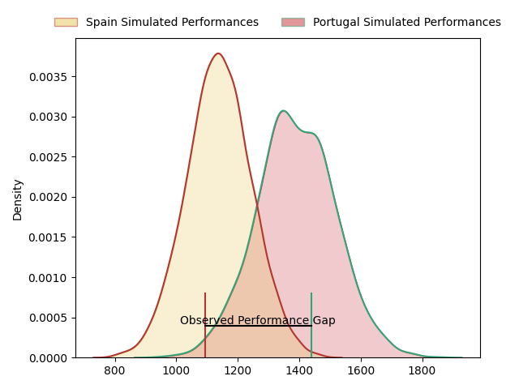
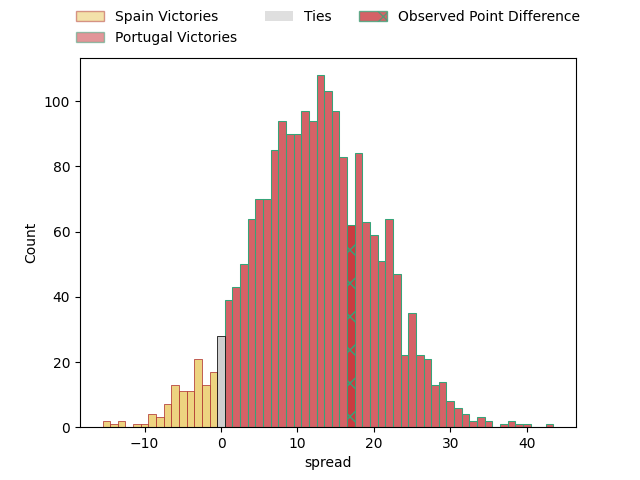
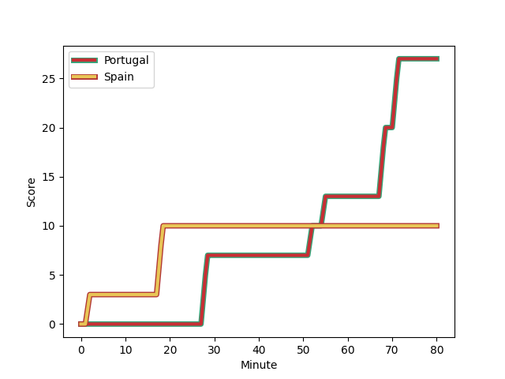
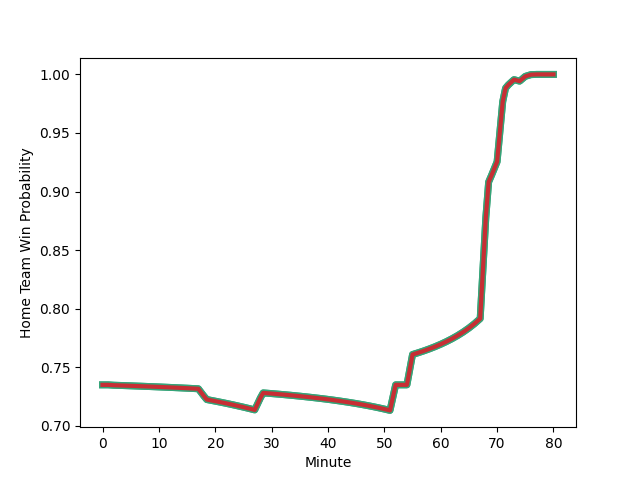

---  
layout: page  
title: Spain at Portugal; 10-27  
date: 2023-03-04 18:00:00 18:00:00 -0500  
categories: match review  
---
# Spain at Portugal; 10-27

# Club Level Predictions

The first set of predictions treats a club as the smallest object, as the club develops its members, organizes a gameplan, and deploys its players as needed for each match. This club model has a prediction of 0.798, which translates to predicting Portugal to win by 12.6.

Each club has a rating and a rating deviation (simiar to a Glicko system), and expected performances can be generated. This allows for simulated matches and spreads like the ones below.
## Projected Performances

## Projected Spreads

## Projected Results

# Player Level Predictions

Treating teams instead as an entity made up of the currently active players, I have ratings for each player in an altogether different system. These can be combined to form team ratings once teamsheets are announced, weighting starters a bit higher than the reserves. After the match is played, players can be weighted by their minutes on the field, allowing for an accurate measure of the team's composition. With these compiled team ratings, we can make predictions, measure inaccuracy, and update the individual player ratings.
## Prediction with Player Minutes: Portugal by 47.6

Portugal by 43.6 on a neutral field
## Scores over Time

## Win Probability over Time

There were 4 large changes in win probability in this match
## Prediction without Player Minutes: Portugal by 46.9

Portugal by 42.9 on a neutral pitch

|   Away Minutes | Away Player                                                                          |   Away elo |   Away Percentile |   Number |   Home Percentile |   Home elo | Home Player                                                                                 |   Home Minutes |
|---------------:|:-------------------------------------------------------------------------------------|-----------:|------------------:|---------:|------------------:|-----------:|:--------------------------------------------------------------------------------------------|---------------:|
|             59 | [Thierry Futeu Youtcheu](..//playerfiles//ThierryFuteuYoutcheu_cleaned.md)           |      72.43 |                 7 |        1 |                98 |     129.25 | [David Da Costa](..//playerfiles//DavidDaCosta_cleaned.md)                                  |             40 |
|             59 | [Thierry Futeu Youtcheu](..//playerfiles//ThierryFuteuYoutcheu_cleaned.md)           |      72.43 |                 5 |        1 |                98 |     129.25 | [David Da Costa](..//playerfiles//DavidDaCosta_cleaned.md)                                  |             40 |
|             80 | [Thierry Futeu Youtcheu](..//playerfiles//ThierryFuteuYoutcheu_cleaned.md)           |      72.43 |                 5 |        1 |                98 |     129.25 | [David Da Costa](..//playerfiles//DavidDaCosta_cleaned.md)                                  |             40 |
|             80 | [Thierry Futeu Youtcheu](..//playerfiles//ThierryFuteuYoutcheu_cleaned.md)           |      72.43 |                 7 |        1 |                98 |     129.25 | [David Da Costa](..//playerfiles//DavidDaCosta_cleaned.md)                                  |             40 |
|             80 | [Thierry Futeu Youtcheu](..//playerfiles//ThierryFuteuYoutcheu_cleaned.md)           |      72.43 |                 7 |        1 |                98 |     129.25 | [David Da Costa](..//playerfiles//DavidDaCosta_cleaned.md)                                  |             80 |
|             80 | [Thierry Futeu Youtcheu](..//playerfiles//ThierryFuteuYoutcheu_cleaned.md)           |      72.43 |                 5 |        1 |                98 |     129.25 | [David Da Costa](..//playerfiles//DavidDaCosta_cleaned.md)                                  |             80 |
|             59 | [Thierry Futeu Youtcheu](..//playerfiles//ThierryFuteuYoutcheu_cleaned.md)           |      72.43 |                 7 |        1 |                98 |     129.25 | [David Da Costa](..//playerfiles//DavidDaCosta_cleaned.md)                                  |             80 |
|             59 | [Thierry Futeu Youtcheu](..//playerfiles//ThierryFuteuYoutcheu_cleaned.md)           |      72.43 |                 5 |        1 |                98 |     129.25 | [David Da Costa](..//playerfiles//DavidDaCosta_cleaned.md)                                  |             80 |
|             80 | [Vicente del Hoyo](..//playerfiles//VicentedelHoyo_cleaned.md)                       |      77.88 |                10 |        2 |                55 |      95.86 | [Lionel Campergue](..//playerfiles//LionelCampergue_cleaned.md)                             |             40 |
|             80 | [Vicente del Hoyo](..//playerfiles//VicentedelHoyo_cleaned.md)                       |      77.88 |                10 |        2 |                55 |      95.86 | [Lionel Campergue](..//playerfiles//LionelCampergue_cleaned.md)                             |             80 |
|             59 | [Vicente del Hoyo](..//playerfiles//VicentedelHoyo_cleaned.md)                       |      77.88 |                10 |        2 |                55 |      95.86 | [Lionel Campergue](..//playerfiles//LionelCampergue_cleaned.md)                             |             40 |
|             59 | [Vicente del Hoyo](..//playerfiles//VicentedelHoyo_cleaned.md)                       |      77.88 |                10 |        2 |                55 |      95.86 | [Lionel Campergue](..//playerfiles//LionelCampergue_cleaned.md)                             |             80 |
|             80 | [Jon Zabala Arrieta](..//playerfiles//JonZabalaArrieta_cleaned.md)                   |      80.46 |                12 |        3 |                 9 |      77.42 | [Anthony Alves](..//playerfiles//AnthonyAlves_cleaned.md)                                   |             80 |
|             65 | [Jon Zabala Arrieta](..//playerfiles//JonZabalaArrieta_cleaned.md)                   |      80.46 |                12 |        3 |                 9 |      77.42 | [Anthony Alves](..//playerfiles//AnthonyAlves_cleaned.md)                                   |             80 |
|             80 | [Jon Zabala Arrieta](..//playerfiles//JonZabalaArrieta_cleaned.md)                   |      80.46 |                12 |        3 |                 9 |      77.42 | [Anthony Alves](..//playerfiles//AnthonyAlves_cleaned.md)                                   |             51 |
|             65 | [Jon Zabala Arrieta](..//playerfiles//JonZabalaArrieta_cleaned.md)                   |      80.46 |                12 |        3 |                 9 |      77.42 | [Anthony Alves](..//playerfiles//AnthonyAlves_cleaned.md)                                   |             51 |
|             80 | [Josh Peters](..//playerfiles//JoshPeters_cleaned.md)                                |      93.66 |                45 |        4 |                85 |     111.42 | [José Duarte Madeira](..//playerfiles//JoséDuarteMadeira_cleaned.md)                        |             80 |
|             80 | [Manuel Mora-Ruiz](..//playerfiles//ManuelMora-Ruiz_cleaned.md)                      |      88.96 |                29 |        5 |                70 |     103.84 | [Jose Maria Rebelo De Andrade](..//playerfiles//JoseMariaRebeloDeAndrade_cleaned.md)        |             80 |
|             80 | [Manuel Mora-Ruiz](..//playerfiles//ManuelMora-Ruiz_cleaned.md)                      |      88.96 |                29 |        5 |                70 |     103.84 | [Jose Maria Rebelo De Andrade](..//playerfiles//JoseMariaRebeloDeAndrade_cleaned.md)        |             74 |
|             55 | [Manuel Mora-Ruiz](..//playerfiles//ManuelMora-Ruiz_cleaned.md)                      |      88.96 |                29 |        5 |                70 |     103.84 | [Jose Maria Rebelo De Andrade](..//playerfiles//JoseMariaRebeloDeAndrade_cleaned.md)        |             74 |
|             55 | [Manuel Mora-Ruiz](..//playerfiles//ManuelMora-Ruiz_cleaned.md)                      |      88.96 |                41 |        5 |                70 |     103.84 | [Jose Maria Rebelo De Andrade](..//playerfiles//JoseMariaRebeloDeAndrade_cleaned.md)        |             74 |
|             80 | [Manuel Mora-Ruiz](..//playerfiles//ManuelMora-Ruiz_cleaned.md)                      |      88.96 |                41 |        5 |                70 |     103.84 | [Jose Maria Rebelo De Andrade](..//playerfiles//JoseMariaRebeloDeAndrade_cleaned.md)        |             80 |
|             80 | [Manuel Mora-Ruiz](..//playerfiles//ManuelMora-Ruiz_cleaned.md)                      |      88.96 |                41 |        5 |                70 |     103.84 | [Jose Maria Rebelo De Andrade](..//playerfiles//JoseMariaRebeloDeAndrade_cleaned.md)        |             74 |
|             55 | [Manuel Mora-Ruiz](..//playerfiles//ManuelMora-Ruiz_cleaned.md)                      |      88.96 |                41 |        5 |                70 |     103.84 | [Jose Maria Rebelo De Andrade](..//playerfiles//JoseMariaRebeloDeAndrade_cleaned.md)        |             80 |
|             55 | [Manuel Mora-Ruiz](..//playerfiles//ManuelMora-Ruiz_cleaned.md)                      |      88.96 |                29 |        5 |                70 |     103.84 | [Jose Maria Rebelo De Andrade](..//playerfiles//JoseMariaRebeloDeAndrade_cleaned.md)        |             80 |
|             80 | [Mario Pichardie](..//playerfiles//MarioPichardie_cleaned.md)                        |      84.72 |                19 |        6 |                80 |     107.33 | [Joao Granate](..//playerfiles//JoaoGranate_cleaned.md)                                     |             80 |
|             80 | [Mario Pichardie](..//playerfiles//MarioPichardie_cleaned.md)                        |      84.72 |                19 |        6 |                80 |     107.33 | [Joao Granate](..//playerfiles//JoaoGranate_cleaned.md)                                     |             62 |
|             73 | [Victor Sanchez Borrego](..//playerfiles//VictorSanchezBorrego_cleaned.md)           |      95    |               nan |        7 |               nan |      98.43 | [Rafael Simoes](..//playerfiles//RafaelSimoes_cleaned.md)                                   |             80 |
|             80 | [Victor Sanchez Borrego](..//playerfiles//VictorSanchezBorrego_cleaned.md)           |      95    |               nan |        7 |               nan |      98.43 | [Rafael Simoes](..//playerfiles//RafaelSimoes_cleaned.md)                                   |             80 |
|             80 | [Facundo Nahuel Dominguez](..//playerfiles//FacundoNahuelDominguez_cleaned.md)       |      85.52 |                30 |        8 |                93 |     120.03 | [Thibault De Freitas](..//playerfiles//ThibaultDeFreitas_cleaned.md)                        |             80 |
|             80 | [Facundo Nahuel Dominguez](..//playerfiles//FacundoNahuelDominguez_cleaned.md)       |      85.52 |                21 |        8 |                93 |     120.03 | [Thibault De Freitas](..//playerfiles//ThibaultDeFreitas_cleaned.md)                        |             80 |
|             68 | [Estanislao Bay](..//playerfiles//EstanislaoBay_cleaned.md)                          |      80.02 |                14 |        9 |                94 |     116.16 | [Samuel Marques](..//playerfiles//SamuelMarques_cleaned.md)                                 |             75 |
|             80 | [Estanislao Bay](..//playerfiles//EstanislaoBay_cleaned.md)                          |      80.02 |                14 |        9 |                94 |     116.16 | [Samuel Marques](..//playerfiles//SamuelMarques_cleaned.md)                                 |             75 |
|             68 | [Estanislao Bay](..//playerfiles//EstanislaoBay_cleaned.md)                          |      80.02 |                14 |        9 |                94 |     116.16 | [Samuel Marques](..//playerfiles//SamuelMarques_cleaned.md)                                 |             80 |
|             80 | [Estanislao Bay](..//playerfiles//EstanislaoBay_cleaned.md)                          |      80.02 |                14 |        9 |                94 |     116.16 | [Samuel Marques](..//playerfiles//SamuelMarques_cleaned.md)                                 |             80 |
|             62 | [Gonzalo Vinuesa](..//playerfiles//GonzaloVinuesa_cleaned.md)                        |      83.89 |                18 |       10 |                88 |     110.76 | [Tomas Appleton](..//playerfiles//TomasAppleton_cleaned.md)                                 |             80 |
|             80 | [Gonzalo Vinuesa](..//playerfiles//GonzaloVinuesa_cleaned.md)                        |      83.89 |                18 |       10 |                88 |     110.76 | [Tomas Appleton](..//playerfiles//TomasAppleton_cleaned.md)                                 |             80 |
|             80 | [Alberto Carmona](..//playerfiles//AlbertoCarmona_cleaned.md)                        |      90.49 |                37 |       11 |                66 |     100.42 | [Raffaele Costa Storti](..//playerfiles//RaffaeleCostaStorti_cleaned.md)                    |             73 |
|             80 | [Alberto Carmona](..//playerfiles//AlbertoCarmona_cleaned.md)                        |      90.49 |                37 |       11 |                66 |     100.42 | [Raffaele Costa Storti](..//playerfiles//RaffaeleCostaStorti_cleaned.md)                    |             80 |
|             80 | [Inaki Martin Mateu](..//playerfiles//InakiMartinMateu_cleaned.md)                   |      85.07 |                21 |       12 |                77 |     104.24 | [Pedro Bettencourt Avila](..//playerfiles//PedroBettencourtAvila_cleaned.md)                |             80 |
|             80 | [Alejandro Alonso](..//playerfiles//AlejandroAlonso_cleaned.md)                      |      91.5  |                39 |       13 |                92 |     116.78 | [Rodrigo Marta](..//playerfiles//RodrigoMarta_cleaned.md)                                   |             80 |
|             80 | [Jordi Jorba](..//playerfiles//JordiJorba_cleaned.md)                                |      86.13 |                27 |       14 |                77 |     104.83 | [Vincent Pinto](..//playerfiles//VincentPinto_cleaned.md)                                   |             80 |
|             65 | [Jordi Jorba](..//playerfiles//JordiJorba_cleaned.md)                                |      86.13 |                27 |       14 |                77 |     104.83 | [Vincent Pinto](..//playerfiles//VincentPinto_cleaned.md)                                   |             80 |
|             80 | [Silvio Federico Castiglioni](..//playerfiles//SilvioFedericoCastiglioni_cleaned.md) |      95.57 |                52 |       15 |                79 |     107.77 | [Nuno Sousa Guedes](..//playerfiles//NunoSousaGuedes_cleaned.md)                            |             80 |
|             80 | [Silvio Federico Castiglioni](..//playerfiles//SilvioFedericoCastiglioni_cleaned.md) |      95.57 |                52 |       15 |                79 |     107.77 | [Nuno Sousa Guedes](..//playerfiles//NunoSousaGuedes_cleaned.md)                            |             37 |
|             21 | [Lucas Santamaria](..//playerfiles//LucasSantamaria_cleaned.md)                      |      92.23 |               nan |       16 |                56 |     109.63 | [Simao Broeiro Bento](..//playerfiles//SimaoBroeiroBento_cleaned.md)                        |             43 |
|             21 | [Lucas Santamaria](..//playerfiles//LucasSantamaria_cleaned.md)                      |      92.23 |               nan |       16 |                75 |     109.63 | [Simao Broeiro Bento](..//playerfiles//SimaoBroeiroBento_cleaned.md)                        |             43 |
|             21 | [Pablo Miejimolle](..//playerfiles//PabloMiejimolle_cleaned.md)                      |      97.3  |                70 |       17 |                 3 |      72.68 | [Duarte Azevedo de Brito Diniz](..//playerfiles//DuarteAzevedodeBritoDiniz_cleaned.md)      |             40 |
|             21 | [Pablo Miejimolle](..//playerfiles//PabloMiejimolle_cleaned.md)                      |      97.3  |                59 |       17 |                 3 |      72.68 | [Duarte Azevedo de Brito Diniz](..//playerfiles//DuarteAzevedodeBritoDiniz_cleaned.md)      |             40 |
|             25 | [Marc Sanchez](..//playerfiles//MarcSanchez_cleaned.md)                              |     102.06 |               nan |       18 |                18 |      85.04 | [Francisco Fernandes](..//playerfiles//FranciscoFernandes_cleaned.md)                       |             40 |
|             18 | [Bautista Guemes](..//playerfiles//BautistaGuemes_cleaned.md)                        |     101.24 |                69 |       19 |                23 |      97.7  | [Diogo Hasse Ferreira](..//playerfiles//DiogoHasseFerreira_cleaned.md)                      |             29 |
|             18 | [Bautista Guemes](..//playerfiles//BautistaGuemes_cleaned.md)                        |     101.24 |                69 |       19 |                52 |      97.7  | [Diogo Hasse Ferreira](..//playerfiles//DiogoHasseFerreira_cleaned.md)                      |             29 |
|             15 | [Bittor Aboitiz](..//playerfiles//BittorAboitiz_cleaned.md)                          |      90.38 |               nan |       20 |                72 |     103.09 | [David Wallis De Carvalho](..//playerfiles//DavidWallisDeCarvalho_cleaned.md)               |             18 |
|             15 | [Pablo Rascon](..//playerfiles//PabloRascon_cleaned.md)                              |      93.61 |                46 |       21 |               nan |      96.54 | [Manuel Cardoso Pinto](..//playerfiles//ManuelCardosoPinto_cleaned.md)                      |              7 |
|             12 | [Ike Irusta](..//playerfiles//IkeIrusta_cleaned.md)                                  |      93.77 |               nan |       22 |                88 |     115    | [Martim Ruggeroni Roquette Bello](..//playerfiles//MartimRuggeroniRoquetteBello_cleaned.md) |              6 |
|              7 | [Michael Hogg](..//playerfiles//MichaelHogg_cleaned.md)                              |      95    |               nan |       23 |                69 |     100.68 | [Pedro Lucas](..//playerfiles//PedroLucas_cleaned.md)                                       |              5 |

