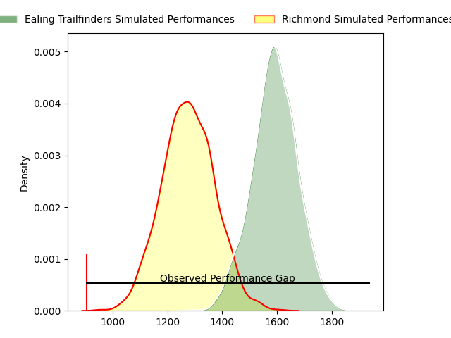
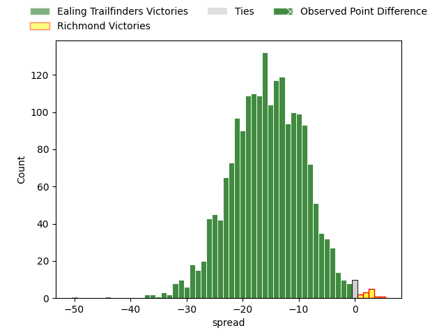
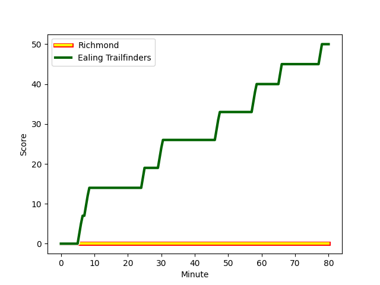
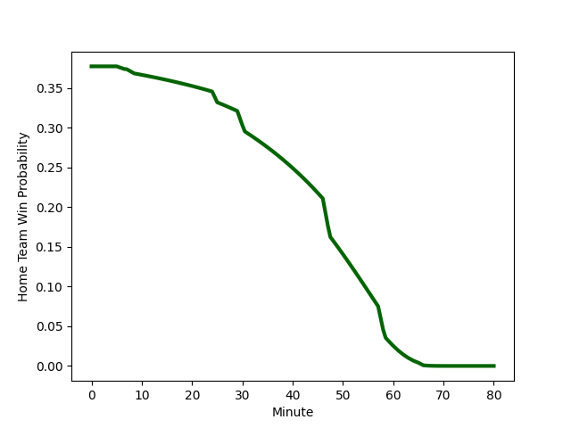

---  
layout: page  
title: Ealing Trailfinders at Richmond; 50-0  
date: 2023-03-04 16:00:00 18:00:00 -0500  
categories: match review  
---
# Ealing Trailfinders at Richmond; 50-0

# Club Level Predictions

The first set of predictions treats a club as the smallest object, as the club develops its members, organizes a gameplan, and deploys its players as needed for each match. This club model has a prediction of 0.148, which translates to predicting Ealing Trailfinders to win by 15.7.

Each club has a rating and a rating deviation (simiar to a Glicko system), and expected performances can be generated. This allows for simulated matches and spreads like the ones below.
## Projected Performances

## Projected Spreads

## Projected Results

# Player Level Predictions

Treating teams instead as an entity made up of the currently active players, I have ratings for each player in an altogether different system. These can be combined to form team ratings once teamsheets are announced, weighting starters a bit higher than the reserves. After the match is played, players can be weighted by their minutes on the field, allowing for an accurate measure of the team's composition. With these compiled team ratings, we can make predictions, measure inaccuracy, and update the individual player ratings.
## Prediction with Player Minutes: Ealing Trailfinders by 17.7

Ealing Trailfinders by 21.7 on a neutral field
## Scores over Time

## Win Probability over Time

There were 2 large changes in win probability in this match
## Prediction without Player Minutes: Ealing Trailfinders by 17.7

Ealing Trailfinders by 21.7 on a neutral pitch

|   Away Minutes | Away Player                                                           |   Away elo |   Away Percentile |   Number |   Home Percentile |   Home elo | Home Player                                                       |   Home Minutes |
|---------------:|:----------------------------------------------------------------------|-----------:|------------------:|---------:|------------------:|-----------:|:------------------------------------------------------------------|---------------:|
|             80 | [Kyle John Whyte](..//playerfiles//KyleJohnWhyte_cleaned.md)          |     124.61 |                97 |        1 |                12 |      81.68 | [Conor Maguire](..//playerfiles//ConorMaguire_cleaned.md)         |             80 |
|             80 | [Alun Walker](..//playerfiles//AlunWalker_cleaned.md)                 |      92.62 |               nan |        2 |                74 |     105.71 | [Alexander Post](..//playerfiles//AlexanderPost_cleaned.md)       |             80 |
|             80 | [George Davis](..//playerfiles//GeorgeDavis_cleaned.md)               |      91.4  |                61 |        3 |                 1 |      56.97 | [Jimmy Litchfield](..//playerfiles//JimmyLitchfield_cleaned.md)   |             80 |
|             80 | [Andrew Davidson](..//playerfiles//AndrewDavidson_cleaned.md)         |      95    |               nan |        4 |               nan |      95    | [Tevita Cavubati](..//playerfiles//TevitaCavubati_cleaned.md)     |             80 |
|             80 | [Simon Linsell](..//playerfiles//SimonLinsell_cleaned.md)             |     111.74 |                86 |        5 |                40 |      92.33 | [Jake Monson](..//playerfiles//JakeMonson_cleaned.md)             |             80 |
|             80 | [Rob Farrar](..//playerfiles//RobFarrar_cleaned.md)                   |      92.58 |                43 |        6 |                54 |      96.45 | [David Massey](..//playerfiles//DavidMassey_cleaned.md)           |             80 |
|             80 | [Ollie Newman](..//playerfiles//OllieNewman_cleaned.md)               |     113.71 |                90 |        7 |                 7 |      76.91 | [Ethan Benson](..//playerfiles//EthanBenson_cleaned.md)           |             80 |
|             80 | [Jack Digby](..//playerfiles//JackDigby_cleaned.md)                   |     100.13 |                65 |        8 |                26 |      87.46 | [Mark Bright](..//playerfiles//MarkBright_cleaned.md)             |             80 |
|             80 | [Craig Hampson](..//playerfiles//CraigHampson_cleaned.md)             |      91.89 |                41 |        9 |                69 |     103.56 | [Jack Stafford](..//playerfiles//JackStafford_cleaned.md)         |             80 |
|             80 | [Craig Willis](..//playerfiles//CraigWillis_cleaned.md)               |      94    |                46 |       10 |                48 |      94.64 | [Bill Johnston](..//playerfiles//BillJohnston_cleaned.md)         |             80 |
|             80 | [Cian Kelleher](..//playerfiles//CianKelleher_cleaned.md)             |      94.46 |                48 |       11 |                 5 |      72.05 | [Jack Caddy](..//playerfiles//JackCaddy_cleaned.md)               |             80 |
|             80 | [Reuben Bird-Tulloch](..//playerfiles//ReubenBird-Tulloch_cleaned.md) |      87.02 |                28 |       12 |                 7 |      73.69 | [Paul Kiernan](..//playerfiles//PaulKiernan_cleaned.md)           |             80 |
|             80 | [Max Bodilly](..//playerfiles//MaxBodilly_cleaned.md)                 |      96.72 |                55 |       13 |               nan |      95    | [Jack Walsh](..//playerfiles//JackWalsh_cleaned.md)               |             80 |
|             80 | [James Cordy-Redden](..//playerfiles//JamesCordy-Redden_cleaned.md)   |     141.65 |                99 |       14 |                21 |      85.19 | [Alexander O'Meara](..//playerfiles//AlexanderO'Meara_cleaned.md) |             80 |
|             80 | [Jonah Holmes](..//playerfiles//JonahHolmes_cleaned.md)               |      94.57 |                48 |       15 |                32 |      88.09 | [Darren Atkins](..//playerfiles//DarrenAtkins_cleaned.md)         |             80 |

