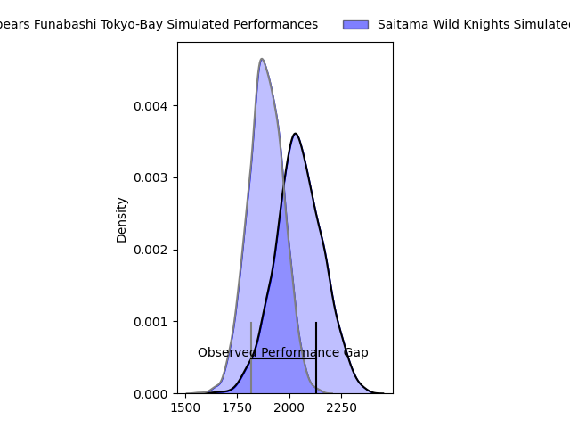
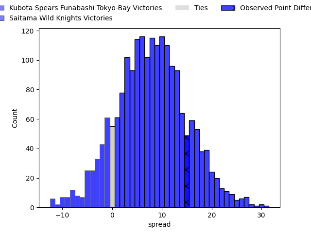
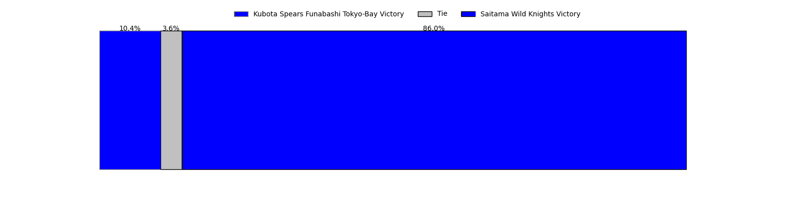
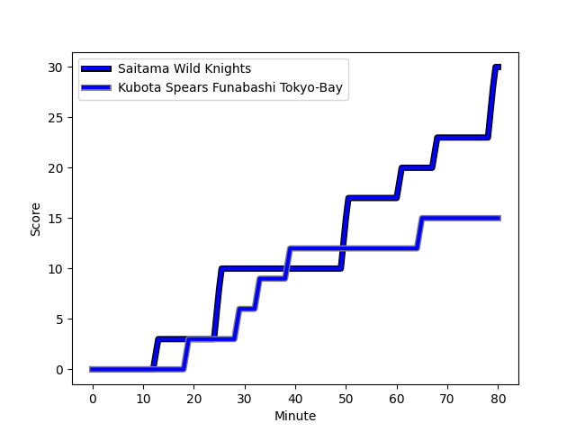
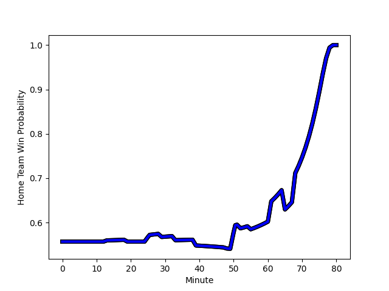

---  
layout: page  
title: Kubota Spears Funabashi Tokyo-Bay at Saitama Wild Knights; 15-30  
date: 2023-03-04 07:00:00 18:00:00 -0500  
categories: match review  
---
# Kubota Spears Funabashi Tokyo-Bay at Saitama Wild Knights; 15-30

# Club Level Predictions

The first set of predictions treats a club as the smallest object, as the club develops its members, organizes a gameplan, and deploys its players as needed for each match. This club model has a prediction of 0.706, which translates to predicting Saitama Wild Knights to win by 7.9.

Each club has a rating and a rating deviation (simiar to a Glicko system), and expected performances can be generated. This allows for simulated matches and spreads like the ones below.
## Projected Performances

## Projected Spreads

## Projected Results

# Player Level Predictions

Treating teams instead as an entity made up of the currently active players, I have ratings for each player in an altogether different system. These can be combined to form team ratings once teamsheets are announced, weighting starters a bit higher than the reserves. After the match is played, players can be weighted by their minutes on the field, allowing for an accurate measure of the team's composition. With these compiled team ratings, we can make predictions, measure inaccuracy, and update the individual player ratings.
## Prediction with Player Minutes: Saitama Wild Knights by 13.9

Saitama Wild Knights by 9.9 on a neutral field
## Scores over Time

## Win Probability over Time

There were 10 large changes in win probability in this match
## Prediction without Player Minutes: Saitama Wild Knights by 9.0

Saitama Wild Knights by 5.0 on a neutral pitch

|   Away Minutes | Away Player                                                                                                              |   Away elo |   Away Percentile |   Number |   Home Percentile |   Home elo | Home Player                                                      |   Home Minutes |
|---------------:|:-------------------------------------------------------------------------------------------------------------------------|-----------:|------------------:|---------:|------------------:|-----------:|:-----------------------------------------------------------------|---------------:|
|             53 | [Kota Kaishi](..//playerfiles//KotaKaishi_cleaned.md)                                                                    |     116.96 |                94 |        1 |                84 |     112.47 | [Keita Inagaki](..//playerfiles//KeitaInagaki_cleaned.md)        |             52 |
|             53 | [Kota Kaishi](..//playerfiles//KotaKaishi_cleaned.md)                                                                    |     116.96 |                94 |        1 |                90 |     112.47 | [Keita Inagaki](..//playerfiles//KeitaInagaki_cleaned.md)        |             52 |
|             75 | [Malcolm Justin Marx](..//playerfiles//MalcolmJustinMarx_cleaned.md)                                                     |     104.79 |                81 |        2 |                96 |     122.09 | [Atsushi Sakate](..//playerfiles//AtsushiSakate_cleaned.md)      |             52 |
|             75 | [Malcolm Justin Marx](..//playerfiles//MalcolmJustinMarx_cleaned.md)                                                     |     104.79 |                81 |        2 |                93 |     122.09 | [Atsushi Sakate](..//playerfiles//AtsushiSakate_cleaned.md)      |             52 |
|             53 | [Shoya Matsunami](..//playerfiles//ShoyaMatsunami_cleaned.md)                                                            |      87.84 |                24 |        3 |                91 |     114    | [Shohei Hirano](..//playerfiles//ShoheiHirano_cleaned.md)        |             52 |
|             48 | [Uwe Helu](..//playerfiles//UweHelu_cleaned.md)                                                                          |     100.77 |                52 |        4 |                90 |     116.5  | [Liam Mitchell](..//playerfiles//LiamMitchell_cleaned.md)        |             52 |
|             80 | [David James Bulbring](..//playerfiles//DavidJamesBulbring_cleaned.md)                                                   |     112.55 |                88 |        5 |                87 |     111.98 | [Lodewyk de Jager](..//playerfiles//LodewykdeJager_cleaned.md)   |             80 |
|             80 | [Finau Tupa](..//playerfiles//FinauTupa_cleaned.md)                                                                      |     143.84 |                99 |        6 |                96 |     126.47 | [Shota Fukui](..//playerfiles//ShotaFukui_cleaned.md)            |             80 |
|             53 | [Takeo Suenaga](..//playerfiles//TakeoSuenaga_cleaned.md)                                                                |     127.55 |                96 |        7 |                80 |     107.62 | [Ben Gunter](..//playerfiles//BenGunter_cleaned.md)              |             80 |
|             80 | [Faulua Makisi](..//playerfiles//FauluaMakisi_cleaned.md)                                                                |     116.02 |                90 |        8 |                87 |     112.47 | [Jack Cornelsen](..//playerfiles//JackCornelsen_cleaned.md)      |             80 |
|             55 | [Shinobu Fujiwara](..//playerfiles//ShinobuFujiwara_cleaned.md)                                                          |     105.51 |                71 |        9 |                99 |     149.4  | [Taiki Koyama](..//playerfiles//TaikiKoyama_cleaned.md)          |             79 |
|             80 | [Bernard Foley](..//playerfiles//BernardFoley_cleaned.md)                                                                |     108.9  |                83 |       10 |                93 |     121    | [Takuya Yamasawa](..//playerfiles//TakuyaYamasawa_cleaned.md)    |             80 |
|             80 | [Haruto Kida](..//playerfiles//HarutoKida_cleaned.md)                                                                    |     126.35 |                96 |       11 |                87 |     112.41 | [Marika Koroibete](..//playerfiles//MarikaKoroibete_cleaned.md)  |             77 |
|             80 | [Harumichi Tatekawa](..//playerfiles//HarumichiTatekawa_cleaned.md)                                                      |     104.8  |                72 |       12 |                84 |     109.13 | [Damian de Allende](..//playerfiles//DamiandeAllende_cleaned.md) |             80 |
|             53 | [Rikus Pretorius](..//playerfiles//RikusPretorius_cleaned.md)                                                            |     105.31 |                78 |       13 |                94 |     119.48 | [Dylan Riley](..//playerfiles//DylanRiley_cleaned.md)            |             80 |
|             80 | [Gerhard Jacobus van den Heever](..//playerfiles//GerhardJacobusvandenHeever_cleaned.md)                                 |     114.97 |                88 |       14 |                82 |     110.52 | [Tomoki Osada](..//playerfiles//TomokiOsada_cleaned.md)          |             80 |
|             68 | [Yuhei Shimada](..//playerfiles//YuheiShimada_cleaned.md)                                                                |      77.69 |                13 |       15 |                97 |     128.19 | [Ryuji Noguchi](..//playerfiles//RyujiNoguchi_cleaned.md)        |             80 |
|             32 | [Yuki Aoki](..//playerfiles//YukiAoki_cleaned.md)                                                                        |     104.49 |                74 |       16 |                85 |     110.93 | [Craig Millar](..//playerfiles//CraigMillar_cleaned.md)          |             28 |
|             27 | [Pieter Hermias Cornelius (Lappies) Labuschagne](..//playerfiles//PieterHermiasCornelius(Lappies)Labuschagne_cleaned.md) |     110.32 |                84 |       17 |                69 |     102.88 | [Shota Horie](..//playerfiles//ShotaHorie_cleaned.md)            |             28 |
|             27 | [Sione Teaupa](..//playerfiles//SioneTeaupa_cleaned.md)                                                                  |     110.45 |                80 |       18 |                88 |     115.98 | [Taiki Fujii](..//playerfiles//TaikiFujii_cleaned.md)            |             28 |
|             27 | [Sione Teaupa](..//playerfiles//SioneTeaupa_cleaned.md)                                                                  |     110.45 |                80 |       18 |                93 |     115.98 | [Taiki Fujii](..//playerfiles//TaikiFujii_cleaned.md)            |             28 |
|             27 | [Opeti Helu](..//playerfiles//OpetiHelu_cleaned.md)                                                                      |     118.97 |                92 |       19 |                79 |     113.3  | [Lachlan Boshier](..//playerfiles//LachlanBoshier_cleaned.md)    |             28 |
|             27 | [Opeti Helu](..//playerfiles//OpetiHelu_cleaned.md)                                                                      |     118.97 |                92 |       19 |                88 |     113.3  | [Lachlan Boshier](..//playerfiles//LachlanBoshier_cleaned.md)    |             28 |
|             27 | [Yota Kaminori](..//playerfiles//YotaKaminori_cleaned.md)                                                                |      98.44 |                62 |       20 |                72 |     104.1  | [Vince Aso](..//playerfiles//VinceAso_cleaned.md)                |              3 |
|             25 | [Kazuhiro Taniguchi](..//playerfiles//KazuhiroTaniguchi_cleaned.md)                                                      |     125.68 |                97 |       21 |               nan |      95    | [Yuta Takagi](..//playerfiles//YutaTakagi_cleaned.md)            |              1 |
|              5 | [Schalk Erasmus](..//playerfiles//SchalkErasmus_cleaned.md)                                                              |     105.77 |                79 |       22 |               nan |     nan    | nan                                                              |            nan |
|             12 | [Halatoa Vailea](..//playerfiles//HalatoaVailea_cleaned.md)                                                              |     103.07 |                73 |       23 |               nan |     nan    | nan                                                              |            nan |

