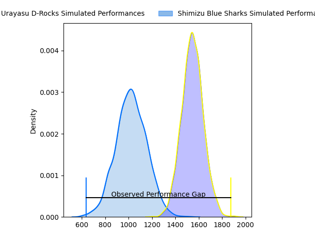
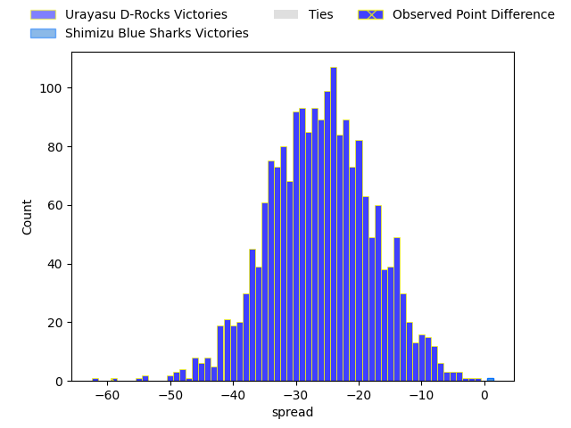
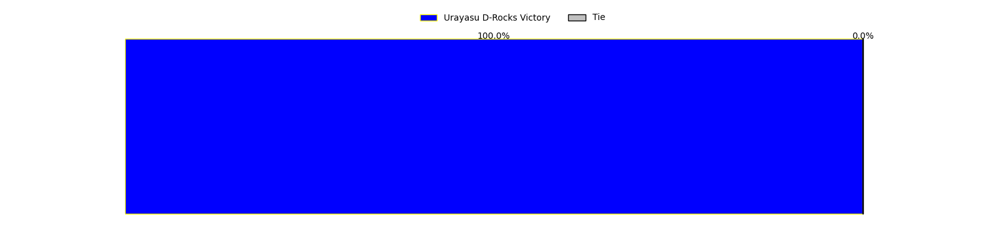
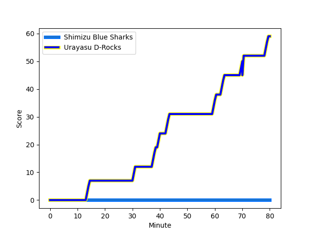
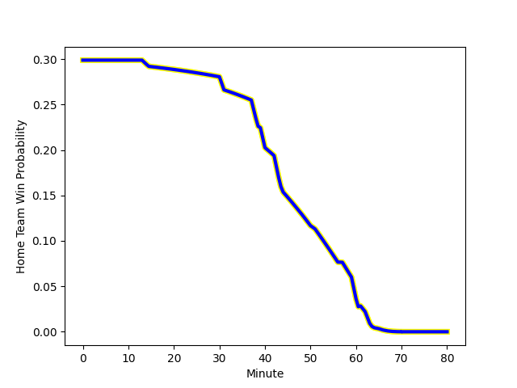

---  
layout: page  
title: Urayasu D-Rocks at Shimizu Blue Sharks; 59-0  
date: 2023-03-04 00:00:00 18:00:00 -0500  
categories: match review  
---
# Urayasu D-Rocks at Shimizu Blue Sharks; 59-0

# Club Level Predictions

The first set of predictions treats a club as the smallest object, as the club develops its members, organizes a gameplan, and deploys its players as needed for each match. This club model has a prediction of 0.052, which translates to predicting Urayasu D-Rocks to win by 26.2.

Each club has a rating and a rating deviation (simiar to a Glicko system), and expected performances can be generated. This allows for simulated matches and spreads like the ones below.
## Projected Performances

## Projected Spreads

## Projected Results

# Player Level Predictions

Treating teams instead as an entity made up of the currently active players, I have ratings for each player in an altogether different system. These can be combined to form team ratings once teamsheets are announced, weighting starters a bit higher than the reserves. After the match is played, players can be weighted by their minutes on the field, allowing for an accurate measure of the team's composition. With these compiled team ratings, we can make predictions, measure inaccuracy, and update the individual player ratings.
## Prediction with Player Minutes: Urayasu D-Rocks by 33.0

Urayasu D-Rocks by 37.0 on a neutral field
## Scores over Time

## Win Probability over Time

## Prediction without Player Minutes: Urayasu D-Rocks by 33.2

Urayasu D-Rocks by 37.2 on a neutral pitch

|   Away Minutes | Away Player                                                                  |   Away elo |   Away Percentile |   Number |   Home Percentile |   Home elo | Home Player                                                                 |   Home Minutes |
|---------------:|:-----------------------------------------------------------------------------|-----------:|------------------:|---------:|------------------:|-----------:|:----------------------------------------------------------------------------|---------------:|
|             57 | [Kazuma Nishikawa](..//playerfiles//KazumaNishikawa_cleaned.md)              |      89.61 |                24 |        1 |                12 |      80.73 | [Daiki Shimura](..//playerfiles//DaikiShimura_cleaned.md)                   |             65 |
|             48 | [Ryo Miura](..//playerfiles//RyoMiura_cleaned.md)                            |     102.3  |                76 |        2 |                28 |      88.16 | [Kaito Tamori](..//playerfiles//KaitoTamori_cleaned.md)                     |             60 |
|             61 | [Sekonaia Pole](..//playerfiles//SekonaiaPole_cleaned.md)                    |      98.69 |               nan |        3 |                 8 |      77.65 | [Ryota Saitou](..//playerfiles//RyotaSaitou_cleaned.md)                     |             65 |
|             80 | [Ryeongji Kim](..//playerfiles//RyeongjiKim_cleaned.md)                      |      91.41 |                38 |        4 |                24 |      86.98 | [Thomas Nowlan](..//playerfiles//ThomasNowlan_cleaned.md)                   |             61 |
|             80 | [Yuta Kojima](..//playerfiles//YutaKojima_cleaned.md)                        |     112.15 |                86 |        5 |                 0 |      44.31 | [Yutaro Shirako](..//playerfiles//YutaroShirako_cleaned.md)                 |             57 |
|             64 | [Lourens Jacobus Erasmus](..//playerfiles//LourensJacobusErasmus_cleaned.md) |     108.23 |                82 |        6 |                42 |      92.41 | [Tetsunori Osaki](..//playerfiles//TetsunoriOsaki_cleaned.md)               |             80 |
|             80 | [Tetta Shigemitsu](..//playerfiles//TettaShigemitsu_cleaned.md)              |     108.98 |                83 |        7 |                57 |      97.5  | [Ginjiro Hase](..//playerfiles//GinjiroHase_cleaned.md)                     |             80 |
|             44 | [Liam Gill](..//playerfiles//LiamGill_cleaned.md)                            |     113.91 |                86 |        8 |                10 |      78.47 | [Murphy Taramai](..//playerfiles//MurphyTaramai_cleaned.md)                 |             80 |
|             51 | [Ren Iinuma](..//playerfiles//RenIinuma_cleaned.md)                          |     114.01 |                93 |        9 |                61 |      98.37 | [Reijiro Usui](..//playerfiles//ReijiroUsui_cleaned.md)                     |             44 |
|             51 | [Otere Black](..//playerfiles//OtereBlack_cleaned.md)                        |     107.6  |                82 |       10 |                15 |      81.72 | [Orbyn Leger](..//playerfiles//OrbynLeger_cleaned.md)                       |             80 |
|             80 | [Kai Ishii](..//playerfiles//KaiIshii_cleaned.md)                            |     117.2  |                93 |       11 |                25 |      87.5  | [Shuhei Sasaki](..//playerfiles//ShuheiSasaki_cleaned.md)                   |             80 |
|             71 | [Tone Tukufuka](..//playerfiles//ToneTukufuka_cleaned.md)                    |     136.51 |                98 |       12 |                30 |      89    | [Siale Piutau](..//playerfiles//SialePiutau_cleaned.md)                     |             44 |
|             80 | [Samisoni Ahokovi Tua](..//playerfiles//SamisoniAhokoviTua_cleaned.md)       |     101.44 |                69 |       13 |                12 |      79.67 | [Michael Va'a Toloke](..//playerfiles//MichaelVa'aToloke_cleaned.md)        |             61 |
|             80 | [Shane Edwards Gates](..//playerfiles//ShaneEdwardsGates_cleaned.md)         |     121.34 |                95 |       14 |                21 |      85.98 | [Ryota Noda](..//playerfiles//RyotaNoda_cleaned.md)                         |             80 |
|             80 | [Larry Steven Sulunga](..//playerfiles//LarryStevenSulunga_cleaned.md)       |     126.56 |                96 |       15 |                11 |      75.85 | [Coenraad George van Wyk](..//playerfiles//CoenraadGeorgevanWyk_cleaned.md) |             80 |
|             36 | [Tyler Warne Paul](..//playerfiles//TylerWarnePaul_cleaned.md)               |     108.37 |                82 |       16 |                12 |      78.28 | [Kayne Hammington](..//playerfiles//KayneHammington_cleaned.md)             |             36 |
|             32 | [Shokei Kin](..//playerfiles//ShokeiKin_cleaned.md)                          |     101.96 |                75 |       17 |                44 |      93.13 | [Soichiro Kuwata](..//playerfiles//SoichiroKuwata_cleaned.md)               |             36 |
|             29 | [Tian Carel Meyer](..//playerfiles//TianCarelMeyer_cleaned.md)               |     103.58 |                75 |       18 |                16 |      83.26 | [Ryo Sato](..//playerfiles//RyoSato_cleaned.md)                             |             23 |
|             29 | [Hayden Cripps](..//playerfiles//HaydenCripps_cleaned.md)                    |     105.42 |                74 |       19 |                65 |      98.64 | [Naomichi Tatekawa](..//playerfiles//NaomichiTatekawa_cleaned.md)           |             20 |
|             23 | [Kabuto Anoku](..//playerfiles//KabutoAnoku_cleaned.md)                      |      88.13 |                25 |       20 |                82 |     108.17 | [Minato Goto](..//playerfiles//MinatoGoto_cleaned.md)                       |             19 |
|             19 | [Syuhei Takeuchi](..//playerfiles//SyuheiTakeuchi_cleaned.md)                |      88.53 |                26 |       21 |                52 |      94.67 | [John Ben Kotze](..//playerfiles//JohnBenKotze_cleaned.md)                  |             19 |
|             16 | [Shingo Nakashima](..//playerfiles//ShingoNakashima_cleaned.md)              |     119.1  |                93 |       22 |                92 |     111.2  | [Kazuki Kanazawa](..//playerfiles//KazukiKanazawa_cleaned.md)               |             15 |
|              9 | [Takuhei Yasuda](..//playerfiles//TakuheiYasuda_cleaned.md)                  |     133.73 |                98 |       23 |                88 |     110.21 | [Fumiyake Mato](..//playerfiles//FumiyakeMato_cleaned.md)                   |             15 |

