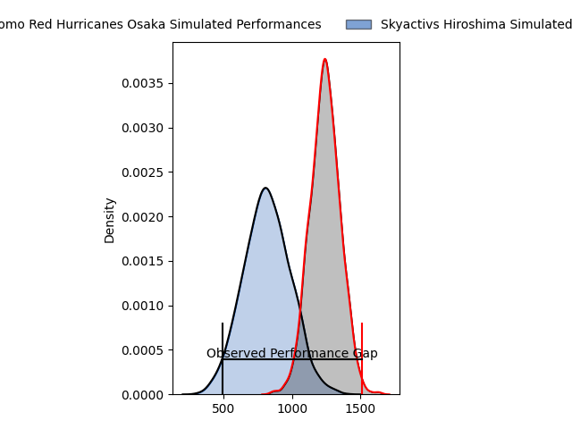
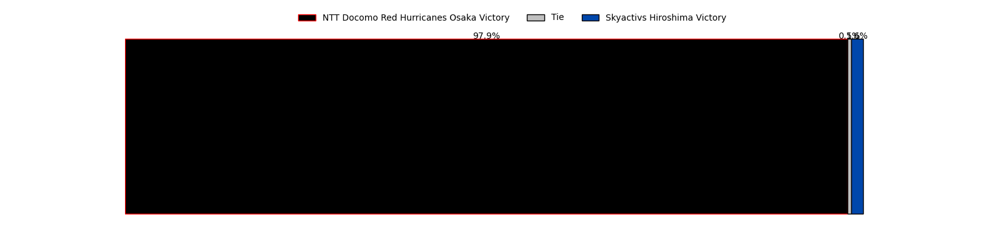
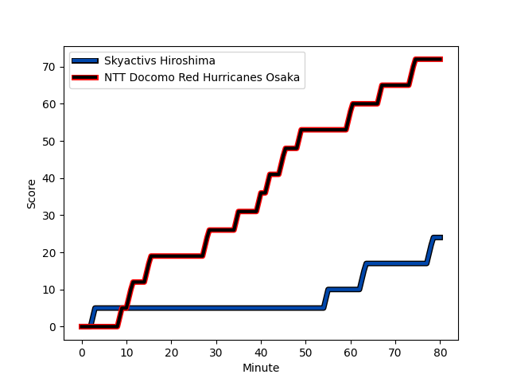
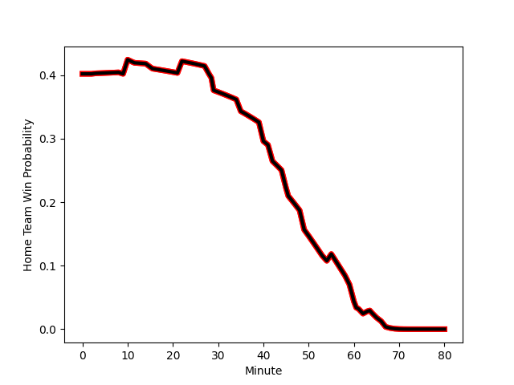

---  
layout: page  
title: NTT Docomo Red Hurricanes Osaka at Skyactivs Hiroshima; 72-24  
date: 2023-03-04 00:00:00 18:00:00 -0500  
categories: match review  
---
# NTT Docomo Red Hurricanes Osaka at Skyactivs Hiroshima; 72-24

# Club Level Predictions

The first set of predictions treats a club as the smallest object, as the club develops its members, organizes a gameplan, and deploys its players as needed for each match. This club model has a prediction of 0.095, which translates to predicting NTT Docomo Red Hurricanes Osaka to win by 20.7.

Each club has a rating and a rating deviation (simiar to a Glicko system), and expected performances can be generated. This allows for simulated matches and spreads like the ones below.
## Projected Performances

## Projected Spreads

## Projected Results

# Player Level Predictions

Treating teams instead as an entity made up of the currently active players, I have ratings for each player in an altogether different system. These can be combined to form team ratings once teamsheets are announced, weighting starters a bit higher than the reserves. After the match is played, players can be weighted by their minutes on the field, allowing for an accurate measure of the team's composition. With these compiled team ratings, we can make predictions, measure inaccuracy, and update the individual player ratings.
## Prediction with Player Minutes: NTT Docomo Red Hurricanes Osaka by 13.2

NTT Docomo Red Hurricanes Osaka by 17.2 on a neutral field
## Scores over Time

## Win Probability over Time

There were 5 large changes in win probability in this match
## Prediction without Player Minutes: NTT Docomo Red Hurricanes Osaka by 16.0

NTT Docomo Red Hurricanes Osaka by 20.0 on a neutral pitch

|   Away Minutes | Away Player                                                             |   Away elo |   Away Percentile |   Number |   Home Percentile |   Home elo | Home Player                                                       |   Home Minutes |
|---------------:|:------------------------------------------------------------------------|-----------:|------------------:|---------:|------------------:|-----------:|:------------------------------------------------------------------|---------------:|
|             40 | [Yosuke Nishiura](..//playerfiles//YosukeNishiura_cleaned.md)           |      84.14 |                16 |        1 |                35 |      90.85 | [Koshiro Shigenobu](..//playerfiles//KoshiroShigenobu_cleaned.md) |             71 |
|             50 | [Hisamitsu Shimada](..//playerfiles//HisamitsuShimada_cleaned.md)       |     101.58 |                73 |        2 |                21 |      86.14 | [Tomohiro Takeda](..//playerfiles//TomohiroTakeda_cleaned.md)     |             71 |
|             40 | [Munekata Sashida](..//playerfiles//MunekataSashida_cleaned.md)         |      91.27 |                36 |        3 |                24 |      87.98 | [Tomoya Otake](..//playerfiles//TomoyaOtake_cleaned.md)           |             59 |
|             61 | [Willie Britz](..//playerfiles//WillieBritz_cleaned.md)                 |     103.49 |                73 |        4 |                30 |      88.62 | [Rame Sato](..//playerfiles//RameSato_cleaned.md)                 |             78 |
|             80 | [Tom Jeffries](..//playerfiles//TomJeffries_cleaned.md)                 |     108.35 |                82 |        5 |                21 |      85.3  | [Lachlan Osborne](..//playerfiles//LachlanOsborne_cleaned.md)     |             80 |
|             61 | [Toru Sugishita](..//playerfiles//ToruSugishita_cleaned.md)             |      81.23 |                12 |        6 |                 6 |      75.43 | [Tomoki Ashida](..//playerfiles//TomokiAshida_cleaned.md)         |             80 |
|             80 | [Taro Sato](..//playerfiles//TaroSato_cleaned.md)                       |     122.57 |                95 |        7 |                83 |     109.11 | [Koki Nakano](..//playerfiles//KokiNakano_cleaned.md)             |             80 |
|             80 | [Colin Bourke](..//playerfiles//ColinBourke_cleaned.md)                 |     103    |                73 |        8 |                19 |      84.29 | [Iori Suzuki](..//playerfiles//IoriSuzuki_cleaned.md)             |             54 |
|             80 | [Ryo Tsuruda](..//playerfiles//RyoTsuruda_cleaned.md)                   |     131.46 |                97 |        9 |                69 |     100.62 | [Jacob Abel](..//playerfiles//JacobAbel_cleaned.md)               |             80 |
|             80 | [Oh Ryong Tee](..//playerfiles//OhRyongTee_cleaned.md)                  |      97.46 |               nan |       10 |                22 |      86.54 | [Kotaro Tatsuno](..//playerfiles//KotaroTatsuno_cleaned.md)       |             80 |
|             66 | [Masaki Kobayashi](..//playerfiles//MasakiKobayashi_cleaned.md)         |     116.68 |                92 |       11 |                 3 |      64.19 | [Shuhei Lee](..//playerfiles//ShuheiLee_cleaned.md)               |             78 |
|             80 | [Mifiposeti Paea](..//playerfiles//MifiposetiPaea_cleaned.md)           |     106.78 |                81 |       12 |                79 |     105.81 | [Sora Ohchi](..//playerfiles//SoraOhchi_cleaned.md)               |             29 |
|             22 | [Benjamin Saunders](..//playerfiles//BenjaminSaunders_cleaned.md)       |     136.46 |                99 |       13 |                79 |     105.6  | [Tevita Tai](..//playerfiles//TevitaTai_cleaned.md)               |             80 |
|             10 | [Kenta Komura](..//playerfiles//KentaKomura_cleaned.md)                 |     103.23 |                68 |       14 |                61 |      99.45 | [Kaito Sasaoka](..//playerfiles//KaitoSasaoka_cleaned.md)         |             80 |
|             80 | [Taichi Yoshizawa](..//playerfiles//TaichiYoshizawa_cleaned.md)         |      72.89 |                 9 |       15 |                 5 |      63.57 | [Ginjiro Sakiguchi](..//playerfiles//GinjiroSakiguchi_cleaned.md) |             71 |
|             70 | [Kanta Yamamoto](..//playerfiles//KantaYamamoto_cleaned.md)             |      50.77 |                 1 |       16 |                 1 |      61.76 | [Dai Goto](..//playerfiles//DaiGoto_cleaned.md)                   |             51 |
|             58 | [Daisuke Iba](..//playerfiles//DaisukeIba_cleaned.md)                   |      89.75 |               nan |       17 |                57 |      97.55 | [Isi Manu](..//playerfiles//IsiManu_cleaned.md)                   |             26 |
|             40 | [Yuichiro Hosono](..//playerfiles//YuichiroHosono_cleaned.md)           |      99.62 |               nan |       18 |                 2 |      66.37 | [Yuta Takami](..//playerfiles//YutaTakami_cleaned.md)             |             21 |
|             40 | [Shosuke Fukasawa](..//playerfiles//ShosukeFukasawa_cleaned.md)         |      92.24 |                28 |       19 |                72 |     102.44 | [Tomonori Koyanagi](..//playerfiles//TomonoriKoyanagi_cleaned.md) |              9 |
|             30 | [Mitsumasa Harayama](..//playerfiles//MitsumasaHarayama_cleaned.md)     |     100.7  |                73 |       20 |                18 |      86.53 | [Ryo Nagata](..//playerfiles//RyoNagata_cleaned.md)               |              9 |
|             19 | [Tsukasa Yasuda](..//playerfiles//TsukasaYasuda_cleaned.md)             |      87.76 |                26 |       21 |                 9 |      76.51 | [Ryoutarou Saito](..//playerfiles//RyoutarouSaito_cleaned.md)     |              9 |
|             19 | [Tatsunari Fujita](..//playerfiles//TatsunariFujita_cleaned.md)         |      71.85 |                 6 |       22 |                74 |     102.68 | [Tsubasa Kono](..//playerfiles//TsubasaKono_cleaned.md)           |              2 |
|             14 | [Toshihiro Yamamouchi](..//playerfiles//ToshihiroYamamouchi_cleaned.md) |     103.16 |                75 |       23 |                56 |      98.41 | [Yutaro Tanaka](..//playerfiles//YutaroTanaka_cleaned.md)         |              2 |

