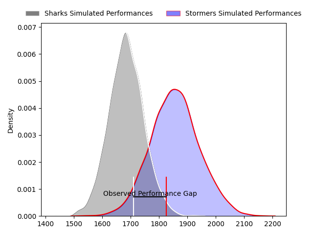
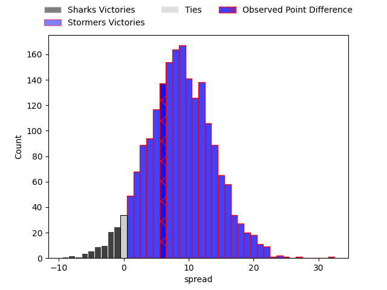
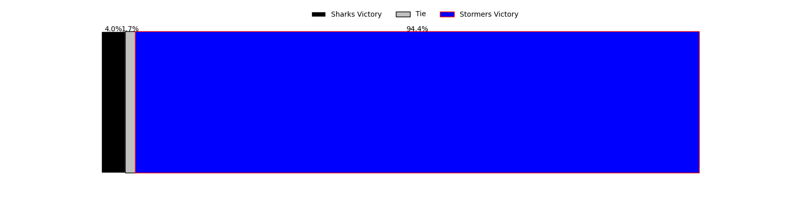
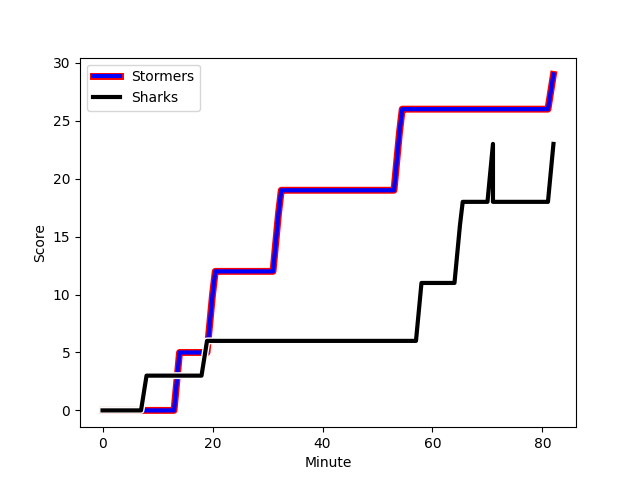
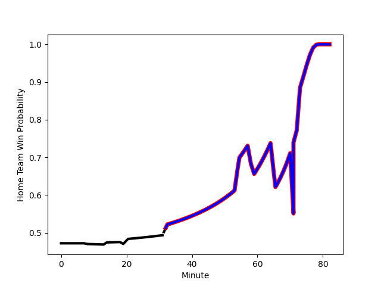

---  
layout: page  
title: Sharks at Stormers; 23-29  
date: 2023-03-04 13:30:00 18:00:00 -0500  
categories: match review  
---
# Sharks at Stormers; 23-29

# Club Level Predictions

The first set of predictions treats a club as the smallest object, as the club develops its members, organizes a gameplan, and deploys its players as needed for each match. This club model has a prediction of 0.725, which translates to predicting Stormers to win by 8.6.

Each club has a rating and a rating deviation (simiar to a Glicko system), and expected performances can be generated. This allows for simulated matches and spreads like the ones below.
## Projected Performances

## Projected Spreads

## Projected Results

# Player Level Predictions

Treating teams instead as an entity made up of the currently active players, I have ratings for each player in an altogether different system. These can be combined to form team ratings once teamsheets are announced, weighting starters a bit higher than the reserves. After the match is played, players can be weighted by their minutes on the field, allowing for an accurate measure of the team's composition. With these compiled team ratings, we can make predictions, measure inaccuracy, and update the individual player ratings.
## Prediction with Player Minutes: Sharks by 0.9

Sharks by 4.9 on a neutral field
## Scores over Time

## Win Probability over Time

There were 13 large changes in win probability in this match
## Prediction without Player Minutes: Sharks by 2.9

Sharks by 6.9 on a neutral pitch

|   Away Minutes | Away Player                                                                             |   Away elo |   Away Percentile |   Number |   Home Percentile |   Home elo | Home Player                                                                            |   Home Minutes |
|---------------:|:----------------------------------------------------------------------------------------|-----------:|------------------:|---------:|------------------:|-----------:|:---------------------------------------------------------------------------------------|---------------:|
|             80 | [Dian Bleuler](..//playerfiles//DianBleuler_cleaned.md)                                 |      89.97 |                29 |        1 |                35 |      92.87 | [Alistair Fernando Vermaak](..//playerfiles//AlistairFernandoVermaak_cleaned.md)       |             52 |
|             80 | [Dian Bleuler](..//playerfiles//DianBleuler_cleaned.md)                                 |      89.97 |                29 |        1 |                35 |      92.87 | [Alistair Fernando Vermaak](..//playerfiles//AlistairFernandoVermaak_cleaned.md)       |             80 |
|             55 | [Dian Bleuler](..//playerfiles//DianBleuler_cleaned.md)                                 |      89.97 |                29 |        1 |                35 |      92.87 | [Alistair Fernando Vermaak](..//playerfiles//AlistairFernandoVermaak_cleaned.md)       |             80 |
|             55 | [Dian Bleuler](..//playerfiles//DianBleuler_cleaned.md)                                 |      89.97 |                29 |        1 |                35 |      92.87 | [Alistair Fernando Vermaak](..//playerfiles//AlistairFernandoVermaak_cleaned.md)       |             52 |
|             53 | [Fezokuhle Mbatha](..//playerfiles//FezokuhleMbatha_cleaned.md)                         |      91.37 |                38 |        2 |                92 |     111.02 | [Joseph Dweba](..//playerfiles//JosephDweba_cleaned.md)                                |             52 |
|             80 | [Fezokuhle Mbatha](..//playerfiles//FezokuhleMbatha_cleaned.md)                         |      91.37 |                38 |        2 |                87 |     111.02 | [Joseph Dweba](..//playerfiles//JosephDweba_cleaned.md)                                |             52 |
|             53 | [Fezokuhle Mbatha](..//playerfiles//FezokuhleMbatha_cleaned.md)                         |      91.37 |                38 |        2 |                87 |     111.02 | [Joseph Dweba](..//playerfiles//JosephDweba_cleaned.md)                                |             52 |
|             80 | [Fezokuhle Mbatha](..//playerfiles//FezokuhleMbatha_cleaned.md)                         |      91.37 |                38 |        2 |                92 |     111.02 | [Joseph Dweba](..//playerfiles//JosephDweba_cleaned.md)                                |             80 |
|             53 | [Fezokuhle Mbatha](..//playerfiles//FezokuhleMbatha_cleaned.md)                         |      91.37 |                38 |        2 |                92 |     111.02 | [Joseph Dweba](..//playerfiles//JosephDweba_cleaned.md)                                |             80 |
|             80 | [Fezokuhle Mbatha](..//playerfiles//FezokuhleMbatha_cleaned.md)                         |      91.37 |                38 |        2 |                87 |     111.02 | [Joseph Dweba](..//playerfiles//JosephDweba_cleaned.md)                                |             80 |
|             53 | [Fezokuhle Mbatha](..//playerfiles//FezokuhleMbatha_cleaned.md)                         |      91.37 |                38 |        2 |                87 |     111.02 | [Joseph Dweba](..//playerfiles//JosephDweba_cleaned.md)                                |             80 |
|             80 | [Fezokuhle Mbatha](..//playerfiles//FezokuhleMbatha_cleaned.md)                         |      91.37 |                38 |        2 |                92 |     111.02 | [Joseph Dweba](..//playerfiles//JosephDweba_cleaned.md)                                |             52 |
|             43 | [Hanro Jacobs](..//playerfiles//HanroJacobs_cleaned.md)                                 |      92.05 |                40 |        3 |                85 |     106.73 | [Johan Neethling Fouche](..//playerfiles//JohanNeethlingFouche_cleaned.md)             |             59 |
|             80 | [Hanro Jacobs](..//playerfiles//HanroJacobs_cleaned.md)                                 |      92.05 |                40 |        3 |                85 |     106.73 | [Johan Neethling Fouche](..//playerfiles//JohanNeethlingFouche_cleaned.md)             |             59 |
|             43 | [Hanro Jacobs](..//playerfiles//HanroJacobs_cleaned.md)                                 |      92.05 |                40 |        3 |                85 |     106.73 | [Johan Neethling Fouche](..//playerfiles//JohanNeethlingFouche_cleaned.md)             |             80 |
|             80 | [Hanro Jacobs](..//playerfiles//HanroJacobs_cleaned.md)                                 |      92.05 |                40 |        3 |                85 |     106.73 | [Johan Neethling Fouche](..//playerfiles//JohanNeethlingFouche_cleaned.md)             |             80 |
|             80 | [Emile van Heerden](..//playerfiles//EmilevanHeerden_cleaned.md)                        |      87.42 |                28 |        4 |               nan |      94.39 | [Ernst van Rhyn](..//playerfiles//ErnstvanRhyn_cleaned.md)                             |             80 |
|             80 | [Douw Gerbrandt Grobler](..//playerfiles//DouwGerbrandtGrobler_cleaned.md)              |     103.63 |                72 |        5 |                89 |     114.08 | [Ruben van Heerden](..//playerfiles//RubenvanHeerden_cleaned.md)                       |             80 |
|             49 | [Douw Gerbrandt Grobler](..//playerfiles//DouwGerbrandtGrobler_cleaned.md)              |     103.63 |                72 |        5 |                89 |     114.08 | [Ruben van Heerden](..//playerfiles//RubenvanHeerden_cleaned.md)                       |             80 |
|             80 | [Hendrik Petrus (Henco) Venter](..//playerfiles//HendrikPetrus(Henco)Venter_cleaned.md) |      92.38 |                43 |        6 |                83 |     108.8  | [Deon Fourie](..//playerfiles//DeonFourie_cleaned.md)                                  |             80 |
|             49 | [Hendrik Petrus (Henco) Venter](..//playerfiles//HendrikPetrus(Henco)Venter_cleaned.md) |      92.38 |                43 |        6 |                83 |     108.8  | [Deon Fourie](..//playerfiles//DeonFourie_cleaned.md)                                  |             80 |
|             80 | [Vincent Tshikaya Tshituka](..//playerfiles//VincentTshikayaTshituka_cleaned.md)        |     101.82 |                69 |        7 |                72 |     104.67 | [Ben-Jason Dixon](..//playerfiles//Ben-JasonDixon_cleaned.md)                          |             80 |
|             80 | [Vincent Tshikaya Tshituka](..//playerfiles//VincentTshikayaTshituka_cleaned.md)        |     101.82 |                69 |        7 |                72 |     104.67 | [Ben-Jason Dixon](..//playerfiles//Ben-JasonDixon_cleaned.md)                          |             59 |
|             55 | [Sikhumbuzo Notshe](..//playerfiles//SikhumbuzoNotshe_cleaned.md)                       |     106.47 |                88 |        8 |                22 |      85.77 | [Marcel Theunissen](..//playerfiles//MarcelTheunissen_cleaned.md)                      |             80 |
|             80 | [Sikhumbuzo Notshe](..//playerfiles//SikhumbuzoNotshe_cleaned.md)                       |     106.47 |                88 |        8 |                22 |      85.77 | [Marcel Theunissen](..//playerfiles//MarcelTheunissen_cleaned.md)                      |             80 |
|             73 | [Grant Williams](..//playerfiles//GrantWilliams_cleaned.md)                             |     106.25 |                82 |        9 |                82 |     108.45 | [Albertus Paul de Wet](..//playerfiles//AlbertusPauldeWet_cleaned.md)                  |             53 |
|             73 | [Grant Williams](..//playerfiles//GrantWilliams_cleaned.md)                             |     106.25 |                82 |        9 |                82 |     108.45 | [Albertus Paul de Wet](..//playerfiles//AlbertusPauldeWet_cleaned.md)                  |             80 |
|             80 | [Grant Williams](..//playerfiles//GrantWilliams_cleaned.md)                             |     106.25 |                82 |        9 |                82 |     108.45 | [Albertus Paul de Wet](..//playerfiles//AlbertusPauldeWet_cleaned.md)                  |             80 |
|             80 | [Grant Williams](..//playerfiles//GrantWilliams_cleaned.md)                             |     106.25 |                82 |        9 |                82 |     108.45 | [Albertus Paul de Wet](..//playerfiles//AlbertusPauldeWet_cleaned.md)                  |             53 |
|             80 | [Curwin Dominique Bosch](..//playerfiles//CurwinDominiqueBosch_cleaned.md)              |     106.49 |                79 |       10 |                77 |     105.72 | [Immanuel Libbok](..//playerfiles//ImmanuelLibbok_cleaned.md)                          |             80 |
|             80 | [Aphelele Onke Okuhle Fassi](..//playerfiles//ApheleleOnkeOkuhleFassi_cleaned.md)       |      89.12 |                36 |       11 |                62 |      99.42 | [Seabelo Senatla](..//playerfiles//SeabeloSenatla_cleaned.md)                          |             80 |
|             43 | [Aphelele Onke Okuhle Fassi](..//playerfiles//ApheleleOnkeOkuhleFassi_cleaned.md)       |      89.12 |                36 |       11 |                62 |      99.42 | [Seabelo Senatla](..//playerfiles//SeabeloSenatla_cleaned.md)                          |             80 |
|             80 | [Rohan Janse van Rensburg](..//playerfiles//RohanJansevanRensburg_cleaned.md)           |      95.49 |                51 |       12 |                76 |     104.69 | [Daniel Michael du Plessis](..//playerfiles//DanielMichaelduPlessis_cleaned.md)        |             80 |
|             80 | [Marnus Potgieter](..//playerfiles//MarnusPotgieter_cleaned.md)                         |      86.79 |                23 |       13 |                57 |      97.76 | [Adriaan Ruhan Nel](..//playerfiles//AdriaanRuhanNel_cleaned.md)                       |             80 |
|             80 | [Werner Kok](..//playerfiles//WernerKok_cleaned.md)                                     |     109.94 |                86 |       14 |                93 |     117.4  | [Angelo Davids](..//playerfiles//AngeloDavids_cleaned.md)                              |             80 |
|             80 | [Werner Kok](..//playerfiles//WernerKok_cleaned.md)                                     |     109.94 |                86 |       14 |                93 |     117.4  | [Angelo Davids](..//playerfiles//AngeloDavids_cleaned.md)                              |             59 |
|             80 | [Boeta Chamberlain](..//playerfiles//BoetaChamberlain_cleaned.md)                       |     110.91 |                85 |       15 |                62 |      99.65 | [Clayton Blommetjies](..//playerfiles//ClaytonBlommetjies_cleaned.md)                  |             80 |
|             39 | [Yaw Osei Penxe](..//playerfiles//YawOseiPenxe_cleaned.md)                              |      85.42 |                31 |       16 |                81 |     104.56 | [Juan Brok Harris](..//playerfiles//JuanBrokHarris_cleaned.md)                         |             30 |
|             39 | [Carlu Johann Sadie](..//playerfiles//CarluJohannSadie_cleaned.md)                      |      89.03 |                28 |       17 |                42 |      92.14 | [JJ Kotze](..//playerfiles//JJKotze_cleaned.md)                                        |             30 |
|             33 | [James Venter](..//playerfiles//JamesVenter_cleaned.md)                                 |      89.62 |                33 |       18 |               nan |      98.23 | [Sazi Sandi](..//playerfiles//SaziSandi_cleaned.md)                                    |             23 |
|             33 | [Jeandre Labuschagne](..//playerfiles//JeandreLabuschagne_cleaned.md)                   |      99.69 |                64 |       19 |                79 |     104.89 | [Herschel Jerome Jantjies](..//playerfiles//HerschelJeromeJantjies_cleaned.md)         |             29 |
|             29 | [Kerron van Vuuren](..//playerfiles//KerronvanVuuren_cleaned.md)                        |      85.97 |                21 |       20 |                32 |      89.29 | [Willem Gerhardus Engelbrecht](..//playerfiles//WillemGerhardusEngelbrecht_cleaned.md) |             23 |
|             29 | [Kerron van Vuuren](..//playerfiles//KerronvanVuuren_cleaned.md)                        |      85.97 |                38 |       20 |                32 |      89.29 | [Willem Gerhardus Engelbrecht](..//playerfiles//WillemGerhardusEngelbrecht_cleaned.md) |             23 |
|             27 | [Ntuthuko Mchunu](..//playerfiles//NtuthukoMchunu_cleaned.md)                           |      79.43 |                10 |       21 |                67 |     100.62 | [Suleiman  Hartzenberg](..//playerfiles//SuleimanHartzenberg_cleaned.md)               |             23 |
|             27 | [Phendulani Buthelezi](..//playerfiles//PhendulaniButhelezi_cleaned.md)                 |      94.24 |                47 |       22 |               nan |     nan    | nan                                                                                    |            nan |
|              9 | [Cameron Robin Wright](..//playerfiles//CameronRobinWright_cleaned.md)                  |      77.74 |                21 |       23 |               nan |     nan    | nan                                                                                    |            nan |
|              9 | [Cameron Robin Wright](..//playerfiles//CameronRobinWright_cleaned.md)                  |      77.74 |                10 |       23 |               nan |     nan    | nan                                                                                    |            nan |

