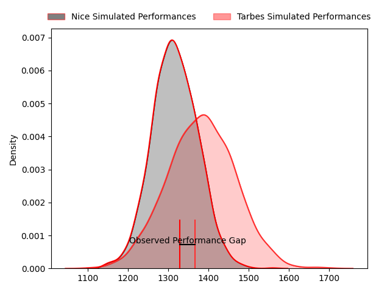
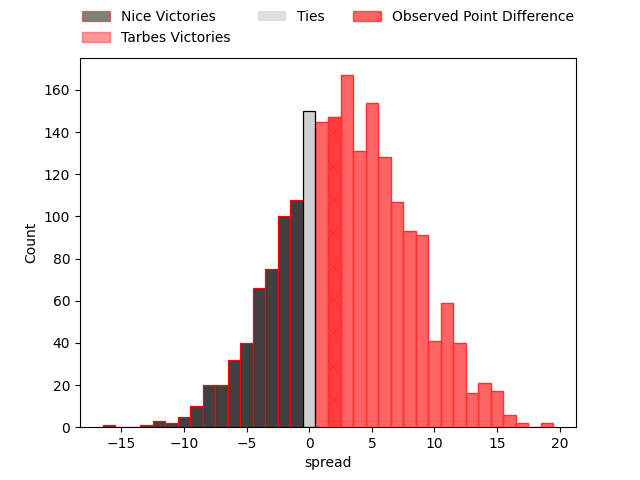
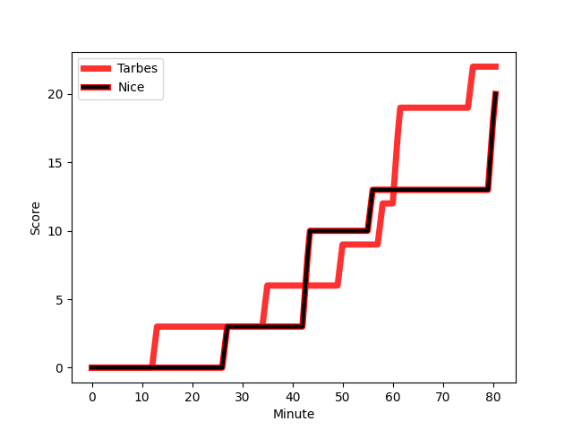

---  
layout: page  
title: Nice at Tarbes; 20-22  
date: 2023-03-04 19:00:00 18:00:00 -0500  
categories: match review  
---
# Nice at Tarbes; 20-22

# Club Level Predictions

The first set of predictions treats a club as the smallest object, as the club develops its members, organizes a gameplan, and deploys its players as needed for each match. This club model has a prediction of 0.589, which translates to predicting Tarbes to win by 3.2.

Each club has a rating and a rating deviation (simiar to a Glicko system), and expected performances can be generated. This allows for simulated matches and spreads like the ones below.
## Projected Performances

## Projected Spreads

## Projected Results

# Player Level Predictions

Treating teams instead as an entity made up of the currently active players, I have ratings for each player in an altogether different system. These can be combined to form team ratings once teamsheets are announced, weighting starters a bit higher than the reserves. After the match is played, players can be weighted by their minutes on the field, allowing for an accurate measure of the team's composition. With these compiled team ratings, we can make predictions, measure inaccuracy, and update the individual player ratings.
## Prediction with Player Minutes: Nice by 7.5

Nice by 11.5 on a neutral field
## Scores over Time

## Win Probability over Time

There were 9 large changes in win probability in this match
## Prediction without Player Minutes: Nice by 10.2

Nice by 14.2 on a neutral pitch

|   Away Minutes | Away Player                                                             |   Away elo |   Away Percentile |   Number |   Home Percentile |   Home elo | Home Player                                                                      |   Home Minutes |
|---------------:|:------------------------------------------------------------------------|-----------:|------------------:|---------:|------------------:|-----------:|:---------------------------------------------------------------------------------|---------------:|
|             80 | [Sunia Vola](..//playerfiles//SuniaVola_cleaned.md)                     |     101.13 |                72 |        1 |                54 |      98.78 | [Antoine Palisse](..//playerfiles//AntoinePalisse_cleaned.md)                    |             47 |
|             47 | [Sunia Vola](..//playerfiles//SuniaVola_cleaned.md)                     |     101.13 |                72 |        1 |                54 |      98.78 | [Antoine Palisse](..//playerfiles//AntoinePalisse_cleaned.md)                    |             47 |
|             80 | [Sunia Vola](..//playerfiles//SuniaVola_cleaned.md)                     |     101.13 |                72 |        1 |                54 |      98.78 | [Antoine Palisse](..//playerfiles//AntoinePalisse_cleaned.md)                    |             80 |
|             47 | [Sunia Vola](..//playerfiles//SuniaVola_cleaned.md)                     |     101.13 |                72 |        1 |                54 |      98.78 | [Antoine Palisse](..//playerfiles//AntoinePalisse_cleaned.md)                    |             80 |
|             80 | [Louis Martin](..//playerfiles//LouisMartin_cleaned.md)                 |     102.63 |                79 |        2 |                95 |     118.07 | [Enzo Mondon](..//playerfiles//EnzoMondon_cleaned.md)                            |             80 |
|             49 | [Louis Martin](..//playerfiles//LouisMartin_cleaned.md)                 |     102.63 |                79 |        2 |                95 |     118.07 | [Enzo Mondon](..//playerfiles//EnzoMondon_cleaned.md)                            |             80 |
|             63 | [Jeronimo Negrotto](..//playerfiles//JeronimoNegrotto_cleaned.md)       |      87.3  |                23 |        3 |                49 |      94.48 | [Aleksi Tchitchiashvili](..//playerfiles//AleksiTchitchiashvili_cleaned.md)      |             52 |
|             63 | [Jeronimo Negrotto](..//playerfiles//JeronimoNegrotto_cleaned.md)       |      87.3  |                23 |        3 |                49 |      94.48 | [Aleksi Tchitchiashvili](..//playerfiles//AleksiTchitchiashvili_cleaned.md)      |             80 |
|             80 | [Jeronimo Negrotto](..//playerfiles//JeronimoNegrotto_cleaned.md)       |      87.3  |                23 |        3 |                49 |      94.48 | [Aleksi Tchitchiashvili](..//playerfiles//AleksiTchitchiashvili_cleaned.md)      |             80 |
|             80 | [Jeronimo Negrotto](..//playerfiles//JeronimoNegrotto_cleaned.md)       |      87.3  |                23 |        3 |                49 |      94.48 | [Aleksi Tchitchiashvili](..//playerfiles//AleksiTchitchiashvili_cleaned.md)      |             52 |
|             74 | [Thibaud Rey](..//playerfiles//ThibaudRey_cleaned.md)                   |      97.39 |                57 |        4 |                 6 |      71.01 | [Paul Sajous](..//playerfiles//PaulSajous_cleaned.md)                            |             80 |
|             80 | [Thibaud Rey](..//playerfiles//ThibaudRey_cleaned.md)                   |      97.39 |                57 |        4 |                 6 |      71.01 | [Paul Sajous](..//playerfiles//PaulSajous_cleaned.md)                            |             48 |
|             74 | [Thibaud Rey](..//playerfiles//ThibaudRey_cleaned.md)                   |      97.39 |                57 |        4 |                 6 |      71.01 | [Paul Sajous](..//playerfiles//PaulSajous_cleaned.md)                            |             48 |
|             80 | [Thibaud Rey](..//playerfiles//ThibaudRey_cleaned.md)                   |      97.39 |                57 |        4 |                 6 |      71.01 | [Paul Sajous](..//playerfiles//PaulSajous_cleaned.md)                            |             80 |
|             80 | [Marvin Woki](..//playerfiles//MarvinWoki_cleaned.md)                   |      96.14 |                54 |        5 |                63 |      99.47 | [Antoine Bousquet](..//playerfiles//AntoineBousquet_cleaned.md)                  |             80 |
|             80 | [Louis Suaud](..//playerfiles//LouisSuaud_cleaned.md)                   |     101.1  |                69 |        6 |                84 |     109.2  | [Mattéo Coustalat](..//playerfiles//MattéoCoustalat_cleaned.md)                  |             56 |
|             73 | [Louis Suaud](..//playerfiles//LouisSuaud_cleaned.md)                   |     101.1  |                69 |        6 |                84 |     109.2  | [Mattéo Coustalat](..//playerfiles//MattéoCoustalat_cleaned.md)                  |             56 |
|             80 | [Louis Suaud](..//playerfiles//LouisSuaud_cleaned.md)                   |     101.1  |                69 |        6 |                84 |     109.2  | [Mattéo Coustalat](..//playerfiles//MattéoCoustalat_cleaned.md)                  |             80 |
|             73 | [Louis Suaud](..//playerfiles//LouisSuaud_cleaned.md)                   |     101.1  |                69 |        6 |                84 |     109.2  | [Mattéo Coustalat](..//playerfiles//MattéoCoustalat_cleaned.md)                  |             80 |
|             63 | [Arthur Vignolles](..//playerfiles//ArthurVignolles_cleaned.md)         |      93.14 |                46 |        7 |                60 |      98.07 | [Loan Real](..//playerfiles//LoanReal_cleaned.md)                                |             80 |
|             80 | [Arthur Vignolles](..//playerfiles//ArthurVignolles_cleaned.md)         |      93.14 |                46 |        7 |                60 |      98.07 | [Loan Real](..//playerfiles//LoanReal_cleaned.md)                                |             80 |
|             80 | [Steffon Armitage](..//playerfiles//SteffonArmitage_cleaned.md)         |     106.47 |                82 |        8 |                77 |     104.28 | [Willem Leon Massyn](..//playerfiles//WillemLeonMassyn_cleaned.md)               |             80 |
|             80 | [Agustin Ormaechea](..//playerfiles//AgustinOrmaechea_cleaned.md)       |      95    |               nan |        9 |                49 |      94.42 | [Thibaut Dulucq](..//playerfiles//ThibautDulucq_cleaned.md)                      |             80 |
|             68 | [Agustin Ormaechea](..//playerfiles//AgustinOrmaechea_cleaned.md)       |      95    |               nan |        9 |                49 |      94.42 | [Thibaut Dulucq](..//playerfiles//ThibautDulucq_cleaned.md)                      |             80 |
|             80 | [Mathis Viard](..//playerfiles//MathisViard_cleaned.md)                 |     103.26 |                73 |       10 |                88 |     114    | [Anthony  Fuertes](..//playerfiles//AnthonyFuertes_cleaned.md)                   |             80 |
|             80 | [David Odiete](..//playerfiles//DavidOdiete_cleaned.md)                 |      99.49 |                62 |       11 |                96 |     124.17 | [Jonathan Duffau](..//playerfiles//JonathanDuffau_cleaned.md)                    |             80 |
|             80 | [Julien Fritz](..//playerfiles//JulienFritz_cleaned.md)                 |     103.83 |                80 |       12 |                29 |      88.32 | [Johan Paulet](..//playerfiles//JohanPaulet_cleaned.md)                          |             80 |
|             80 | [Julien Fritz](..//playerfiles//JulienFritz_cleaned.md)                 |     103.83 |                80 |       12 |                29 |      88.32 | [Johan Paulet](..//playerfiles//JohanPaulet_cleaned.md)                          |             40 |
|             80 | [Luca Cutayar](..//playerfiles//LucaCutayar_cleaned.md)                 |     106.52 |                80 |       13 |                53 |      97.84 | [Pierre Descoubet](..//playerfiles//PierreDescoubet_cleaned.md)                  |             80 |
|             80 | [Luca Cutayar](..//playerfiles//LucaCutayar_cleaned.md)                 |     106.52 |                80 |       13 |                53 |      97.84 | [Pierre Descoubet](..//playerfiles//PierreDescoubet_cleaned.md)                  |             56 |
|             80 | [Clement Egiziano](..//playerfiles//ClementEgiziano_cleaned.md)         |      98.5  |                60 |       14 |                 2 |      60.35 | [Maxime Oltmann](..//playerfiles//MaximeOltmann_cleaned.md)                      |             80 |
|             80 | [Clement Egiziano](..//playerfiles//ClementEgiziano_cleaned.md)         |      98.5  |                60 |       14 |                 2 |      60.35 | [Maxime Oltmann](..//playerfiles//MaximeOltmann_cleaned.md)                      |             56 |
|             58 | [Loic Le Gal](..//playerfiles//LoicLeGal_cleaned.md)                    |      83.18 |                23 |       15 |                63 |      99.68 | [Thibaut Trotta](..//playerfiles//ThibautTrotta_cleaned.md)                      |             80 |
|             80 | [Loic Le Gal](..//playerfiles//LoicLeGal_cleaned.md)                    |      83.18 |                23 |       15 |                63 |      99.68 | [Thibaut Trotta](..//playerfiles//ThibautTrotta_cleaned.md)                      |             80 |
|             33 | [Nicolas Lemaire](..//playerfiles//NicolasLemaire_cleaned.md)           |      90.61 |                34 |       16 |                37 |      91.45 | [Alexandre Combier](..//playerfiles//AlexandreCombier_cleaned.md)                |             33 |
|             31 | [Badri Alkhazashvili](..//playerfiles//BadriAlkhazashvili_cleaned.md)   |     106.26 |                84 |       17 |                34 |      90.6  | [Mariano Ezequiel Filomeno](..//playerfiles//MarianoEzequielFilomeno_cleaned.md) |             28 |
|             17 | [Nicolas Ciancio](..//playerfiles//NicolasCiancio_cleaned.md)           |      94.39 |               nan |       18 |                65 |     105.03 | [Aurelien Ricart](..//playerfiles//AurelienRicart_cleaned.md)                    |             32 |
|              6 | [Jérôme Mondoulet](..//playerfiles//JérômeMondoulet_cleaned.md)         |      89.86 |                32 |       19 |                87 |     114.49 | [Léo Saint-Guilhem](..//playerfiles//LéoSaint-Guilhem_cleaned.md)                |             24 |
|              7 | [Laijiasa Bolenaivalu](..//playerfiles//LaijiasaBolenaivalu_cleaned.md) |     123.52 |                96 |       20 |                72 |     103.8  | [William Pees](..//playerfiles//WilliamPees_cleaned.md)                          |             40 |
|             17 | [Martin Freytes](..//playerfiles//MartinFreytes_cleaned.md)             |      76.11 |                11 |       21 |                33 |      89.69 | [Julien Cantan](..//playerfiles//JulienCantan_cleaned.md)                        |             24 |
|             12 | [Louis Peutin](..//playerfiles//LouisPeutin_cleaned.md)                 |      84.5  |                27 |       22 |                59 |      99.41 | [Vaea Tutuila Vaea](..//playerfiles//VaeaTutuilaVaea_cleaned.md)                 |             24 |
|             22 | [Baptiste Delage](..//playerfiles//BaptisteDelage_cleaned.md)           |      97.69 |                58 |       23 |               nan |     nan    | nan                                                                              |            nan |

