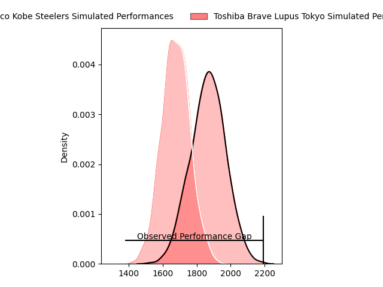
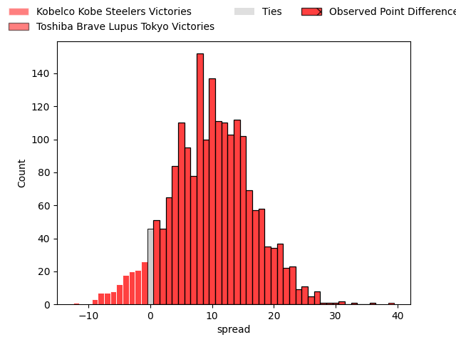
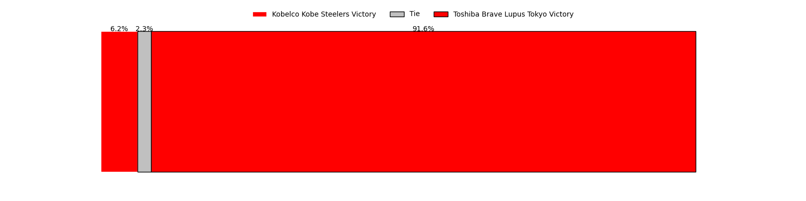
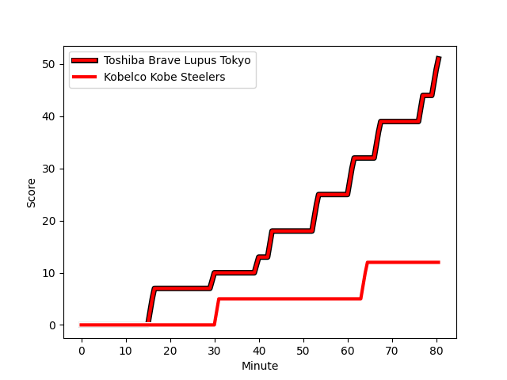
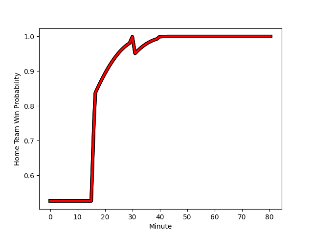

---  
layout: page  
title: Kobelco Kobe Steelers at Toshiba Brave Lupus Tokyo; 12-51  
date: 2023-03-04 04:00:00 18:00:00 -0500  
categories: match review  
---
# Kobelco Kobe Steelers at Toshiba Brave Lupus Tokyo; 12-51

# Club Level Predictions

The first set of predictions treats a club as the smallest object, as the club develops its members, organizes a gameplan, and deploys its players as needed for each match. This club model has a prediction of 0.741, which translates to predicting Toshiba Brave Lupus Tokyo to win by 9.5.

Each club has a rating and a rating deviation (simiar to a Glicko system), and expected performances can be generated. This allows for simulated matches and spreads like the ones below.
## Projected Performances

## Projected Spreads

## Projected Results

# Player Level Predictions

Treating teams instead as an entity made up of the currently active players, I have ratings for each player in an altogether different system. These can be combined to form team ratings once teamsheets are announced, weighting starters a bit higher than the reserves. After the match is played, players can be weighted by their minutes on the field, allowing for an accurate measure of the team's composition. With these compiled team ratings, we can make predictions, measure inaccuracy, and update the individual player ratings.
## Prediction with Player Minutes: Toshiba Brave Lupus Tokyo by 8.5

Toshiba Brave Lupus Tokyo by 4.5 on a neutral field
## Scores over Time

## Win Probability over Time

There were 3 large changes in win probability in this match
## Prediction without Player Minutes: Toshiba Brave Lupus Tokyo by 5.8

Toshiba Brave Lupus Tokyo by 1.8 on a neutral pitch

|   Away Minutes | Away Player                                                                    |   Away elo |   Away Percentile |   Number |   Home Percentile |   Home elo | Home Player                                                         |   Home Minutes |
|---------------:|:-------------------------------------------------------------------------------|-----------:|------------------:|---------:|------------------:|-----------:|:--------------------------------------------------------------------|---------------:|
|             50 | [Isileli Nakajima Vakauta](..//playerfiles//IsileliNakajimaVakauta_cleaned.md) |     110.17 |                88 |        1 |                65 |      99.21 | [Sena Kimura](..//playerfiles//SenaKimura_cleaned.md)               |             53 |
|             50 | [Isileli Nakajima Vakauta](..//playerfiles//IsileliNakajimaVakauta_cleaned.md) |     110.17 |                89 |        1 |                65 |      99.21 | [Sena Kimura](..//playerfiles//SenaKimura_cleaned.md)               |             53 |
|             57 | [Kenta Matsuoka](..//playerfiles//KentaMatsuoka_cleaned.md)                    |      86.2  |                21 |        2 |                 4 |      70.96 | [Daigo Hashimoto](..//playerfiles//DaigoHashimoto_cleaned.md)       |             53 |
|             57 | [Kenta Matsuoka](..//playerfiles//KentaMatsuoka_cleaned.md)                    |      86.2  |                42 |        2 |                 4 |      70.96 | [Daigo Hashimoto](..//playerfiles//DaigoHashimoto_cleaned.md)       |             53 |
|             50 | [Sho Maeda](..//playerfiles//ShoMaeda_cleaned.md)                              |      99.99 |                68 |        3 |                93 |     116.39 | [Yuta Kokaji](..//playerfiles//YutaKokaji_cleaned.md)               |             40 |
|             50 | [Sho Maeda](..//playerfiles//ShoMaeda_cleaned.md)                              |      99.99 |                83 |        3 |                93 |     116.39 | [Yuta Kokaji](..//playerfiles//YutaKokaji_cleaned.md)               |             40 |
|             46 | [Seokhwan Jang](..//playerfiles//SeokhwanJang_cleaned.md)                      |     145.51 |                99 |        4 |                65 |     100.54 | [Warner Dearns](..//playerfiles//WarnerDearns_cleaned.md)           |             80 |
|             80 | [John Dave Schickerling](..//playerfiles//JohnDaveSchickerling_cleaned.md)     |      77.62 |                11 |        5 |                72 |     103.23 | [Jacob Pierce](..//playerfiles//JacobPierce_cleaned.md)             |             58 |
|             71 | [Amanaki Saumaki](..//playerfiles//AmanakiSaumaki_cleaned.md)                  |      96.1  |                54 |        6 |                69 |     101.16 | [Yoshitaka Tokunaga](..//playerfiles//YoshitakaTokunaga_cleaned.md) |             80 |
|             80 | [Takara Imamura](..//playerfiles//TakaraImamura_cleaned.md)                    |      94.91 |                50 |        7 |                67 |     100.41 | [Matt Todd](..//playerfiles//MattTodd_cleaned.md)                   |             69 |
|             80 | [Tiennan Costley](..//playerfiles//TiennanCostley_cleaned.md)                  |      95    |               nan |        8 |                61 |      98.88 | [Michael Leitch](..//playerfiles//MichaelLeitch_cleaned.md)         |             80 |
|             65 | [Atsushi Hiwasa](..//playerfiles//AtsushiHiwasa_cleaned.md)                    |      76.55 |                10 |        9 |                47 |      93.24 | [Takahiro Ogawa](..//playerfiles//TakahiroOgawa_cleaned.md)         |             67 |
|             65 | [Atsushi Hiwasa](..//playerfiles//AtsushiHiwasa_cleaned.md)                    |      76.55 |                14 |        9 |                47 |      93.24 | [Takahiro Ogawa](..//playerfiles//TakahiroOgawa_cleaned.md)         |             67 |
|             80 | [Taihei Kusaka](..//playerfiles//TaiheiKusaka_cleaned.md)                      |      95    |               nan |       10 |                72 |     103.12 | [Tom Taylor](..//playerfiles//TomTaylor_cleaned.md)                 |             72 |
|             80 | [Rakuhei Yamashita](..//playerfiles//RakuheiYamashita_cleaned.md)              |     144.08 |                99 |       11 |                86 |     109.82 | [Masaki Hamada](..//playerfiles//MasakiHamada_cleaned.md)           |             80 |
|             55 | [Richard Buckman](..//playerfiles//RichardBuckman_cleaned.md)                  |      92.54 |                42 |       12 |               nan |      95.9  | [Taichi Mano](..//playerfiles//TaichiMano_cleaned.md)               |             80 |
|             55 | [Richard Buckman](..//playerfiles//RichardBuckman_cleaned.md)                  |      92.54 |                59 |       12 |               nan |      95.9  | [Taichi Mano](..//playerfiles//TaichiMano_cleaned.md)               |             80 |
|             80 | [Junta Hamano](..//playerfiles//JuntaHamano_cleaned.md)                        |      91.41 |                39 |       13 |                49 |      94.58 | [Seta Tamanivalu](..//playerfiles//SetaTamanivalu_cleaned.md)       |             58 |
|             50 | [Shinsuke Iseki](..//playerfiles//ShinsukeIseki_cleaned.md)                    |     113.76 |                90 |       14 |                78 |     106.31 | [Shohei Toyoshima](..//playerfiles//ShoheiToyoshima_cleaned.md)     |             80 |
|             80 | [Ryohei Yamanaka](..//playerfiles//RyoheiYamanaka_cleaned.md)                  |      77.69 |                12 |       15 |                73 |     104.07 | [Takuro Matsunaga](..//playerfiles//TakuroMatsunaga_cleaned.md)     |             80 |
|             30 | [Shigure Takao](..//playerfiles//ShigureTakao_cleaned.md)                      |      95.68 |                52 |       16 |               nan |     100.02 | [Latu Taufa](..//playerfiles//LatuTaufa_cleaned.md)                 |             40 |
|             34 | [Naohiro Kotaki](..//playerfiles//NaohiroKotaki_cleaned.md)                    |      87.38 |                26 |       17 |                59 |      97.24 | [Masataka Mikami](..//playerfiles//MasatakaMikami_cleaned.md)       |             27 |
|             30 | [Ataata Moeakiola](..//playerfiles//AtaataMoeakiola_cleaned.md)                |      82.68 |                16 |       18 |                54 |      95.2  | [Mamoru Harada](..//playerfiles//MamoruHarada_cleaned.md)           |             27 |
|             30 | [Jiwon Koo](..//playerfiles//JiwonKoo_cleaned.md)                              |      92.6  |               nan |       19 |                73 |     103.86 | [Shin Ito](..//playerfiles//ShinIto_cleaned.md)                     |             22 |
|             25 | [Michael Little](..//playerfiles//MichaelLittle_cleaned.md)                    |      82.31 |                19 |       20 |                73 |     103.05 | [Burger Odendaal](..//playerfiles//BurgerOdendaal_cleaned.md)       |             22 |
|             23 | [Takuya Kitade](..//playerfiles//TakuyaKitade_cleaned.md)                      |      94.83 |                59 |       21 |                57 |     101.14 | [Yuhei Sugiyama](..//playerfiles//YuheiSugiyama_cleaned.md)         |             13 |
|              9 | [Ryo Inoue](..//playerfiles//RyoInoue_cleaned.md)                              |      98.91 |                61 |       22 |               nan |     103.93 | [Takeshi Sasaki](..//playerfiles//TakeshiSasaki_cleaned.md)         |             11 |
|             15 | [Kenta Tokuda](..//playerfiles//KentaTokuda_cleaned.md)                        |      97.51 |                59 |       23 |                66 |      98.45 | [Futoshi Mori](..//playerfiles//FutoshiMori_cleaned.md)             |              8 |

