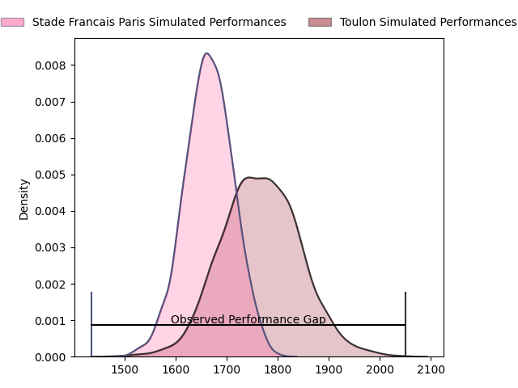
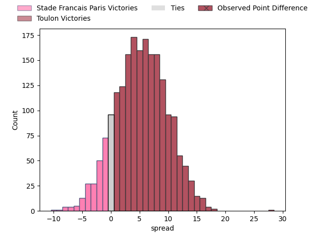
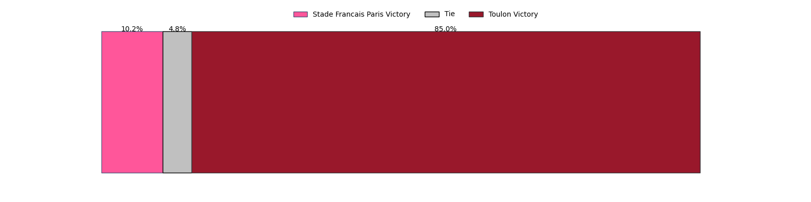
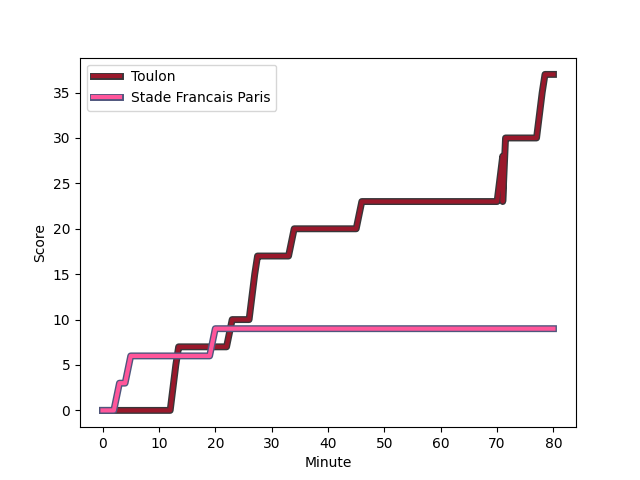
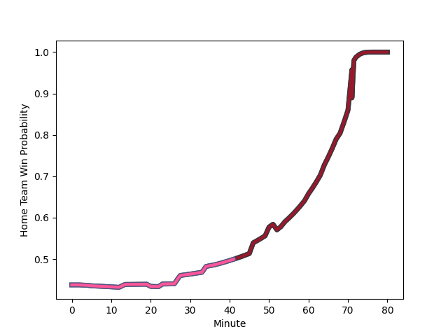

---  
layout: page  
title: Stade Francais Paris at Toulon; 9-37  
date: 2023-03-04 21:00:00 18:00:00 -0500  
categories: match review  
---
# Stade Francais Paris at Toulon; 9-37

# Club Level Predictions

The first set of predictions treats a club as the smallest object, as the club develops its members, organizes a gameplan, and deploys its players as needed for each match. This club model has a prediction of 0.641, which translates to predicting Toulon to win by 5.1.

Each club has a rating and a rating deviation (simiar to a Glicko system), and expected performances can be generated. This allows for simulated matches and spreads like the ones below.
## Projected Performances

## Projected Spreads

## Projected Results

# Player Level Predictions

Treating teams instead as an entity made up of the currently active players, I have ratings for each player in an altogether different system. These can be combined to form team ratings once teamsheets are announced, weighting starters a bit higher than the reserves. After the match is played, players can be weighted by their minutes on the field, allowing for an accurate measure of the team's composition. With these compiled team ratings, we can make predictions, measure inaccuracy, and update the individual player ratings.
## Prediction with Player Minutes: Stade Francais Paris by 5.8

Stade Francais Paris by 9.8 on a neutral field
## Scores over Time

## Win Probability over Time

There were 6 large changes in win probability in this match
## Prediction without Player Minutes: Stade Francais Paris by 2.2

Stade Francais Paris by 6.2 on a neutral pitch

|   Away Minutes | Away Player                                                                |   Away elo |   Away Percentile |   Number |   Home Percentile |   Home elo | Home Player                                                           |   Home Minutes |
|---------------:|:---------------------------------------------------------------------------|-----------:|------------------:|---------:|------------------:|-----------:|:----------------------------------------------------------------------|---------------:|
|             80 | [Clément Castets](..//playerfiles//ClémentCastets_cleaned.md)              |     105.82 |                82 |        1 |                78 |     103.41 | [Dany Priso](..//playerfiles//DanyPriso_cleaned.md)                   |             52 |
|             64 | [Laurent Panis](..//playerfiles//LaurentPanis_cleaned.md)                  |      97.16 |                59 |        2 |                67 |      99.65 | [Teddy Baubigny](..//playerfiles//TeddyBaubigny_cleaned.md)           |             52 |
|             36 | [Paul Alo-Emile](..//playerfiles//PaulAlo-Emile_cleaned.md)                |      91.52 |                27 |        3 |                76 |     102.36 | [Emerick Setiano](..//playerfiles//EmerickSetiano_cleaned.md)         |             52 |
|             80 | [Paul Gabrillagues](..//playerfiles//PaulGabrillagues_cleaned.md)          |     100.8  |                66 |        4 |                23 |      85.35 | [Matthias Halagahu](..//playerfiles//MatthiasHalagahu_cleaned.md)     |             54 |
|             60 | [Sitakeli Timani](..//playerfiles//SitakeliTimani_cleaned.md)              |      85.16 |                22 |        5 |                70 |     102.37 | [Brian Alainu'uese](..//playerfiles//BrianAlainu'uese_cleaned.md)     |             68 |
|             80 | [Marcos Kremer](..//playerfiles//MarcosKremer_cleaned.md)                  |     100.76 |                68 |        6 |                68 |     101.08 | [Cornell du Preez](..//playerfiles//CornellduPreez_cleaned.md)        |             80 |
|             52 | [Romain Briatte](..//playerfiles//RomainBriatte_cleaned.md)                |     105.79 |                78 |        7 |                70 |     101.57 | [Swan Rebbadj](..//playerfiles//SwanRebbadj_cleaned.md)               |             80 |
|             80 | [Sekou Macalou](..//playerfiles//SekouMacalou_cleaned.md)                  |     117.61 |                92 |        8 |                42 |      93.28 | [Facundo Isa](..//playerfiles//FacundoIsa_cleaned.md)                 |             68 |
|             50 | [Morgan Parra](..//playerfiles//MorganParra_cleaned.md)                    |     107.32 |                83 |        9 |                71 |     101.34 | [Baptiste Serin](..//playerfiles//BaptisteSerin_cleaned.md)           |             68 |
|             80 | [Joris Segonds](..//playerfiles//JorisSegonds_cleaned.md)                  |      99.68 |                62 |       10 |                34 |      90.01 | [Ihaia West](..//playerfiles//IhaiaWest_cleaned.md)                   |             80 |
|             80 | [Lester Etien](..//playerfiles//LesterEtien_cleaned.md)                    |     111.15 |                86 |       11 |                61 |      99.19 | [Jiuta Wainiqolo](..//playerfiles//JiutaWainiqolo_cleaned.md)         |             80 |
|             72 | [Julien Delbouis](..//playerfiles//JulienDelbouis_cleaned.md)              |     121.32 |                95 |       12 |                33 |      89.88 | [Duncan Paia'aua](..//playerfiles//DuncanPaia'aua_cleaned.md)         |             64 |
|             80 | [Jeremy Charles Ward](..//playerfiles//JeremyCharlesWard_cleaned.md)       |     105.91 |                80 |       13 |                24 |      86.2  | [Waisea Nayacavelu](..//playerfiles//WaiseaNayacavelu_cleaned.md)     |             80 |
|             80 | [Peniasi Dakuwaqa](..//playerfiles//PeniasiDakuwaqa_cleaned.md)            |      96.16 |               nan |       14 |                32 |      89.06 | [Cheslin Kolbe](..//playerfiles//CheslinKolbe_cleaned.md)             |             80 |
|             52 | [Kylan Hamdaoui](..//playerfiles//KylanHamdaoui_cleaned.md)                |      91.01 |                41 |       15 |                53 |      96.11 | [Thomas Salles](..//playerfiles//ThomasSalles_cleaned.md)             |             80 |
|             28 | [Léo Barré](..//playerfiles//LéoBarré_cleaned.md)                          |     109.62 |                83 |       16 |                43 |      93.28 | [Bruce Devaux](..//playerfiles//BruceDevaux_cleaned.md)               |             28 |
|             44 | [Vincent Philip Koch](..//playerfiles//VincentPhilipKoch_cleaned.md)       |      97.04 |                57 |       17 |               nan |      90.52 | [Christopher Tolofua](..//playerfiles//ChristopherTolofua_cleaned.md) |             28 |
|             30 | [James Hall](..//playerfiles//JamesHall_cleaned.md)                        |      83.72 |                19 |       18 |                56 |     100.84 | [Kieran Brookes](..//playerfiles//KieranBrookes_cleaned.md)           |             28 |
|             28 | [Giovanni Habel Kuffner](..//playerfiles//GiovanniHabelKuffner_cleaned.md) |     105.73 |                79 |       19 |                51 |      93.91 | [Adrien Warion](..//playerfiles//AdrienWarion_cleaned.md)             |             26 |
|             16 | [Lucas Peyresblanques](..//playerfiles//LucasPeyresblanques_cleaned.md)    |      95.47 |                47 |       20 |                65 |     100.5  | [Jérémy Sinzelle](..//playerfiles//JérémySinzelle_cleaned.md)         |             16 |
|             20 | [Mathieu Hirigoyen](..//playerfiles//MathieuHirigoyen_cleaned.md)          |      84.31 |                18 |       21 |                57 |      95.62 | [Mathieu Bastareaud](..//playerfiles//MathieuBastareaud_cleaned.md)   |             12 |
|              8 | [Théo Dachary](..//playerfiles//ThéoDachary_cleaned.md)                    |      82.79 |                17 |       22 |                29 |      87.88 | [Benoit Paillaugue](..//playerfiles//BenoitPaillaugue_cleaned.md)     |             12 |
|            nan | nan                                                                        |     nan    |               nan |       23 |                39 |      91.12 | [Mattéo Le Corvec](..//playerfiles//MattéoLeCorvec_cleaned.md)        |             12 |

