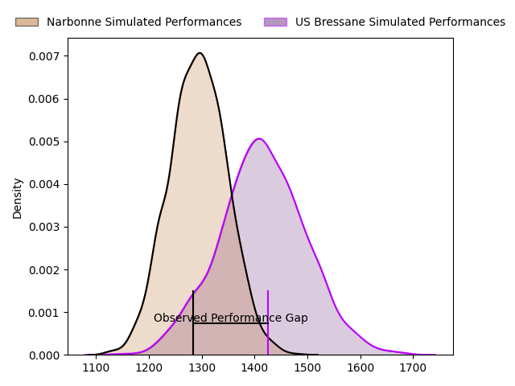
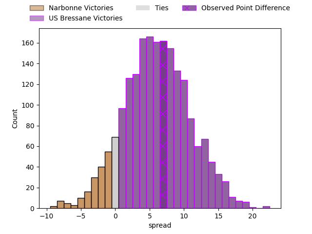
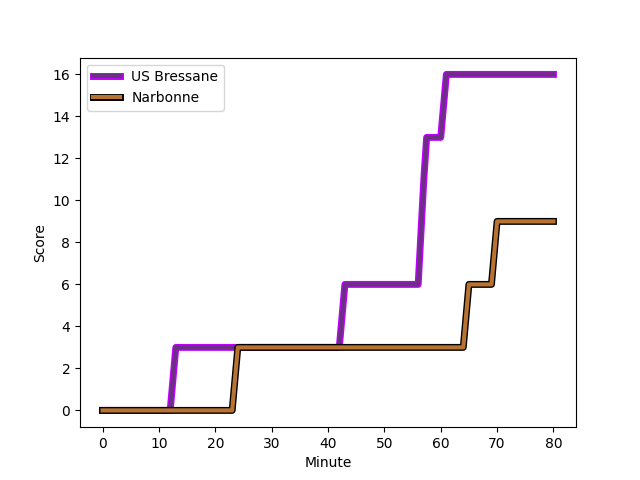
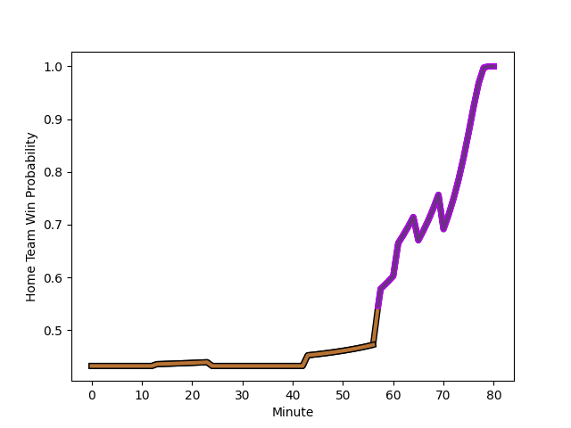

---  
layout: page  
title: Narbonne at US Bressane; 9-16  
date: 2023-03-04 19:30:00 18:00:00 -0500  
categories: match review  
---
# Narbonne at US Bressane; 9-16

# Club Level Predictions

The first set of predictions treats a club as the smallest object, as the club develops its members, organizes a gameplan, and deploys its players as needed for each match. This club model has a prediction of 0.667, which translates to predicting US Bressane to win by 6.1.

Each club has a rating and a rating deviation (simiar to a Glicko system), and expected performances can be generated. This allows for simulated matches and spreads like the ones below.
## Projected Performances

## Projected Spreads

## Projected Results

# Player Level Predictions

Treating teams instead as an entity made up of the currently active players, I have ratings for each player in an altogether different system. These can be combined to form team ratings once teamsheets are announced, weighting starters a bit higher than the reserves. After the match is played, players can be weighted by their minutes on the field, allowing for an accurate measure of the team's composition. With these compiled team ratings, we can make predictions, measure inaccuracy, and update the individual player ratings.
## Prediction with Player Minutes: Narbonne by 7.9

Narbonne by 11.9 on a neutral field
## Scores over Time

## Win Probability over Time

There were 14 large changes in win probability in this match
## Prediction without Player Minutes: Narbonne by 6.7

Narbonne by 10.7 on a neutral pitch

|   Away Minutes | Away Player                                                         |   Away elo |   Away Percentile |   Number |   Home Percentile |   Home elo | Home Player                                                                       |   Home Minutes |
|---------------:|:--------------------------------------------------------------------|-----------:|------------------:|---------:|------------------:|-----------:|:----------------------------------------------------------------------------------|---------------:|
|             80 | [Geoffrey Moise](..//playerfiles//GeoffreyMoise_cleaned.md)         |      92.17 |                40 |        1 |                11 |      75.57 | [Vazha Kapanadze](..//playerfiles//VazhaKapanadze_cleaned.md)                     |             80 |
|             65 | [Geoffrey Moise](..//playerfiles//GeoffreyMoise_cleaned.md)         |      92.17 |                40 |        1 |                11 |      75.57 | [Vazha Kapanadze](..//playerfiles//VazhaKapanadze_cleaned.md)                     |             80 |
|             65 | [Geoffrey Moise](..//playerfiles//GeoffreyMoise_cleaned.md)         |      92.17 |                40 |        1 |                11 |      75.57 | [Vazha Kapanadze](..//playerfiles//VazhaKapanadze_cleaned.md)                     |             63 |
|             80 | [Geoffrey Moise](..//playerfiles//GeoffreyMoise_cleaned.md)         |      92.17 |                40 |        1 |                11 |      75.57 | [Vazha Kapanadze](..//playerfiles//VazhaKapanadze_cleaned.md)                     |             63 |
|             54 | [Christophe David](..//playerfiles//ChristopheDavid_cleaned.md)     |      94.91 |                52 |        2 |                19 |      85.71 | [Clément Jullien](..//playerfiles//ClémentJullien_cleaned.md)                     |             80 |
|             54 | [Christophe David](..//playerfiles//ChristopheDavid_cleaned.md)     |      94.91 |                52 |        2 |                19 |      85.71 | [Clément Jullien](..//playerfiles//ClémentJullien_cleaned.md)                     |             52 |
|             80 | [Christophe David](..//playerfiles//ChristopheDavid_cleaned.md)     |      94.91 |                52 |        2 |                19 |      85.71 | [Clément Jullien](..//playerfiles//ClémentJullien_cleaned.md)                     |             52 |
|             80 | [Christophe David](..//playerfiles//ChristopheDavid_cleaned.md)     |      94.91 |                52 |        2 |                19 |      85.71 | [Clément Jullien](..//playerfiles//ClémentJullien_cleaned.md)                     |             80 |
|             80 | [Matthieu Loudet](..//playerfiles//MatthieuLoudet_cleaned.md)       |      91.46 |                37 |        3 |                14 |      82.52 | [Willem Johannes Harmse](..//playerfiles//WillemJohannesHarmse_cleaned.md)        |             25 |
|             54 | [Matthieu Loudet](..//playerfiles//MatthieuLoudet_cleaned.md)       |      91.46 |                37 |        3 |                14 |      82.52 | [Willem Johannes Harmse](..//playerfiles//WillemJohannesHarmse_cleaned.md)        |             25 |
|             80 | [Matthieu Loudet](..//playerfiles//MatthieuLoudet_cleaned.md)       |      91.46 |                37 |        3 |                14 |      82.52 | [Willem Johannes Harmse](..//playerfiles//WillemJohannesHarmse_cleaned.md)        |             80 |
|             54 | [Matthieu Loudet](..//playerfiles//MatthieuLoudet_cleaned.md)       |      91.46 |                37 |        3 |                14 |      82.52 | [Willem Johannes Harmse](..//playerfiles//WillemJohannesHarmse_cleaned.md)        |             80 |
|             80 | [Valentin Sese](..//playerfiles//ValentinSese_cleaned.md)           |     100.66 |                67 |        4 |                76 |     104.97 | [Koen Bloemen](..//playerfiles//KoenBloemen_cleaned.md)                           |             80 |
|             59 | [Mohamed Kbaier](..//playerfiles//MohamedKbaier_cleaned.md)         |      92.87 |                43 |        5 |                31 |      89.16 | [Monty Leverstein](..//playerfiles//MontyLeverstein_cleaned.md)                   |             75 |
|             80 | [Mohamed Kbaier](..//playerfiles//MohamedKbaier_cleaned.md)         |      92.87 |                43 |        5 |                31 |      89.16 | [Monty Leverstein](..//playerfiles//MontyLeverstein_cleaned.md)                   |             80 |
|             59 | [Mohamed Kbaier](..//playerfiles//MohamedKbaier_cleaned.md)         |      92.87 |                43 |        5 |                31 |      89.16 | [Monty Leverstein](..//playerfiles//MontyLeverstein_cleaned.md)                   |             80 |
|             80 | [Mohamed Kbaier](..//playerfiles//MohamedKbaier_cleaned.md)         |      92.87 |                43 |        5 |                31 |      89.16 | [Monty Leverstein](..//playerfiles//MontyLeverstein_cleaned.md)                   |             75 |
|             80 | [Arthur Christienne](..//playerfiles//ArthurChristienne_cleaned.md) |      91.06 |                53 |        6 |                96 |     127.96 | [Lucas Lyons](..//playerfiles//LucasLyons_cleaned.md)                             |             80 |
|             59 | [Arthur Christienne](..//playerfiles//ArthurChristienne_cleaned.md) |      91.06 |                53 |        6 |                96 |     127.96 | [Lucas Lyons](..//playerfiles//LucasLyons_cleaned.md)                             |             80 |
|             80 | [Paul Belzons](..//playerfiles//PaulBelzons_cleaned.md)             |      97.88 |                58 |        7 |                17 |      83.55 | [Loïc Baradel](..//playerfiles//LoïcBaradel_cleaned.md)                           |             54 |
|             80 | [Paul Belzons](..//playerfiles//PaulBelzons_cleaned.md)             |      97.88 |                58 |        7 |                17 |      83.55 | [Loïc Baradel](..//playerfiles//LoïcBaradel_cleaned.md)                           |             80 |
|             80 | [Thibault Clauzade](..//playerfiles//ThibaultClauzade_cleaned.md)   |      98.91 |                59 |        8 |                69 |     101.26 | [Wael May](..//playerfiles//WaelMay_cleaned.md)                                   |             80 |
|             80 | [Thibault Clauzade](..//playerfiles//ThibaultClauzade_cleaned.md)   |      98.91 |                59 |        8 |                69 |     101.26 | [Wael May](..//playerfiles//WaelMay_cleaned.md)                                   |             63 |
|             80 | [Pierrick Nova](..//playerfiles//PierrickNova_cleaned.md)           |      83.32 |                18 |        9 |                16 |      79.3  | [Robin Graulle](..//playerfiles//RobinGraulle_cleaned.md)                         |             74 |
|             78 | [Pierrick Nova](..//playerfiles//PierrickNova_cleaned.md)           |      83.32 |                18 |        9 |                16 |      79.3  | [Robin Graulle](..//playerfiles//RobinGraulle_cleaned.md)                         |             74 |
|             80 | [Pierrick Nova](..//playerfiles//PierrickNova_cleaned.md)           |      83.32 |                18 |        9 |                16 |      79.3  | [Robin Graulle](..//playerfiles//RobinGraulle_cleaned.md)                         |             80 |
|             78 | [Pierrick Nova](..//playerfiles//PierrickNova_cleaned.md)           |      83.32 |                18 |        9 |                16 |      79.3  | [Robin Graulle](..//playerfiles//RobinGraulle_cleaned.md)                         |             80 |
|             63 | [Tom Chauvet](..//playerfiles//TomChauvet_cleaned.md)               |      90.83 |                36 |       10 |                13 |      77.52 | [Christian Lacombe](..//playerfiles//ChristianLacombe_cleaned.md)                 |             80 |
|             80 | [Tom Chauvet](..//playerfiles//TomChauvet_cleaned.md)               |      90.83 |                36 |       10 |                13 |      77.52 | [Christian Lacombe](..//playerfiles//ChristianLacombe_cleaned.md)                 |             80 |
|             80 | [Sébastien Giorgis](..//playerfiles//SébastienGiorgis_cleaned.md)   |      98.73 |                59 |       11 |                30 |      87.21 | [Thibaut Perrette](..//playerfiles//ThibautPerrette_cleaned.md)                   |             80 |
|             80 | [Sébastien Giorgis](..//playerfiles//SébastienGiorgis_cleaned.md)   |      98.73 |                59 |       11 |                28 |      88.04 | [Élie De Fleurian](..//playerfiles//ÉlieDeFleurian_cleaned.md)                    |             80 |
|             80 | [José Lima](..//playerfiles//JoséLima_cleaned.md)                   |     124.22 |                96 |       12 |                15 |      81.4  | [Maile Mamao](..//playerfiles//MaileMamao_cleaned.md)                             |             80 |
|             70 | [Pierre Nueno](..//playerfiles//PierreNueno_cleaned.md)             |     104.81 |                77 |       13 |                12 |      78.67 | [Benjamin Doy](..//playerfiles//BenjaminDoy_cleaned.md)                           |             80 |
|             80 | [Pierre Nueno](..//playerfiles//PierreNueno_cleaned.md)             |     104.81 |                77 |       13 |                12 |      78.67 | [Benjamin Doy](..//playerfiles//BenjaminDoy_cleaned.md)                           |             80 |
|             80 | [Pierre-Hugo Ducom](..//playerfiles//Pierre-HugoDucom_cleaned.md)   |      99.57 |                63 |       14 |                30 |      87.21 | [Thibaut Perrette](..//playerfiles//ThibautPerrette_cleaned.md)                   |             40 |
|             80 | [Pierre-Hugo Ducom](..//playerfiles//Pierre-HugoDucom_cleaned.md)   |      99.57 |                63 |       14 |                28 |      88.04 | [Élie De Fleurian](..//playerfiles//ÉlieDeFleurian_cleaned.md)                    |             80 |
|             80 | [James Kane](..//playerfiles//JamesKane_cleaned.md)                 |     109.22 |                84 |       15 |                23 |      83.17 | [Audric Sanlaville](..//playerfiles//AudricSanlaville_cleaned.md)                 |             80 |
|             15 | [Sylvain Abadie](..//playerfiles//SylvainAbadie_cleaned.md)         |      95.26 |                61 |       16 |                88 |     111.25 | [Quentin Drancourt](..//playerfiles//QuentinDrancourt_cleaned.md)                 |             17 |
|             26 | [Jordan Rochier](..//playerfiles//JordanRochier_cleaned.md)         |      99.41 |                66 |       17 |                41 |      92.17 | [Sione Anga'aelangi](..//playerfiles//SioneAnga'aelangi_cleaned.md)               |             28 |
|             26 | [Théo Castinel](..//playerfiles//ThéoCastinel_cleaned.md)           |     118.51 |                95 |       18 |                 4 |      65.46 | [Zauri Tevdorashvili](..//playerfiles//ZauriTevdorashvili_cleaned.md)             |             55 |
|             21 | [Mauro Rebussone](..//playerfiles//MauroRebussone_cleaned.md)       |     118.08 |                94 |       19 |                81 |     106.91 | [Thomas Déliance](..//playerfiles//ThomasDéliance_cleaned.md)                     |              5 |
|             21 | [Luke Nakobukobua](..//playerfiles//LukeNakobukobua_cleaned.md)     |     111.79 |                87 |       20 |                71 |     102.07 | [TJ Ioane](..//playerfiles//TJIoane_cleaned.md)                                   |             17 |
|              2 | [Pablo Barbaste](..//playerfiles//PabloBarbaste_cleaned.md)         |      94.17 |                56 |       21 |                27 |      82.06 | [Nicolas Tachat](..//playerfiles//NicolasTachat_cleaned.md)                       |             26 |
|             17 | [Thomas Homer](..//playerfiles//ThomasHomer_cleaned.md)             |      92.08 |                45 |       22 |                95 |     117.88 | [Nicolas Faure](..//playerfiles//NicolasFaure_cleaned.md)                         |              6 |
|             10 | [Théo Mias](..//playerfiles//ThéoMias_cleaned.md)                   |      97    |                56 |       23 |                94 |     118.15 | [Parataiso Silafai-Lea'ana](..//playerfiles//ParataisoSilafai-Lea'ana_cleaned.md) |             40 |

