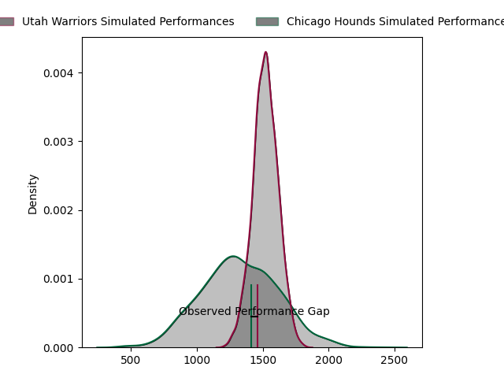
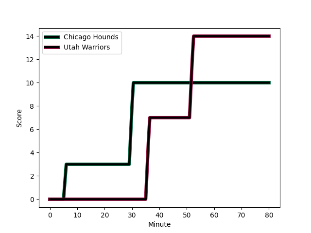
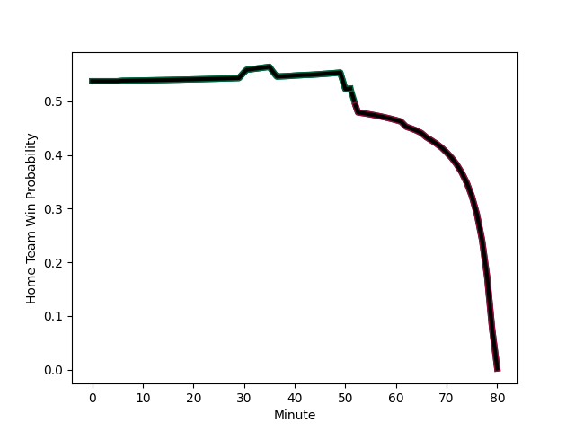

---  
layout: page  
title: Utah Warriors at Chicago Hounds; 14-10  
date: 2023-03-05 20:00:00 18:00:00 -0500  
categories: match review  
---
# Utah Warriors at Chicago Hounds; 14-10

# Club Level Predictions

The first set of predictions treats a club as the smallest object, as the club develops its members, organizes a gameplan, and deploys its players as needed for each match. This club model has a prediction of 0.257, which translates to predicting Utah Warriors to win by 9.6.

Each club has a rating and a rating deviation (simiar to a Glicko system), and expected performances can be generated. This allows for simulated matches and spreads like the ones below.
## Projected Performances

## Projected Spreads

## Projected Results

# Player Level Predictions

Treating teams instead as an entity made up of the currently active players, I have ratings for each player in an altogether different system. These can be combined to form team ratings once teamsheets are announced, weighting starters a bit higher than the reserves. After the match is played, players can be weighted by their minutes on the field, allowing for an accurate measure of the team's composition. With these compiled team ratings, we can make predictions, measure inaccuracy, and update the individual player ratings.
## Prediction with Player Minutes: Chicago Hounds by 10.5

Chicago Hounds by 6.5 on a neutral field
## Scores over Time

## Win Probability over Time

There were 8 large changes in win probability in this match
## Prediction without Player Minutes: Chicago Hounds by 6.5

Chicago Hounds by 2.5 on a neutral pitch

|   Away Minutes | Away Player                                                                       |   Away elo |   Away Percentile |   Number |   Home Percentile |   Home elo | Home Player                                                             |   Home Minutes |
|---------------:|:----------------------------------------------------------------------------------|-----------:|------------------:|---------:|------------------:|-----------:|:------------------------------------------------------------------------|---------------:|
|             50 | [Franco van den Berg](..//playerfiles//FrancovandenBerg_cleaned.md)               |      37.77 |                 0 |        1 |                32 |      90.09 | [George Thornton](..//playerfiles//GeorgeThornton_cleaned.md)           |             70 |
|             40 | [Henry Bell](..//playerfiles//HenryBell_cleaned.md)                               |      95    |               nan |        2 |               nan |      91.78 | [Hugh Roach](..//playerfiles//HughRoach_cleaned.md)                     |              9 |
|             50 | [Paul Mullen](..//playerfiles//PaulMullen_cleaned.md)                             |      91.42 |                37 |        3 |                 3 |      67.39 | [Charles Abel](..//playerfiles//CharlesAbel_cleaned.md)                 |             80 |
|             62 | [Saia Uhila](..//playerfiles//SaiaUhila_cleaned.md)                               |      75.41 |                 9 |        4 |                96 |     125.91 | [Dineshwaran Krishnan](..//playerfiles//DineshwaranKrishnan_cleaned.md) |             80 |
|             80 | [Jamie Lane](..//playerfiles//JamieLane_cleaned.md)                               |      89.12 |                30 |        5 |                 0 |      -0.34 | [Mike Matarazzo](..//playerfiles//MikeMatarazzo_cleaned.md)             |             80 |
|             80 | [Lance Williams](..//playerfiles//LanceWilliams_cleaned.md)                       |      65.28 |                 3 |        6 |                29 |      88.56 | [Luke Beauchamp](..//playerfiles//LukeBeauchamp_cleaned.md)             |             80 |
|             80 | [Bailey Wilson](..//playerfiles//BaileyWilson_cleaned.md)                         |      65.84 |                 3 |        7 |                29 |      88.56 | [Maclean Jones](..//playerfiles//MacleanJones_cleaned.md)               |             80 |
|             50 | [Thomas Tu'avao](..//playerfiles//ThomasTu'avao_cleaned.md)                       |      54.16 |                 2 |        8 |                 0 |      50.05 | [Michael De Waal](..//playerfiles//MichaelDeWaal_cleaned.md)            |             80 |
|             66 | [Connor McLeod](..//playerfiles//ConnorMcLeod_cleaned.md)                         |      90.22 |                36 |        9 |                89 |     111.52 | [Michael Baska](..//playerfiles//MichaelBaska_cleaned.md)               |             79 |
|             80 | [Joel Hodgson](..//playerfiles//JoelHodgson_cleaned.md)                           |      90.37 |                34 |       10 |                31 |      89.37 | [Luke Carty](..//playerfiles//LukeCarty_cleaned.md)                     |             65 |
|             80 | [Joseph Mano](..//playerfiles//JosephMano_cleaned.md)                             |      85.97 |                22 |       11 |               nan |      95    | [Julian Dominguez](..//playerfiles//JulianDominguez_cleaned.md)         |             67 |
|             80 | [Paul Lasike](..//playerfiles//PaulLasike_cleaned.md)                             |      90.57 |                35 |       12 |                29 |      88.56 | [Bryce Campbell](..//playerfiles//BryceCampbell_cleaned.md)             |             80 |
|             80 | [Calvin Whiting](..//playerfiles//CalvinWhiting_cleaned.md)                       |      89.12 |                30 |       13 |                 0 |      48.44 | [Mark O'Keeffe](..//playerfiles//MarkO'Keeffe_cleaned.md)               |             80 |
|             80 | [Mika Kruse](..//playerfiles//MikaKruse_cleaned.md)                               |      89.12 |                31 |       14 |                48 |      94.43 | [Caleb Strum](..//playerfiles//CalebStrum_cleaned.md)                   |             80 |
|             40 | [Caleb Makene](..//playerfiles//CalebMakene_cleaned.md)                           |      89.12 |                37 |       15 |               100 |     174.72 | [Chris Mattina](..//playerfiles//ChrisMattina_cleaned.md)               |             80 |
|             30 | [Emerson Prior](..//playerfiles//EmersonPrior_cleaned.md)                         |      94.26 |                48 |       16 |               nan |      88.42 | [LaRome White](..//playerfiles//LaRomeWhite_cleaned.md)                 |             10 |
|             40 | [Ratu Vere Taukona Vugakoto](..//playerfiles//RatuVereTaukonaVugakoto_cleaned.md) |      90.31 |                34 |       17 |                41 |      91.78 | [Lindsey Stevens](..//playerfiles//LindseyStevens_cleaned.md)           |             71 |
|             30 | [Angus McLellan](..//playerfiles//AngusMcLellan_cleaned.md)                       |      84.41 |                17 |       18 |               nan |      93.47 | [Sean Yacoubian](..//playerfiles//SeanYacoubian_cleaned.md)             |              1 |
|             18 | [Jeremiah Noaese](..//playerfiles//JeremiahNoaese_cleaned.md)                     |      93.74 |               nan |       19 |                27 |      88.05 | [Jean-Pierre Eloff](..//playerfiles//Jean-PierreEloff_cleaned.md)       |             15 |
|             30 | [Onehunga Havili Kaufusi](..//playerfiles//OnehungaHaviliKaufusi_cleaned.md)      |      94.17 |               nan |       20 |               nan |      93.63 | [Kevin Morgan](..//playerfiles//KevinMorgan_cleaned.md)                 |             13 |
|             14 | [Zion Going](..//playerfiles//ZionGoing_cleaned.md)                               |      99.27 |                68 |       21 |               nan |     nan    | nan                                                                     |            nan |
|              3 | [Cliven Loubser](..//playerfiles//ClivenLoubser_cleaned.md)                       |      93.18 |               nan |       22 |               nan |     nan    | nan                                                                     |            nan |
|             37 | [Logan Tago](..//playerfiles//LoganTago_cleaned.md)                               |      94.13 |               nan |       23 |               nan |     nan    | nan                                                                     |            nan |

