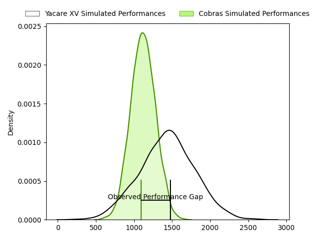
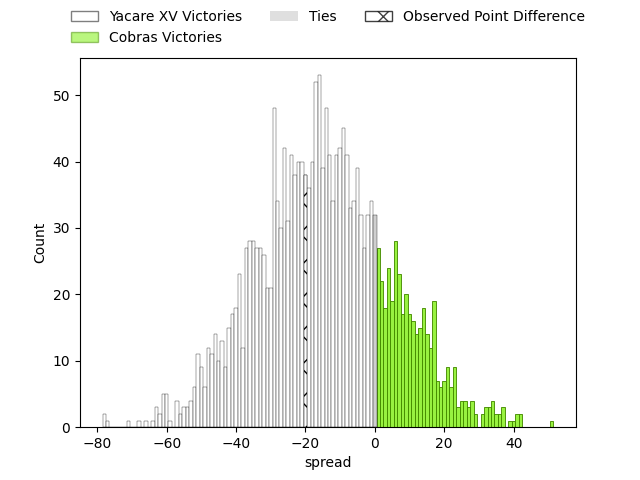
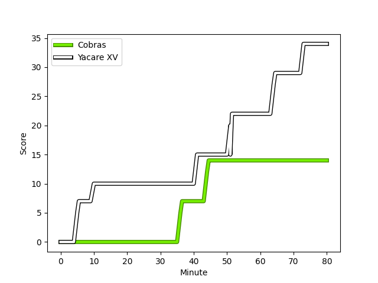
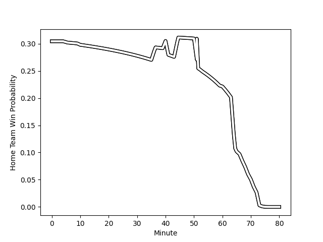

---  
layout: page  
title: Yacare XV at Cobras; 34-14  
date: 2023-03-05 22:00:00 18:00:00 -0500  
categories: match review  
---
# Yacare XV at Cobras; 34-14

# Club Level Predictions

The first set of predictions treats a club as the smallest object, as the club develops its members, organizes a gameplan, and deploys its players as needed for each match. This club model has a prediction of 0.242, which translates to predicting Yacare XV to win by 15.0.

Each club has a rating and a rating deviation (simiar to a Glicko system), and expected performances can be generated. This allows for simulated matches and spreads like the ones below.
## Projected Performances

## Projected Spreads

## Projected Results

# Player Level Predictions

Treating teams instead as an entity made up of the currently active players, I have ratings for each player in an altogether different system. These can be combined to form team ratings once teamsheets are announced, weighting starters a bit higher than the reserves. After the match is played, players can be weighted by their minutes on the field, allowing for an accurate measure of the team's composition. With these compiled team ratings, we can make predictions, measure inaccuracy, and update the individual player ratings.
## Prediction with Player Minutes: Yacare XV by 31.9

Yacare XV by 35.9 on a neutral field
## Scores over Time

## Win Probability over Time

There were 6 large changes in win probability in this match
## Prediction without Player Minutes: Yacare XV by 36.9

Yacare XV by 40.9 on a neutral pitch

|   Away Minutes | Away Player                                                                |   Away elo |   Away Percentile |   Number |   Home Percentile |   Home elo | Home Player                                                                             |   Home Minutes |
|---------------:|:---------------------------------------------------------------------------|-----------:|------------------:|---------:|------------------:|-----------:|:----------------------------------------------------------------------------------------|---------------:|
|             60 | [Lucas Noguera Paz](..//playerfiles//LucasNogueraPaz_cleaned.md)           |     109.48 |                87 |        1 |                12 |      81.11 | [Alexandre Alves](..//playerfiles//AlexandreAlves_cleaned.md)                           |             80 |
|             68 | [Emilio Gorostiaga](..//playerfiles//EmilioGorostiaga_cleaned.md)          |     101.31 |                73 |        2 |                 5 |      68.76 | [Endy Willian](..//playerfiles//EndyWillian_cleaned.md)                                 |             70 |
|             68 | [Emilio Gorostiaga](..//playerfiles//EmilioGorostiaga_cleaned.md)          |     101.31 |                73 |        2 |                 3 |      68.76 | [Endy Willian](..//playerfiles//EndyWillian_cleaned.md)                                 |             70 |
|             53 | [Estefano Aranda](..//playerfiles//EstefanoAranda_cleaned.md)              |     104.59 |                24 |        3 |                41 |      92.62 | [Henrique Ribeiro Ferreira](..//playerfiles//HenriqueRibeiroFerreira_cleaned.md)        |             80 |
|             53 | [Estefano Aranda](..//playerfiles//EstefanoAranda_cleaned.md)              |     104.59 |                24 |        3 |                51 |      92.62 | [Henrique Ribeiro Ferreira](..//playerfiles//HenriqueRibeiroFerreira_cleaned.md)        |             80 |
|             53 | [Ignacio Martinez](..//playerfiles//IgnacioMartinez_cleaned.md)            |     113.39 |                89 |        4 |               nan |      92.68 | [Ben Donald](..//playerfiles//BenDonald_cleaned.md)                                     |             80 |
|             80 | [Mariano Garcete Elli](..//playerfiles//MarianoGarceteElli_cleaned.md)     |      98.81 |                62 |        5 |                 4 |      64.28 | [Gabriel Paganini](..//playerfiles//GabrielPaganini_cleaned.md)                         |             41 |
|             80 | [Felipe Villagran](..//playerfiles//FelipeVillagran_cleaned.md)            |     106.73 |                80 |        6 |               nan |      91.99 | [Donnacha Byrne](..//playerfiles//DonnachaByrne_cleaned.md)                             |             80 |
|             80 | [Felipe Puertas](..//playerfiles//FelipePuertas_cleaned.md)                |      84.81 |                20 |        7 |                19 |      80.98 | [Matheus Claudio](..//playerfiles//MatheusClaudio_cleaned.md)                           |             80 |
|             80 | [Felipe Puertas](..//playerfiles//FelipePuertas_cleaned.md)                |      84.81 |                20 |        7 |                12 |      80.98 | [Matheus Claudio](..//playerfiles//MatheusClaudio_cleaned.md)                           |             80 |
|             68 | [Marcos Riquelme](..//playerfiles//MarcosRiquelme_cleaned.md)              |     113.39 |                88 |        8 |                13 |      81.1  | [Andre Arruda](..//playerfiles//AndreArruda_cleaned.md)                                 |             41 |
|             68 | [Marcos Riquelme](..//playerfiles//MarcosRiquelme_cleaned.md)              |     113.39 |                88 |        8 |                18 |      81.1  | [Andre Arruda](..//playerfiles//AndreArruda_cleaned.md)                                 |             41 |
|             74 | [Ignacio Inchauspe](..//playerfiles//IgnacioInchauspe_cleaned.md)          |     105.99 |                81 |        9 |                 1 |      60.17 | [Facundo Vilalba](..//playerfiles//FacundoVilalba_cleaned.md)                           |             66 |
|             74 | [Ignacio Inchauspe](..//playerfiles//IgnacioInchauspe_cleaned.md)          |     105.99 |                81 |        9 |                 9 |      60.17 | [Facundo Vilalba](..//playerfiles//FacundoVilalba_cleaned.md)                           |             66 |
|             53 | [Estanislao Gomez](..//playerfiles//EstanislaoGomez_cleaned.md)            |     105.81 |                78 |       10 |                 7 |      75.52 | [Lucas Tranquez](..//playerfiles//LucasTranquez_cleaned.md)                             |             80 |
|             80 | [Juan Daniel Gonzalez](..//playerfiles//JuanDanielGonzalez_cleaned.md)     |      71.65 |                 7 |       11 |                10 |      70.98 | [Alain Andres Altahona Fulleda](..//playerfiles//AlainAndresAltahonaFulleda_cleaned.md) |             72 |
|             53 | [Sebastian Urbieta](..//playerfiles//SebastianUrbieta_cleaned.md)          |      96.72 |                54 |       12 |                 8 |      74.93 | [Robert Tenorio](..//playerfiles//RobertTenorio_cleaned.md)                             |             80 |
|             80 | [Ramiro Amarilla](..//playerfiles//RamiroAmarilla_cleaned.md)              |     106.89 |                81 |       13 |                 4 |      67.6  | [Nicolas Cantarutti](..//playerfiles//NicolasCantarutti_cleaned.md)                     |             80 |
|             80 | [Federico Gauna](..//playerfiles//FedericoGauna_cleaned.md)                |     113.39 |                89 |       14 |                24 |      87.04 | [Ariel Rodrigues](..//playerfiles//ArielRodrigues_cleaned.md)                           |             80 |
|             80 | [Tomas McCall](..//playerfiles//TomasMcCall_cleaned.md)                    |     113.39 |                88 |       15 |                 8 |      69.42 | [Guilherme Coghetto](..//playerfiles//GuilhermeCoghetto_cleaned.md)                     |             40 |
|             27 | [Juan Cruz Perez Rachel](..//playerfiles//JuanCruzPerezRachel_cleaned.md)  |     101.67 |               nan |       16 |                 5 |      69.72 | [Cleber Dias](..//playerfiles//CleberDias_cleaned.md)                                   |             39 |
|             27 | [Juan Cruz Perez Rachel](..//playerfiles//JuanCruzPerezRachel_cleaned.md)  |     101.67 |               nan |       16 |                 4 |      69.72 | [Cleber Dias](..//playerfiles//CleberDias_cleaned.md)                                   |             39 |
|             27 | [Tomas Acosta Pimentel](..//playerfiles//TomasAcostaPimentel_cleaned.md)   |     129.86 |                97 |       17 |                64 |      99.99 | [Lucas Ferrer Spago](..//playerfiles//LucasFerrerSpago_cleaned.md)                      |             40 |
|             27 | [Federico Cacciabúe](..//playerfiles//FedericoCacciabúe_cleaned.md)        |     102.59 |               nan |       18 |                 6 |      72.21 | [Lucio Anconetani](..//playerfiles//LucioAnconetani_cleaned.md)                         |             39 |
|             27 | [Rolando Edgar Portillo](..//playerfiles//RolandoEdgarPortillo_cleaned.md) |      88.24 |                35 |       19 |               nan |      90.31 | [Felipe Goncalves Cunha](..//playerfiles//FelipeGoncalvesCunha_cleaned.md)              |             14 |
|             20 | [Julian Martin](..//playerfiles//JulianMartin_cleaned.md)                  |     100.06 |               nan |       20 |               nan |      95    | [Diego Vidal](..//playerfiles//DiegoVidal_cleaned.md)                                   |             10 |
|             12 | [Carlos Plate](..//playerfiles//CarlosPlate_cleaned.md)                    |     106.62 |               nan |       21 |               nan |      95    | [Robson Alves de Morais](..//playerfiles//RobsonAlvesdeMorais_cleaned.md)               |              8 |
|             12 | [Camillo Blasco](..//playerfiles//CamilloBlasco_cleaned.md)                |      98.91 |               nan |       22 |               nan |     nan    | nan                                                                                     |            nan |
|              6 | [Diego Miño](..//playerfiles//DiegoMiño_cleaned.md)                        |      95    |               nan |       23 |               nan |     nan    | nan                                                                                     |            nan |

