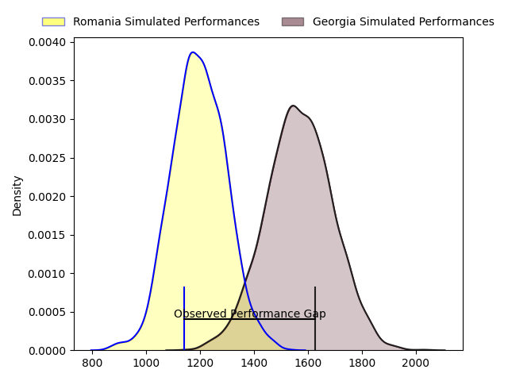
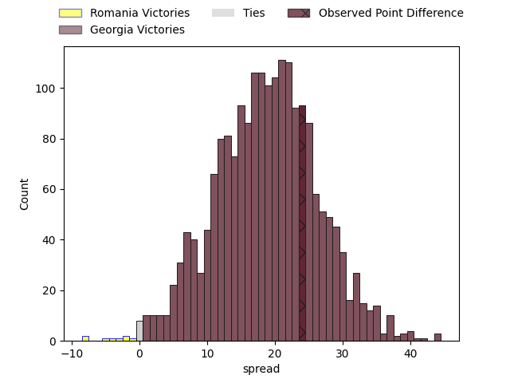
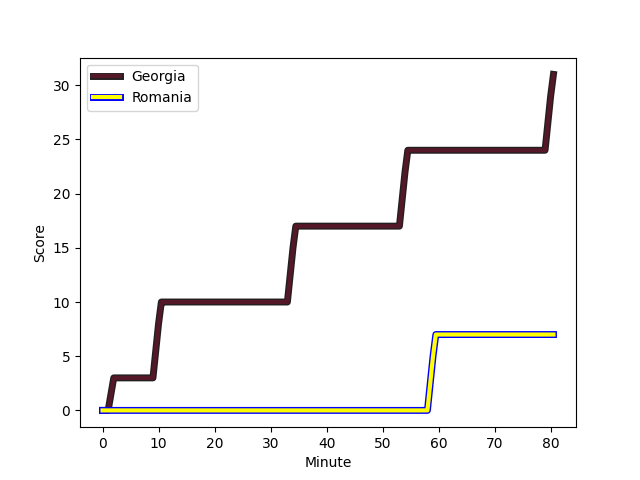

---  
layout: page  
title: Romania at Georgia; 7-31  
date: 2023-03-05 13:00:00 18:00:00 -0500  
categories: match review  
---
# Romania at Georgia; 7-31

# Club Level Predictions

The first set of predictions treats a club as the smallest object, as the club develops its members, organizes a gameplan, and deploys its players as needed for each match. This club model has a prediction of 0.887, which translates to predicting Georgia to win by 18.8.

Each club has a rating and a rating deviation (simiar to a Glicko system), and expected performances can be generated. This allows for simulated matches and spreads like the ones below.
## Projected Performances

## Projected Spreads

## Projected Results

# Player Level Predictions

Treating teams instead as an entity made up of the currently active players, I have ratings for each player in an altogether different system. These can be combined to form team ratings once teamsheets are announced, weighting starters a bit higher than the reserves. After the match is played, players can be weighted by their minutes on the field, allowing for an accurate measure of the team's composition. With these compiled team ratings, we can make predictions, measure inaccuracy, and update the individual player ratings.
## Prediction with Player Minutes: Georgia by 22.4

Georgia by 18.4 on a neutral field
## Scores over Time

## Win Probability over Time

There were 3 large changes in win probability in this match
## Prediction without Player Minutes: Georgia by 21.3

Georgia by 17.3 on a neutral pitch

|   Away Minutes | Away Player                                                                          |   Away elo |   Away Percentile |   Number |   Home Percentile |   Home elo | Home Player                                                               |   Home Minutes |
|---------------:|:-------------------------------------------------------------------------------------|-----------:|------------------:|---------:|------------------:|-----------:|:--------------------------------------------------------------------------|---------------:|
|             64 | [Alexandru Savin](..//playerfiles//AlexandruSavin_cleaned.md)                        |     100.87 |                71 |        1 |                66 |      99.53 | [Guram Gogichashvili](..//playerfiles//GuramGogichashvili_cleaned.md)     |             80 |
|             80 | [Alexandru Savin](..//playerfiles//AlexandruSavin_cleaned.md)                        |     100.87 |                71 |        1 |                66 |      99.53 | [Guram Gogichashvili](..//playerfiles//GuramGogichashvili_cleaned.md)     |             80 |
|             64 | [Alexandru Savin](..//playerfiles//AlexandruSavin_cleaned.md)                        |     100.87 |                71 |        1 |                66 |      99.53 | [Guram Gogichashvili](..//playerfiles//GuramGogichashvili_cleaned.md)     |             50 |
|             80 | [Alexandru Savin](..//playerfiles//AlexandruSavin_cleaned.md)                        |     100.87 |                71 |        1 |                66 |      99.53 | [Guram Gogichashvili](..//playerfiles//GuramGogichashvili_cleaned.md)     |             50 |
|             80 | [Ovidiu Cojocaru](..//playerfiles//OvidiuCojocaru_cleaned.md)                        |      93.37 |                47 |        2 |                58 |      99.41 | [Giorgi Chkoidze](..//playerfiles//GiorgiChkoidze_cleaned.md)             |             50 |
|             49 | [Ovidiu Cojocaru](..//playerfiles//OvidiuCojocaru_cleaned.md)                        |      93.37 |                47 |        2 |                64 |      99.41 | [Giorgi Chkoidze](..//playerfiles//GiorgiChkoidze_cleaned.md)             |             50 |
|             80 | [Ovidiu Cojocaru](..//playerfiles//OvidiuCojocaru_cleaned.md)                        |      93.37 |                47 |        2 |                64 |      99.41 | [Giorgi Chkoidze](..//playerfiles//GiorgiChkoidze_cleaned.md)             |             50 |
|             49 | [Ovidiu Cojocaru](..//playerfiles//OvidiuCojocaru_cleaned.md)                        |      93.37 |                47 |        2 |                58 |      99.41 | [Giorgi Chkoidze](..//playerfiles//GiorgiChkoidze_cleaned.md)             |             50 |
|             49 | [Ovidiu Cojocaru](..//playerfiles//OvidiuCojocaru_cleaned.md)                        |      93.37 |                47 |        2 |                64 |      99.41 | [Giorgi Chkoidze](..//playerfiles//GiorgiChkoidze_cleaned.md)             |             80 |
|             80 | [Ovidiu Cojocaru](..//playerfiles//OvidiuCojocaru_cleaned.md)                        |      93.37 |                47 |        2 |                64 |      99.41 | [Giorgi Chkoidze](..//playerfiles//GiorgiChkoidze_cleaned.md)             |             80 |
|             49 | [Ovidiu Cojocaru](..//playerfiles//OvidiuCojocaru_cleaned.md)                        |      93.37 |                47 |        2 |                58 |      99.41 | [Giorgi Chkoidze](..//playerfiles//GiorgiChkoidze_cleaned.md)             |             80 |
|             80 | [Ovidiu Cojocaru](..//playerfiles//OvidiuCojocaru_cleaned.md)                        |      93.37 |                47 |        2 |                58 |      99.41 | [Giorgi Chkoidze](..//playerfiles//GiorgiChkoidze_cleaned.md)             |             80 |
|             80 | [Thomas Cretu](..//playerfiles//ThomasCretu_cleaned.md)                              |      93.74 |                46 |        3 |                58 |      97.32 | [Beka Gigashvili](..//playerfiles//BekaGigashvili_cleaned.md)             |             54 |
|             53 | [Thomas Cretu](..//playerfiles//ThomasCretu_cleaned.md)                              |      93.74 |                46 |        3 |                58 |      97.32 | [Beka Gigashvili](..//playerfiles//BekaGigashvili_cleaned.md)             |             80 |
|             53 | [Thomas Cretu](..//playerfiles//ThomasCretu_cleaned.md)                              |      93.74 |                46 |        3 |                58 |      97.32 | [Beka Gigashvili](..//playerfiles//BekaGigashvili_cleaned.md)             |             54 |
|             80 | [Thomas Cretu](..//playerfiles//ThomasCretu_cleaned.md)                              |      93.74 |                46 |        3 |                58 |      97.32 | [Beka Gigashvili](..//playerfiles//BekaGigashvili_cleaned.md)             |             80 |
|             80 | [Adrian Motoc](..//playerfiles//AdrianMotoc_cleaned.md)                              |      98.34 |                60 |        4 |                87 |     111.34 | [Nodar Cheishvili](..//playerfiles//NodarCheishvili_cleaned.md)           |             80 |
|             58 | [Adrian Motoc](..//playerfiles//AdrianMotoc_cleaned.md)                              |      98.34 |                60 |        4 |                87 |     111.34 | [Nodar Cheishvili](..//playerfiles//NodarCheishvili_cleaned.md)           |             80 |
|             80 | [Adrian Motoc](..//playerfiles//AdrianMotoc_cleaned.md)                              |      98.34 |                60 |        4 |                87 |     111.34 | [Nodar Cheishvili](..//playerfiles//NodarCheishvili_cleaned.md)           |             60 |
|             58 | [Adrian Motoc](..//playerfiles//AdrianMotoc_cleaned.md)                              |      98.34 |                60 |        4 |                87 |     111.34 | [Nodar Cheishvili](..//playerfiles//NodarCheishvili_cleaned.md)           |             60 |
|             80 | [Marius Constantin Antonescu](..//playerfiles//MariusConstantinAntonescu_cleaned.md) |      96.03 |                54 |        5 |                90 |     115.47 | [Konstantin Mikautadze](..//playerfiles//KonstantinMikautadze_cleaned.md) |             80 |
|             80 | [Marius Constantin Antonescu](..//playerfiles//MariusConstantinAntonescu_cleaned.md) |      96.03 |                54 |        5 |                87 |     115.47 | [Konstantin Mikautadze](..//playerfiles//KonstantinMikautadze_cleaned.md) |             80 |
|             80 | [Mihai Macovei](..//playerfiles//MihaiMacovei_cleaned.md)                            |     103    |                67 |        6 |                92 |     117.74 | [Giorgi Tsutskiridze](..//playerfiles//GiorgiTsutskiridze_cleaned.md)     |             80 |
|             80 | [Mihai Macovei](..//playerfiles//MihaiMacovei_cleaned.md)                            |     103    |                67 |        6 |                89 |     117.74 | [Giorgi Tsutskiridze](..//playerfiles//GiorgiTsutskiridze_cleaned.md)     |             80 |
|             80 | [Mihai Macovei](..//playerfiles//MihaiMacovei_cleaned.md)                            |     103    |                73 |        6 |                89 |     117.74 | [Giorgi Tsutskiridze](..//playerfiles//GiorgiTsutskiridze_cleaned.md)     |             80 |
|             80 | [Mihai Macovei](..//playerfiles//MihaiMacovei_cleaned.md)                            |     103    |                73 |        6 |                92 |     117.74 | [Giorgi Tsutskiridze](..//playerfiles//GiorgiTsutskiridze_cleaned.md)     |             80 |
|             80 | [Christian Marian Chirica](..//playerfiles//ChristianMarianChirica_cleaned.md)       |     100.16 |                65 |        7 |                78 |     105.74 | [Beka Saghinadze](..//playerfiles//BekaSaghinadze_cleaned.md)             |             80 |
|             80 | [André Gorin](..//playerfiles//AndréGorin_cleaned.md)                                |     102.38 |                71 |        8 |                82 |     108.23 | [Tornike Jalagonia](..//playerfiles//TornikeJalagonia_cleaned.md)         |             80 |
|             66 | [André Gorin](..//playerfiles//AndréGorin_cleaned.md)                                |     102.38 |                71 |        8 |                82 |     108.23 | [Tornike Jalagonia](..//playerfiles//TornikeJalagonia_cleaned.md)         |             80 |
|             80 | [André Gorin](..//playerfiles//AndréGorin_cleaned.md)                                |     102.38 |                71 |        8 |                82 |     108.23 | [Tornike Jalagonia](..//playerfiles//TornikeJalagonia_cleaned.md)         |             70 |
|             66 | [André Gorin](..//playerfiles//AndréGorin_cleaned.md)                                |     102.38 |                71 |        8 |                82 |     108.23 | [Tornike Jalagonia](..//playerfiles//TornikeJalagonia_cleaned.md)         |             70 |
|             80 | [Gabriel Vasile Rupanu](..//playerfiles//GabrielVasileRupanu_cleaned.md)             |     104.35 |                78 |        9 |                94 |     114.96 | [Vasil Lobzhanidze](..//playerfiles//VasilLobzhanidze_cleaned.md)         |             80 |
|             80 | [Gabriel Vasile Rupanu](..//playerfiles//GabrielVasileRupanu_cleaned.md)             |     104.35 |                63 |        9 |                94 |     114.96 | [Vasil Lobzhanidze](..//playerfiles//VasilLobzhanidze_cleaned.md)         |             80 |
|             68 | [Gabriel Vasile Rupanu](..//playerfiles//GabrielVasileRupanu_cleaned.md)             |     104.35 |                78 |        9 |                94 |     114.96 | [Vasil Lobzhanidze](..//playerfiles//VasilLobzhanidze_cleaned.md)         |             80 |
|             68 | [Gabriel Vasile Rupanu](..//playerfiles//GabrielVasileRupanu_cleaned.md)             |     104.35 |                63 |        9 |                94 |     114.96 | [Vasil Lobzhanidze](..//playerfiles//VasilLobzhanidze_cleaned.md)         |             80 |
|             80 | [Gabriel Vasile Rupanu](..//playerfiles//GabrielVasileRupanu_cleaned.md)             |     104.35 |                78 |        9 |                94 |     114.96 | [Vasil Lobzhanidze](..//playerfiles//VasilLobzhanidze_cleaned.md)         |             57 |
|             80 | [Gabriel Vasile Rupanu](..//playerfiles//GabrielVasileRupanu_cleaned.md)             |     104.35 |                63 |        9 |                94 |     114.96 | [Vasil Lobzhanidze](..//playerfiles//VasilLobzhanidze_cleaned.md)         |             57 |
|             68 | [Gabriel Vasile Rupanu](..//playerfiles//GabrielVasileRupanu_cleaned.md)             |     104.35 |                78 |        9 |                94 |     114.96 | [Vasil Lobzhanidze](..//playerfiles//VasilLobzhanidze_cleaned.md)         |             57 |
|             68 | [Gabriel Vasile Rupanu](..//playerfiles//GabrielVasileRupanu_cleaned.md)             |     104.35 |                63 |        9 |                94 |     114.96 | [Vasil Lobzhanidze](..//playerfiles//VasilLobzhanidze_cleaned.md)         |             57 |
|             58 | [Florin Popa](..//playerfiles//FlorinPopa_cleaned.md)                                |     101.58 |                64 |       10 |                84 |     110.14 | [Tedo Abzhandadze](..//playerfiles//TedoAbzhandadze_cleaned.md)           |             68 |
|             80 | [Florin Popa](..//playerfiles//FlorinPopa_cleaned.md)                                |     101.58 |                64 |       10 |                81 |     110.14 | [Tedo Abzhandadze](..//playerfiles//TedoAbzhandadze_cleaned.md)           |             80 |
|             80 | [Florin Popa](..//playerfiles//FlorinPopa_cleaned.md)                                |     101.58 |                64 |       10 |                84 |     110.14 | [Tedo Abzhandadze](..//playerfiles//TedoAbzhandadze_cleaned.md)           |             68 |
|             58 | [Florin Popa](..//playerfiles//FlorinPopa_cleaned.md)                                |     101.58 |                64 |       10 |                81 |     110.14 | [Tedo Abzhandadze](..//playerfiles//TedoAbzhandadze_cleaned.md)           |             80 |
|             58 | [Florin Popa](..//playerfiles//FlorinPopa_cleaned.md)                                |     101.58 |                64 |       10 |                84 |     110.14 | [Tedo Abzhandadze](..//playerfiles//TedoAbzhandadze_cleaned.md)           |             80 |
|             80 | [Florin Popa](..//playerfiles//FlorinPopa_cleaned.md)                                |     101.58 |                64 |       10 |                84 |     110.14 | [Tedo Abzhandadze](..//playerfiles//TedoAbzhandadze_cleaned.md)           |             80 |
|             58 | [Florin Popa](..//playerfiles//FlorinPopa_cleaned.md)                                |     101.58 |                64 |       10 |                81 |     110.14 | [Tedo Abzhandadze](..//playerfiles//TedoAbzhandadze_cleaned.md)           |             68 |
|             80 | [Florin Popa](..//playerfiles//FlorinPopa_cleaned.md)                                |     101.58 |                64 |       10 |                81 |     110.14 | [Tedo Abzhandadze](..//playerfiles//TedoAbzhandadze_cleaned.md)           |             68 |
|             80 | [Paul Popoaia](..//playerfiles//PaulPopoaia_cleaned.md)                              |     108.44 |                82 |       11 |                68 |     101.45 | [Sandro Todua](..//playerfiles//SandroTodua_cleaned.md)                   |             80 |
|             80 | [Jason Tomane](..//playerfiles//JasonTomane_cleaned.md)                              |      92.47 |                42 |       12 |                75 |     103.78 | [Merab Sharikadze](..//playerfiles//MerabSharikadze_cleaned.md)           |             80 |
|             80 | [Atila Septar](..//playerfiles//AtilaSeptar_cleaned.md)                              |     107.45 |                82 |       13 |                93 |     117.38 | [Giorgi Kveseladze](..//playerfiles//GiorgiKveseladze_cleaned.md)         |             68 |
|             64 | [Atila Septar](..//playerfiles//AtilaSeptar_cleaned.md)                              |     107.45 |                71 |       13 |                90 |     117.38 | [Giorgi Kveseladze](..//playerfiles//GiorgiKveseladze_cleaned.md)         |             68 |
|             64 | [Atila Septar](..//playerfiles//AtilaSeptar_cleaned.md)                              |     107.45 |                82 |       13 |                90 |     117.38 | [Giorgi Kveseladze](..//playerfiles//GiorgiKveseladze_cleaned.md)         |             68 |
|             80 | [Atila Septar](..//playerfiles//AtilaSeptar_cleaned.md)                              |     107.45 |                71 |       13 |                90 |     117.38 | [Giorgi Kveseladze](..//playerfiles//GiorgiKveseladze_cleaned.md)         |             68 |
|             80 | [Atila Septar](..//playerfiles//AtilaSeptar_cleaned.md)                              |     107.45 |                82 |       13 |                90 |     117.38 | [Giorgi Kveseladze](..//playerfiles//GiorgiKveseladze_cleaned.md)         |             68 |
|             64 | [Atila Septar](..//playerfiles//AtilaSeptar_cleaned.md)                              |     107.45 |                71 |       13 |                93 |     117.38 | [Giorgi Kveseladze](..//playerfiles//GiorgiKveseladze_cleaned.md)         |             68 |
|             64 | [Atila Septar](..//playerfiles//AtilaSeptar_cleaned.md)                              |     107.45 |                82 |       13 |                93 |     117.38 | [Giorgi Kveseladze](..//playerfiles//GiorgiKveseladze_cleaned.md)         |             68 |
|             80 | [Atila Septar](..//playerfiles//AtilaSeptar_cleaned.md)                              |     107.45 |                71 |       13 |                93 |     117.38 | [Giorgi Kveseladze](..//playerfiles//GiorgiKveseladze_cleaned.md)         |             68 |
|             64 | [Atila Septar](..//playerfiles//AtilaSeptar_cleaned.md)                              |     107.45 |                71 |       13 |                90 |     117.38 | [Giorgi Kveseladze](..//playerfiles//GiorgiKveseladze_cleaned.md)         |             80 |
|             80 | [Atila Septar](..//playerfiles//AtilaSeptar_cleaned.md)                              |     107.45 |                71 |       13 |                90 |     117.38 | [Giorgi Kveseladze](..//playerfiles//GiorgiKveseladze_cleaned.md)         |             80 |
|             80 | [Atila Septar](..//playerfiles//AtilaSeptar_cleaned.md)                              |     107.45 |                82 |       13 |                90 |     117.38 | [Giorgi Kveseladze](..//playerfiles//GiorgiKveseladze_cleaned.md)         |             80 |
|             64 | [Atila Septar](..//playerfiles//AtilaSeptar_cleaned.md)                              |     107.45 |                71 |       13 |                93 |     117.38 | [Giorgi Kveseladze](..//playerfiles//GiorgiKveseladze_cleaned.md)         |             80 |
|             64 | [Atila Septar](..//playerfiles//AtilaSeptar_cleaned.md)                              |     107.45 |                82 |       13 |                93 |     117.38 | [Giorgi Kveseladze](..//playerfiles//GiorgiKveseladze_cleaned.md)         |             80 |
|             80 | [Atila Septar](..//playerfiles//AtilaSeptar_cleaned.md)                              |     107.45 |                71 |       13 |                93 |     117.38 | [Giorgi Kveseladze](..//playerfiles//GiorgiKveseladze_cleaned.md)         |             80 |
|             80 | [Atila Septar](..//playerfiles//AtilaSeptar_cleaned.md)                              |     107.45 |                82 |       13 |                93 |     117.38 | [Giorgi Kveseladze](..//playerfiles//GiorgiKveseladze_cleaned.md)         |             80 |
|             64 | [Atila Septar](..//playerfiles//AtilaSeptar_cleaned.md)                              |     107.45 |                82 |       13 |                90 |     117.38 | [Giorgi Kveseladze](..//playerfiles//GiorgiKveseladze_cleaned.md)         |             80 |
|             80 | [Marius Simionescu](..//playerfiles//MariusSimionescu_cleaned.md)                    |      95.63 |                52 |       14 |                86 |     109.49 | [Akaki Tabutsadze](..//playerfiles//AkakiTabutsadze_cleaned.md)           |             80 |
|             80 | [Ionel Melinte](..//playerfiles//IonelMelinte_cleaned.md)                            |      96.42 |                67 |       15 |                70 |     101.93 | [Davit Niniashvili](..//playerfiles//DavitNiniashvili_cleaned.md)         |             80 |
|             31 | [Eugen Capatina](..//playerfiles//EugenCapatina_cleaned.md)                          |     103.55 |                63 |       16 |                90 |     116.08 | [Shalva Mamukashvili](..//playerfiles//ShalvaMamukashvili_cleaned.md)     |             30 |
|             31 | [Eugen Capatina](..//playerfiles//EugenCapatina_cleaned.md)                          |     103.55 |                79 |       16 |                93 |     116.08 | [Shalva Mamukashvili](..//playerfiles//ShalvaMamukashvili_cleaned.md)     |             30 |
|             31 | [Eugen Capatina](..//playerfiles//EugenCapatina_cleaned.md)                          |     103.55 |                79 |       16 |                90 |     116.08 | [Shalva Mamukashvili](..//playerfiles//ShalvaMamukashvili_cleaned.md)     |             30 |
|             31 | [Eugen Capatina](..//playerfiles//EugenCapatina_cleaned.md)                          |     103.55 |                63 |       16 |                93 |     116.08 | [Shalva Mamukashvili](..//playerfiles//ShalvaMamukashvili_cleaned.md)     |             30 |
|             27 | [Costel Burtila](..//playerfiles//CostelBurtila_cleaned.md)                          |      98.58 |                69 |       17 |                93 |     119.38 | [Nika Abuladze](..//playerfiles//NikaAbuladze_cleaned.md)                 |             30 |
|             27 | [Costel Burtila](..//playerfiles//CostelBurtila_cleaned.md)                          |      98.58 |                69 |       17 |                96 |     119.38 | [Nika Abuladze](..//playerfiles//NikaAbuladze_cleaned.md)                 |             30 |
|             22 | [Marius Iftimiciuc](..//playerfiles//MariusIftimiciuc_cleaned.md)                    |      99.84 |                65 |       18 |                77 |     103.56 | [Guram Papidze](..//playerfiles//GuramPapidze_cleaned.md)                 |             26 |
|             22 | [Marius Iftimiciuc](..//playerfiles//MariusIftimiciuc_cleaned.md)                    |      99.84 |                65 |       18 |                52 |     103.56 | [Guram Papidze](..//playerfiles//GuramPapidze_cleaned.md)                 |             26 |
|             22 | [Fonovai Tangimana](..//playerfiles//FonovaiTangimana_cleaned.md)                    |      95    |               nan |       19 |                67 |     100.89 | [Gela Aprasidze](..//playerfiles//GelaAprasidze_cleaned.md)               |             23 |
|             22 | [Fonovai Tangimana](..//playerfiles//FonovaiTangimana_cleaned.md)                    |      95    |               nan |       19 |                62 |     100.89 | [Gela Aprasidze](..//playerfiles//GelaAprasidze_cleaned.md)               |             23 |
|             16 | [Constantin Ciprian Chiriac](..//playerfiles//ConstantinCiprianChiriac_cleaned.md)   |     102.96 |                68 |       20 |                70 |     103.05 | [Lado Chachanidze](..//playerfiles//LadoChachanidze_cleaned.md)           |             20 |
|             16 | [Constantin Ciprian Chiriac](..//playerfiles//ConstantinCiprianChiriac_cleaned.md)   |     102.96 |                77 |       20 |                70 |     103.05 | [Lado Chachanidze](..//playerfiles//LadoChachanidze_cleaned.md)           |             20 |
|             16 | [Cosmin Iliuta](..//playerfiles//CosminIliuta_cleaned.md)                            |      95    |               nan |       21 |                95 |     126.26 | [Luka Matkava](..//playerfiles//LukaMatkava_cleaned.md)                   |             12 |
|             14 | [Vlad Neculau](..//playerfiles//VladNeculau_cleaned.md)                              |     100.6  |                68 |       22 |                71 |     102.81 | [Demur Tapladze](..//playerfiles//DemurTapladze_cleaned.md)               |             12 |
|             12 | [Alexandru Tigla](..//playerfiles//AlexandruTigla_cleaned.md)                        |     100.88 |                70 |       23 |                75 |     104.1  | [Otar Giorgadze](..//playerfiles//OtarGiorgadze_cleaned.md)               |             10 |

