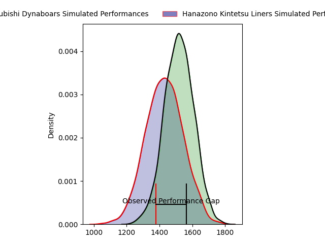
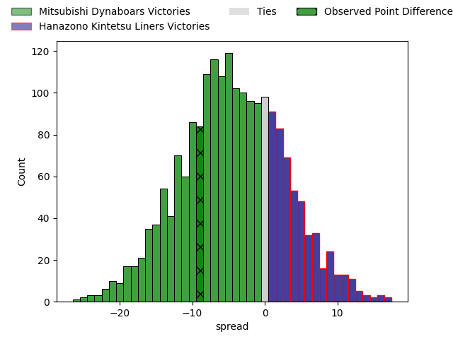
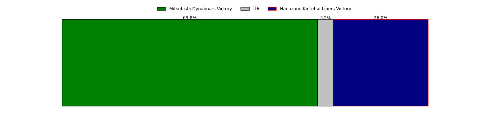
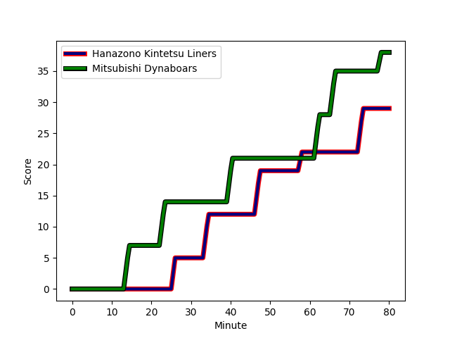
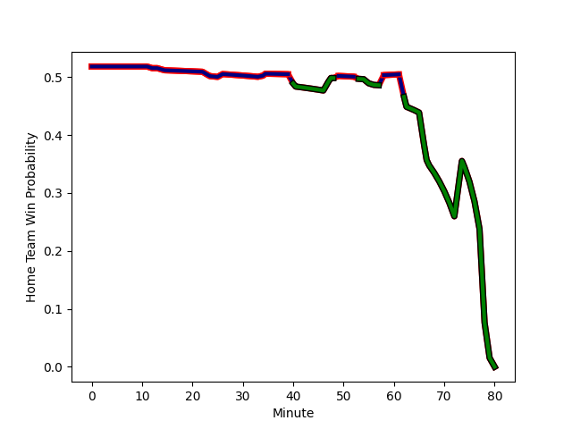

---  
layout: page  
title: Mitsubishi Dynaboars at Hanazono Kintetsu Liners; 38-29  
date: 2023-03-05 04:00:00 18:00:00 -0500  
categories: match review  
---
# Mitsubishi Dynaboars at Hanazono Kintetsu Liners; 38-29

# Club Level Predictions

The first set of predictions treats a club as the smallest object, as the club develops its members, organizes a gameplan, and deploys its players as needed for each match. This club model has a prediction of 0.383, which translates to predicting Mitsubishi Dynaboars to win by 4.3.

Each club has a rating and a rating deviation (simiar to a Glicko system), and expected performances can be generated. This allows for simulated matches and spreads like the ones below.
## Projected Performances

## Projected Spreads

## Projected Results

# Player Level Predictions

Treating teams instead as an entity made up of the currently active players, I have ratings for each player in an altogether different system. These can be combined to form team ratings once teamsheets are announced, weighting starters a bit higher than the reserves. After the match is played, players can be weighted by their minutes on the field, allowing for an accurate measure of the team's composition. With these compiled team ratings, we can make predictions, measure inaccuracy, and update the individual player ratings.
## Prediction with Player Minutes: Hanazono Kintetsu Liners by 7.2

Hanazono Kintetsu Liners by 3.2 on a neutral field
## Scores over Time

## Win Probability over Time

There were 10 large changes in win probability in this match
## Prediction without Player Minutes: Hanazono Kintetsu Liners by 20.3

Hanazono Kintetsu Liners by 16.3 on a neutral pitch

|   Away Minutes | Away Player                                                                 |   Away elo |   Away Percentile |   Number |   Home Percentile |   Home elo | Home Player                                                               |   Home Minutes |
|---------------:|:----------------------------------------------------------------------------|-----------:|------------------:|---------:|------------------:|-----------:|:--------------------------------------------------------------------------|---------------:|
|             56 | [Hayato Hosoda](..//playerfiles//HayatoHosoda_cleaned.md)                   |      75.95 |                 7 |        1 |                67 |      97.35 | [Kotaro Takahashi](..//playerfiles//KotaroTakahashi_cleaned.md)           |             12 |
|             80 | [Yuki Miyazato](..//playerfiles//YukiMiyazato_cleaned.md)                   |      74.16 |                 6 |        2 |                88 |     108.79 | [Atsushi Kashimoto](..//playerfiles//AtsushiKashimoto_cleaned.md)         |             53 |
|             80 | [Mototsugu Hachiya](..//playerfiles//MototsuguHachiya_cleaned.md)           |      88.15 |                42 |        3 |                 7 |      68.88 | [Lata Tangimana](..//playerfiles//LataTangimana_cleaned.md)               |             49 |
|             80 | [Daniel Linde](..//playerfiles//DanielLinde_cleaned.md)                     |      79.43 |                13 |        4 |                14 |      80.35 | [Isamu Matsuoka](..//playerfiles//IsamuMatsuoka_cleaned.md)               |             40 |
|             80 | [Walt Steenkamp](..//playerfiles//WaltSteenkamp_cleaned.md)                 |      76.72 |                10 |        5 |                19 |      83.66 | [Takahito Sugahara](..//playerfiles//TakahitoSugahara_cleaned.md)         |             80 |
|             80 | [Masataka Tsuruya](..//playerfiles//MasatakaTsuruya_cleaned.md)             |     106.29 |                78 |        6 |                46 |      93.64 | [Hayato Yokoi](..//playerfiles//HayatoYokoi_cleaned.md)                   |             67 |
|             80 | [Yusuke Sakamoto](..//playerfiles//YusukeSakamoto_cleaned.md)               |      73.93 |                 6 |        7 |                84 |     109.66 | [Shohei Nonaka](..//playerfiles//ShoheiNonaka_cleaned.md)                 |             80 |
|             80 | [Epineri Uluviti](..//playerfiles//EpineriUluviti_cleaned.md)               |      81.93 |                17 |        8 |                38 |      91.91 | [Waimana Kapa](..//playerfiles//WaimanaKapa_cleaned.md)                   |             80 |
|             80 | [Kota Iwamura](..//playerfiles//KotaIwamura_cleaned.md)                     |      92.65 |                45 |        9 |                 0 |      48.97 | [William Genia](..//playerfiles//WilliamGenia_cleaned.md)                 |             79 |
|             55 | [Jamie Shillcock](..//playerfiles//JamieShillcock_cleaned.md)               |      61.35 |                 2 |       10 |                 2 |      57.96 | [Jackson Garden-Bachop](..//playerfiles//JacksonGarden-Bachop_cleaned.md) |             80 |
|             80 | [Honeti Taumoha'apai](..//playerfiles//HonetiTaumoha'apai_cleaned.md)       |     100.72 |                67 |       11 |                 1 |      51.62 | [Sioasia Fifita](..//playerfiles//SioasiaFifita_cleaned.md)               |             80 |
|             80 | [Brackin Karauria-Henry](..//playerfiles//BrackinKarauria-Henry_cleaned.md) |      74.45 |                 8 |       12 |                98 |     135.56 | [Patrick Stehlin](..//playerfiles//PatrickStehlin_cleaned.md)             |             79 |
|             80 | [Curtis Rona](..//playerfiles//CurtisRona_cleaned.md)                       |      82.47 |                16 |       13 |                12 |      77.99 | [Koji Okamura](..//playerfiles//KojiOkamura_cleaned.md)                   |             80 |
|             80 | [Jonmoon Han](..//playerfiles//JonmoonHan_cleaned.md)                       |      84.69 |                20 |       14 |                22 |      85.09 | [Joshua Nohra](..//playerfiles//JoshuaNohra_cleaned.md)                   |             67 |
|             34 | [Roland Alaiasa](..//playerfiles//RolandAlaiasa_cleaned.md)                 |      74.44 |                11 |       15 |                88 |     112.63 | [Tatsuma Nanto](..//playerfiles//TatsumaNanto_cleaned.md)                 |             80 |
|             46 | [Nozomi Nara](..//playerfiles//NozomiNara_cleaned.md)                       |      99.49 |                63 |       16 |                20 |      85.63 | [Kenta Tanaka](..//playerfiles//KentaTanaka_cleaned.md)                   |             68 |
|             25 | [Matt To'omua](..//playerfiles//MattTo'omua_cleaned.md)                     |      88.83 |                31 |       17 |                 2 |      63.48 | [Daiki Miyashita](..//playerfiles//DaikiMiyashita_cleaned.md)             |             40 |
|             24 | [Shunsuke Sakamoto](..//playerfiles//ShunsukeSakamoto_cleaned.md)           |      84.5  |                30 |       18 |                20 |      85.54 | [Kota Mitake](..//playerfiles//KotaMitake_cleaned.md)                     |             31 |
|            nan | nan                                                                         |     nan    |               nan |       19 |                11 |      80.5  | [Jed Brown](..//playerfiles//JedBrown_cleaned.md)                         |             13 |
|            nan | nan                                                                         |     nan    |               nan |       20 |                17 |      82.85 | [Akihide Onogi](..//playerfiles//AkihideOnogi_cleaned.md)                 |             13 |
|            nan | nan                                                                         |     nan    |               nan |       21 |               nan |      95    | [Sho Fukui](..//playerfiles//ShoFukui_cleaned.md)                         |             27 |
|            nan | nan                                                                         |     nan    |               nan |       22 |               nan |      95    | [Tomoya Nakamura](..//playerfiles//TomoyaNakamura_cleaned.md)             |              1 |
|            nan | nan                                                                         |     nan    |               nan |       23 |               nan |      93.5  | [Haruki Kanazawa](..//playerfiles//HarukiKanazawa_cleaned.md)             |              1 |

