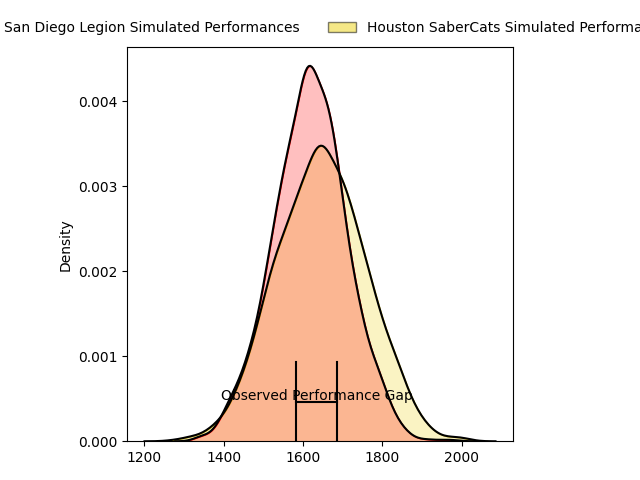
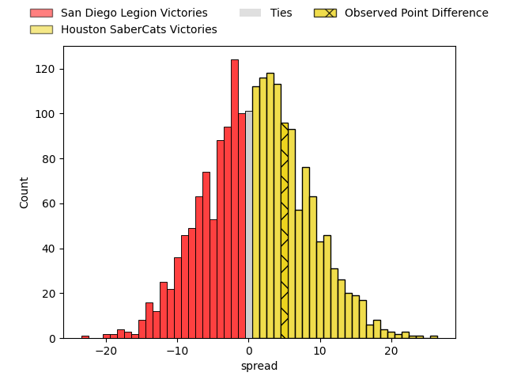
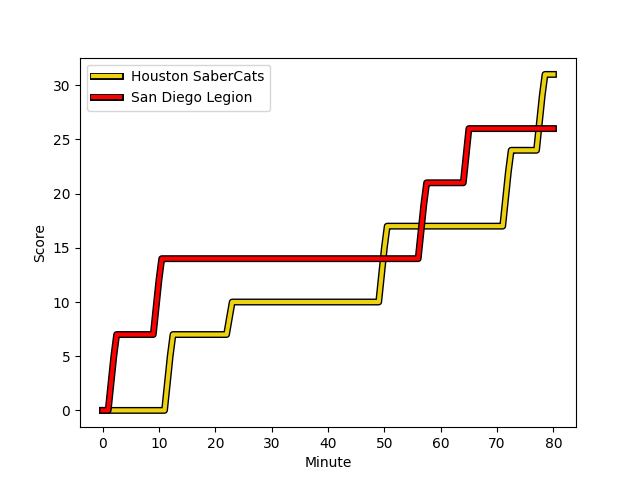
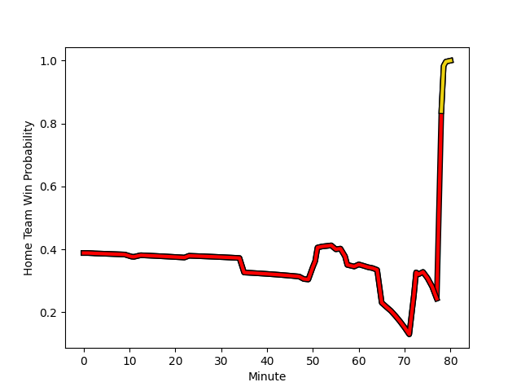

---  
layout: page  
title: San Diego Legion at Houston SaberCats; 26-31  
date: 2023-03-05 21:00:00 18:00:00 -0500  
categories: match review  
---
# San Diego Legion at Houston SaberCats; 26-31

# Club Level Predictions

The first set of predictions treats a club as the smallest object, as the club develops its members, organizes a gameplan, and deploys its players as needed for each match. This club model has a prediction of 0.536, which translates to predicting Houston SaberCats to win by 1.3.

Each club has a rating and a rating deviation (simiar to a Glicko system), and expected performances can be generated. This allows for simulated matches and spreads like the ones below.
## Projected Performances

## Projected Spreads

## Projected Results

# Player Level Predictions

Treating teams instead as an entity made up of the currently active players, I have ratings for each player in an altogether different system. These can be combined to form team ratings once teamsheets are announced, weighting starters a bit higher than the reserves. After the match is played, players can be weighted by their minutes on the field, allowing for an accurate measure of the team's composition. With these compiled team ratings, we can make predictions, measure inaccuracy, and update the individual player ratings.
## Prediction with Player Minutes: San Diego Legion by 15.8

San Diego Legion by 19.8 on a neutral field
## Scores over Time

## Win Probability over Time

There were 11 large changes in win probability in this match
## Prediction without Player Minutes: San Diego Legion by 13.2

San Diego Legion by 17.2 on a neutral pitch

|   Away Minutes | Away Player                                                             |   Away elo |   Away Percentile |   Number |   Home Percentile |   Home elo | Home Player                                                                              |   Home Minutes |
|---------------:|:------------------------------------------------------------------------|-----------:|------------------:|---------:|------------------:|-----------:|:-----------------------------------------------------------------------------------------|---------------:|
|             55 | [Faka'osi Pifeleti](..//playerfiles//Faka'osiPifeleti_cleaned.md)       |      66.36 |                 3 |        1 |                59 |      97.45 | [Rob Cobb](..//playerfiles//RobCobb_cleaned.md)                                          |             57 |
|             60 | [Sama Malolo](..//playerfiles//SamaMalolo_cleaned.md)                   |     115.92 |                93 |        2 |                54 |      95.3  | [Axel Zapata](..//playerfiles//AxelZapata_cleaned.md)                                    |             57 |
|             55 | [Chris Baumann](..//playerfiles//ChrisBaumann_cleaned.md)               |      95.91 |               nan |        3 |                61 |      97.8  | [Morgan Mitchell](..//playerfiles//MorganMitchell_cleaned.md)                            |             67 |
|             80 | [Ben Grant](..//playerfiles//BenGrant_cleaned.md)                       |     122.34 |                95 |        4 |                49 |      94.72 | [Siaosi Mahoni](..//playerfiles//SiaosiMahoni_cleaned.md)                                |             48 |
|             74 | [Isaac Ross](..//playerfiles//IsaacRoss_cleaned.md)                     |      98.65 |                61 |        5 |                 5 |      70.43 | [Nathan Den Hoedt](..//playerfiles//NathanDenHoedt_cleaned.md)                           |             80 |
|             80 | [Christian Poidevin](..//playerfiles//ChristianPoidevin_cleaned.md)     |      85.78 |                22 |        6 |                60 |      97.99 | [Hanco Germishuys](..//playerfiles//HancoGermishuys_cleaned.md)                          |             80 |
|             80 | [Blair Cowan](..//playerfiles//BlairCowan_cleaned.md)                   |      99.9  |                66 |        7 |                 0 |      16.15 | [Keni Nasoqeqe](..//playerfiles//KeniNasoqeqe_cleaned.md)                                |             51 |
|             52 | [Tupou Afungia](..//playerfiles//TupouAfungia_cleaned.md)               |      99.9  |                63 |        8 |                36 |      91.28 | [Gideon van Wyk](..//playerfiles//GideonvanWyk_cleaned.md)                               |             80 |
|             80 | [Richard Judd](..//playerfiles//RichardJudd_cleaned.md)                 |      99.52 |                64 |        9 |                24 |      85.95 | [Carlo de Nysschen](..//playerfiles//CarlodeNysschen_cleaned.md)                         |             35 |
|             35 | [Josh Henderson](..//playerfiles//JoshHenderson_cleaned.md)             |      87.03 |                24 |       10 |                 5 |      72.45 | [David Coetzer](..//playerfiles//DavidCoetzer_cleaned.md)                                |             57 |
|             80 | [Nathaniel Augspurger](..//playerfiles//NathanielAugspurger_cleaned.md) |      99.9  |                64 |       11 |                37 |      91.03 | [Vereniki Tikoisolomone](..//playerfiles//VerenikiTikoisolomone_cleaned.md)              |             80 |
|             63 | [Ma'a Nonu](..//playerfiles//Ma'aNonu_cleaned.md)                       |      99.36 |                63 |       12 |                 7 |      73.93 | [Dominic Akina](..//playerfiles//DominicAkina_cleaned.md)                                |             80 |
|             80 | [Marcel Brache](..//playerfiles//MarcelBrache_cleaned.md)               |      99.9  |                65 |       13 |                58 |      97.99 | [Christian Dyer](..//playerfiles//ChristianDyer_cleaned.md)                              |             80 |
|             80 | [Tomas Aoake](..//playerfiles//TomasAoake_cleaned.md)                   |      99.9  |                64 |       14 |                47 |      93.6  | [Gherardus Jacobus Labuschagne](..//playerfiles//GherardusJacobusLabuschagne_cleaned.md) |             80 |
|             80 | [Mike Te'o](..//playerfiles//MikeTe'o_cleaned.md)                       |      99.9  |                64 |       15 |                57 |      97.99 | [Drew Wild](..//playerfiles//DrewWild_cleaned.md)                                        |             80 |
|             25 | [Djustice Sears-Duru](..//playerfiles//DjusticeSears-Duru_cleaned.md)   |      96.16 |               nan |       16 |                71 |     101.39 | [Alec McDonnell](..//playerfiles//AlecMcDonnell_cleaned.md)                              |             23 |
|             20 | [Shilo Klein](..//playerfiles//ShiloKlein_cleaned.md)                   |      96.71 |               nan |       17 |               nan |      95.25 | [Andrew Tuala](..//playerfiles//AndrewTuala_cleaned.md)                                  |             23 |
|             25 | [Fred Fatumanu Apulu](..//playerfiles//FredFatumanuApulu_cleaned.md)    |      91.57 |               nan |       18 |               nan |     102.32 | [Pono Davis](..//playerfiles//PonoDavis_cleaned.md)                                      |             13 |
|              6 | [Chris Turori](..//playerfiles//ChrisTurori_cleaned.md)                 |      54.95 |               nan |       19 |                16 |      82.34 | [Marno Redelinghuys](..//playerfiles//MarnoRedelinghuys_cleaned.md)                      |             32 |
|             28 | [Dan Pryor](..//playerfiles//DanPryor_cleaned.md)                       |      96.72 |                56 |       20 |                41 |      93.01 | [Emmanuel Albert](..//playerfiles//EmmanuelAlbert_cleaned.md)                            |             29 |
|             45 | [Will Hooley](..//playerfiles//WillHooley_cleaned.md)                   |      96    |               nan |       21 |                 0 |      10.54 | [Nick Boyer](..//playerfiles//NickBoyer_cleaned.md)                                      |             45 |
|             17 | [Ryan Matyas](..//playerfiles//RyanMatyas_cleaned.md)                   |      95.54 |               nan |       22 |                99 |     139.33 | [Robert Povey](..//playerfiles//RobertPovey_cleaned.md)                                  |             23 |

