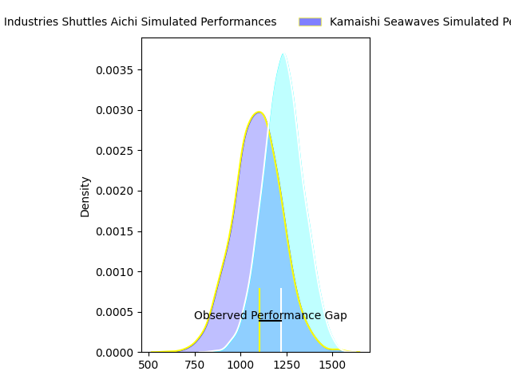
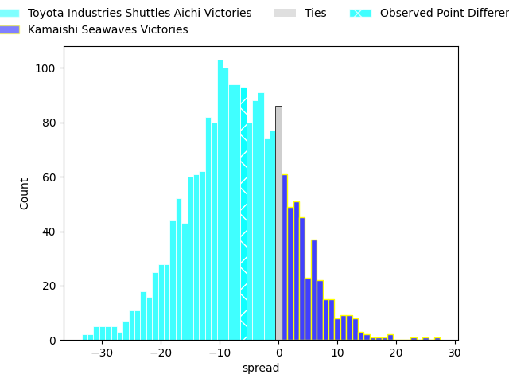
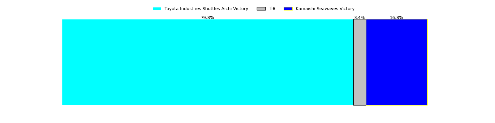
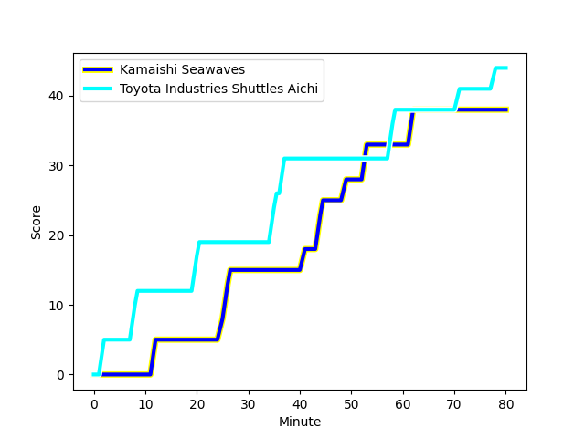
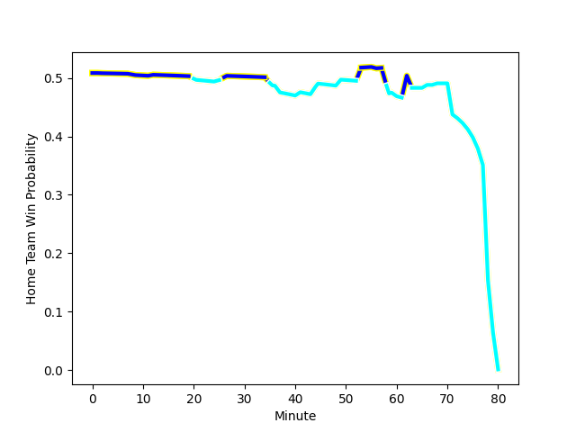

---  
layout: page  
title: Toyota Industries Shuttles Aichi at Kamaishi Seawaves; 44-38  
date: 2023-03-05 00:00:00 18:00:00 -0500  
categories: match review  
---
# Toyota Industries Shuttles Aichi at Kamaishi Seawaves; 44-38

# Club Level Predictions

The first set of predictions treats a club as the smallest object, as the club develops its members, organizes a gameplan, and deploys its players as needed for each match. This club model has a prediction of 0.313, which translates to predicting Toyota Industries Shuttles Aichi to win by 7.2.

Each club has a rating and a rating deviation (simiar to a Glicko system), and expected performances can be generated. This allows for simulated matches and spreads like the ones below.
## Projected Performances

## Projected Spreads

## Projected Results

# Player Level Predictions

Treating teams instead as an entity made up of the currently active players, I have ratings for each player in an altogether different system. These can be combined to form team ratings once teamsheets are announced, weighting starters a bit higher than the reserves. After the match is played, players can be weighted by their minutes on the field, allowing for an accurate measure of the team's composition. With these compiled team ratings, we can make predictions, measure inaccuracy, and update the individual player ratings.
## Prediction with Player Minutes: Kamaishi Seawaves by 5.5

Kamaishi Seawaves by 1.5 on a neutral field
## Scores over Time

## Win Probability over Time

There were 7 large changes in win probability in this match
## Prediction without Player Minutes: Kamaishi Seawaves by 4.2

Kamaishi Seawaves by 0.2 on a neutral pitch

|   Away Minutes | Away Player                                                              |   Away elo |   Away Percentile |   Number |   Home Percentile |   Home elo | Home Player                                                              |   Home Minutes |
|---------------:|:-------------------------------------------------------------------------|-----------:|------------------:|---------:|------------------:|-----------:|:-------------------------------------------------------------------------|---------------:|
|             59 | [Tomoki Yamaguchi](..//playerfiles//TomokiYamaguchi_cleaned.md)          |     119.03 |                95 |        1 |                21 |      85.98 | [Takuya Takahashi](..//playerfiles//TakuyaTakahashi_cleaned.md)          |             78 |
|             59 | [Akito Fujinami](..//playerfiles//AkitoFujinami_cleaned.md)              |      61.76 |                 2 |        2 |                10 |      78.62 | [Daiki Ito](..//playerfiles//DaikiIto_cleaned.md)                        |             68 |
|             68 | [Ryota Fukamura](..//playerfiles//RyotaFukamura_cleaned.md)              |      84.41 |                25 |        3 |                69 |     100.2  | [Taiki Noguchi](..//playerfiles//TaikiNoguchi_cleaned.md)                |             56 |
|             80 | [James Gaskell](..//playerfiles//JamesGaskell_cleaned.md)                |      95    |               nan |        4 |                25 |      87.68 | [Dallas Tatana](..//playerfiles//DallasTatana_cleaned.md)                |             80 |
|             63 | [Yoann Maestri](..//playerfiles//YoannMaestri_cleaned.md)                |      78.96 |                12 |        5 |                46 |      93.57 | [Ben Nee Nee](..//playerfiles//BenNeeNee_cleaned.md)                     |             80 |
|             71 | [Itaru Taniguchi](..//playerfiles//ItaruTaniguchi_cleaned.md)            |      89.84 |               nan |        6 |                27 |      87.52 | [Ryota Kano](..//playerfiles//RyotaKano_cleaned.md)                      |             63 |
|             80 | [Yamato Matsuoka](..//playerfiles//YamatoMatsuoka_cleaned.md)            |      81.81 |                15 |        7 |                30 |      88.63 | [Daisuke Musya](..//playerfiles//DaisukeMusya_cleaned.md)                |             80 |
|             80 | [Talifolofola Tangipa](..//playerfiles//TalifolofolaTangipa_cleaned.md)  |     107.21 |                80 |        8 |                76 |     104.12 | [Sam Henwood](..//playerfiles//SamHenwood_cleaned.md)                    |             63 |
|             68 | [Riku Morisaki](..//playerfiles//RikuMorisaki_cleaned.md)                |      84.77 |                21 |        9 |                 9 |      75.49 | [Youhei Murakami](..//playerfiles//YouheiMurakami_cleaned.md)            |             66 |
|             80 | [Akihiro Shimizu](..//playerfiles//AkihiroShimizu_cleaned.md)            |      89.39 |                31 |       10 |                27 |      90.25 | [Joshua Trevor Stander](..//playerfiles//JoshuaTrevorStander_cleaned.md) |             60 |
|             80 | [Go Nakano](..//playerfiles//GoNakano_cleaned.md)                        |     103.25 |                73 |       11 |                 7 |      72.15 | [Kodai Ono](..//playerfiles//KodaiOno_cleaned.md)                        |             80 |
|             63 | [Keita Ichikawa](..//playerfiles//KeitaIchikawa_cleaned.md)              |      84.63 |                20 |       12 |                12 |      80.16 | [Osuka Lloyd Murata](..//playerfiles//OsukaLloydMurata_cleaned.md)       |             60 |
|             80 | [James Mollentze](..//playerfiles//JamesMollentze_cleaned.md)            |      63.18 |                 3 |       13 |                89 |     112.03 | [Kohei Ishigaki](..//playerfiles//KoheiIshigaki_cleaned.md)              |             80 |
|             80 | [Hiroaki Saito](..//playerfiles//HiroakiSaito_cleaned.md)                |      77.57 |                11 |       14 |                51 |      95.25 | [Ryuji Abe](..//playerfiles//RyujiAbe_cleaned.md)                        |             80 |
|             78 | [Timothy Gregory Swiel](..//playerfiles//TimothyGregorySwiel_cleaned.md) |      93.24 |                48 |       15 |                53 |      96.5  | [Cameron Bailey](..//playerfiles//CameronBailey_cleaned.md)              |             80 |
|             21 | [Hyosuke Watanabe](..//playerfiles//HyosukeWatanabe_cleaned.md)          |      98.88 |                74 |       16 |                23 |      88.58 | [Shun Terawaki](..//playerfiles//ShunTerawaki_cleaned.md)                |             24 |
|             21 | [Tomoya Watanabe](..//playerfiles//TomoyaWatanabe_cleaned.md)            |      72.24 |               nan |       17 |                 2 |      59.16 | [Ryoma Nakamura](..//playerfiles//RyomaNakamura_cleaned.md)              |             20 |
|             17 | [Ryuichiro Fukutsubo](..//playerfiles//RyuichiroFukutsubo_cleaned.md)    |     120.73 |                94 |       18 |               nan |      95    | [Gerdus van der Walt](..//playerfiles//GerdusvanderWalt_cleaned.md)      |             20 |
|             17 | [Josh Matavesi](..//playerfiles//JoshMatavesi_cleaned.md)                |      91.92 |                41 |       19 |                 4 |      68.14 | [Ryunosuke Yamada](..//playerfiles//RyunosukeYamada_cleaned.md)          |             17 |
|             12 | [Harumoto Kodera](..//playerfiles//HarumotoKodera_cleaned.md)            |      86.19 |                21 |       20 |               nan |      87.99 | [Seta Koroitamana](..//playerfiles//SetaKoroitamana_cleaned.md)          |             17 |
|             12 | [Taisei Okamoto](..//playerfiles//TaiseiOkamoto_cleaned.md)              |      93.34 |               nan |       21 |               nan |      96.07 | [Takumi Tokairin](..//playerfiles//TakumiTokairin_cleaned.md)            |             14 |
|              9 | [Taishi Nakamura](..//playerfiles//TaishiNakamura_cleaned.md)            |      94.05 |                48 |       22 |               nan |      99.9  | [Tastuji Yoshida](..//playerfiles//TastujiYoshida_cleaned.md)            |             12 |
|              2 | [Yuki Omichi](..//playerfiles//YukiOmichi_cleaned.md)                    |     143.43 |                99 |       23 |                17 |      84.98 | [Shoichiro Inada](..//playerfiles//ShoichiroInada_cleaned.md)            |              2 |

