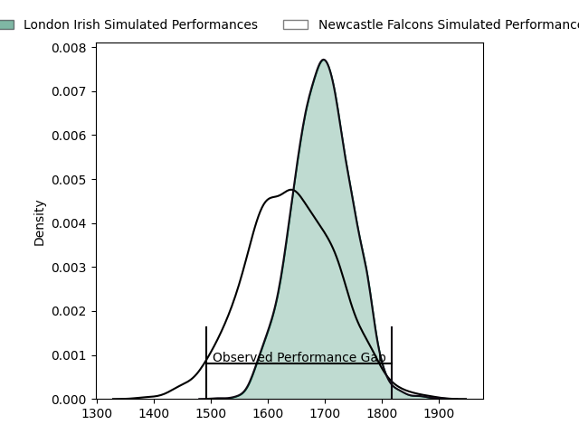
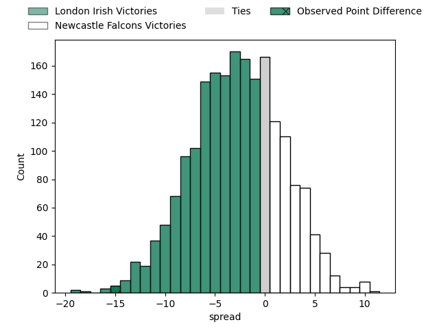
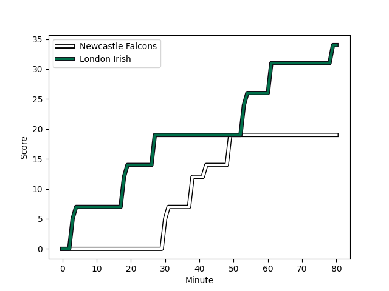
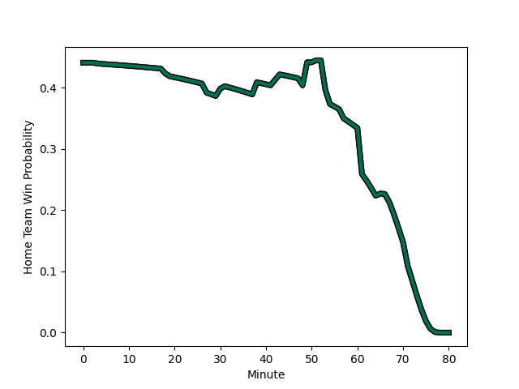

---  
layout: page  
title: London Irish at Newcastle Falcons; 34.0-19.0  
date: 2023-03-05 10:00:00 18:00:00 -0500  
categories: match review  
---
# London Irish at Newcastle Falcons; 34.0-19.0

# Club Level Predictions

The first set of predictions treats a club as the smallest object, as the club develops its members, organizes a gameplan, and deploys its players as needed for each match. This club model has a prediction of 0.423, which translates to predicting London Irish to win by 2.7.

Each club has a rating and a rating deviation (simiar to a Glicko system), and expected performances can be generated. This allows for simulated matches and spreads like the ones below.
## Projected Performances

## Projected Spreads

## Projected Results

# Player Level Predictions

Treating teams instead as an entity made up of the currently active players, I have ratings for each player in an altogether different system. These can be combined to form team ratings once teamsheets are announced, weighting starters a bit higher than the reserves. After the match is played, players can be weighted by their minutes on the field, allowing for an accurate measure of the team's composition. With these compiled team ratings, we can make predictions, measure inaccuracy, and update the individual player ratings.
## Prediction with Player Minutes: London Irish by 6.8

London Irish by 10.8 on a neutral field
## Scores over Time

## Win Probability over Time

There were 4 large changes in win probability in this match
## Prediction without Player Minutes: London Irish by 6.8

London Irish by 10.8 on a neutral pitch

|   Away Minutes | Away Player                                                                       |   Away elo |   Away Percentile |   Number |   Home Percentile |   Home elo | Home Player                                                          |   Home Minutes |
|---------------:|:----------------------------------------------------------------------------------|-----------:|------------------:|---------:|------------------:|-----------:|:---------------------------------------------------------------------|---------------:|
|             66 | [Danilo Fischetti](..//playerfiles//DaniloFischetti_cleaned.md)                   |     100.01 |                68 |        1 |                78 |     101.27 | [Adam Brocklebank](..//playerfiles//AdamBrocklebank_cleaned.md)      |             60 |
|             43 | [Agustin Creevy](..//playerfiles//AgustinCreevy_cleaned.md)                       |     115.31 |                93 |        2 |                37 |      90.72 | [Jamie Blamire](..//playerfiles//JamieBlamire_cleaned.md)            |             80 |
|             66 | [Oli Hoskins](..//playerfiles//OliHoskins_cleaned.md)                             |     112.23 |                90 |        3 |                 3 |      68.32 | [Trevor Davison](..//playerfiles//TrevorDavison_cleaned.md)          |             65 |
|             51 | [Api Ratuniyarawa](..//playerfiles//ApiRatuniyarawa_cleaned.md)                   |      95.54 |                52 |        4 |                14 |      81.84 | [Matthew Dalton](..//playerfiles//MatthewDalton_cleaned.md)          |             69 |
|             80 | [Rob Simmons](..//playerfiles//RobSimmons_cleaned.md)                             |     134.76 |                98 |        5 |                 9 |      74.62 | [Sebastian de Chaves](..//playerfiles//SebastiandeChaves_cleaned.md) |             80 |
|             80 | [Josh Basham](..//playerfiles//JoshBasham_cleaned.md)                             |      84.5  |                19 |        6 |               nan |      97.03 | [Pedro Rubiolo](..//playerfiles//PedroRubiolo_cleaned.md)            |             80 |
|             80 | [Tom Pearson](..//playerfiles//TomPearson_cleaned.md)                             |     130.65 |                97 |        7 |                74 |     103.33 | [Callum Chick](..//playerfiles//CallumChick_cleaned.md)              |             80 |
|             69 | [Chandler Cunningham-South](..//playerfiles//ChandlerCunningham-South_cleaned.md) |      96.15 |                55 |        8 |                97 |     122.42 | [Carl Fearns](..//playerfiles//CarlFearns_cleaned.md)                |             57 |
|             79 | [Ben White](..//playerfiles//BenWhite_cleaned.md)                                 |     107.3  |                84 |        9 |                92 |     113.59 | [Michael Young](..//playerfiles//MichaelYoung_cleaned.md)            |             71 |
|             80 | [Paddy Jackson](..//playerfiles//PaddyJackson_cleaned.md)                         |     126.74 |                95 |       10 |                47 |      94.32 | [Brett Connon](..//playerfiles//BrettConnon_cleaned.md)              |             65 |
|             80 | [Ollie Hassell-Collins](..//playerfiles//OllieHassell-Collins_cleaned.md)         |      88.89 |                30 |       11 |                47 |      93.95 | [Mateo Carreras](..//playerfiles//MateoCarreras_cleaned.md)          |             80 |
|             80 | [Benhard Janse van Rensburg](..//playerfiles//BenhardJansevanRensburg_cleaned.md) |     110.66 |                88 |       12 |                13 |      80.59 | [Matias Orlando](..//playerfiles//MatiasOrlando_cleaned.md)          |             67 |
|             48 | [Will Joseph](..//playerfiles//WillJoseph_cleaned.md)                             |      93.26 |                44 |       13 |                96 |     121.76 | [Matias Moroni](..//playerfiles//MatiasMoroni_cleaned.md)            |             80 |
|             80 | [Lucio Cinti](..//playerfiles//LucioCinti_cleaned.md)                             |      87.39 |                24 |       14 |                98 |     131.92 | [Adam Radwan](..//playerfiles//AdamRadwan_cleaned.md)                |             80 |
|             79 | [Ben Loader](..//playerfiles//BenLoader_cleaned.md)                               |     106.36 |                80 |       15 |                67 |      97.39 | [Alex Tait](..//playerfiles//AlexTait_cleaned.md)                    |             80 |
|             37 | [Matthew Cornish](..//playerfiles//MatthewCornish_cleaned.md)                     |      95    |               nan |       16 |               nan |      94.24 | [Ollie Fletcher](..//playerfiles//OllieFletcher_cleaned.md)          |              0 |
|             14 | [Facundo Gigena](..//playerfiles//FacundoGigena_cleaned.md)                       |      98.31 |                63 |       17 |                79 |     103.92 | [Logovi'i Mulipola](..//playerfiles//Logovi'iMulipola_cleaned.md)    |             20 |
|             14 | [Lovejoy Chawatama](..//playerfiles//LovejoyChawatama_cleaned.md)                 |      77.83 |                 9 |       18 |               nan |      93.14 | [Mark Tampin](..//playerfiles//MarkTampin_cleaned.md)                |             15 |
|             29 | [Josh Caulfield](..//playerfiles//JoshCaulfield_cleaned.md)                       |      89.38 |               nan |       19 |                74 |     101.49 | [Freddie Lockwood](..//playerfiles//FreddieLockwood_cleaned.md)      |             23 |
|             11 | [Matt Rogerson](..//playerfiles//MattRogerson_cleaned.md)                         |     107.48 |                81 |       20 |               nan |      85.96 | [Tom Marshall](..//playerfiles//TomMarshall_cleaned.md)              |             11 |
|              1 | [Hugh O'Sullivan](..//playerfiles//HughO'Sullivan_cleaned.md)                     |      92.84 |               nan |       21 |                 2 |      62.81 | [Sam Stuart](..//playerfiles//SamStuart_cleaned.md)                  |              9 |
|             32 | [Luca Morisi](..//playerfiles//LucaMorisi_cleaned.md)                             |     110.92 |                88 |       22 |                88 |     112.23 | [Tian Schoeman](..//playerfiles//TianSchoeman_cleaned.md)            |             15 |
|              1 | [James Stokes](..//playerfiles//JamesStokes_cleaned.md)                           |      99.07 |                60 |       23 |               nan |      92.59 | [Pete Lucock](..//playerfiles//PeteLucock_cleaned.md)                |             13 |

