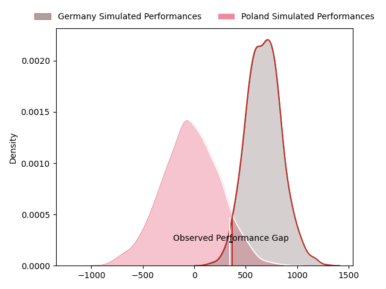
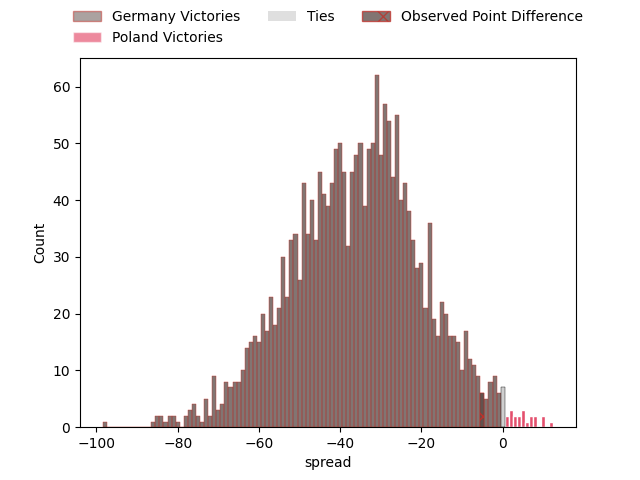
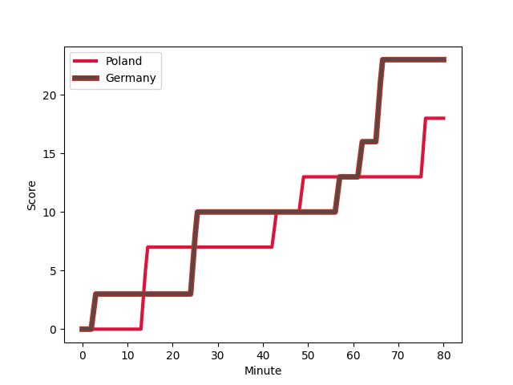
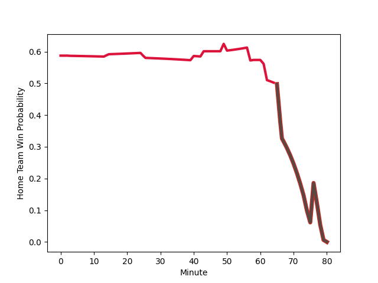

---  
layout: page  
title: Germany at Poland; 23-18  
date: 2023-03-05 20:00:00 18:00:00 -0500  
categories: match review  
---
# Germany at Poland; 23-18

# Club Level Predictions

The first set of predictions treats a club as the smallest object, as the club develops its members, organizes a gameplan, and deploys its players as needed for each match. This club model has a prediction of 0.027, which translates to predicting Germany to win by 35.6.

Each club has a rating and a rating deviation (simiar to a Glicko system), and expected performances can be generated. This allows for simulated matches and spreads like the ones below.
## Projected Performances

## Projected Spreads

## Projected Results

# Player Level Predictions

Treating teams instead as an entity made up of the currently active players, I have ratings for each player in an altogether different system. These can be combined to form team ratings once teamsheets are announced, weighting starters a bit higher than the reserves. After the match is played, players can be weighted by their minutes on the field, allowing for an accurate measure of the team's composition. With these compiled team ratings, we can make predictions, measure inaccuracy, and update the individual player ratings.
## Prediction with Player Minutes: Poland by 18.8

Poland by 14.8 on a neutral field
## Scores over Time

## Win Probability over Time

There were 14 large changes in win probability in this match
## Prediction without Player Minutes: Poland by 20.7

Poland by 16.7 on a neutral pitch

|   Away Minutes | Away Player                                                            |   Away elo |   Away Percentile |   Number |   Home Percentile |   Home elo | Home Player                                                             |   Home Minutes |
|---------------:|:-----------------------------------------------------------------------|-----------:|------------------:|---------:|------------------:|-----------:|:------------------------------------------------------------------------|---------------:|
|             57 | [Jörn Schroder](..//playerfiles//JörnSchroder_cleaned.md)              |      73.92 |                 6 |        1 |                63 |      98.5  | [Tom Fidler](..//playerfiles//TomFidler_cleaned.md)                     |             74 |
|             50 | [Elias Ezequiel Haase](..//playerfiles//EliasEzequielHaase_cleaned.md) |      82.57 |               nan |        2 |                66 |     105.81 | [Grzegorz Buczek](..//playerfiles//GrzegorzBuczek_cleaned.md)           |             80 |
|             50 | [Elias Ezequiel Haase](..//playerfiles//EliasEzequielHaase_cleaned.md) |      82.57 |               nan |        2 |                83 |     105.81 | [Grzegorz Buczek](..//playerfiles//GrzegorzBuczek_cleaned.md)           |             80 |
|             40 | [Mathis Blume](..//playerfiles//MathisBlume_cleaned.md)                |      93.44 |               nan |        3 |               nan |      98.14 | [Craig Bachurzewski](..//playerfiles//CraigBachurzewski_cleaned.md)     |             61 |
|             80 | [Michel Himmer](..//playerfiles//MichelHimmer_cleaned.md)              |      90.88 |                17 |        4 |                65 |      99.31 | [Jan Cal](..//playerfiles//JanCal_cleaned.md)                           |             74 |
|             80 | [Michel Himmer](..//playerfiles//MichelHimmer_cleaned.md)              |      90.88 |                36 |        4 |                65 |      99.31 | [Jan Cal](..//playerfiles//JanCal_cleaned.md)                           |             74 |
|             50 | [Hassan Omar Rayan](..//playerfiles//HassanOmarRayan_cleaned.md)       |      77.16 |                10 |        5 |               nan |      95    | [Michat Mirosz](..//playerfiles//MichatMirosz_cleaned.md)               |             50 |
|             80 | [Oliver Stein](..//playerfiles//OliverStein_cleaned.md)                |      88.87 |                29 |        6 |               nan |      95    | [Brandon Olow](..//playerfiles//BrandonOlow_cleaned.md)                 |             50 |
|             80 | [Justin Renc](..//playerfiles//JustinRenc_cleaned.md)                  |      91.77 |                41 |        7 |                35 |      94.08 | [Siokivaha Taufui](..//playerfiles//SiokivahaTaufui_cleaned.md)         |             80 |
|             80 | [Sebastian Ferreira](..//playerfiles//SebastianFerreira_cleaned.md)    |      92.92 |                29 |        8 |                50 |      96.15 | [Piotr Zeszutek](..//playerfiles//PiotrZeszutek_cleaned.md)             |             80 |
|             80 | [Sebastian Ferreira](..//playerfiles//SebastianFerreira_cleaned.md)    |      92.92 |                43 |        8 |                50 |      96.15 | [Piotr Zeszutek](..//playerfiles//PiotrZeszutek_cleaned.md)             |             80 |
|             80 | [Sebastian Ferreira](..//playerfiles//SebastianFerreira_cleaned.md)    |      92.92 |                43 |        8 |                23 |      96.15 | [Piotr Zeszutek](..//playerfiles//PiotrZeszutek_cleaned.md)             |             80 |
|             80 | [Sebastian Ferreira](..//playerfiles//SebastianFerreira_cleaned.md)    |      92.92 |                29 |        8 |                23 |      96.15 | [Piotr Zeszutek](..//playerfiles//PiotrZeszutek_cleaned.md)             |             80 |
|             61 | [Oliver Paine](..//playerfiles//OliverPaine_cleaned.md)                |      58.7  |                 1 |        9 |                42 |      92.09 | [Dawid Plichta](..//playerfiles//DawidPlichta_cleaned.md)               |             58 |
|             80 | [Raynor Parkinson](..//playerfiles//RaynorParkinson_cleaned.md)        |     110.6  |                70 |       10 |                51 |      95.27 | [Wojciak Piotrowicz](..//playerfiles//WojciakPiotrowicz_cleaned.md)     |             80 |
|             80 | [Raynor Parkinson](..//playerfiles//RaynorParkinson_cleaned.md)        |     110.6  |                85 |       10 |                51 |      95.27 | [Wojciak Piotrowicz](..//playerfiles//WojciakPiotrowicz_cleaned.md)     |             80 |
|             80 | [Felix Lammers](..//playerfiles//FelixLammers_cleaned.md)              |      70.58 |                 6 |       11 |                62 |      99.31 | [Robert Wojtowicz](..//playerfiles//RobertWojtowicz_cleaned.md)         |             80 |
|             80 | [Leo Wolf](..//playerfiles//LeoWolf_cleaned.md)                        |      94.81 |                48 |       12 |                37 |      91.22 | [Peter Hudson](..//playerfiles//PeterHudson_cleaned.md)                 |             80 |
|             80 | [Sebastian Rodwell](..//playerfiles//SebastianRodwell_cleaned.md)      |      81.51 |                15 |       13 |                52 |      96.21 | [Grzegorz Szczepanski](..//playerfiles//GrzegorzSzczepanski_cleaned.md) |             80 |
|             80 | [Zinzan Henrick Hees](..//playerfiles//ZinzanHenrickHees_cleaned.md)   |      88.87 |                31 |       14 |                39 |      91.22 | [Ross Cooke](..//playerfiles//RossCooke_cleaned.md)                     |             80 |
|             80 | [Eduardo Stella](..//playerfiles//EduardoStella_cleaned.md)            |      83.76 |                24 |       15 |               nan |      95    | [Mateuz Plichta](..//playerfiles//MateuzPlichta_cleaned.md)             |             80 |
|             40 | [Paul Weiss](..//playerfiles//PaulWeiss_cleaned.md)                    |      66.69 |                 1 |       16 |                21 |      86.28 | [Kacper Palamarczuk](..//playerfiles//KacperPalamarczuk_cleaned.md)     |             30 |
|             40 | [Paul Weiss](..//playerfiles//PaulWeiss_cleaned.md)                    |      66.69 |                 3 |       16 |                21 |      86.28 | [Kacper Palamarczuk](..//playerfiles//KacperPalamarczuk_cleaned.md)     |             30 |
|             30 | [Nicolas Rinklin](..//playerfiles//NicolasRinklin_cleaned.md)          |      99.05 |               nan |       17 |                37 |      91.22 | [Michal Kruzycki](..//playerfiles//MichalKruzycki_cleaned.md)           |             30 |
|             30 | [Andrew Reintges](..//playerfiles//AndrewReintges_cleaned.md)          |      92.51 |                27 |       18 |                89 |     110.45 | [Zenon Szwagrzak](..//playerfiles//ZenonSzwagrzak_cleaned.md)           |             19 |
|             30 | [Andrew Reintges](..//playerfiles//AndrewReintges_cleaned.md)          |      92.51 |                43 |       18 |                89 |     110.45 | [Zenon Szwagrzak](..//playerfiles//ZenonSzwagrzak_cleaned.md)           |             19 |
|             30 | [Andrew Reintges](..//playerfiles//AndrewReintges_cleaned.md)          |      92.51 |                43 |       18 |                80 |     110.45 | [Zenon Szwagrzak](..//playerfiles//ZenonSzwagrzak_cleaned.md)           |             19 |
|             30 | [Andrew Reintges](..//playerfiles//AndrewReintges_cleaned.md)          |      92.51 |                27 |       18 |                80 |     110.45 | [Zenon Szwagrzak](..//playerfiles//ZenonSzwagrzak_cleaned.md)           |             19 |
|             23 | [Daniel Wolf](..//playerfiles//DanielWolf_cleaned.md)                  |      85.37 |                22 |       19 |               nan |      95    | [Krystian Pogorzelski](..//playerfiles//KrystianPogorzelski_cleaned.md) |             22 |
|             19 | [Michael McDonald](..//playerfiles//MichaelMcDonald_cleaned.md)        |      94.3  |               nan |       20 |                40 |      83.95 | [Jake Wisniewski](..//playerfiles//JakeWisniewski_cleaned.md)           |              6 |
|             19 | [Michael McDonald](..//playerfiles//MichaelMcDonald_cleaned.md)        |      94.3  |               nan |       20 |                23 |      83.95 | [Jake Wisniewski](..//playerfiles//JakeWisniewski_cleaned.md)           |              6 |
|            nan | nan                                                                    |     nan    |               nan |       21 |                14 |      80.14 | [Max Loboda](..//playerfiles//MaxLoboda_cleaned.md)                     |              6 |
|            nan | nan                                                                    |     nan    |               nan |       21 |                25 |      80.14 | [Max Loboda](..//playerfiles//MaxLoboda_cleaned.md)                     |              6 |

