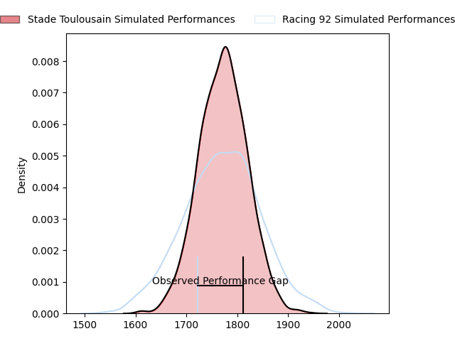
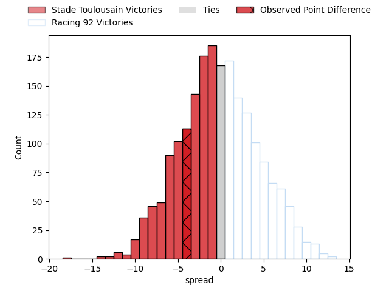
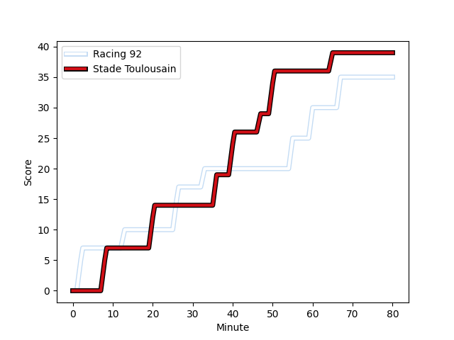
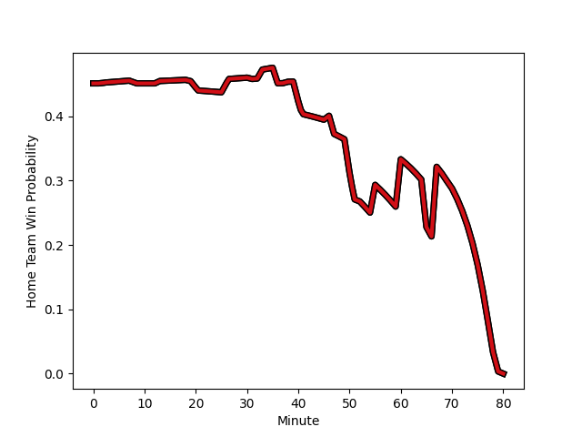

---  
layout: page  
title: Stade Toulousain at Racing 92; 39-35  
date: 2023-03-05 21:00:00 18:00:00 -0500  
categories: match review  
---
# Stade Toulousain at Racing 92; 39-35

# Club Level Predictions

The first set of predictions treats a club as the smallest object, as the club develops its members, organizes a gameplan, and deploys its players as needed for each match. This club model has a prediction of 0.497, which translates to predicting Stade Toulousain to win by 0.1.

Each club has a rating and a rating deviation (simiar to a Glicko system), and expected performances can be generated. This allows for simulated matches and spreads like the ones below.
## Projected Performances

## Projected Spreads

## Projected Results

# Player Level Predictions

Treating teams instead as an entity made up of the currently active players, I have ratings for each player in an altogether different system. These can be combined to form team ratings once teamsheets are announced, weighting starters a bit higher than the reserves. After the match is played, players can be weighted by their minutes on the field, allowing for an accurate measure of the team's composition. With these compiled team ratings, we can make predictions, measure inaccuracy, and update the individual player ratings.
## Prediction with Player Minutes: Stade Toulousain by 4.5

Stade Toulousain by 8.5 on a neutral field
## Scores over Time

## Win Probability over Time

There were 13 large changes in win probability in this match
## Prediction without Player Minutes: Stade Toulousain by 1.8

Stade Toulousain by 5.8 on a neutral pitch

|   Away Minutes | Away Player                                                             |   Away elo |   Away Percentile |   Number |   Home Percentile |   Home elo | Home Player                                                              |   Home Minutes |
|---------------:|:------------------------------------------------------------------------|-----------:|------------------:|---------:|------------------:|-----------:|:-------------------------------------------------------------------------|---------------:|
|             41 | [David Ainu'u](..//playerfiles//DavidAinu'u_cleaned.md)                 |      91.21 |                36 |        1 |                45 |      93.38 | [Eddy Ben Arous](..//playerfiles//EddyBenArous_cleaned.md)               |             52 |
|             55 | [Peato Mauvaka](..//playerfiles//PeatoMauvaka_cleaned.md)               |      91.77 |                42 |        2 |                16 |      81.24 | [Janick Tarrit](..//playerfiles//JanickTarrit_cleaned.md)                |             52 |
|             38 | [Joel Merkler](..//playerfiles//JoelMerkler_cleaned.md)                 |      98.77 |                65 |        3 |                81 |     104.6  | [Gia Kharaishvili](..//playerfiles//GiaKharaishvili_cleaned.md)          |             52 |
|             55 | [Joshua Brennan](..//playerfiles//JoshuaBrennan_cleaned.md)             |      98.97 |                53 |        4 |                38 |      91.4  | [Boris Palu](..//playerfiles//BorisPalu_cleaned.md)                      |             52 |
|             80 | [Emmanuel Meafou](..//playerfiles//EmmanuelMeafou_cleaned.md)           |     109.53 |                85 |        5 |                23 |      85.7  | [Veikoso Poloniati](..//playerfiles//VeikosoPoloniati_cleaned.md)        |             80 |
|             80 | [Rynhard Elstadt](..//playerfiles//RynhardElstadt_cleaned.md)           |      86.24 |                34 |        6 |                77 |     105.26 | [Wenceslas Lauret](..//playerfiles//WenceslasLauret_cleaned.md)          |             80 |
|             51 | [Pierre Fouyssac](..//playerfiles//PierreFouyssac_cleaned.md)           |      96.36 |               nan |        7 |                15 |      80.68 | [Baptiste Chouzenoux](..//playerfiles//BaptisteChouzenoux_cleaned.md)    |             80 |
|             80 | [Alexandre Roumat](..//playerfiles//AlexandreRoumat_cleaned.md)         |     101.38 |                68 |        8 |                47 |      91.71 | [Maxime Baudonne](..//playerfiles//MaximeBaudonne_cleaned.md)            |             46 |
|             80 | [Paul Graou](..//playerfiles//PaulGraou_cleaned.md)                     |     127.62 |                98 |        9 |                32 |      89.1  | [Teddy Iribaren](..//playerfiles//TeddyIribaren_cleaned.md)              |             31 |
|             80 | [Juan Cruz Mallia](..//playerfiles//JuanCruzMallia_cleaned.md)          |     101.93 |                70 |       10 |                98 |     136.37 | [Finn Russell](..//playerfiles//FinnRussell_cleaned.md)                  |             80 |
|             80 | [Matthis Lebel](..//playerfiles//MatthisLebel_cleaned.md)               |      98.51 |                60 |       11 |                33 |      91.64 | [Juan Imhoff](..//playerfiles//JuanImhoff_cleaned.md)                    |             80 |
|             60 | [Pita Ahki](..//playerfiles//PitaAhki_cleaned.md)                       |     104.73 |                77 |       12 |                17 |      82.81 | [Henry Chavancy](..//playerfiles//HenryChavancy_cleaned.md)              |             52 |
|             80 | [Sofiane Guitoune](..//playerfiles//SofianeGuitoune_cleaned.md)         |     104.55 |                77 |       13 |                80 |     105.88 | [Francis Saili](..//playerfiles//FrancisSaili_cleaned.md)                |             80 |
|             19 | [Arthur Retière](..//playerfiles//ArthurRetière_cleaned.md)             |      91.35 |                42 |       14 |                28 |      88.3  | [Vinaya Habosi](..//playerfiles//VinayaHabosi_cleaned.md)                |             70 |
|             80 | [Melvyn Jaminet](..//playerfiles//MelvynJaminet_cleaned.md)             |      83.85 |                23 |       15 |                21 |      82.81 | [Max Spring](..//playerfiles//MaxSpring_cleaned.md)                      |             80 |
|             61 | [Dimitri Delibes](..//playerfiles//DimitriDelibes_cleaned.md)           |      95.14 |                51 |       16 |                20 |      84.98 | [Antoine Gibert](..//playerfiles//AntoineGibert_cleaned.md)              |             49 |
|             42 | [Paul Mallez](..//playerfiles//PaulMallez_cleaned.md)                   |      95.72 |               nan |       17 |                76 |     105.26 | [Kitione Kamikamica](..//playerfiles//KitioneKamikamica_cleaned.md)      |             34 |
|             39 | [Rodrigue Neti](..//playerfiles//RodrigueNeti_cleaned.md)               |     100.35 |                65 |       18 |               nan |      93.31 | [Thomas Moukoro](..//playerfiles//ThomasMoukoro_cleaned.md)              |             28 |
|             29 | [Jack Willis](..//playerfiles//JackWillis_cleaned.md)                   |     124.8  |                95 |       19 |               nan |      91.97 | [Ben Volavola](..//playerfiles//BenVolavola_cleaned.md)                  |             10 |
|             25 | [Clement Verge](..//playerfiles//ClementVerge_cleaned.md)               |      98.22 |               nan |       20 |                53 |      96.78 | [Trevor Ntando Nyakane](..//playerfiles//TrevorNtandoNyakane_cleaned.md) |             28 |
|             25 | [Guillaume Cramont](..//playerfiles//GuillaumeCramont_cleaned.md)       |      99.57 |                67 |       21 |               nan |      91.37 | [Jonathan Maiau](..//playerfiles//JonathanMaiau_cleaned.md)              |             28 |
|             20 | [Pierre-Louis Barassi](..//playerfiles//Pierre-LouisBarassi_cleaned.md) |      96.72 |                40 |       22 |                27 |      85.56 | [Olivier Klemenczak](..//playerfiles//OlivierKlemenczak_cleaned.md)      |             28 |
|            nan | nan                                                                     |     nan    |               nan |       23 |                52 |      95.46 | [Fabien Sanconnie](..//playerfiles//FabienSanconnie_cleaned.md)          |             28 |

