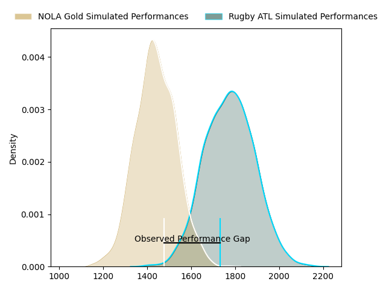
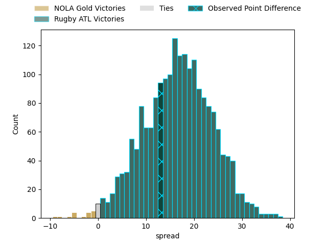
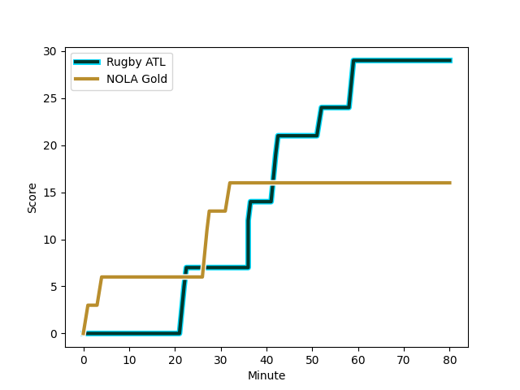
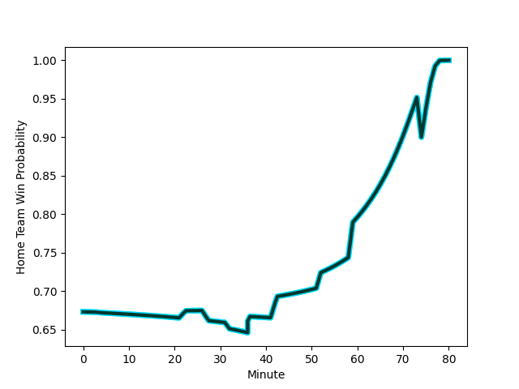

---  
layout: page  
title: NOLA Gold at Rugby ATL; 16-29  
date: 2023-03-05 00:00:00 18:00:00 -0500  
categories: match review  
---
# NOLA Gold at Rugby ATL; 16-29

# Club Level Predictions

The first set of predictions treats a club as the smallest object, as the club develops its members, organizes a gameplan, and deploys its players as needed for each match. This club model has a prediction of 0.864, which translates to predicting Rugby ATL to win by 16.7.

Each club has a rating and a rating deviation (simiar to a Glicko system), and expected performances can be generated. This allows for simulated matches and spreads like the ones below.
## Projected Performances

## Projected Spreads

## Projected Results

# Player Level Predictions

Treating teams instead as an entity made up of the currently active players, I have ratings for each player in an altogether different system. These can be combined to form team ratings once teamsheets are announced, weighting starters a bit higher than the reserves. After the match is played, players can be weighted by their minutes on the field, allowing for an accurate measure of the team's composition. With these compiled team ratings, we can make predictions, measure inaccuracy, and update the individual player ratings.
## Prediction with Player Minutes: Rugby ATL by 35.5

Rugby ATL by 31.5 on a neutral field
## Scores over Time

## Win Probability over Time

There were 4 large changes in win probability in this match
## Prediction without Player Minutes: Rugby ATL by 40.1

Rugby ATL by 36.1 on a neutral pitch

|   Away Minutes | Away Player                                                                                                 |   Away elo |   Away Percentile |   Number |   Home Percentile |   Home elo | Home Player                                                                 |   Home Minutes |
|---------------:|:------------------------------------------------------------------------------------------------------------|-----------:|------------------:|---------:|------------------:|-----------:|:----------------------------------------------------------------------------|---------------:|
|             64 | [Jarred Adams](..//playerfiles//JarredAdams_cleaned.md)                                                     |      74.67 |                12 |        1 |               nan |      68.19 | [Jonas Petrakopoulos](..//playerfiles//JonasPetrakopoulos_cleaned.md)       |             54 |
|             80 | [Jarred Adams](..//playerfiles//JarredAdams_cleaned.md)                                                     |      74.67 |                 5 |        1 |               nan |      68.19 | [Jonas Petrakopoulos](..//playerfiles//JonasPetrakopoulos_cleaned.md)       |             54 |
|             80 | [Jarred Adams](..//playerfiles//JarredAdams_cleaned.md)                                                     |      74.67 |                12 |        1 |               nan |      68.19 | [Jonas Petrakopoulos](..//playerfiles//JonasPetrakopoulos_cleaned.md)       |             54 |
|             64 | [Jarred Adams](..//playerfiles//JarredAdams_cleaned.md)                                                     |      74.67 |                 5 |        1 |               nan |      68.19 | [Jonas Petrakopoulos](..//playerfiles//JonasPetrakopoulos_cleaned.md)       |             80 |
|             64 | [Jarred Adams](..//playerfiles//JarredAdams_cleaned.md)                                                     |      74.67 |                12 |        1 |               nan |      68.19 | [Jonas Petrakopoulos](..//playerfiles//JonasPetrakopoulos_cleaned.md)       |             80 |
|             80 | [Jarred Adams](..//playerfiles//JarredAdams_cleaned.md)                                                     |      74.67 |                12 |        1 |               nan |      68.19 | [Jonas Petrakopoulos](..//playerfiles//JonasPetrakopoulos_cleaned.md)       |             80 |
|             80 | [Jarred Adams](..//playerfiles//JarredAdams_cleaned.md)                                                     |      74.67 |                 5 |        1 |               nan |      68.19 | [Jonas Petrakopoulos](..//playerfiles//JonasPetrakopoulos_cleaned.md)       |             80 |
|             64 | [Jarred Adams](..//playerfiles//JarredAdams_cleaned.md)                                                     |      74.67 |                 5 |        1 |               nan |      68.19 | [Jonas Petrakopoulos](..//playerfiles//JonasPetrakopoulos_cleaned.md)       |             54 |
|             51 | [Pat O'Toole](..//playerfiles//PatO'Toole_cleaned.md)                                                       |      56.8  |                 1 |        2 |               nan |      98.73 | [Ben Strang](..//playerfiles//BenStrang_cleaned.md)                         |             54 |
|             80 | [Pat O'Toole](..//playerfiles//PatO'Toole_cleaned.md)                                                       |      56.8  |                 1 |        2 |               nan |      98.73 | [Ben Strang](..//playerfiles//BenStrang_cleaned.md)                         |             80 |
|             51 | [Pat O'Toole](..//playerfiles//PatO'Toole_cleaned.md)                                                       |      56.8  |                 1 |        2 |               nan |      98.73 | [Ben Strang](..//playerfiles//BenStrang_cleaned.md)                         |             80 |
|             80 | [Pat O'Toole](..//playerfiles//PatO'Toole_cleaned.md)                                                       |      56.8  |                 1 |        2 |               nan |      98.73 | [Ben Strang](..//playerfiles//BenStrang_cleaned.md)                         |             54 |
|             64 | [Sean Bradley Paranihi](..//playerfiles//SeanBradleyParanihi_cleaned.md)                                    |      95    |               nan |        3 |                91 |     122.67 | [John Roy Jenkinson](..//playerfiles//JohnRoyJenkinson_cleaned.md)          |             80 |
|             80 | [Sean Bradley Paranihi](..//playerfiles//SeanBradleyParanihi_cleaned.md)                                    |      95    |               nan |        3 |                91 |     122.67 | [John Roy Jenkinson](..//playerfiles//JohnRoyJenkinson_cleaned.md)          |             80 |
|             64 | [Sean Bradley Paranihi](..//playerfiles//SeanBradleyParanihi_cleaned.md)                                    |      95    |               nan |        3 |                97 |     122.67 | [John Roy Jenkinson](..//playerfiles//JohnRoyJenkinson_cleaned.md)          |             27 |
|             64 | [Sean Bradley Paranihi](..//playerfiles//SeanBradleyParanihi_cleaned.md)                                    |      95    |               nan |        3 |                91 |     122.67 | [John Roy Jenkinson](..//playerfiles//JohnRoyJenkinson_cleaned.md)          |             27 |
|             80 | [Sean Bradley Paranihi](..//playerfiles//SeanBradleyParanihi_cleaned.md)                                    |      95    |               nan |        3 |                91 |     122.67 | [John Roy Jenkinson](..//playerfiles//JohnRoyJenkinson_cleaned.md)          |             27 |
|             80 | [Sean Bradley Paranihi](..//playerfiles//SeanBradleyParanihi_cleaned.md)                                    |      95    |               nan |        3 |                97 |     122.67 | [John Roy Jenkinson](..//playerfiles//JohnRoyJenkinson_cleaned.md)          |             80 |
|             80 | [Sean Bradley Paranihi](..//playerfiles//SeanBradleyParanihi_cleaned.md)                                    |      95    |               nan |        3 |                97 |     122.67 | [John Roy Jenkinson](..//playerfiles//JohnRoyJenkinson_cleaned.md)          |             27 |
|             64 | [Sean Bradley Paranihi](..//playerfiles//SeanBradleyParanihi_cleaned.md)                                    |      95    |               nan |        3 |                97 |     122.67 | [John Roy Jenkinson](..//playerfiles//JohnRoyJenkinson_cleaned.md)          |             80 |
|             80 | [Cameron Dolan](..//playerfiles//CameronDolan_cleaned.md)                                                   |      85.65 |                21 |        4 |                91 |     123.78 | [Justin Johan Basson](..//playerfiles//JustinJohanBasson_cleaned.md)        |             62 |
|             80 | [Cameron Dolan](..//playerfiles//CameronDolan_cleaned.md)                                                   |      85.65 |                21 |        4 |                95 |     123.78 | [Justin Johan Basson](..//playerfiles//JustinJohanBasson_cleaned.md)        |             80 |
|             80 | [Cameron Dolan](..//playerfiles//CameronDolan_cleaned.md)                                                   |      85.65 |                21 |        4 |                91 |     123.78 | [Justin Johan Basson](..//playerfiles//JustinJohanBasson_cleaned.md)        |             80 |
|             80 | [Cameron Dolan](..//playerfiles//CameronDolan_cleaned.md)                                                   |      85.65 |                21 |        4 |                95 |     123.78 | [Justin Johan Basson](..//playerfiles//JustinJohanBasson_cleaned.md)        |             62 |
|             60 | [Liam Hallam-Eames](..//playerfiles//LiamHallam-Eames_cleaned.md)                                           |      84.83 |                21 |        5 |                 2 |      62.31 | [Johannes Momsen](..//playerfiles//JohannesMomsen_cleaned.md)               |             80 |
|             80 | [Liam Hallam-Eames](..//playerfiles//LiamHallam-Eames_cleaned.md)                                           |      84.83 |                21 |        5 |                 2 |      62.31 | [Johannes Momsen](..//playerfiles//JohannesMomsen_cleaned.md)               |             80 |
|             60 | [Malcolm May](..//playerfiles//MalcolmMay_cleaned.md)                                                       |      66.87 |                 5 |        6 |               100 |     176.4  | [Vili Helu](..//playerfiles//ViliHelu_cleaned.md)                           |             80 |
|             60 | [Malcolm May](..//playerfiles//MalcolmMay_cleaned.md)                                                       |      66.87 |                 5 |        6 |                99 |     176.4  | [Vili Helu](..//playerfiles//ViliHelu_cleaned.md)                           |             80 |
|             80 | [Malcolm May](..//playerfiles//MalcolmMay_cleaned.md)                                                       |      66.87 |                 5 |        6 |                99 |     176.4  | [Vili Helu](..//playerfiles//ViliHelu_cleaned.md)                           |             80 |
|             60 | [Malcolm May](..//playerfiles//MalcolmMay_cleaned.md)                                                       |      66.87 |                 5 |        6 |               100 |     176.4  | [Vili Helu](..//playerfiles//ViliHelu_cleaned.md)                           |             71 |
|             80 | [Malcolm May](..//playerfiles//MalcolmMay_cleaned.md)                                                       |      66.87 |                 5 |        6 |               100 |     176.4  | [Vili Helu](..//playerfiles//ViliHelu_cleaned.md)                           |             71 |
|             60 | [Malcolm May](..//playerfiles//MalcolmMay_cleaned.md)                                                       |      66.87 |                 5 |        6 |                99 |     176.4  | [Vili Helu](..//playerfiles//ViliHelu_cleaned.md)                           |             71 |
|             80 | [Malcolm May](..//playerfiles//MalcolmMay_cleaned.md)                                                       |      66.87 |                 5 |        6 |                99 |     176.4  | [Vili Helu](..//playerfiles//ViliHelu_cleaned.md)                           |             71 |
|             80 | [Malcolm May](..//playerfiles//MalcolmMay_cleaned.md)                                                       |      66.87 |                 5 |        6 |               100 |     176.4  | [Vili Helu](..//playerfiles//ViliHelu_cleaned.md)                           |             80 |
|             80 | [Moni Tonga'uiha](..//playerfiles//MoniTonga'uiha_cleaned.md)                                               |      23.96 |                 0 |        7 |               nan |      96.59 | [Matthew Heaton](..//playerfiles//MatthewHeaton_cleaned.md)                 |             62 |
|             80 | [Moni Tonga'uiha](..//playerfiles//MoniTonga'uiha_cleaned.md)                                               |      23.96 |                 0 |        7 |               nan |      96.59 | [Matthew Heaton](..//playerfiles//MatthewHeaton_cleaned.md)                 |             80 |
|             80 | [Tom Florence](..//playerfiles//TomFlorence_cleaned.md)                                                     |      85.65 |                21 |        8 |                 0 |      40.14 | [Jason Damm](..//playerfiles//JasonDamm_cleaned.md)                         |             80 |
|             80 | [Luke Campbell](..//playerfiles//LukeCampbell_cleaned.md)                                                   |      90.97 |               nan |        9 |                94 |      97.16 | [Ryan Rees](..//playerfiles//RyanRees_cleaned.md)                           |             80 |
|             78 | [Luke Campbell](..//playerfiles//LukeCampbell_cleaned.md)                                                   |      90.97 |               nan |        9 |                94 |      97.16 | [Ryan Rees](..//playerfiles//RyanRees_cleaned.md)                           |             80 |
|             80 | [Luke Campbell](..//playerfiles//LukeCampbell_cleaned.md)                                                   |      90.97 |               nan |        9 |                40 |      97.16 | [Ryan Rees](..//playerfiles//RyanRees_cleaned.md)                           |             80 |
|             78 | [Luke Campbell](..//playerfiles//LukeCampbell_cleaned.md)                                                   |      90.97 |               nan |        9 |                40 |      97.16 | [Ryan Rees](..//playerfiles//RyanRees_cleaned.md)                           |             80 |
|             78 | [Luke Campbell](..//playerfiles//LukeCampbell_cleaned.md)                                                   |      90.97 |               nan |        9 |                94 |      97.16 | [Ryan Rees](..//playerfiles//RyanRees_cleaned.md)                           |             60 |
|             80 | [Luke Campbell](..//playerfiles//LukeCampbell_cleaned.md)                                                   |      90.97 |               nan |        9 |                40 |      97.16 | [Ryan Rees](..//playerfiles//RyanRees_cleaned.md)                           |             60 |
|             78 | [Luke Campbell](..//playerfiles//LukeCampbell_cleaned.md)                                                   |      90.97 |               nan |        9 |                40 |      97.16 | [Ryan Rees](..//playerfiles//RyanRees_cleaned.md)                           |             60 |
|             80 | [Luke Campbell](..//playerfiles//LukeCampbell_cleaned.md)                                                   |      90.97 |               nan |        9 |                94 |      97.16 | [Ryan Rees](..//playerfiles//RyanRees_cleaned.md)                           |             60 |
|             67 | [Rodney Iona](..//playerfiles//RodneyIona_cleaned.md)                                                       |      84.6  |                19 |       10 |                76 |     105.29 | [Kurt Kendall Coleman](..//playerfiles//KurtKendallColeman_cleaned.md)      |             80 |
|             67 | [Rodney Iona](..//playerfiles//RodneyIona_cleaned.md)                                                       |      84.6  |                19 |       10 |                60 |     105.29 | [Kurt Kendall Coleman](..//playerfiles//KurtKendallColeman_cleaned.md)      |             80 |
|             80 | [Rodney Iona](..//playerfiles//RodneyIona_cleaned.md)                                                       |      84.6  |                19 |       10 |                60 |     105.29 | [Kurt Kendall Coleman](..//playerfiles//KurtKendallColeman_cleaned.md)      |             80 |
|             80 | [Rodney Iona](..//playerfiles//RodneyIona_cleaned.md)                                                       |      84.6  |                19 |       10 |                76 |     105.29 | [Kurt Kendall Coleman](..//playerfiles//KurtKendallColeman_cleaned.md)      |             80 |
|             67 | [Dougie Fife](..//playerfiles//DougieFife_cleaned.md)                                                       |      99.67 |                63 |       11 |               nan |      95    | [Te Rangatira Waitokia](..//playerfiles//TeRangatiraWaitokia_cleaned.md)    |             80 |
|             80 | [Dougie Fife](..//playerfiles//DougieFife_cleaned.md)                                                       |      99.67 |                63 |       11 |               nan |      95    | [Te Rangatira Waitokia](..//playerfiles//TeRangatiraWaitokia_cleaned.md)    |             80 |
|             80 | [Jordan Jackson-Hope](..//playerfiles//JordanJackson-Hope_cleaned.md)                                       |      85.65 |                23 |       12 |                89 |     111.4  | [Rewita Biddle](..//playerfiles//RewitaBiddle_cleaned.md)                   |             80 |
|             80 | [Philippus Jacobus Snyman (JP) du Plessis](..//playerfiles//PhilippusJacobusSnyman(JP)duPlessis_cleaned.md) |      74.61 |                 8 |       13 |               100 |     219.35 | [Will Leonard](..//playerfiles//WillLeonard_cleaned.md)                     |             80 |
|             80 | [Harley Wheeler](..//playerfiles//HarleyWheeler_cleaned.md)                                                 |      98.23 |                59 |       14 |                 0 |      -0.84 | [Austin White](..//playerfiles//AustinWhite_cleaned.md)                     |             80 |
|             80 | [Harley Wheeler](..//playerfiles//HarleyWheeler_cleaned.md)                                                 |      98.23 |                59 |       14 |                 0 |      -0.84 | [Austin White](..//playerfiles//AustinWhite_cleaned.md)                     |             74 |
|             80 | [Jordan Trainor](..//playerfiles//JordanTrainor_cleaned.md)                                                 |      83.31 |                23 |       15 |                19 |      84.57 | [Martini Talapusi](..//playerfiles//MartiniTalapusi_cleaned.md)             |             80 |
|             16 | [Kevin Sullivan](..//playerfiles//KevinSullivan_cleaned.md)                                                 |      99.64 |                67 |       16 |                 7 |      75.98 | [Will Burke](..//playerfiles//WillBurke_cleaned.md)                         |             26 |
|             29 | [Eric Howard](..//playerfiles//EricHoward_cleaned.md)                                                       |      93.6  |               nan |       17 |                 0 |      44.96 | [Tiaan Erasmus](..//playerfiles//TiaanErasmus_cleaned.md)                   |             26 |
|             29 | [Eric Howard](..//playerfiles//EricHoward_cleaned.md)                                                       |      93.6  |               nan |       17 |                 0 |      44.96 | [Tiaan Erasmus](..//playerfiles//TiaanErasmus_cleaned.md)                   |             26 |
|             16 | [Doc Irey](..//playerfiles//DocIrey_cleaned.md)                                                             |      88.21 |                26 |       18 |                 0 |      12.04 | [Alex Maughan](..//playerfiles//AlexMaughan_cleaned.md)                     |             53 |
|             16 | [Doc Irey](..//playerfiles//DocIrey_cleaned.md)                                                             |      88.21 |                26 |       18 |                 0 |      12.04 | [Alex Maughan](..//playerfiles//AlexMaughan_cleaned.md)                     |             53 |
|             20 | [Billy Stewart](..//playerfiles//BillyStewart_cleaned.md)                                                   |     122.25 |                94 |       19 |                90 |     114.85 | [Jordan Brown](..//playerfiles//JordanBrown_cleaned.md)                     |             18 |
|             20 | [Billy Stewart](..//playerfiles//BillyStewart_cleaned.md)                                                   |     122.25 |                94 |       19 |                76 |     114.85 | [Jordan Brown](..//playerfiles//JordanBrown_cleaned.md)                     |             18 |
|             20 | [Maciu Koroi](..//playerfiles//MaciuKoroi_cleaned.md)                                                       |      98.67 |                71 |       20 |               nan |      95.94 | [Frederick Henry-Ajudua](..//playerfiles//FrederickHenry-Ajudua_cleaned.md) |              9 |
|              2 | [Sebastiano Villani](..//playerfiles//SebastianoVillani_cleaned.md)                                         |      95    |               nan |       21 |                 0 |      37.01 | [Ross Deacon](..//playerfiles//RossDeacon_cleaned.md)                       |             18 |
|             13 | [Aaron Matthews](..//playerfiles//AaronMatthews_cleaned.md)                                                 |      40.18 |                 0 |       22 |                21 |      85.1  | [Rowan Gouws](..//playerfiles//RowanGouws_cleaned.md)                       |             20 |
|             13 | [Aaron Matthews](..//playerfiles//AaronMatthews_cleaned.md)                                                 |      40.18 |                 0 |       22 |                15 |      85.1  | [Rowan Gouws](..//playerfiles//RowanGouws_cleaned.md)                       |             20 |
|             13 | [Ross Depperschmidt](..//playerfiles//RossDepperschmidt_cleaned.md)                                         |      41.67 |                 0 |       23 |                85 |     111.4  | [Jack Shaw](..//playerfiles//JackShaw_cleaned.md)                           |              6 |

