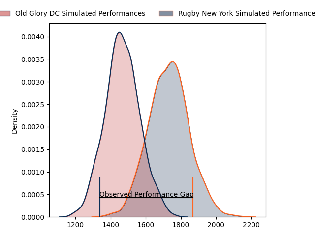
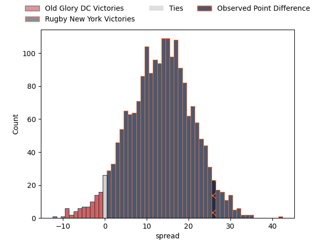
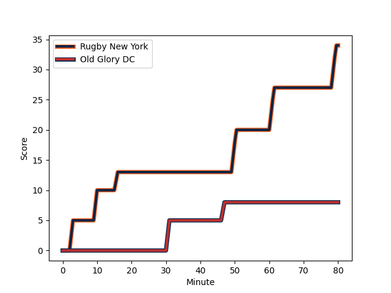
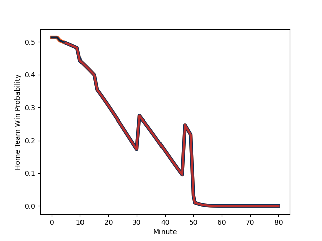

---  
layout: page  
title: Old Glory DC at Rugby New York; 8-34  
date: 2023-03-05 21:00:00 18:00:00 -0500  
categories: match review  
---
# Old Glory DC at Rugby New York; 8-34

# Club Level Predictions

The first set of predictions treats a club as the smallest object, as the club develops its members, organizes a gameplan, and deploys its players as needed for each match. This club model has a prediction of 0.81, which translates to predicting Rugby New York to win by 13.2.

Each club has a rating and a rating deviation (simiar to a Glicko system), and expected performances can be generated. This allows for simulated matches and spreads like the ones below.
## Projected Performances

## Projected Spreads

## Projected Results

# Player Level Predictions

Treating teams instead as an entity made up of the currently active players, I have ratings for each player in an altogether different system. These can be combined to form team ratings once teamsheets are announced, weighting starters a bit higher than the reserves. After the match is played, players can be weighted by their minutes on the field, allowing for an accurate measure of the team's composition. With these compiled team ratings, we can make predictions, measure inaccuracy, and update the individual player ratings.
## Prediction with Player Minutes: Rugby New York by 6.4

Rugby New York by 2.4 on a neutral field
## Scores over Time

## Win Probability over Time

There were 5 large changes in win probability in this match
## Prediction without Player Minutes: Rugby New York by 6.9

Rugby New York by 2.9 on a neutral pitch

|   Away Minutes | Away Player                                                                    |   Away elo |   Away Percentile |   Number |   Home Percentile |   Home elo | Home Player                                                                |   Home Minutes |
|---------------:|:-------------------------------------------------------------------------------|-----------:|------------------:|---------:|------------------:|-----------:|:---------------------------------------------------------------------------|---------------:|
|             66 | [Jack Iscaro](..//playerfiles//JackIscaro_cleaned.md)                          |      19.6  |                 0 |        1 |                38 |      91.82 | [Chance Wenglewski](..//playerfiles//ChanceWenglewski_cleaned.md)          |             59 |
|             62 | [Nic Souchon](..//playerfiles//NicSouchon_cleaned.md)                          |      99.75 |                68 |        2 |                43 |      92.15 | [Dylan Fawsitt](..//playerfiles//DylanFawsitt_cleaned.md)                  |             59 |
|             51 | [Ramiro Herrera](..//playerfiles//RamiroHerrera_cleaned.md)                    |      95    |               nan |        3 |               nan |      93.84 | [Sam Davies](..//playerfiles//SamDavies_cleaned.md)                        |             62 |
|             47 | [Api Naikatini](..//playerfiles//ApiNaikatini_cleaned.md)                      |      95    |               nan |        4 |                45 |      93.29 | [Nate Brakeley](..//playerfiles//NateBrakeley_cleaned.md)                  |             80 |
|             80 | [Tevita Naqali](..//playerfiles//TevitaNaqali_cleaned.md)                      |      67.79 |                 5 |        5 |                35 |      90.79 | [Hamish Dalzell](..//playerfiles//HamishDalzell_cleaned.md)                |             62 |
|             80 | [Lautaro Ezequiel Bavaro](..//playerfiles//LautaroEzequielBavaro_cleaned.md)   |     111.78 |                87 |        6 |                30 |      89.89 | [Brad Tucker](..//playerfiles//BradTucker_cleaned.md)                      |             59 |
|             62 | [Brady Daniel](..//playerfiles//BradyDaniel_cleaned.md)                        |      95    |               nan |        7 |                38 |      90.79 | [Brendon O'Connor](..//playerfiles//BrendonO'Connor_cleaned.md)            |             80 |
|             80 | [Jamason Fa'anana Schultz](..//playerfiles//JamasonFa'ananaSchultz_cleaned.md) |     106.49 |                79 |        8 |                56 |      98.09 | [Kara Pryor](..//playerfiles//KaraPryor_cleaned.md)                        |             80 |
|             62 | [Danny Joseph Tusitala](..//playerfiles//DannyJosephTusitala_cleaned.md)       |      82.81 |                17 |        9 |                12 |      78.05 | [Connor Buckley](..//playerfiles//ConnorBuckley_cleaned.md)                |             62 |
|             80 | [Joaquin Diaz Bonilla](..//playerfiles//JoaquinDiazBonilla_cleaned.md)         |     101.35 |                69 |       10 |                44 |      91.88 | [Jack Heighton](..//playerfiles//JackHeighton_cleaned.md)                  |             66 |
|             80 | [Tafeaga Junior Sau](..//playerfiles//TafeagaJuniorSau_cleaned.md)             |      66.93 |                 5 |       11 |                45 |      93.04 | [Teofilo Ed Fidow](..//playerfiles//TeofiloEdFidow_cleaned.md)             |             80 |
|             66 | [Thretton Palamo](..//playerfiles//ThrettonPalamo_cleaned.md)                  |     101.44 |                69 |       12 |                43 |      93.19 | [Jason Emery](..//playerfiles//JasonEmery_cleaned.md)                      |             62 |
|             80 | [Fermin Martinez](..//playerfiles//FerminMartinez_cleaned.md)                  |     130.31 |                97 |       13 |                29 |      89.48 | [Teihorangi Walden](..//playerfiles//TeihorangiWalden_cleaned.md)          |             80 |
|             47 | [Marcos Young](..//playerfiles//MarcosYoung_cleaned.md)                        |     102.25 |                65 |       14 |                52 |      96.1  | [Fa'asiu Fuatai](..//playerfiles//Fa'asiuFuatai_cleaned.md)                |             80 |
|             80 | [Kurt Baker](..//playerfiles//KurtBaker_cleaned.md)                            |     101.44 |                68 |       15 |                40 |      91.88 | [Andrew Coe](..//playerfiles//AndrewCoe_cleaned.md)                        |             80 |
|             14 | [Quentin Newcomer](..//playerfiles//QuentinNewcomer_cleaned.md)                |      64.98 |                 2 |       16 |               nan |      96.14 | [Tevita Langi](..//playerfiles//TevitaLangi_cleaned.md)                    |             21 |
|             14 | [Quentin Newcomer](..//playerfiles//QuentinNewcomer_cleaned.md)                |      64.98 |                21 |       16 |               nan |      96.14 | [Tevita Langi](..//playerfiles//TevitaLangi_cleaned.md)                    |             21 |
|             18 | [Facundo Gattas](..//playerfiles//FacundoGattas_cleaned.md)                    |      96.69 |               nan |       17 |                99 |     157.21 | [Kaleb Geiger](..//playerfiles//KalebGeiger_cleaned.md)                    |             21 |
|             29 | [Cali Martinez](..//playerfiles//CaliMartinez_cleaned.md)                      |      96.53 |               nan |       18 |                10 |      79.14 | [Luis Enrique Quinteros](..//playerfiles//LuisEnriqueQuinteros_cleaned.md) |             18 |
|             33 | [Colin Grosse](..//playerfiles//ColinGrosse_cleaned.md)                        |     100.95 |                69 |       19 |               100 |     153.96 | [Charlie Hewitt](..//playerfiles//CharlieHewitt_cleaned.md)                |             18 |
|             18 | [Fintan Coleman](..//playerfiles//FintanColeman_cleaned.md)                    |      95.15 |                43 |       20 |               nan |     110.38 | [Pago Haini](..//playerfiles//PagoHaini_cleaned.md)                        |             21 |
|             18 | [John LeFevre](..//playerfiles//JohnLeFevre_cleaned.md)                        |      92.51 |               nan |       21 |                71 |     101.98 | [Eamonn Matthews](..//playerfiles//EamonnMatthews_cleaned.md)              |             18 |
|             14 | [Gradyn Bowd](..//playerfiles//GradynBowd_cleaned.md)                          |      95.08 |               nan |       22 |                40 |      91.88 | [Samuel Windsor](..//playerfiles//SamuelWindsor_cleaned.md)                |             14 |
|             33 | [Mike Dabulas](..//playerfiles//MikeDabulas_cleaned.md)                        |     109.12 |                85 |       23 |               nan |      95.74 | [John Powers](..//playerfiles//JohnPowers_cleaned.md)                      |             18 |

