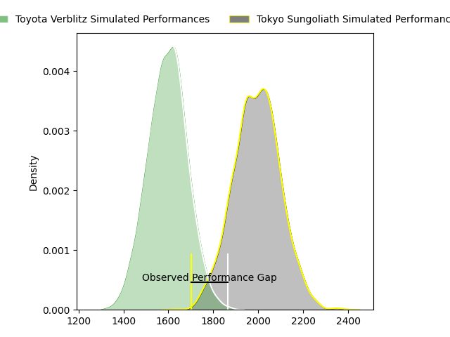
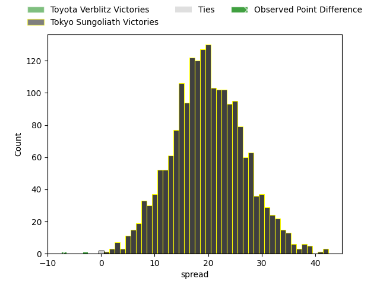
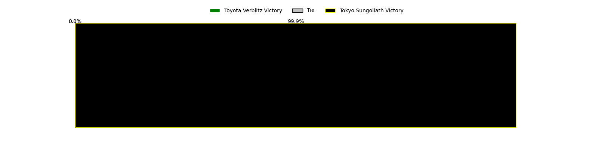
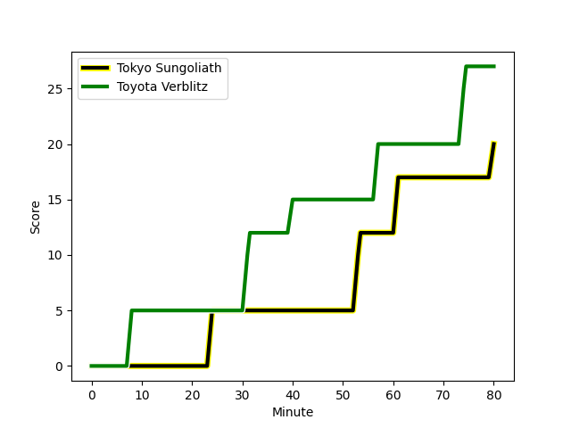
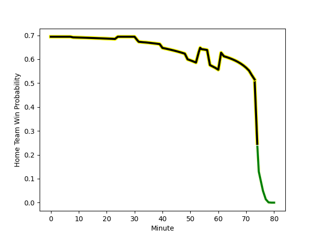

---  
layout: page  
title: Toyota Verblitz at Tokyo Sungoliath; 27-20  
date: 2023-03-05 06:30:00 18:00:00 -0500  
categories: match review  
---
# Toyota Verblitz at Tokyo Sungoliath; 27-20

# Club Level Predictions

The first set of predictions treats a club as the smallest object, as the club develops its members, organizes a gameplan, and deploys its players as needed for each match. This club model has a prediction of 0.903, which translates to predicting Tokyo Sungoliath to win by 20.1.

Each club has a rating and a rating deviation (simiar to a Glicko system), and expected performances can be generated. This allows for simulated matches and spreads like the ones below.
## Projected Performances

## Projected Spreads

## Projected Results

# Player Level Predictions

Treating teams instead as an entity made up of the currently active players, I have ratings for each player in an altogether different system. These can be combined to form team ratings once teamsheets are announced, weighting starters a bit higher than the reserves. After the match is played, players can be weighted by their minutes on the field, allowing for an accurate measure of the team's composition. With these compiled team ratings, we can make predictions, measure inaccuracy, and update the individual player ratings.
## Prediction with Player Minutes: Tokyo Sungoliath by 39.6

Tokyo Sungoliath by 35.6 on a neutral field
## Scores over Time

## Win Probability over Time

There were 8 large changes in win probability in this match
## Prediction without Player Minutes: Tokyo Sungoliath by 45.8

Tokyo Sungoliath by 41.8 on a neutral pitch

|   Away Minutes | Away Player                                                                   |   Away elo |   Away Percentile |   Number |   Home Percentile |   Home elo | Home Player                                                           |   Home Minutes |
|---------------:|:------------------------------------------------------------------------------|-----------:|------------------:|---------:|------------------:|-----------:|:----------------------------------------------------------------------|---------------:|
|             80 | [Shogo Miura](..//playerfiles//ShogoMiura_cleaned.md)                         |      94.63 |                50 |        1 |                77 |     103.83 | [Kenta Kobayashi](..//playerfiles//KentaKobayashi_cleaned.md)         |             59 |
|             80 | [Yoshikatsu Hikosaka](..//playerfiles//YoshikatsuHikosaka_cleaned.md)         |     108.18 |                87 |        2 |                99 |     136.15 | [Shunta Nakamura](..//playerfiles//ShuntaNakamura_cleaned.md)         |             49 |
|             76 | [Runya Choi](..//playerfiles//RunyaChoi_cleaned.md)                           |      79.61 |               nan |        3 |                83 |     106.19 | [Kan Nakano](..//playerfiles//KanNakano_cleaned.md)                   |             49 |
|             80 | [Daichi Akiyama](..//playerfiles//DaichiAkiyama_cleaned.md)                   |      91.44 |                38 |        4 |                82 |     107.9  | [Hendrik Tui](..//playerfiles//HendrikTui_cleaned.md)                 |             59 |
|             58 | [Isaiah Mapusua](..//playerfiles//IsaiahMapusua_cleaned.md)                   |      95    |               nan |        5 |                91 |     116.02 | [Harrison Hockings](..//playerfiles//HarrisonHockings_cleaned.md)     |             80 |
|             80 | [Pieter Stephanus du Toit](..//playerfiles//PieterStephanusduToit_cleaned.md) |      84.87 |                20 |        6 |                87 |     112.37 | [Kanji Shimokawa](..//playerfiles//KanjiShimokawa_cleaned.md)         |             80 |
|             80 | [Kazuki Himeno](..//playerfiles//KazukiHimeno_cleaned.md)                     |      76.79 |                 7 |        7 |                85 |     110.02 | [Kai Yamamoto](..//playerfiles//KaiYamamoto_cleaned.md)               |             80 |
|             62 | [Lautaimi Fetuani](..//playerfiles//LautaimiFetuani_cleaned.md)               |      69.4  |                 3 |        8 |                83 |     109.2  | [Ryuga Hashimoto](..//playerfiles//RyugaHashimoto_cleaned.md)         |             34 |
|             58 | [Kaito Shigeno](..//playerfiles//KaitoShigeno_cleaned.md)                     |      83.05 |                18 |        9 |                85 |     108.28 | [Naoto Saito](..//playerfiles//NaotoSaito_cleaned.md)                 |             49 |
|             80 | [Willem Jacobus Le Roux](..//playerfiles//WillemJacobusLeRoux_cleaned.md)     |      58.52 |                 2 |       10 |                76 |     104.68 | [Aaron Cruden](..//playerfiles//AaronCruden_cleaned.md)               |             54 |
|             80 | [Viliame Tuidraki](..//playerfiles//ViliameTuidraki_cleaned.md)               |      87.91 |                37 |       11 |                85 |     109.12 | [Tevita Li](..//playerfiles//TevitaLi_cleaned.md)                     |             80 |
|             80 | [Charlie Lawrence](..//playerfiles//CharlieLawrence_cleaned.md)               |      99.23 |                63 |       12 |                68 |     100.82 | [Isaiah Punivai](..//playerfiles//IsaiahPunivai_cleaned.md)           |             72 |
|             58 | [Vatiliai Tuidraki](..//playerfiles//VatiliaiTuidraki_cleaned.md)             |      88.25 |                28 |       13 |                90 |     114.77 | [Shogo Nakano](..//playerfiles//ShogoNakano_cleaned.md)               |             80 |
|             80 | [Taichi Takahashi](..//playerfiles//TaichiTakahashi_cleaned.md)               |      72.01 |                 7 |       14 |                81 |     107.98 | [Seiya Ozaki](..//playerfiles//SeiyaOzaki_cleaned.md)                 |             80 |
|             80 | [Tiaan Falcon](..//playerfiles//TiaanFalcon_cleaned.md)                       |      84.07 |                24 |       15 |                73 |     105.69 | [Kotaro Matsushima](..//playerfiles//KotaroMatsushima_cleaned.md)     |             80 |
|             22 | [Kyo Yoshida](..//playerfiles//KyoYoshida_cleaned.md)                         |      90.91 |                43 |       16 |                82 |     109.86 | [Tevita Tatafu](..//playerfiles//TevitaTatafu_cleaned.md)             |             46 |
|             22 | [Kenta Fukuda](..//playerfiles//KentaFukuda_cleaned.md)                       |     100.89 |                82 |       17 |                64 |      98.38 | [Kosuke Horikoshi](..//playerfiles//KosukeHorikoshi_cleaned.md)       |             31 |
|             22 | [Rob Thompson](..//playerfiles//RobThompson_cleaned.md)                       |      74.32 |                10 |       18 |                89 |     110.59 | [Shinnosuke Kakinaga](..//playerfiles//ShinnosukeKakinaga_cleaned.md) |             31 |
|             18 | [Will Tupou](..//playerfiles//WillTupou_cleaned.md)                           |      92.03 |                52 |       19 |               nan |     103.19 | [Yutaka Nagare](..//playerfiles//YutakaNagare_cleaned.md)             |             31 |
|              4 | [Shunsuke Asaoka](..//playerfiles//ShunsukeAsaoka_cleaned.md)                 |      99.31 |                72 |       20 |                48 |      95.29 | [Hikaru Tamura](..//playerfiles//HikaruTamura_cleaned.md)             |             26 |
|            nan | nan                                                                           |     nan    |               nan |       21 |                88 |     110    | [Shintaro Ishihara](..//playerfiles//ShintaroIshihara_cleaned.md)     |             21 |
|            nan | nan                                                                           |     nan    |               nan |       22 |                72 |     103.04 | [Tom Savage](..//playerfiles//TomSavage_cleaned.md)                   |             21 |
|            nan | nan                                                                           |     nan    |               nan |       23 |                39 |      91.56 | [Taiga Ozaki](..//playerfiles//TaigaOzaki_cleaned.md)                 |              8 |

