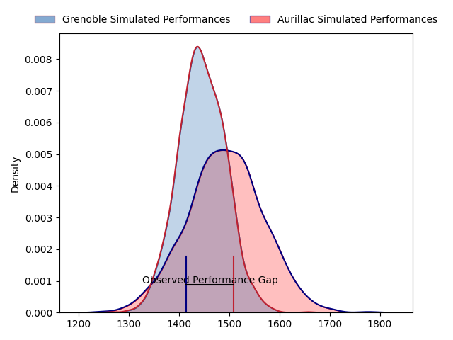
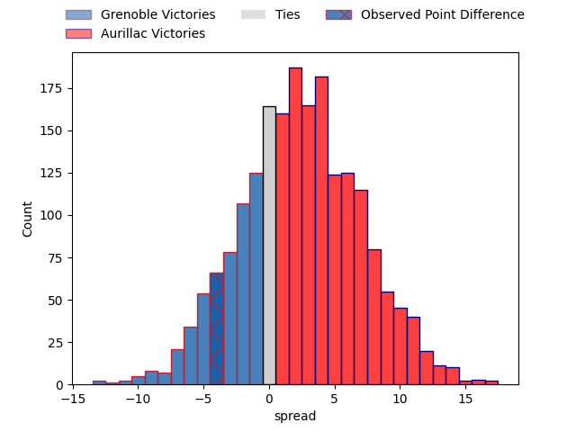
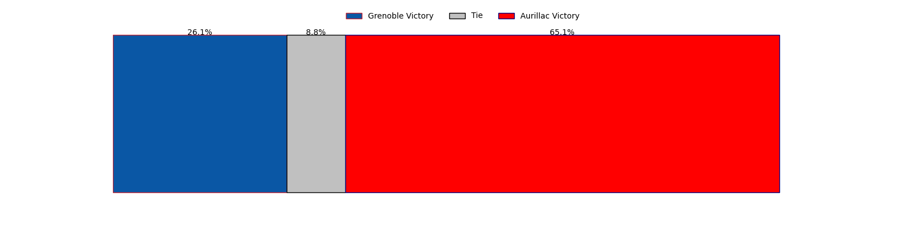
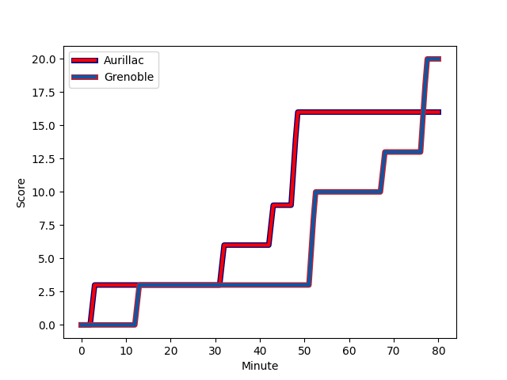
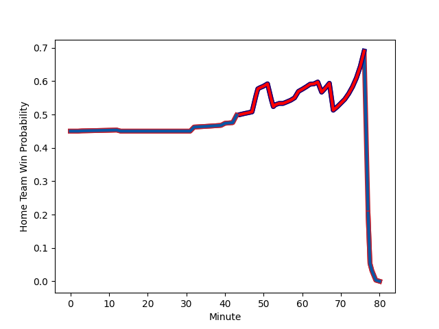

---  
layout: page  
title: Grenoble at Aurillac; 20-16  
date: 2023-03-09 20:30:00 18:00:00 -0500  
categories: match review  
---
# Grenoble at Aurillac; 20-16

# Club Level Predictions

The first set of predictions treats a club as the smallest object, as the club develops its members, organizes a gameplan, and deploys its players as needed for each match. This club model has a prediction of 0.569, which translates to predicting Aurillac to win by 2.4.

Each club has a rating and a rating deviation (simiar to a Glicko system), and expected performances can be generated. This allows for simulated matches and spreads like the ones below.
## Projected Performances

## Projected Spreads

## Projected Results

# Player Level Predictions

Treating teams instead as an entity made up of the currently active players, I have ratings for each player in an altogether different system. These can be combined to form team ratings once teamsheets are announced, weighting starters a bit higher than the reserves. After the match is played, players can be weighted by their minutes on the field, allowing for an accurate measure of the team's composition. With these compiled team ratings, we can make predictions, measure inaccuracy, and update the individual player ratings.
## Prediction with Player Minutes: Grenoble by 3.3

Grenoble by 7.3 on a neutral field
## Scores over Time

## Win Probability over Time

There were 10 large changes in win probability in this match
## Prediction without Player Minutes: Grenoble by 3.6

Grenoble by 7.6 on a neutral pitch

|   Away Minutes | Away Player                                                           |   Away elo |   Away Percentile |   Number |   Home Percentile |   Home elo | Home Player                                                                                           |   Home Minutes |
|---------------:|:----------------------------------------------------------------------|-----------:|------------------:|---------:|------------------:|-----------:|:------------------------------------------------------------------------------------------------------|---------------:|
|             50 | [Luka Goginava](..//playerfiles//LukaGoginava_cleaned.md)             |      84.45 |                14 |        1 |                47 |      94.08 | [Robert Rodgers](..//playerfiles//RobertRodgers_cleaned.md)                                           |             55 |
|             45 | [Mathis Sarragallet](..//playerfiles//MathisSarragallet_cleaned.md)   |      98.63 |                53 |        2 |                69 |      99.73 | [Adrian Smith](..//playerfiles//AdrianSmith_cleaned.md)                                               |             63 |
|             40 | [Regis Montagne](..//playerfiles//RegisMontagne_cleaned.md)           |     100.46 |                70 |        3 |                93 |     115.67 | [Giorgi Kartvelishvili](..//playerfiles//GiorgiKartvelishvili_cleaned.md)                             |             65 |
|             45 | [Thomas Lainault](..//playerfiles//ThomasLainault_cleaned.md)         |     105.91 |                78 |        4 |                26 |      87.7  | [Martial Rolland](..//playerfiles//MartialRolland_cleaned.md)                                         |             71 |
|             80 | [Tanginoa Halaifonua](..//playerfiles//TanginoaHalaifonua_cleaned.md) |     102.57 |                71 |        5 |                37 |      90.63 | [Jean-Baptiste Singer](..//playerfiles//Jean-BaptisteSinger_cleaned.md)                               |             80 |
|             80 | [Tanginoa Halaifonua](..//playerfiles//TanginoaHalaifonua_cleaned.md) |     102.57 |                71 |        5 |                50 |      90.63 | [Jean-Baptiste Singer](..//playerfiles//Jean-BaptisteSinger_cleaned.md)                               |             80 |
|             58 | [Thibaut Martel](..//playerfiles//ThibautMartel_cleaned.md)           |     103.88 |                70 |        6 |                42 |      92.02 | [Eoghan Masterson](..//playerfiles//EoghanMasterson_cleaned.md)                                       |             80 |
|             80 | [Steeve Blanc-Mappaz](..//playerfiles//SteeveBlanc-Mappaz_cleaned.md) |     104.44 |                75 |        7 |                 9 |      78.29 | [Théo Cambon](..//playerfiles//ThéoCambon_cleaned.md)                                                 |             59 |
|             58 | [Talalelei Gray](..//playerfiles//TalaleleiGray_cleaned.md)           |      97.12 |                54 |        8 |                69 |     101.08 | [Didier Tison](..//playerfiles//DidierTison_cleaned.md)                                               |             65 |
|             53 | [Éric Escande](..//playerfiles//ÉricEscande_cleaned.md)               |     104.53 |                79 |        9 |                68 |     100.3  | [David Delarue](..//playerfiles//DavidDelarue_cleaned.md)                                             |             63 |
|             64 | [Romain Trouilloud](..//playerfiles//RomainTrouilloud_cleaned.md)     |      76.66 |                10 |       10 |                12 |      78.82 | [Antoine Aucagne](..//playerfiles//AntoineAucagne_cleaned.md)                                         |             65 |
|             80 | [Karim Qadiri](..//playerfiles//KarimQadiri_cleaned.md)               |     103.56 |                74 |       11 |                68 |     100.92 | [Elijah Niko](..//playerfiles//ElijahNiko_cleaned.md)                                                 |             80 |
|             80 | [Bautista Ezcurra](..//playerfiles//BautistaEzcurra_cleaned.md)       |     101.72 |                67 |       12 |                 8 |      74.72 | [Christa Powell](..//playerfiles//ChristaPowell_cleaned.md)                                           |             80 |
|             80 | [Terence Hepetema](..//playerfiles//TerenceHepetema_cleaned.md)       |      98.64 |                45 |       13 |                52 |      95.86 | [Jimmy Yobo](..//playerfiles//JimmyYobo_cleaned.md)                                                   |             80 |
|             80 | [Erwan Dridi](..//playerfiles//ErwanDridi_cleaned.md)                 |     100.84 |                67 |       14 |                60 |      98.28 | [Adriaan Jocobus van der Berg Coertzen](..//playerfiles//AdriaanJocobusvanderBergCoertzen_cleaned.md) |             80 |
|             80 | [Corentin Glenat](..//playerfiles//CorentinGlenat_cleaned.md)         |     101.34 |                60 |       15 |                85 |     109.76 | [Marc Palmier](..//playerfiles//MarcPalmier_cleaned.md)                                               |             80 |
|             40 | [Irakli Aptsiauri](..//playerfiles//IrakliAptsiauri_cleaned.md)       |      91.03 |                24 |       16 |                25 |      86.97 | [Jean-Jacques Gymael](..//playerfiles//Jean-JacquesGymael_cleaned.md)                                 |             25 |
|             35 | [Enzo Camilleri](..//playerfiles//EnzoCamilleri_cleaned.md)           |      87.05 |                24 |       17 |                64 |      99.76 | [Yann Tivoli](..//playerfiles//YannTivoli_cleaned.md)                                                 |             21 |
|             35 | [Pio Muarua](..//playerfiles//PioMuarua_cleaned.md)                   |     114.83 |                90 |       18 |                 5 |      69.1  | [Hugo Bouyssou](..//playerfiles//HugoBouyssou_cleaned.md)                                             |             17 |
|             30 | [Eli Eglaine](..//playerfiles//EliEglaine_cleaned.md)                 |      88.12 |                26 |       19 |                95 |     117.97 | [Luka Nioradze](..//playerfiles//LukaNioradze_cleaned.md)                                             |             17 |
|             27 | [Felipe Ezcurra](..//playerfiles//FelipeEzcurra_cleaned.md)           |      97.85 |                60 |       20 |                 7 |      75.03 | [Latuka Maituku](..//playerfiles//LatukaMaituku_cleaned.md)                                           |             15 |
|             22 | [Marnus Schoeman](..//playerfiles//MarnusSchoeman_cleaned.md)         |     100.24 |                67 |       21 |                18 |      84.75 | [Tim Daniel-Meissen](..//playerfiles//TimDaniel-Meissen_cleaned.md)                                   |             15 |
|             22 | [Clément Ancely](..//playerfiles//ClémentAncely_cleaned.md)           |      98.14 |                60 |       22 |                 7 |      68.71 | [Anderson Neisen](..//playerfiles//AndersonNeisen_cleaned.md)                                         |             15 |
|             16 | [Romain Fusier](..//playerfiles//RomainFusier_cleaned.md)             |      83.01 |                17 |       23 |                23 |      84.18 | [Mosa'ati Moala](..//playerfiles//Mosa'atiMoala_cleaned.md)                                           |              9 |

