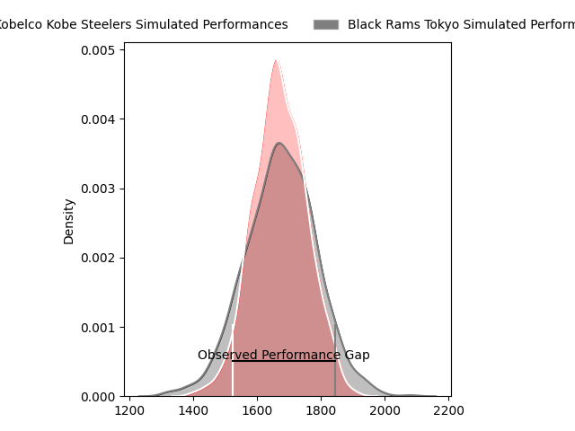
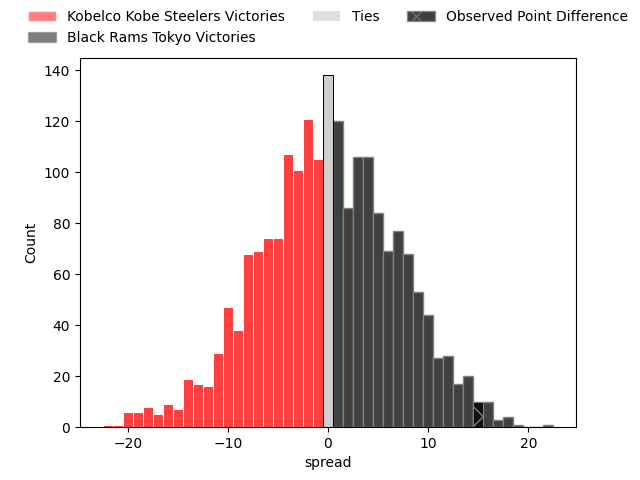

---  
layout: page  
title: Kobelco Kobe Steelers at Black Rams Tokyo; 26-41  
date: 2023-03-10 11:00:00 18:00:00 -0500  
categories: match review  
---
# Kobelco Kobe Steelers at Black Rams Tokyo; 26-41

# Club Level Predictions

The first set of predictions treats a club as the smallest object, as the club develops its members, organizes a gameplan, and deploys its players as needed for each match. This club model has a prediction of 0.506, which translates to predicting Black Rams Tokyo to win by 0.2.

Each club has a rating and a rating deviation (simiar to a Glicko system), and expected performances can be generated. This allows for simulated matches and spreads like the ones below.
## Projected Performances

## Projected Spreads

## Projected Results

# Player Level Predictions

Treating teams instead as an entity made up of the currently active players, I have ratings for each player in an altogether different system. These can be combined to form team ratings once teamsheets are announced, weighting starters a bit higher than the reserves. After the match is played, players can be weighted by their minutes on the field, allowing for an accurate measure of the team's composition. With these compiled team ratings, we can make predictions, measure inaccuracy, and update the individual player ratings.
## Prediction with Player Minutes: Black Rams Tokyo by 34.5

Black Rams Tokyo by 30.5 on a neutral field

There were 5 large changes in win probability in this match
## Prediction without Player Minutes: Black Rams Tokyo by 34.6

Black Rams Tokyo by 30.6 on a neutral pitch

|   Away Minutes | Away Player                                                                    |   Away elo |   Away Percentile |   Number |   Home Percentile |   Home elo | Home Player                                                         |   Home Minutes |
|---------------:|:-------------------------------------------------------------------------------|-----------:|------------------:|---------:|------------------:|-----------:|:--------------------------------------------------------------------|---------------:|
|             69 | [Isileli Nakajima Vakauta](..//playerfiles//IsileliNakajimaVakauta_cleaned.md) |     109.43 |                87 |        1 |                90 |     112.46 | [Yuichiro Taniguchi](..//playerfiles//YuichiroTaniguchi_cleaned.md) |             58 |
|             69 | [Kenta Matsuoka](..//playerfiles//KentaMatsuoka_cleaned.md)                    |      81.3  |                12 |        2 |                82 |     105.6  | [Ko Sato](..//playerfiles//KoSato_cleaned.md)                       |             62 |
|             45 | [Hiroshi Yamashita](..//playerfiles//HiroshiYamashita_cleaned.md)              |      84.61 |                17 |        3 |                81 |     105.57 | [Paddy Ryan](..//playerfiles//PaddyRyan_cleaned.md)                 |             62 |
|             69 | [Takara Imamura](..//playerfiles//TakaraImamura_cleaned.md)                    |      87.97 |                27 |        4 |                 8 |      73.2  | [Daiki Yanagawa](..//playerfiles//DaikiYanagawa_cleaned.md)         |             35 |
|             80 | [John Dave Schickerling](..//playerfiles//JohnDaveSchickerling_cleaned.md)     |      70.44 |                 6 |        5 |                87 |     111.96 | [Talau Fakatava](..//playerfiles//TalauFakatava_cleaned.md)         |             80 |
|             51 | [Tiennan Costley](..//playerfiles//TiennanCostley_cleaned.md)                  |      88.16 |                26 |        6 |                14 |      82.13 | [Amato Fakatava](..//playerfiles//AmatoFakatava_cleaned.md)         |             80 |
|             80 | [Hikaru Hashimoto](..//playerfiles//HikaruHashimoto_cleaned.md)                |     117.72 |                94 |        7 |                97 |     131.64 | [Brodi McCurran](..//playerfiles//BrodiMcCurran_cleaned.md)         |             80 |
|             80 | [Hikaru Hashimoto](..//playerfiles//HikaruHashimoto_cleaned.md)                |     117.72 |                91 |        7 |                97 |     131.64 | [Brodi McCurran](..//playerfiles//BrodiMcCurran_cleaned.md)         |             80 |
|             80 | [Marcell Coetzee](..//playerfiles//MarcellCoetzee_cleaned.md)                  |      77.34 |                 8 |        8 |                91 |     116.56 | [Nathan Hughes](..//playerfiles//NathanHughes_cleaned.md)           |             62 |
|             58 | [Atsushi Hiwasa](..//playerfiles//AtsushiHiwasa_cleaned.md)                    |      71.19 |                 6 |        9 |                31 |      96.73 | [Toshiya Takahashi](..//playerfiles//ToshiyaTakahashi_cleaned.md)   |             73 |
|             51 | [Timothy Lafaele](..//playerfiles//TimothyLafaele_cleaned.md)                  |      87.06 |                27 |       10 |                74 |     103.48 | [Kohei Horigome](..//playerfiles//KoheiHorigome_cleaned.md)         |             62 |
|             80 | [Ataata Moeakiola](..//playerfiles//AtaataMoeakiola_cleaned.md)                |      80.06 |                16 |       11 |                93 |     119.51 | [Netani Vakayalia](..//playerfiles//NetaniVakayalia_cleaned.md)     |             80 |
|             80 | [Michael Little](..//playerfiles//MichaelLittle_cleaned.md)                    |      79.66 |                18 |       12 |                97 |     130.24 | [Hadleigh Parkes](..//playerfiles//HadleighParkes_cleaned.md)       |             80 |
|             80 | [Junta Hamano](..//playerfiles//JuntaHamano_cleaned.md)                        |      84.25 |                19 |       13 |                72 |     103.1  | [Yuki Ikeda](..//playerfiles//YukiIkeda_cleaned.md)                 |             80 |
|             80 | [Shinsuke Iseki](..//playerfiles//ShinsukeIseki_cleaned.md)                    |     109.54 |                85 |       14 |                10 |      78.59 | [Yuta Kurihara](..//playerfiles//YutaKurihara_cleaned.md)           |             71 |
|             80 | [Ryohei Yamanaka](..//playerfiles//RyoheiYamanaka_cleaned.md)                  |      70.5  |                 8 |       15 |                96 |     129.82 | [Matt McGahan](..//playerfiles//MattMcGahan_cleaned.md)             |             80 |
|             35 | [Jiwon Koo](..//playerfiles//JiwonKoo_cleaned.md)                              |      90.18 |               nan |       16 |                61 |     103.62 | [Junpei Yukawa](..//playerfiles//JunpeiYukawa_cleaned.md)           |             45 |
|             29 | [Amanaki Saumaki](..//playerfiles//AmanakiSaumaki_cleaned.md)                  |      89.81 |                34 |       17 |                50 |      95.03 | [Kazuma Nishi](..//playerfiles//KazumaNishi_cleaned.md)             |             22 |
|             29 | [Shintaro Hayashi](..//playerfiles//ShintaroHayashi_cleaned.md)                |      92.98 |               nan |       18 |                62 |      99.68 | [Kazuhiro Koike](..//playerfiles//KazuhiroKoike_cleaned.md)         |             18 |
|             22 | [Kenta Tokuda](..//playerfiles//KentaTokuda_cleaned.md)                        |      96.12 |                57 |       19 |                43 |      96.6  | [Daigo Sasagawa](..//playerfiles//DaigoSasagawa_cleaned.md)         |             18 |
|             11 | [Koki Yamamoto](..//playerfiles//KokiYamamoto_cleaned.md)                      |      93.12 |               nan |       20 |                92 |     118.71 | [Josh Goodhue](..//playerfiles//JoshGoodhue_cleaned.md)             |             18 |
|             11 | [Rinpei Sasaki](..//playerfiles//RinpeiSasaki_cleaned.md)                      |      95.44 |               nan |       21 |                82 |     116.94 | [Isaac Lucas](..//playerfiles//IsaacLucas_cleaned.md)               |             18 |
|             11 | [Naohiro Kotaki](..//playerfiles//NaohiroKotaki_cleaned.md)                    |      84.48 |                26 |       22 |               nan |      98.43 | [Amanaki Lotoahea](..//playerfiles//AmanakiLotoahea_cleaned.md)     |              9 |
|            nan | nan                                                                            |     nan    |               nan |       23 |                50 |      94.14 | [Takanobu Minami](..//playerfiles//TakanobuMinami_cleaned.md)       |              7 |

