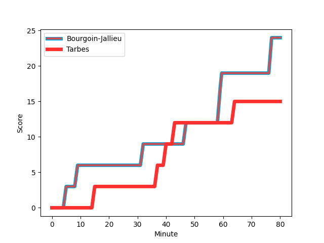
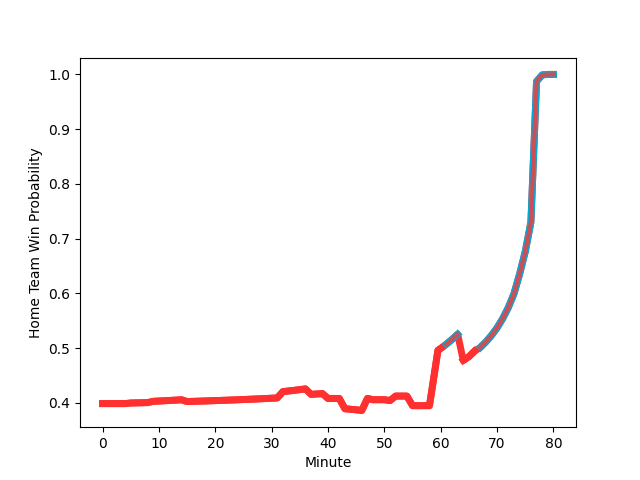

---  
layout: page  
title: Tarbes at Bourgoin-Jallieu; 15-24  
date: 2023-03-10 19:00:00 18:00:00 -0500  
categories: match review  
---
# Tarbes at Bourgoin-Jallieu; 15-24

# Club Level Predictions

The first set of predictions treats a club as the smallest object, as the club develops its members, organizes a gameplan, and deploys its players as needed for each match. This club model has a prediction of 0.641, which translates to predicting Bourgoin-Jallieu to win by 5.1.

Each club has a rating and a rating deviation (simiar to a Glicko system), and expected performances can be generated. This allows for simulated matches and spreads like the ones below.
## Projected Performances

## Projected Spreads

## Projected Results

# Player Level Predictions

Treating teams instead as an entity made up of the currently active players, I have ratings for each player in an altogether different system. These can be combined to form team ratings once teamsheets are announced, weighting starters a bit higher than the reserves. After the match is played, players can be weighted by their minutes on the field, allowing for an accurate measure of the team's composition. With these compiled team ratings, we can make predictions, measure inaccuracy, and update the individual player ratings.
## Prediction with Player Minutes: Tarbes by 13.9

Tarbes by 17.9 on a neutral field
## Scores over Time

## Win Probability over Time

There were 8 large changes in win probability in this match
## Prediction without Player Minutes: Tarbes by 10.4

Tarbes by 14.4 on a neutral pitch

|   Away Minutes | Away Player                                                                      |   Away elo |   Away Percentile |   Number |   Home Percentile |   Home elo | Home Player                                                                    |   Home Minutes |
|---------------:|:---------------------------------------------------------------------------------|-----------:|------------------:|---------:|------------------:|-----------:|:-------------------------------------------------------------------------------|---------------:|
|             74 | [Alexandre Combier](..//playerfiles//AlexandreCombier_cleaned.md)                |      93.91 |                37 |        1 |                90 |     112.52 | [Rémy Gaborit](..//playerfiles//RémyGaborit_cleaned.md)                        |             52 |
|             80 | [Enzo Mondon](..//playerfiles//EnzoMondon_cleaned.md)                            |     124.02 |                97 |        2 |                33 |      89.83 | [Maxime Castant](..//playerfiles//MaximeCastant_cleaned.md)                    |             51 |
|             52 | [Mariano Ezequiel Filomeno](..//playerfiles//MarianoEzequielFilomeno_cleaned.md) |      92.68 |                34 |        3 |                45 |      94.57 | [Oktay Yilmaz](..//playerfiles//OktayYilmaz_cleaned.md)                        |             66 |
|             52 | [Aurelien Ricart](..//playerfiles//AurelienRicart_cleaned.md)                    |     107.42 |                66 |        4 |                11 |      78.1  | [Robin Gascou](..//playerfiles//RobinGascou_cleaned.md)                        |             40 |
|             80 | [Antoine Bousquet](..//playerfiles//AntoineBousquet_cleaned.md)                  |     105.43 |                77 |        5 |                43 |      93.04 | [Joketani Raikabula Koroi](..//playerfiles//JoketaniRaikabulaKoroi_cleaned.md) |             80 |
|             80 | [Léo Saint-Guilhem](..//playerfiles//LéoSaint-Guilhem_cleaned.md)                |     116.27 |                87 |        6 |                84 |     109.09 | [Kevin Chaudouard](..//playerfiles//KevinChaudouard_cleaned.md)                |             55 |
|             59 | [Loan Real](..//playerfiles//LoanReal_cleaned.md)                                |     104.02 |                75 |        7 |                56 |      96.84 | [Bynjamin Rabatel](..//playerfiles//BynjaminRabatel_cleaned.md)                |             55 |
|             80 | [Willem Leon Massyn](..//playerfiles//WillemLeonMassyn_cleaned.md)               |     110.24 |                84 |        8 |                49 |      96.67 | [Théo Lepage](..//playerfiles//ThéoLepage_cleaned.md)                          |             48 |
|             64 | [Thibaut Dulucq](..//playerfiles//ThibautDulucq_cleaned.md)                      |     100.38 |                68 |        9 |                69 |     100.63 | [Remi Bouet](..//playerfiles//RemiBouet_cleaned.md)                            |             80 |
|             80 | [Anthony  Fuertes](..//playerfiles//AnthonyFuertes_cleaned.md)                   |     119.95 |                93 |       10 |                32 |      89.66 | [Nicolas Vuillemin](..//playerfiles//NicolasVuillemin_cleaned.md)              |             37 |
|             80 | [Jonathan Duffau](..//playerfiles//JonathanDuffau_cleaned.md)                    |     130.12 |                97 |       11 |                44 |      92.78 | [Quentin Lefort](..//playerfiles//QuentinLefort_cleaned.md)                    |             80 |
|             52 | [William Pees](..//playerfiles//WilliamPees_cleaned.md)                          |     106.77 |                72 |       12 |                63 |      99.25 | [Isaiah Leota](..//playerfiles//IsaiahLeota_cleaned.md)                        |             80 |
|             67 | [Alofa Alofa](..//playerfiles//AlofaAlofa_cleaned.md)                            |     103.87 |                75 |       13 |                33 |      90    | [Christopher Bosch](..//playerfiles//ChristopherBosch_cleaned.md)              |             80 |
|             80 | [Maxime Oltmann](..//playerfiles//MaximeOltmann_cleaned.md)                      |      63.33 |                 3 |       14 |                49 |      94.54 | [Makalea Foliaki](..//playerfiles//MakaleaFoliaki_cleaned.md)                  |             80 |
|             80 | [Maxime Oltmann](..//playerfiles//MaximeOltmann_cleaned.md)                      |      63.33 |                 3 |       14 |                49 |      94.54 | [Makalea Foliaki](..//playerfiles//MakaleaFoliaki_cleaned.md)                  |             80 |
|             80 | [Thibaut Trotta](..//playerfiles//ThibautTrotta_cleaned.md)                      |     105.64 |                75 |       15 |                 7 |      67.66 | [Nicolas Cachet](..//playerfiles//NicolasCachet_cleaned.md)                    |             80 |
|             28 | [Aleksi Tchitchiashvili](..//playerfiles//AleksiTchitchiashvili_cleaned.md)      |     104.3  |                70 |       16 |                50 |      94.63 | [Tomas Munilla](..//playerfiles//TomasMunilla_cleaned.md)                      |             43 |
|             28 | [Aleksi Tchitchiashvili](..//playerfiles//AleksiTchitchiashvili_cleaned.md)      |     104.3  |                80 |       16 |                50 |      94.63 | [Tomas Munilla](..//playerfiles//TomasMunilla_cleaned.md)                      |             43 |
|             28 | [Josaia Vakacegu](..//playerfiles//JosaiaVakacegu_cleaned.md)                    |      90.33 |                34 |       17 |                45 |      90.08 | [Léandre Cotte](..//playerfiles//LéandreCotte_cleaned.md)                      |             40 |
|             28 | [Paul Sajous](..//playerfiles//PaulSajous_cleaned.md)                            |      80.54 |                10 |       18 |                32 |      87.14 | [Killian Tripier](..//playerfiles//KillianTripier_cleaned.md)                  |             29 |
|             28 | [Paul Sajous](..//playerfiles//PaulSajous_cleaned.md)                            |      80.54 |                14 |       18 |                32 |      87.14 | [Killian Tripier](..//playerfiles//KillianTripier_cleaned.md)                  |             29 |
|             21 | [Mattéo Coustalat](..//playerfiles//MattéoCoustalat_cleaned.md)                  |     119.32 |                90 |       19 |                40 |      92.46 | [Poutasi Luafutu](..//playerfiles//PoutasiLuafutu_cleaned.md)                  |             32 |
|             21 | [Mattéo Coustalat](..//playerfiles//MattéoCoustalat_cleaned.md)                  |     119.32 |                93 |       19 |                40 |      92.46 | [Poutasi Luafutu](..//playerfiles//PoutasiLuafutu_cleaned.md)                  |             32 |
|             16 | [Alexis Levron](..//playerfiles//AlexisLevron_cleaned.md)                        |      89.26 |                33 |       20 |                60 |      95.45 | [Nugzar Somkhishvili](..//playerfiles//NugzarSomkhishvili_cleaned.md)          |             28 |
|             13 | [Pierre Descoubet](..//playerfiles//PierreDescoubet_cleaned.md)                  |     107.96 |                83 |       21 |                18 |      83.93 | [Pablo Patilla](..//playerfiles//PabloPatilla_cleaned.md)                      |             25 |
|             13 | [Pierre Descoubet](..//playerfiles//PierreDescoubet_cleaned.md)                  |     107.96 |                70 |       21 |                18 |      83.93 | [Pablo Patilla](..//playerfiles//PabloPatilla_cleaned.md)                      |             25 |
|              6 | [Alexandre Duny](..//playerfiles//AlexandreDuny_cleaned.md)                      |      86.09 |                14 |       22 |                37 |      90.5  | [Théophile Cotte](..//playerfiles//ThéophileCotte_cleaned.md)                  |             25 |
|            nan | nan                                                                              |     nan    |               nan |       23 |                71 |      98.81 | [Maxime Caillet](..//playerfiles//MaximeCaillet_cleaned.md)                    |             14 |

