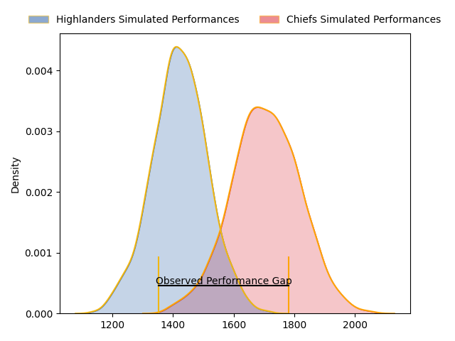
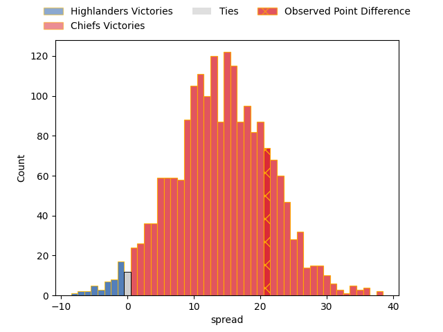
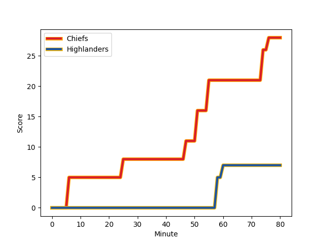
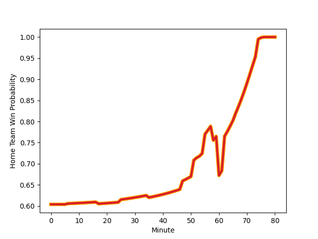

---  
layout: page  
title: Highlanders at Chiefs; 7.0-28.0  
date: 2023-03-10 01:05:00 18:00:00 -0500  
categories: match review  
---
# Highlanders at Chiefs; 7.0-28.0

# Club Level Predictions

The first set of predictions treats a club as the smallest object, as the club develops its members, organizes a gameplan, and deploys its players as needed for each match. This club model has a prediction of 0.823, which translates to predicting Chiefs to win by 14.0.

Each club has a rating and a rating deviation (simiar to a Glicko system), and expected performances can be generated. This allows for simulated matches and spreads like the ones below.
## Projected Performances

## Projected Spreads

## Projected Results

# Player Level Predictions

Treating teams instead as an entity made up of the currently active players, I have ratings for each player in an altogether different system. These can be combined to form team ratings once teamsheets are announced, weighting starters a bit higher than the reserves. After the match is played, players can be weighted by their minutes on the field, allowing for an accurate measure of the team's composition. With these compiled team ratings, we can make predictions, measure inaccuracy, and update the individual player ratings.
## Prediction with Player Minutes: Chiefs by 22.3

Chiefs by 18.3 on a neutral field
## Scores over Time

## Win Probability over Time

There were 6 large changes in win probability in this match
## Prediction without Player Minutes: Chiefs by 26.0

Chiefs by 22.0 on a neutral pitch

|   Away Minutes | Away Player                                                                 |   Away elo |   Away Percentile |   Number |   Home Percentile |   Home elo | Home Player                                                           |   Home Minutes |
|---------------:|:----------------------------------------------------------------------------|-----------:|------------------:|---------:|------------------:|-----------:|:----------------------------------------------------------------------|---------------:|
|             60 | [Ethan de Groot](..//playerfiles//EthandeGroot_cleaned.md)                  |      88.96 |                28 |        1 |                67 |      99.7  | [Aidan Ross](..//playerfiles//AidanRoss_cleaned.md)                   |             60 |
|             62 | [Rhys Marshall](..//playerfiles//RhysMarshall_cleaned.md)                   |      85.68 |                30 |        2 |                83 |     105.43 | [Samisoni Taukei'aho](..//playerfiles//SamisoniTaukei'aho_cleaned.md) |             60 |
|             54 | [Jermaine Ainsley](..//playerfiles//JermaineAinsley_cleaned.md)             |      83.47 |                16 |        3 |                79 |     108.51 | [John Ryan](..//playerfiles//JohnRyan_cleaned.md)                     |             60 |
|             35 | [Pari Pari Parkinson](..//playerfiles//PariPariParkinson_cleaned.md)        |      81.01 |                15 |        4 |                80 |     106.81 | [Brodie Retallick](..//playerfiles//BrodieRetallick_cleaned.md)       |             80 |
|             80 | [Josh Dickson](..//playerfiles//JoshDickson_cleaned.md)                     |      85.89 |                23 |        5 |                80 |     107.29 | [Tupou Vaa'i](..//playerfiles//TupouVaa'i_cleaned.md)                 |             17 |
|             80 | [Shannon Frizell](..//playerfiles//ShannonFrizell_cleaned.md)               |      85.89 |                22 |        6 |               nan |      96.48 | [Naitoa Ah Kuoi](..//playerfiles//NaitoaAhKuoi_cleaned.md)            |             70 |
|             70 | [James Lentjes](..//playerfiles//JamesLentjes_cleaned.md)                   |      92.59 |               nan |        7 |                79 |     106.81 | [Sam Cane](..//playerfiles//SamCane_cleaned.md)                       |             80 |
|             80 | [Hugh Renton](..//playerfiles//HughRenton_cleaned.md)                       |      95    |               nan |        8 |                82 |     108.77 | [Luke Jacobson](..//playerfiles//LukeJacobson_cleaned.md)             |             80 |
|             80 | [Aaron Smith](..//playerfiles//AaronSmith_cleaned.md)                       |      95    |               nan |        9 |                81 |     105.67 | [Brad Weber](..//playerfiles//BradWeber_cleaned.md)                   |             60 |
|             76 | [Mitch Hunt](..//playerfiles//MitchHunt_cleaned.md)                         |      84.63 |                22 |       10 |                81 |     107.66 | [Damian McKenzie](..//playerfiles//DamianMcKenzie_cleaned.md)         |             80 |
|             80 | [Mosese Dawai](..//playerfiles//MoseseDawai_cleaned.md)                     |      91.14 |               nan |       11 |                80 |     106.47 | [Etene Nanai-Seturo](..//playerfiles//EteneNanai-Seturo_cleaned.md)   |             80 |
|             80 | [Thomas Umaga-Jensen](..//playerfiles//ThomasUmaga-Jensen_cleaned.md)       |      79.98 |                12 |       12 |                77 |     104.59 | [Rameka Poihipi](..//playerfiles//RamekaPoihipi_cleaned.md)           |             70 |
|             80 | [Josh Timu](..//playerfiles//JoshTimu_cleaned.md)                           |      78.16 |                10 |       13 |                85 |     108.77 | [Alex Nankivell](..//playerfiles//AlexNankivell_cleaned.md)           |             80 |
|             72 | [Martin Bogado](..//playerfiles//MartinBogado_cleaned.md)                   |     104.66 |                78 |       14 |               nan |      95    | [Emoni Narawa](..//playerfiles//EmoniNarawa_cleaned.md)               |             60 |
|             74 | [Freddie Burns](..//playerfiles//FreddieBurns_cleaned.md)                   |     115.39 |                89 |       15 |                83 |     108.77 | [Shaun Stevenson](..//playerfiles//ShaunStevenson_cleaned.md)         |             80 |
|             18 | [Leni Apisai](..//playerfiles//LeniApisai_cleaned.md)                       |      95    |               nan |       16 |               nan |      96.04 | [Bradley Slater](..//playerfiles//BradleySlater_cleaned.md)           |             20 |
|             20 | [Ayden Johnstone](..//playerfiles//AydenJohnstone_cleaned.md)               |      90.08 |                32 |       17 |                73 |     101.69 | [Ollie Norris](..//playerfiles//OllieNorris_cleaned.md)               |             20 |
|             26 | [Saula Mau](..//playerfiles//SaulaMau_cleaned.md)                           |      89.69 |               nan |       18 |                79 |     103.97 | [George Dyer](..//playerfiles//GeorgeDyer_cleaned.md)                 |             20 |
|             45 | [Fabian Holland](..//playerfiles//FabianHolland_cleaned.md)                 |      95    |               nan |       19 |               nan |      97.26 | [Samipeni Finau](..//playerfiles//SamipeniFinau_cleaned.md)           |             63 |
|             10 | [Sean Withy](..//playerfiles//SeanWithy_cleaned.md)                         |      79.57 |                10 |       20 |                79 |     106.5  | [Pita Gus Sowakula](..//playerfiles//PitaGusSowakula_cleaned.md)      |             10 |
|              4 | [Kemara Hauiti-Parapara](..//playerfiles//KemaraHauiti-Parapara_cleaned.md) |      89.36 |                32 |       21 |               nan |      98.1  | [Cortez Ratima](..//playerfiles//CortezRatima_cleaned.md)             |             20 |
|             24 | [Jake Te Hiwi](..//playerfiles//JakeTeHiwi_cleaned.md)                      |      95    |               nan |       22 |               nan |      98.39 | [Josh Ioane](..//playerfiles//JoshIoane_cleaned.md)                   |             20 |
|             14 | [Connor Garden-Bachop](..//playerfiles//ConnorGarden-Bachop_cleaned.md)     |      80.44 |                14 |       23 |               nan |      95    | [Daniel Rona](..//playerfiles//DanielRona_cleaned.md)                 |             10 |

