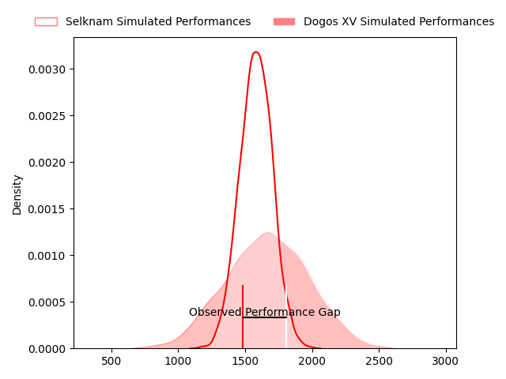
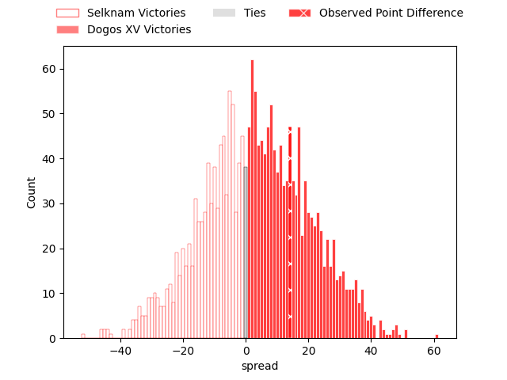
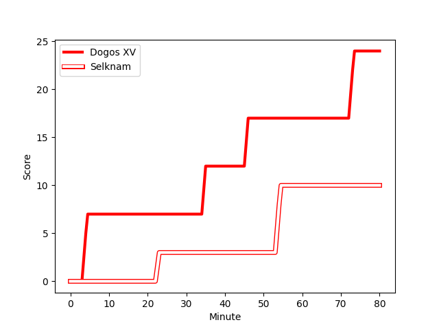
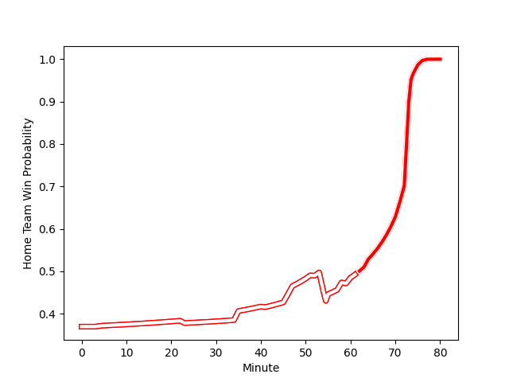

---  
layout: page  
title: Selknam at Dogos XV; 10-24  
date: 2023-03-10 22:00:00 18:00:00 -0500  
categories: match review  
---
# Selknam at Dogos XV; 10-24

# Club Level Predictions

The first set of predictions treats a club as the smallest object, as the club develops its members, organizes a gameplan, and deploys its players as needed for each match. This club model has a prediction of 0.608, which translates to predicting Dogos XV to win by 4.1.

Each club has a rating and a rating deviation (simiar to a Glicko system), and expected performances can be generated. This allows for simulated matches and spreads like the ones below.
## Projected Performances

## Projected Spreads

## Projected Results

# Player Level Predictions

Treating teams instead as an entity made up of the currently active players, I have ratings for each player in an altogether different system. These can be combined to form team ratings once teamsheets are announced, weighting starters a bit higher than the reserves. After the match is played, players can be weighted by their minutes on the field, allowing for an accurate measure of the team's composition. With these compiled team ratings, we can make predictions, measure inaccuracy, and update the individual player ratings.
## Prediction with Player Minutes: Selknam by 19.2

Selknam by 23.2 on a neutral field
## Scores over Time

## Win Probability over Time

There were 5 large changes in win probability in this match
## Prediction without Player Minutes: Selknam by 18.8

Selknam by 22.8 on a neutral pitch

|   Away Minutes | Away Player                                                                                     |   Away elo |   Away Percentile |   Number |   Home Percentile |   Home elo | Home Player                                                                      |   Home Minutes |
|---------------:|:------------------------------------------------------------------------------------------------|-----------:|------------------:|---------:|------------------:|-----------:|:---------------------------------------------------------------------------------|---------------:|
|             51 | [Javier Carrasco](..//playerfiles//JavierCarrasco_cleaned.md)                                   |     101.78 |                74 |        1 |                 9 |      78.19 | [Santiago Pulella](..//playerfiles//SantiagoPulella_cleaned.md)                  |             72 |
|             41 | [Tomas Dussaillant](..//playerfiles//TomasDussaillant_cleaned.md)                               |      88.37 |                29 |        2 |                 9 |      74.35 | [Boris Wenger](..//playerfiles//BorisWenger_cleaned.md)                          |             71 |
|             52 | [Inaki Gurruchaga](..//playerfiles//InakiGurruchaga_cleaned.md)                                 |      84.41 |                17 |        3 |                 7 |      72.01 | [Octavio Filippa](..//playerfiles//OctavioFilippa_cleaned.md)                    |             58 |
|             74 | [Santiago Pedrero](..//playerfiles//SantiagoPedrero_cleaned.md)                                 |     107.41 |                81 |        4 |               nan |      95    | [Lautaro Simes](..//playerfiles//LautaroSimes_cleaned.md)                        |             46 |
|             46 | [Javier Eissmann](..//playerfiles//JavierEissmann_cleaned.md)                                   |      95    |               nan |        5 |                28 |      88.62 | [Franco Molina](..//playerfiles//FrancoMolina_cleaned.md)                        |             80 |
|             80 | [Clemente Saavedra](..//playerfiles//ClementeSaavedra_cleaned.md)                               |     107.41 |                80 |        6 |               nan |      91.55 | [Manuel Todaro](..//playerfiles//ManuelTodaro_cleaned.md)                        |             59 |
|             47 | [Ignacio Silva](..//playerfiles//IgnacioSilva_cleaned.md)                                       |     105.78 |                78 |        7 |                24 |      86.62 | [Efrain Elias](..//playerfiles//EfrainElias_cleaned.md)                          |             80 |
|             80 | [Raimundo Martinez](..//playerfiles//RaimundoMartinez_cleaned.md)                               |     100.24 |               nan |        8 |                 4 |      71.91 | [Ignacio Jose Gandini](..//playerfiles//IgnacioJoseGandini_cleaned.md)           |             80 |
|             60 | [Benjamin Videla](..//playerfiles//BenjaminVidela_cleaned.md)                                   |     110.78 |                88 |        9 |                29 |      87.8  | [Agustin Moyano](..//playerfiles//AgustinMoyano_cleaned.md)                      |             76 |
|             80 | [Rodrigo Fernandez](..//playerfiles//RodrigoFernandez_cleaned.md)                               |     105.15 |                77 |       10 |                45 |      93.57 | [Julian Ignacio Hernandez](..//playerfiles//JulianIgnacioHernandez_cleaned.md)   |             80 |
|             47 | [Gaspar Moltedo](..//playerfiles//GasparMoltedo_cleaned.md)                                     |      94.98 |                50 |       11 |                76 |     104.36 | [Ernesto Giudice](..//playerfiles//ErnestoGiudice_cleaned.md)                    |             80 |
|             80 | [Santiago Videla](..//playerfiles//SantiagoVidela_cleaned.md)                                   |     107.41 |                81 |       12 |                11 |      79.24 | [Leonardo Gea Salim](..//playerfiles//LeonardoGeaSalim_cleaned.md)               |             64 |
|             80 | [Matias Garafulic](..//playerfiles//MatiasGarafulic_cleaned.md)                                 |     107.41 |                81 |       13 |                70 |     101.72 | [Faustino Sánchez Valarolo](..//playerfiles//FaustinoSánchezValarolo_cleaned.md) |             80 |
|             80 | [Jose Ignacio Larenas](..//playerfiles//JoseIgnacioLarenas_cleaned.md)                          |     100.23 |               nan |       14 |                35 |      88.62 | [Mateo Soler](..//playerfiles//MateoSoler_cleaned.md)                            |             80 |
|             80 | [Francisco Urroz](..//playerfiles//FranciscoUrroz_cleaned.md)                                   |     107.41 |                79 |       15 |                 9 |      71.94 | [Franco Giudice](..//playerfiles//FrancoGiudice_cleaned.md)                      |             55 |
|             39 | [Augusto Bohme](..//playerfiles//AugustoBohme_cleaned.md)                                       |      95    |               nan |       16 |                 3 |      61.19 | [Gregorio Hernandez](..//playerfiles//GregorioHernandez_cleaned.md)              |             34 |
|             34 | [Diego Escobar](..//playerfiles//DiegoEscobar_cleaned.md)                                       |      99.21 |               nan |       17 |               nan |      96.75 | [Juan Baronio](..//playerfiles//JuanBaronio_cleaned.md)                          |             25 |
|             33 | [Thomas Hans Orchard Meyer-Rachner](..//playerfiles//ThomasHansOrchardMeyer-Rachner_cleaned.md) |      96.1  |               nan |       18 |                44 |      93.21 | [Ramiro Valdes Iribarren](..//playerfiles//RamiroValdesIribarren_cleaned.md)     |             22 |
|             33 | [Domingo Saavedra](..//playerfiles//DomingoSaavedra_cleaned.md)                                 |      78.6  |                11 |       19 |                 7 |      76.23 | [Aitor Bildosola](..//playerfiles//AitorBildosola_cleaned.md)                    |             21 |
|             29 | [Salvador Lues](..//playerfiles//SalvadorLues_cleaned.md)                                       |     100.64 |                65 |       20 |               nan |      95    | [Felipe Mallia](..//playerfiles//FelipeMallia_cleaned.md)                        |             16 |
|             28 | [Lucas Bordigoni](..//playerfiles//LucasBordigoni_cleaned.md)                                   |      98.65 |               nan |       21 |                33 |      90.09 | [Roman Pretz](..//playerfiles//RomanPretz_cleaned.md)                            |              9 |
|             20 | [Lukas Carvallo](..//playerfiles//LukasCarvallo_cleaned.md)                                     |      99    |               nan |       22 |                43 |      92.27 | [Tomas Bartolini](..//playerfiles//TomasBartolini_cleaned.md)                    |              8 |
|              6 | [Bruno Saez](..//playerfiles//BrunoSaez_cleaned.md)                                             |      96.64 |               nan |       23 |                12 |      77.43 | [Juan Cruz Strada](..//playerfiles//JuanCruzStrada_cleaned.md)                   |              4 |

